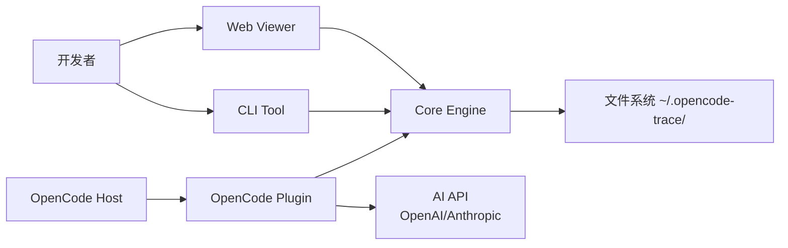
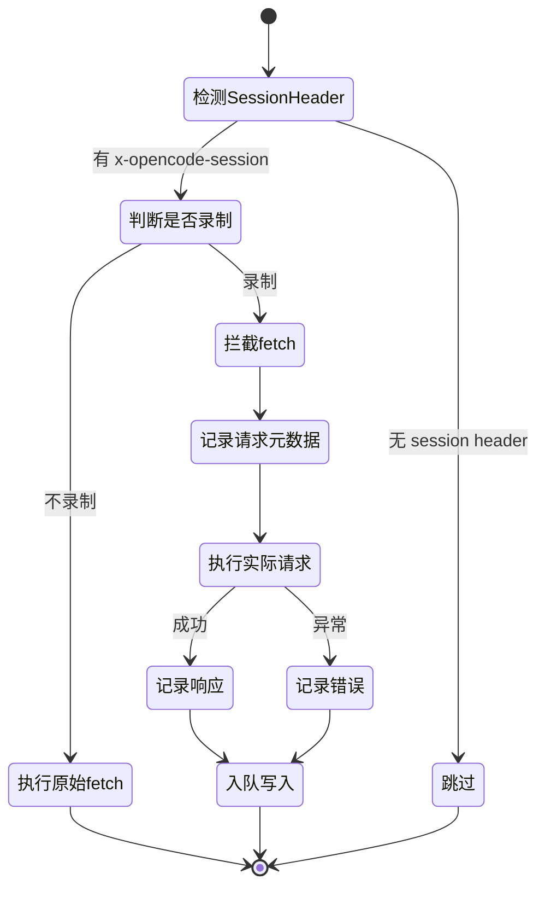
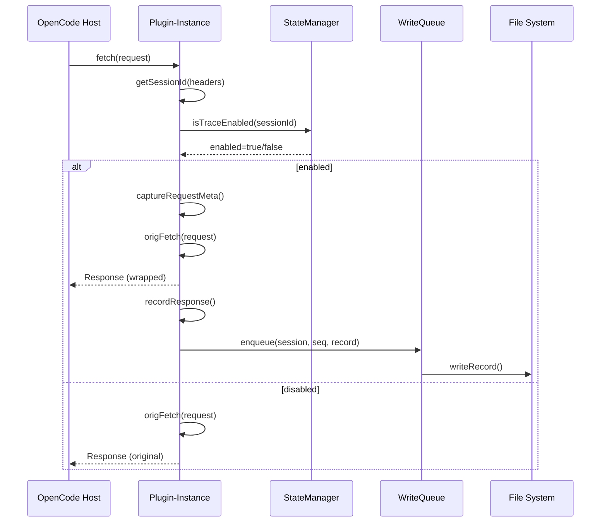
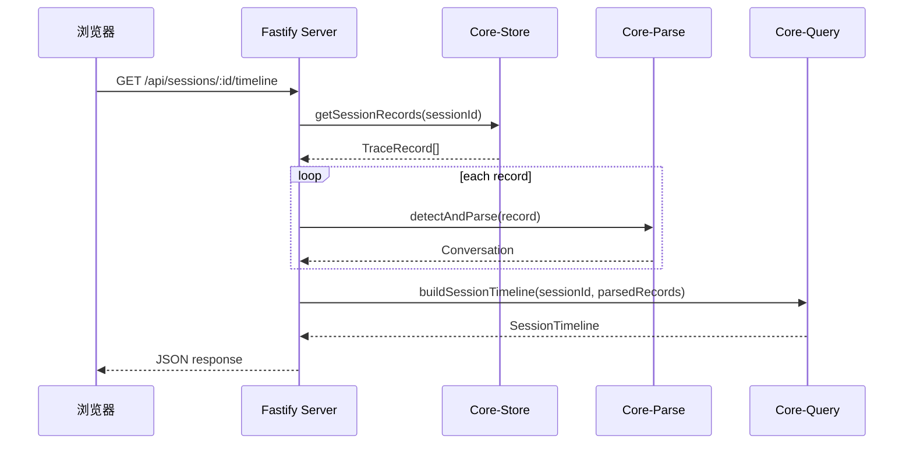
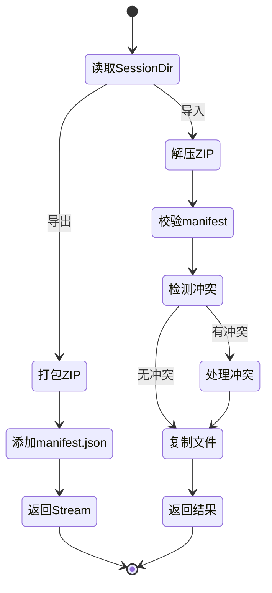
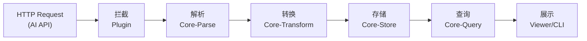

# 系统架构

## 1. 系统边界

### 1.1 系统边界图



### 1.2 外部参与者与外部系统

| 类型 | 名称 | 用途 | 集成方式 | 关键文件 |
|------|------|------|----------|----------|
| 系统 | OpenCode Host | 托载插件，提供会话信息 | Plugin API hooks | `packages/plugin/src/trace.ts:48-144` |
| 服务 | AI API (OpenAI/Anthropic) | 被拦截记录的 HTTP 请求 | fetch interceptor | `packages/plugin/src/plugin-instance.ts:25-54` |
| 存储 | 文件系统 `~/.opencode-trace/` | 持久化 session 数据和 SQLite 状态 | Node.js fs API | `packages/core/src/store/index.ts:1-540` |
| 用户 | 开发者 | 通过 CLI/Viewer 查看和分析 trace 数据 | CLI/Web UI | `packages/cli/src/index.ts`, `packages/viewer/src/server.ts` |

---

## 2. 系统分层

```mermaid
graph TD
    subgraph 接入层["接入层 (Access Layer)"]
        A1[CLI Handler]
        A2[Fastify HTTP Routes]
        A3[OpenCode Plugin Hooks]
    end
    subgraph 业务层["业务层 (Business Layer)"]
        B1[Query Builder]
        B2[Format Export]
        B3[Record Control]
    end
    subgraph 领域层["领域层 (Domain Layer)"]
        C1[Parse Provider Data]
        C2[Transform SSE]
        C3[State Manager]
    end
    subgraph 基础设施层["基础设施层 (Infrastructure Layer)"]
        D1[Store File I/O]
        D2[SQLite (sql.js)]
        D3[Logger]
        D4[Zod Schema]
    end
    
    A1 --> B1 --> C1 --> D1
    A2 --> B1 --> C2 --> D2
    A3 --> B3 --> C3 --> D3
```

| 层次 | 职责 | 关键组件 | 禁止事项 |
|------|------|----------|----------|
| 接入层 | 处理外部输入（CLI 命令、HTTP 请求、Plugin hooks） | `cli/handlers/`, `viewer/server.ts`, `plugin/trace.ts` | 不得包含解析逻辑、不得直接操作文件 |
| 业务层 | 构建 query 结果、格式化输出、控制录制状态 | `query/session.ts`, `format/xml.ts`, `record/control.ts` | 不得直接处理 raw HTTP 数据 |
| 领域层 | 解析 provider 格式、转换 SSE 流、管理 session 状态 | `parse/`, `transform/`, `state/index.ts` | 不得包含 I/O 操作 |
| 基础设施层 | 文件读写、数据库操作、日志、schema 校验 | `store/index.ts`, `schemas/`, `logger.ts` | — |

---

## 3. 跨切面关注点

| 关注点 | 实现方式 | 关键文件 | 说明 |
|--------|----------|----------|------|
| 错误处理 | try-catch + logger.error + graceful fallback | `packages/core/src/store/index.ts:44-56`, `packages/plugin/src/plugin-instance.ts:36-42` | 所有 I/O 操作都有错误捕获，失败时记录日志并返回空结果 |
| 日志 | winston structured logging | `packages/core/src/logger.ts` | 统一的 logger 导出，所有模块共用 |
| 数据校验 | Zod schema safeParse | `packages/core/src/schemas/types.ts`, `packages/core/src/store/index.ts:206-209` | 所有读取的 JSON 数据通过 Zod 校验 |
| 安全性 | Header redaction, stack trace sanitization | `packages/plugin/src/redact.ts`, `packages/plugin/src/plugin-instance.ts:188-195` | 模糊化敏感信息（用户路径、IP、端口） |
| 配置管理 | `~/.opencode-trace/` 目录 + SQLite state.db | `packages/core/src/state/index.ts:36-38` | 统一的 traceDir 配置路径 |

---

## 4. 核心业务流程

### 4.1 入口点分析

| 入口类型 | 入口文件 | 触发方式 | 说明 |
|----------|----------|----------|------|
| CLI 启动 | `packages/cli/src/index.ts:54` | `opencode-trace <command>` | 命令分发到各 handler |
| HTTP 服务 | `packages/viewer/src/server.ts:52` | `opencode-trace-viewer` or `npm run viewer` | Fastify 启动监听端口 3210 |
| Plugin 加载 | `packages/plugin/src/trace.ts:48` | OpenCode 加载 plugin | 初始化拦截器和 StateManager |

### 4.2 状态管理策略

| 状态类型 | 管理方式 | 存储位置 | 作用域 | 关键文件 |
|----------|----------|----------|--------|----------|
| Session 状态 | StateManager (SQLite) | `~/.opencode-trace/state.db` | 全局 | `packages/core/src/state/index.ts:47-596` |
| Trace 数据 | JSON 文件 | `~/.opencode-trace/<session-id>/<seq>.json` | Session 级别 | `packages/core/src/store/index.ts:265-274` |
| SSE 流数据 | `.sse` 文件 | `~/.opencode-trace/<session-id>/<seq>.sse` | Request 级别 | `packages/plugin/src/write-queue.ts` |
| 全局开关 | SQLite global_state 表 | `state.db` | 全局 | `packages/core/src/record/control.ts:76-90` |
| 内存缓存 | AsyncWriteQueue, AsyncStateQueue | 进程内存 | Request 级别 | `packages/plugin/src/write-queue.ts`, `packages/plugin/src/state-queue.ts` |

### 4.3 核心流程

#### 流程 1：请求拦截与记录（Request Interception）

**触发条件**：OpenCode 发起 fetch 请求到 AI API
**涉及模块**：M003 (Plugin), M004 (Core-State), M001 (Core-Store)
**关键文件**：`packages/plugin/src/plugin-instance.ts:25-54`, `packages/core/src/state/index.ts:329-355`

**状态流转**



**跨模块序列图**



#### 流程 2：Viewer Timeline 构建（Timeline Building）

**触发条件**：用户访问 `/api/sessions/:sessionId/timeline`
**涉及模块**：M005 (Viewer), M001 (Core-Store), M002 (Core-Parse), M006 (Core-Query)
**关键文件**：`packages/viewer/src/server.ts:96-135`, `packages/core/src/query/session.ts:136-175`

**跨模块序列图**



#### 流程 3：Session 导入/导出（Import/Export）

**触发条件**：用户执行 `opencode-trace export` 或 Viewer POST `/api/sessions/:sessionId/import`
**涉及模块**：M001 (Core-Store), M004 (Core-State)
**关键文件**：`packages/core/src/store/index.ts:347-384`, `packages/core/src/store/index.ts:409-516`

**状态流转**



### 4.4 端到端数据流



| 数据流 | 输入 | 输出 | 经过模块 | 变换说明 |
|--------|------|------|----------|----------|
| Trace Recording | HTTP Request/Response | JSON 文件 + SSE 文件 | Plugin → Core-State → Core-Store | 拦截 fetch → 提取元数据 → 写入文件 |
| Timeline Building | TraceRecord[] | SessionTimeline | Core-Store → Core-Parse → Core-Query | 读取文件 → 解析对话 → 计算差异 |
| XML Export | Conversation | XML 文件 | Core-Query → Core-Format | 对话数据 → XML 格式化 → 文件输出 |

---

## 5. 扩展性与集成能力

### 5.1 插件/扩展机制

| 扩展点 | 类型 | 位置 | 说明 |
|--------|------|------|------|
| Parser Registry | Plugin Pattern | `packages/core/src/parse/registry.ts` | 支持注册新的 AI provider parser |
| OpenCode Hooks | Hook Pattern | `packages/plugin/src/trace.ts:61-141` | event hook, tool.execute.after hook, tool commands |
| Viewer Routes | Middleware Pattern | `packages/viewer/src/server.ts` | Fastify 路由可扩展新 API |

### 5.2 对外 API 边界

| 协议 | 端点/定义文件 | 文档化程度 | 说明 |
|------|-------------|-----------|------|
| REST | `/api/sessions/*`, `/api/trace/*` | 部分（help 文本） | Viewer HTTP API，无 formal API doc |
| CLI | `packages/cli/src/index.ts:11-51` | 完整（help 命令） | CLI 命令有详细帮助文本 |
| Plugin API | `packages/plugin/src/trace.ts` | 部分（注释） | OpenCode plugin 接口 |

---

## 6. 架构风险与技术债务

### 6.1 系统级风险

| 风险 | 影响范围 | 概率 | 严重度 | 优先级 | 建议措施 |
|------|----------|------|--------|--------|----------|
| SQLite 损坏 | 全局状态丢失 | 低 | 高 | P2 | 已实现损坏检测和重建机制 (`state/index.ts:146-164`) |
| 文件系统权限 | 无法写入 trace | 中 | 中 | P3 | 需添加权限错误处理和用户提示 |
| Provider API 变化 | 解析失败 | 中 | 中 | P2 | Parser registry 设计支持扩展 |

### 6.2 技术债务

| 区域 | 债务类型 | 原因 | 严重度 | 偿还建议 |
|------|----------|------|--------|----------|
| Viewer API | 文档债 | 无 formal API documentation | 轻微 | 添加 OpenAPI spec |
| Error Messages | 代码债 | 部分 CLI handler 无详细错误信息 | 轻微 | 统一错误消息格式 |
| Test Coverage | 测试债 | 部分模块测试覆盖率不足 | 中等 | 补充 integration test |

### 6.3 扩展性瓶颈

| 瓶颈点 | 当前限制 | 触发条件 | 突破方案 |
|--------|----------|----------|----------|
| 单进程写入 | 同一 session 只能由一个进程写入 | 多 viewer 实例 | 添加文件锁或使用真正的 SQLite server |
| 内存缓存 | AsyncWriteQueue 无限增长 | 大量并发请求 | 添加队列容量限制和背压机制 |