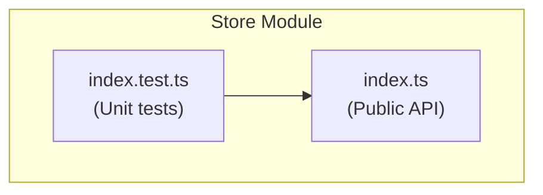
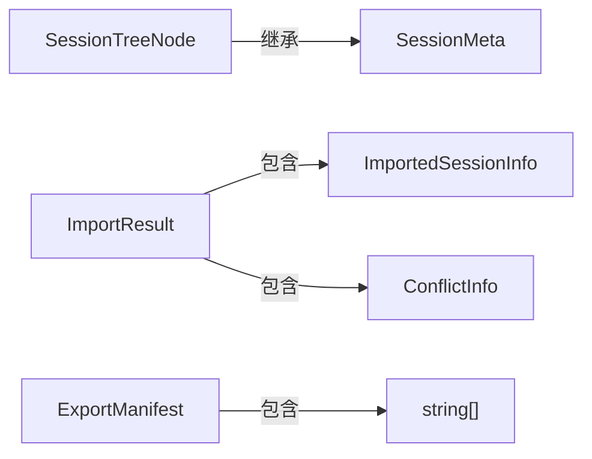
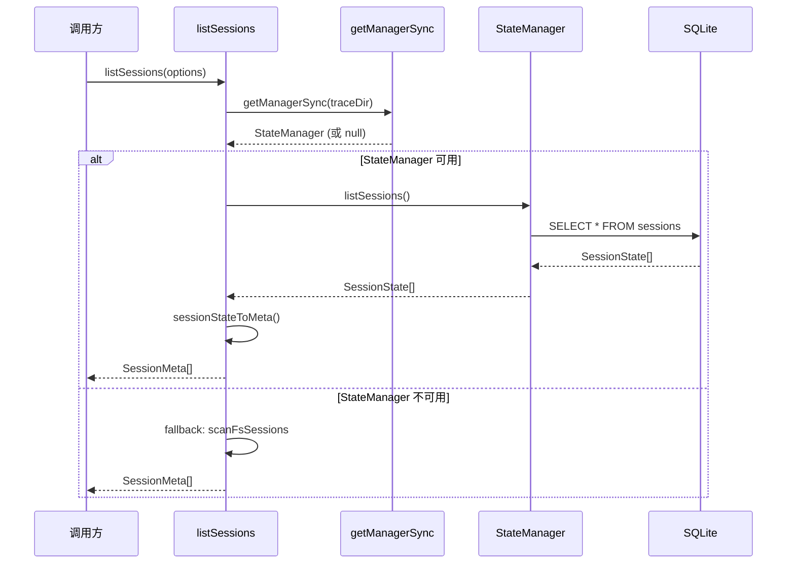
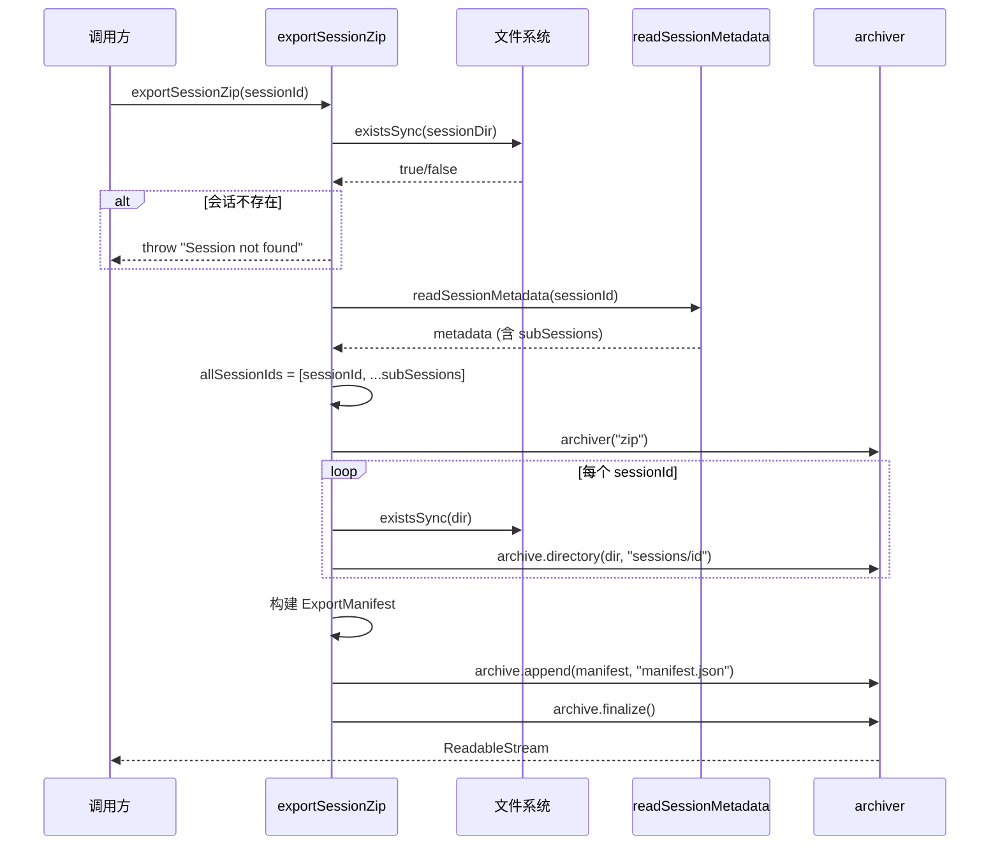
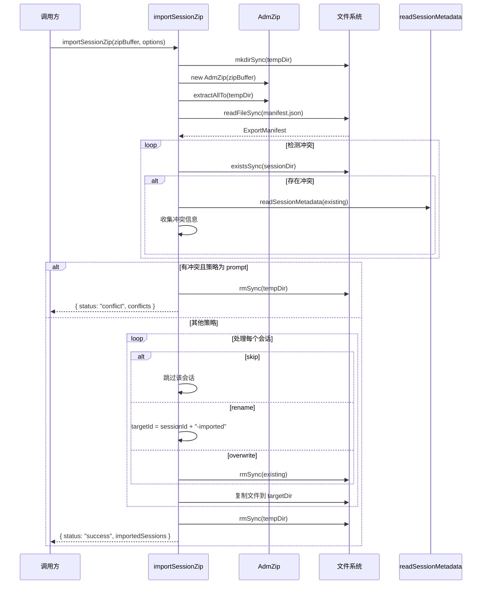

# M001.1-Store

## 概述

Store 模块是 opencode-trace 系统的数据访问层，负责管理 trace 会话的持久化存储、查询、导出导入和删除操作。它作为文件系统与上层模块之间的桥梁，提供了统一的会话管理接口。如果移除此模块，系统将无法持久化 trace 数据、无法查询历史会话、也无法支持会话的导出导入和批量删除等关键功能。

---

## 元数据

| 字段 | 值 |
|------|-----|
| 模块 ID | M001.1 |
| 路径 | packages/core/src/store/ |
| 文件数 | 2 |
| 代码行数 | 1098 |
| 主要语言 | TypeScript |
| 所属层 | Data Access Layer |
| 父模块 | M001-Core |
| 依赖于 | M001.6-State, M001-Types, M001.8-Schemas, M001-Logger |
| 被依赖于 | M002-CLI, M004.1-Server, M001.5-Record |

---

## 子模块

（无子模块）

---

## 文件结构



| 文件 | 职责 | 行数 | 主要导出 |
|------|------|------|----------|
| index.ts | 会话存储的核心实现，包含会话查询、记录读写、元数据管理、导出导入等功能 | 540 | listSessions, listSessionsTree, getSessionRecords, getRecord, getSSEStream, writeRecord, exportSessionZip, importSessionZip, deleteSession |
| index.test.ts | 单元测试，覆盖会话树构建、导出导入、删除等核心功能 | 558 | - |

---

## 功能树

```
M001.1-Store (数据存储与访问)
└── index.ts
    ├── interface: StoreOptions — 存储配置选项
    ├── interface: SessionMeta — 会话元数据摘要
    ├── interface: SessionTreeNode — 会话树节点（含子会话）
    ├── interface: SessionMetadataFile — 会话元数据文件结构
    ├── interface: ExportManifest — 导出 ZIP 的清单文件结构
    ├── interface: ImportResult — 导入结果
    ├── interface: ConflictInfo — 冲突信息详情
    ├── interface: ImportedSessionInfo — 导入的会话信息
    ├── interface: ImportOptions — 导入配置选项（含冲突策略）
    ├── fn: resolveDir(options) — 解析 trace 目录路径
    ├── fn: safeReaddir(dir) — 安全读取目录（错误处理）
    ├── fn: getManager(traceDir) — 异步获取 StateManager 实例
    ├── fn: getManagerSync(traceDir) — 同步获取 StateManager 实例
    ├── fn: sessionStateToMeta(session) — 转换 SessionState 到 SessionMeta
    ├── fn: listSessions(options) — 列出所有会话（扁平列表）
    ├── fn: listSessionsTree(options) — 列出会话树（含父子关系）
    ├── fn: getSessionRecords(sessionId, options) — 获取会话的所有记录
    ├── fn: getRecord(sessionId, recordId, options) — 获取单条记录
    ├── fn: getSSEStream(sessionId, recordId, options) — 获取 SSE 流数据
    ├── fn: getTraceDir(options) — 获取 trace 目录路径
    ├── fn: writeRecord(sessionId, seq, record, options) — 异步写入记录
    ├── fn: initStore(options) — 初始化存储（初始化 StateManager）
    ├── fn: syncStore(options) — 同步存储状态
    ├── fn: readSessionMetadata(sessionId, traceDir) — 读取会话元数据文件
    ├── fn: writeSessionMetadata(sessionId, metadata, traceDir) — 写入会话元数据文件
    ├── fn: exportSessionZip(sessionId, options) — 导出会话为 ZIP
    ├── fn: importSessionZip(zipBuffer, options) — 导入 ZIP 会话
    └── fn: deleteSession(sessionId, options) — 删除会话及其子会话
```

### 功能清单

| 名称 | 类型 | 文件 | 行号 | 描述 |
|------|------|------|------|------|
| StoreOptions | interface | index.ts | L14-16 | 存储配置选项，含可选的 traceDir |
| SessionMeta | interface | index.ts | L22-31 | 会话元数据摘要，含 ID、请求计数、时间戳、标题、父子关系等 |
| SessionTreeNode | interface | index.ts | L40-42 | 会话树节点，继承 SessionMeta 并包含 children 数组 |
| SessionMetadataFile | interface | index.ts | L289-297 | 会话元数据文件结构，含 sessionId、title、enabled、parentID 等 |
| ExportManifest | interface | index.ts | L299-304 | 导出清单文件结构，含导出时间、主会话、会话列表、版本 |
| ImportResult | interface | index.ts | L386-390 | 导入结果，含状态和导入会话列表或冲突信息 |
| ConflictInfo | interface | index.ts | L392-396 | 冲突详情，含现有和导入会话的请求计数与创建时间 |
| ImportedSessionInfo | interface | index.ts | L398-403 | 导入会话信息，含策略和新 ID（rename 时） |
| ImportOptions | interface | index.ts | L405-407 | 导入配置，含冲突处理策略 |
| resolveDir | fn | index.ts | L18-20 | 解析 trace 目录路径，默认为 ~/.opencode-trace |
| safeReaddir | fn | index.ts | L44-56 | 安全读取目录，处理 ENOENT 和其他错误 |
| getManager | fn | index.ts | L61-69 | 异步获取或创建 StateManager 实例（带缓存） |
| getManagerSync | fn | index.ts | L71-73 | 同步获取已初始化的 StateManager 实例 |
| sessionStateToMeta | fn | index.ts | L75-86 | 将 SessionState 转换为 SessionMeta |
| listSessions | fn | index.ts | L88-166 | 列出所有会话，按 updatedAt 倒序排序 |
| listSessionsTree | fn | index.ts | L168-185 | 构建会话树结构，仅支持一层嵌套 |
| getSessionRecords | fn | index.ts | L187-219 | 获取会话的所有记录，按序号排序 |
| getRecord | fn | index.ts | L221-240 | 获取单条记录，使用 TraceRecordSchema 校验 |
| getSSEStream | fn | index.ts | L242-259 | 获取 SSE 流式响应数据 |
| getTraceDir | fn | index.ts | L261-263 | 获取 trace 目录路径 |
| writeRecord | fn | index.ts | L265-274 | 异步写入记录，委托给 StateManager |
| initStore | fn | index.ts | L276-279 | 初始化存储，初始化 StateManager |
| syncStore | fn | index.ts | L281-287 | 同步存储状态，调用 StateManager.sync() |
| readSessionMetadata | fn | index.ts | L306-331 | 读取会话目录下的 metadata.json |
| writeSessionMetadata | fn | index.ts | L333-345 | 写入会话目录下的 metadata.json |
| exportSessionZip | fn | index.ts | L347-384 | 导出会话及其子会话为 ZIP 文件 |
| importSessionZip | fn | index.ts | L409-516 | 导入 ZIP 会话，支持冲突处理策略 |
| deleteSession | fn | index.ts | L518-540 | 删除会话及其所有子会话 |

### 职责边界

**做什么**

- 管理 trace 数据的存储位置（默认 ~/.opencode-trace）
- 列出所有会话（扁平列表和树形结构）
- 查询会话的记录（批量获取和单条获取）
- 获取 SSE 流式响应数据
- 写入请求记录（委托给 StateManager）
- 读写会话元数据文件（metadata.json）
- 导出会话为 ZIP 文件（含子会话和清单）
- 导入 ZIP 会话（支持冲突检测和处理策略）
- 删除会话及其子会话
- 初始化和同步存储状态

**不做什么**

- 不管理 SQLite 数据库索引（由 State 模块负责）
- 不解析 trace 数据内容（由 Parse 模块负责）
- 不构建时间线和统计信息（由 Query 模块负责）
- 不格式化输出（由 Format 模块负责）
- 不提供 HTTP API（由 Server 模块负责）

---

## 公共接口契约

### 接口关系图



### 类型定义

```typescript
// [File: packages/core/src/store/index.ts:14-16]
export interface StoreOptions {
  traceDir?: string;
}
```

```typescript
// [File: packages/core/src/store/index.ts:22-31]
export interface SessionMeta {
  id: string;
  requestCount: number;
  createdAt: string | null;
  updatedAt: string | null;
  title?: string;
  parentID?: string;
  subSessions?: string[];
  folderPath?: string;
}
```

```typescript
// [File: packages/core/src/store/index.ts:40-42]
export interface SessionTreeNode extends SessionMeta {
  children: SessionMeta[];
}
```

```typescript
// [File: packages/core/src/store/index.ts:289-297]
export interface SessionMetadataFile {
  sessionId: string;
  title?: string;
  enabled?: boolean;
  parentID?: string;
  subSessions?: string[];
  createdAt?: string;
  updatedAt?: string;
}
```

```typescript
// [File: packages/core/src/store/index.ts:299-304]
export interface ExportManifest {
  exportedAt: string;
  mainSession: string;
  sessions: string[];
  version: string;
}
```

```typescript
// [File: packages/core/src/store/index.ts:386-390]
export interface ImportResult {
  status: "success" | "conflict";
  conflicts?: ConflictInfo[];
  importedSessions?: ImportedSessionInfo[];
}
```

```typescript
// [File: packages/core/src/store/index.ts:405-407]
interface ImportOptions extends StoreOptions {
  conflictStrategy?: "prompt" | "rename" | "skip" | "overwrite";
}
```

| 类型名 | 字段/方法 | 类型 | 描述 | 位置 |
|--------|-----------|------|------|------|
| SessionMeta | id | string | 会话唯一标识符 | index.ts:23 |
| SessionMeta | requestCount | number | 请求计数 | index.ts:24 |
| SessionMeta | createdAt | string \| null | 会话创建时间 | index.ts:25 |
| SessionMeta | updatedAt | string \| null | 会话更新时间 | index.ts:26 |
| SessionMeta | title | string (optional) | 会话标题 | index.ts:27 |
| SessionMeta | parentID | string (optional) | 父会话 ID | index.ts:28 |
| SessionMeta | subSessions | string[] (optional) | 子会话 ID 列表 | index.ts:29 |
| SessionTreeNode | children | SessionMeta[] | 子会话列表（扁平） | index.ts:41 |
| ExportManifest | exportedAt | string | 导出时间 | index.ts:300 |
| ExportManifest | mainSession | string | 主会话 ID | index.ts:301 |
| ExportManifest | sessions | string[] | 导出的会话列表 | index.ts:302 |
| ImportOptions | conflictStrategy | enum | 冲突处理策略 | index.ts:406 |

### 导出函数

#### `listSessions()`

```typescript
// [File: index.ts:88-166]
export function listSessions(options?: StoreOptions): SessionMeta[]
```

| 参数 | 类型 | 必需 | 描述 |
|------|------|------|------|
| options | StoreOptions | 否 | 存储配置选项 |

- **返回**：`SessionMeta[]` — 所有会话的元数据列表，按 updatedAt 倒序排序

**使用示例**：

```typescript
import { listSessions } from "@opencode-trace/core/store";
const sessions = listSessions({ traceDir: "/custom/path" });
console.log(sessions[0].id, sessions[0].requestCount);
```

#### `listSessionsTree()`

```typescript
// [File: index.ts:168-185]
export function listSessionsTree(options?: StoreOptions): SessionTreeNode[]
```

| 参数 | 类型 | 必需 | 描述 |
|------|------|------|------|
| options | StoreOptions | 否 | 存储配置选项 |

- **返回**：`SessionTreeNode[]` — 会话树结构，每个节点包含 children 数组（仅支持一层嵌套）

**使用示例**：

```typescript
import { listSessionsTree } from "@opencode-trace/core/store";
const tree = listSessionsTree();
tree.forEach(node => {
  console.log(`Parent: ${node.id}, Children: ${node.children.length}`);
});
```

#### `getSessionRecords()`

```typescript
// [File: index.ts:187-219]
export function getSessionRecords(
  sessionId: string,
  options?: StoreOptions
): TraceRecord[]
```

| 参数 | 类型 | 必需 | 描述 |
|------|------|------|------|
| sessionId | string | 是 | 会话标识符 |
| options | StoreOptions | 否 | 存储配置选项 |

- **返回**：`TraceRecord[]` — 会话的所有记录，按序号排序

**使用示例**：

```typescript
import { getSessionRecords } from "@opencode-trace/core/store";
const records = getSessionRecords("session-123");
console.log(records.length);
```

#### `getRecord()`

```typescript
// [File: index.ts:221-240]
export function getRecord(
  sessionId: string,
  recordId: number,
  options?: StoreOptions
): TraceRecord | null
```

| 参数 | 类型 | 必需 | 描述 |
|------|------|------|------|
| sessionId | string | 是 | 会话标识符 |
| recordId | number | 是 | 记录序号 |
| options | StoreOptions | 否 | 存储配置选项 |

- **返回**：`TraceRecord | null` — 单条记录，不存在时返回 null

#### `writeRecord()`

```typescript
// [File: index.ts:265-274]
export async function writeRecord(
  sessionId: string,
  seq: number,
  record: TraceRecord,
  options?: StoreOptions
): Promise<void>
```

| 参数 | 类型 | 必需 | 描述 |
|------|------|------|------|
| sessionId | string | 是 | 会话标识符 |
| seq | number | 是 | 记录序号 |
| record | TraceRecord | 是 | 要写入的记录数据 |
| options | StoreOptions | 否 | 存储配置选项 |

- **返回**：`Promise<void>` — 异步写入操作

#### `exportSessionZip()`

```typescript
// [File: index.ts:347-384]
export async function exportSessionZip(
  sessionId: string,
  options?: StoreOptions
): Promise<NodeJS.ReadableStream>
```

| 参数 | 类型 | 必需 | 描述 |
|------|------|------|------|
| sessionId | string | 是 | 要导出的主会话 ID |
| options | StoreOptions | 否 | 存储配置选项 |

- **返回**：`Promise<NodeJS.ReadableStream>` — ZIP 文件流，包含主会话、子会话和 manifest.json

**使用示例**：

```typescript
import { exportSessionZip } from "@opencode-trace/core/store";
import { createWriteStream } from "node:fs";

const stream = await exportSessionZip("session-123");
stream.pipe(createWriteStream("export.zip"));
```

#### `importSessionZip()`

```typescript
// [File: index.ts:409-516]
export async function importSessionZip(
  zipBuffer: Buffer,
  options?: ImportOptions
): Promise<ImportResult>
```

| 参数 | 类型 | 必需 | 描述 |
|------|------|------|------|
| zipBuffer | Buffer | 是 | ZIP 文件内容 |
| options | ImportOptions | 否 | 导入配置（含冲突策略） |

- **返回**：`Promise<ImportResult>` — 导入结果，含状态和导入详情或冲突信息
- **冲突策略**：`prompt`（返回冲突信息）、`rename`（自动重命名）、`skip`（跳过）、`overwrite`（覆盖）

**使用示例**：

```typescript
import { importSessionZip } from "@opencode-trace/core/store";
import { readFileSync } from "node:fs";

const zipBuffer = readFileSync("export.zip");
const result = await importSessionZip(zipBuffer, { conflictStrategy: "rename" });
if (result.status === "success") {
  console.log("Imported:", result.importedSessions);
}
```

#### `deleteSession()`

```typescript
// [File: index.ts:518-540]
export async function deleteSession(
  sessionId: string,
  options?: StoreOptions
): Promise<void>
```

| 参数 | 类型 | 必需 | 描述 |
|------|------|------|------|
| sessionId | string | 是 | 要删除的会话 ID |
| options | StoreOptions | 否 | 存储配置选项 |

- **返回**：`Promise<void>` — 删除会话及其所有子会话
- **异常**：会话不存在时抛出 "Session not found"

---

## 内部实现

### 核心内部逻辑

| 函数/类 | 文件 | 行号 | 用途 |
|---------|------|------|------|
| resolveDir | index.ts | L18-20 | 解析 trace 目录，优先使用 options.traceDir，否则使用默认 ~/.opencode-trace |
| safeReaddir | index.ts | L44-56 | 尝试读取目录，捕获 ENOENT 和其他错误，返回空数组而非抛异常 |
| getManager | index.ts | L61-69 | 缓存 StateManager 实例，避免重复初始化，确保同一个 traceDir 只有一个实例 |
| getManagerSync | index.ts | L71-73 | 从缓存中同步获取已初始化的 StateManager，未初始化时返回 null |
| sessionStateToMeta | index.ts | L75-86 | 将 State 模块的 SessionState 转换为 Store 模块的 SessionMeta 格式 |
| managers | Map | index.ts | L58 | 全局缓存 Map，存储 traceDir 到 StateManager 的映射 |
| initPromises | Map | index.ts | L59 | 全局缓存 Map，存储 traceDir 到初始化 Promise 的映射 |

### 设计模式

| 模式 | 使用位置 | 使用原因 | 代码证据 |
|------|----------|----------|----------|
| Singleton Cache | getManager(), managers Map | 同一个 traceDir 只创建一个 StateManager 实例，避免重复初始化开销 | index.ts:58-69 |
| Facade Pattern | listSessions(), getSessionRecords() | 封装 StateManager 和文件系统操作，为上层提供统一接口 | index.ts:88-166, 187-219 |
| Strategy Pattern | importSessionZip(), ImportOptions.conflictStrategy | 支持多种冲突处理策略（prompt/rename/skip/overwrite） | index.ts:405-407, 468-493 |
| Tree Builder | listSessionsTree() | 从扁平会话列表构建树形结构，支持父子关系展示 | index.ts:168-185 |

### 关键算法 / 策略

| 算法/策略 | 用途 | 复杂度 | 文件 |
|-----------|------|--------|------|
| 会话树构建 | 从扁平列表构建树，筛选无 parentID 的节点作为根，添加 children | O(n²) 最坏情况 | index.ts:168-185 |
| ZIP 导出算法 | 递归打包主会话和子会话目录，添加 manifest.json | O(k) k=文件数 | index.ts:347-384 |
| ZIP 导入算法 | 解压到临时目录，检测冲突，按策略处理（rename/skip/overwrite），移动文件 | O(k) k=文件数 | index.ts:409-516 |

---

## 关键流程

### 流程 1：列出会话（StateManager 可用时）

**调用链**

```text
listSessions() → getManagerSync() → manager.listSessions() → sessionStateToMeta() → sort()
```

**时序图**



**步骤详解**

| 步骤 | 说明 | 文件位置 |
|------|------|----------|
| 1 | 解析 traceDir 路径 | index.ts:89 |
| 2 | 尝试同步获取已初始化的 StateManager | index.ts:90-91 |
| 3 | 如果可用，调用 StateManager.listSessions() | index.ts:92-94 |
| 4 | 转换 SessionState 到 SessionMeta | index.ts:75-86 |
| 5 | 如果不可用，降级到文件系统扫描模式 | index.ts:96-161 |
| 6 | 按 updatedAt 倒序排序 | index.ts:163-165 |

### 流程 2：导出会话 ZIP

**调用链**

```text
exportSessionZip() → readSessionMetadata() → archiver.directory() → archiver.append(manifest) → archiver.finalize()
```

**时序图**



**步骤详解**

| 步骤 | 说明 | 文件位置 |
|------|------|----------|
| 1 | 检查会话目录是否存在 | index.ts:352-356 |
| 2 | 读取会话元数据获取 subSessions | index.ts:358-359 |
| 3 | 合并主会话和子会话 ID | index.ts:361 |
| 4 | 创建 archiver 实例 | index.ts:363 |
| 5 | 遍历打包每个会话目录 | index.ts:365-370 |
| 6 | 创建并添加 manifest.json | index.ts:372-379 |
| 7 | 完成 ZIP 并返回流 | index.ts:381-383 |

### 流程 3：导入会话 ZIP

**调用链**

```text
importSessionZip() → AdmZip.extractAllTo() → readFileSync(manifest) → 检测冲突 → 按策略处理 → 移动文件 → rmSync(tempDir)
```

**时序图**



**步骤详解**

| 步骤 | 说明 | 文件位置 |
|------|------|----------|
| 1 | 创建临时目录 | index.ts:416-417 |
| 2 | 解压 ZIP 到临时目录 | index.ts:419-428 |
| 3 | 读取 manifest.json | index.ts:431-437 |
| 4 | 遍历检测冲突 | index.ts:439-466 |
| 5 | 有冲突且策略为 prompt 时返回冲突信息 | index.ts:468-471 |
| 6 | 按策略处理每个会话（skip/rename/overwrite） | index.ts:473-511 |
| 7 | 清理临时目录 | index.ts:513 |
| 8 | 返回导入结果 | index.ts:515 |

### 流程 4：删除会话

**调用链**

```text
deleteSession() → readSessionMetadata() → rmSync(childDirs) → rmSync(sessionDir)
```

**步骤详解**

| 步骤 | 说明 | 文件位置 |
|------|------|----------|
| 1 | 检查会话目录是否存在 | index.ts:523-527 |
| 2 | 读取会话元数据获取 subSessions | index.ts:529-530 |
| 3 | 遍历删除所有子会话目录 | index.ts:532-537 |
| 4 | 删除主会话目录 | index.ts:539 |

---

## 依赖

### 内部依赖（项目内其他模块）

| 模块 | 使用的接口 | 调用位置 |
|------|-----------|----------|
| M001.6-State | StateManager, SessionState | index.ts:7, L61-69, L75-86, L92-94, L272-273, L282-286 |
| M001-Types | TraceRecord | index.ts:6, L187, L221, L265 |
| M001.8-Schemas | TraceRecordSchema, SessionMetadataFileSchema | index.ts:8-9, L206, L229, L317 |
| M001-Logger | logger | index.ts:10, L50-53, L119-122, L137-141, L155-159, L211-215, L232-238, L251-257, L324-330, L423-427 |

### 外部依赖（第三方包）

| 包名 | 版本 | 用途 | 可替代性 |
|------|------|------|----------|
| archiver | ^7.0.1 | 创建 ZIP 文件流，支持目录打包和文件追加 | 中（可替换为其他 ZIP 库） |
| AdmZip | ^0.5.16 | 解压 ZIP 文件，读取 ZIP 内容 | 中（可替换为 yauzl 等） |
| Node.js:fs | built-in | 文件系统操作（读写、创建目录、删除） | 低（Node.js 内置） |
| Node.js:path | built-in | 路径拼接和处理 | 低（Node.js 内置） |
| Node.js:os | built-in | 获取用户主目录（homedir） | 低（Node.js 内置） |

---

## 代码质量与风险

### 代码坏味道

| 问题 | 类型 | 文件 | 严重度 | 建议 |
|------|------|------|--------|------|
| 过长文件 | 过大类 | index.ts (540行) | 中 | 可考虑拆分为 session-query.ts, export-import.ts, metadata.ts |
| 重复的错误处理模式 | 重复代码 | 多处 catch 块 | 低 | 可抽取统一的错误处理工具函数 |
| 全局缓存 Map | 全局状态 | index.ts:58-59 | 低 | 可考虑封装为 StoreManager 类管理缓存 |

### 潜在风险

| 风险 | 触发条件 | 影响 | 文件 | 建议 |
|------|----------|------|------|------|
| 并发写入冲突 | 多进程同时 writeRecord | 文件写入冲突或数据丢失 | index.ts:265-274 | 可添加文件锁或队列 |
| 临时目录残留 | importSessionZip 中途失败 | 临时目录未被清理 | index.ts:416-513 | 可添加 finally 块确保清理 |
| ZIP 损坏 | 导入损坏的 ZIP 文件 | 解压失败，抛出异常 | index.ts:420-428 | 可添加 ZIP 校验和友好错误提示 |
| 父子关系断裂 | 删除父会话时子会话仍存在（metadata 未更新） | 子会话的 parentID 指向不存在会话 | index.ts:518-540 | 已处理：删除父会话时同时删除子会话 |

### 测试覆盖

| 测试类型 | 覆盖情况 | 测试文件 | 说明 |
|----------|----------|----------|------|
| 单元测试 | 良好 | index.test.ts | 覆盖 listSessionsTree、exportSessionZip、importSessionZip、deleteSession |
| 集成测试 | 部分 | index.test.ts | 包含文件系统操作和 ZIP 处理测试 |

---

## 开发指南

### 洞察

1. **StateManager 缓存设计**：managers 和 initPromises 两个全局 Map 确保同一个 traceDir 只创建一个 StateManager 实例，避免重复初始化的异步开销。

2. **优雅降级机制**：listSessions 在 StateManager 不可用时自动降级到文件系统扫描模式，保证系统可用性。

3. **会话树扁平设计**：SessionTreeNode 的 children 是 SessionMeta[]（扁平），而非 SessionTreeNode[]（嵌套）。这限制只支持一层父子关系，但简化了实现和展示。

4. **ZIP 导出结构**：导出 ZIP 包含 sessions/ 目录（存放会话数据）和 manifest.json（清单文件），便于跨环境导入。

### 扩展指南

**添加新的冲突处理策略**：
1. 在 ImportOptions.conflictStrategy 类型中添加新策略
2. 在 importSessionZip 函数中添加对应的处理逻辑

**支持多层嵌套会话树**：
1. 修改 listSessionsTree 递归构建 SessionTreeNode
2. 更新 SessionTreeNode.children 类型为 SessionTreeNode[]

**添加新的会话元数据字段**：
1. 更新 SessionMetadataFile 和 SessionMeta 接口
2. 确保 readSessionMetadata 和 writeSessionMetadata 支持新字段

### 风格与约定

- **错误处理**：使用 logger.error 记录错误，不抛出异常（safeReaddir 模式）
- **默认路径**：默认 traceDir 为 ~/.opencode-trace
- **异步模式**：writeRecord、exportSessionZip、importSessionZip、deleteSession 为异步函数
- **文件命名**：记录文件为 {seq}.json，SSE 流文件为 {seq}.sse，元数据文件为 metadata.json

### 设计哲学

1. **Facade 模式**：封装复杂的 StateManager 和文件系统操作，为上层提供简洁接口
2. **策略模式**：导入冲突处理支持多种策略，让调用方选择处理方式
3. **数据完整性优先**：删除父会话时同时删除子会话，保证数据一致性

### 修改检查清单

- [ ] 修改 listSessionsTree 时确保会话树构建逻辑正确
- [ ] 修改 exportSessionZip 时确保 manifest.json 结构完整
- [ ] 修改 importSessionZip 时确保所有冲突策略都能正确处理
- [ ] 添加新的元数据字段时同步更新 SessionMeta 和 SessionMetadataFile
- [ ] 测试修改是否影响 M002-CLI 和 M004.1-Server 模块
- [ ] 运行 `npm run test` 确保所有单元测试通过
