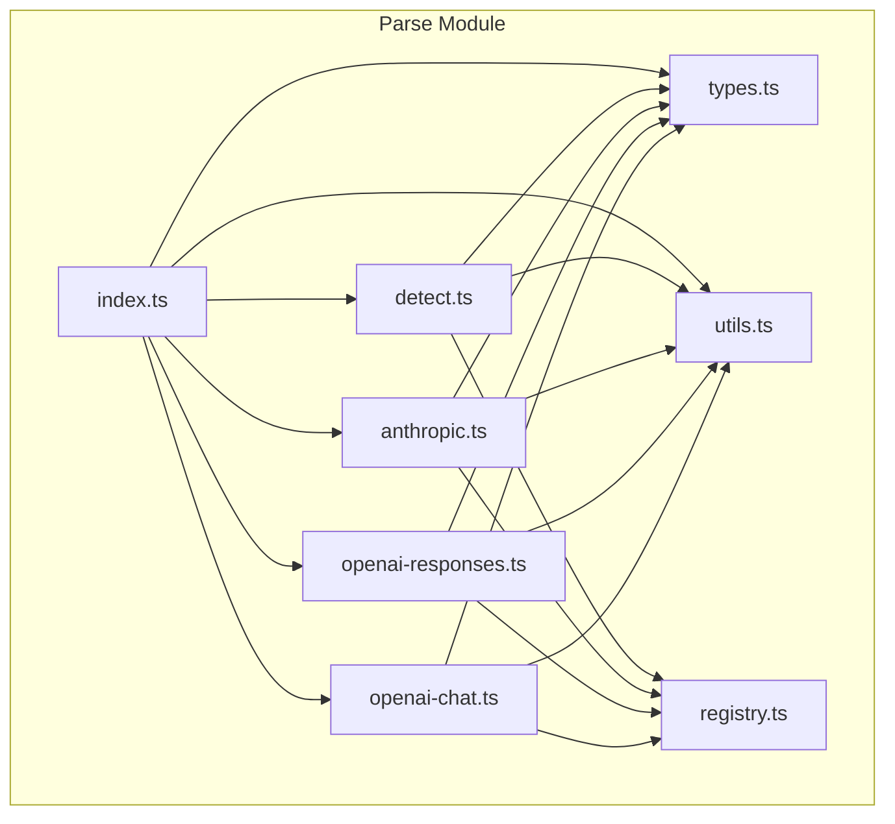
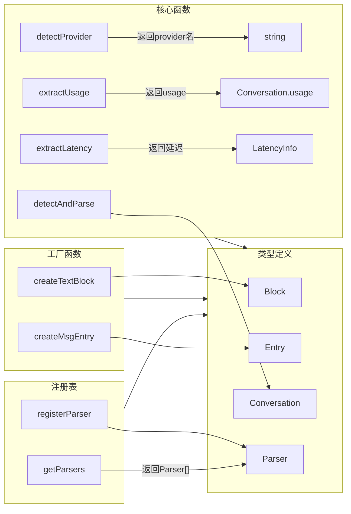
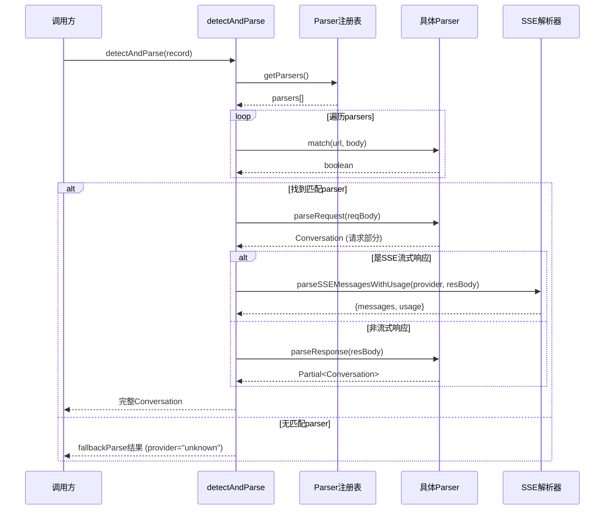
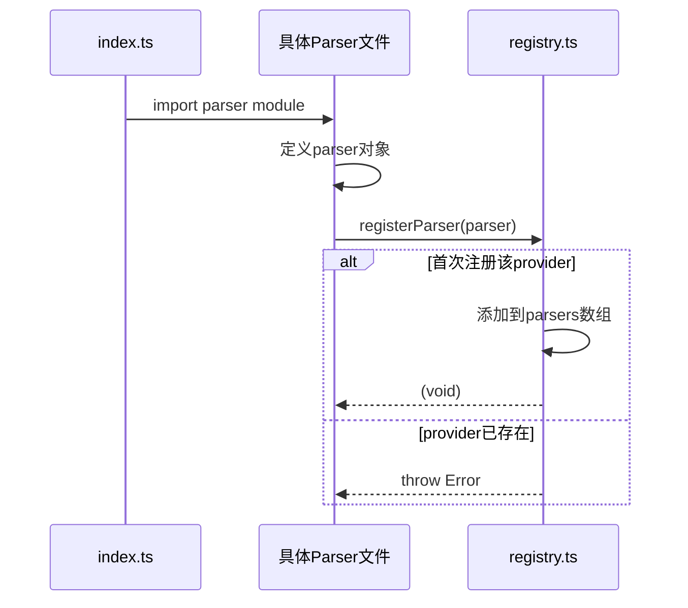

# M001.2-Parse

## 概述

Parse 模块解决了多 AI 提供商 API 格式异构的问题。它在 Domain Layer 中承担"统一抽象"的角色，将 OpenAI (Chat Completions/Responses) 和 Anthropic Messages API 的请求/响应格式转换为统一的 `Conversation` 结构。如果移除此模块，系统将无法理解任何 API 交互内容，所有 trace 数据只能以原始 JSON 形式存储，无法进行有意义的查询和可视化。

---

## 元数据

| 字段 | 值 |
|------|-----|
| 模块 ID | M001.2 |
| 路径 | packages/core/src/parse/ |
| 文件数 | 8 (源文件) + 3 (测试文件) |
| 代码行数 | 990 (源文件) |
| 主要语言 | TypeScript |
| 所属层 | Domain Layer |
| 父模块 | M001-Core |
| 依赖于 | M001.3-Transform (SSE解析), M001.8-Schemas (TraceRecord类型) |
| 被依赖于 | M001.4-Query, M004.1-Server |

---

## 子模块

此模块无子模块。

---

## 文件结构



| 文件 | 职责 | 行数 | 主要导出 |
|------|------|------|----------|
| types.ts | 定义核心类型：Block, Entry, Conversation, Parser 接口 | 70 | Block, Entry, Conversation, Parser |
| registry.ts | Parser 注册表，支持动态注册和测试清理 | 18 | registerParser, getParsers, clearParsersForTesting |
| utils.ts | Entry/Block 创建工厂函数，ID 生成 | 68 | createTextBlock, createMsgEntry, generateId 等 |
| detect.ts | 核心解析逻辑：detectAndParse, detectProvider, extractUsage, extractLatency | 149 | detectAndParse, detectProvider, extractUsage, extractLatency |
| openai-chat.ts | OpenAI Chat Completions API 解析器 | 215 | openaiChatParser (自注册) |
| openai-responses.ts | OpenAI Responses API 解析器 | 253 | openaiResponsesParser (自注册) |
| anthropic.ts | Anthropic Messages API 解析器 | 185 | anthropicParser (自注册) |
| index.ts | 模块公共接口导出 | 37 | 全部公共类型和函数 |

---

## 功能树

```
M001.2-Parse (API响应解析)
├── types.ts
│   ├── type: BlockType — "text" | "thinking" | "td" | "tc" | "tr" | "image" | "other"
│   ├── type: Block — 消息块联合类型 (TextBlock | ThinkingBlock | ...)
│   ├── type: Entry — 消息条目 (id, role, blocks)
│   ├── type: Conversation — 统一对话结构 (provider, model, sys, tool, msgs, usage, stream)
│   └── interface: Parser — 解析器契约 (provider, match, parseRequest, parseResponse)
├── registry.ts
│   ├── fn: registerParser(parser) — 注册解析器，重复注册抛错
│   ├── fn: getParsers() — 获取已注册解析器列表
│   └── fn: clearParsersForTesting() — 清空注册表（测试用）
├── utils.ts
│   ├── fn: generateId() — 生成随机ID
│   ├── fn: generateStableId(role, blocks) — 基于内容生成稳定ID
│   ├── fn: createSysEntry(blocks) — 创建系统消息条目
│   ├── fn: createToolEntry(blocks) — 创建工具定义条目
│   ├── fn: createMsgEntry(role, blocks) — 创建普通消息条目
│   ├── fn: createTextBlock(text) — 创建文本块
│   ├── fn: createThinkingBlock(thinking) — 创建思考块
│   ├── fn: createToolDefinitionBlock(...) — 创建工具定义块
│   ├── fn: createToolCallBlock(...) — 创建工具调用块
│   ├── fn: createToolResultBlock(...) — 创建工具结果块
│   ├── fn: createImageBlock(source) — 创建图像块
│   └── fn: createOtherBlock(raw) — 创建其他类型块
├── detect.ts
│   ├── fn: detectAndParse(record) — 检测提供商并解析为Conversation
│   ├── fn: detectProvider(url, body) — 仅检测提供商名称
│   ├── fn: extractUsage(record) — 提取token使用统计
│   ├── fn: extractLatency(record) — 提取延迟信息(TTFT, TPOT, duration)
│   └── interface: LatencyInfo — 延迟数据结构
├── openai-chat.ts
│   └── const: openaiChatParser — OpenAI Chat Completions 解析器
│       ├── method: match(url, body) — 匹配 /chat/completions 端点
│       ├── method: parseRequest(body) — 解析请求体
│       └── method: parseResponse(body) — 解析响应体
├── openai-responses.ts
│   └── const: openaiResponsesParser — OpenAI Responses API 解析器
│       ├── method: match(url, body) — 匹配 /responses 端点
│       ├── method: parseRequest(body) — 解析请求体
│       └── method: parseResponse(body) — 解析响应体
└── anthropic.ts
    └── const: anthropicParser — Anthropic Messages API 解析器
        ├── method: match(url, body) — 匹配 /v1/messages 端点
        ├── method: parseRequest(body) — 解析请求体
        └── method: parseResponse(body) — 解析响应体
```

### 功能清单

| 名称 | 类型 | 文件 | 行号 | 描述 |
|------|------|------|------|------|
| BlockType | type | types.ts | L1 | 消息块类型枚举 |
| Block | type | types.ts | L43 | 消息块联合类型 |
| Entry | type | types.ts | L45 | 消息条目结构 |
| Conversation | type | types.ts | L51 | 统一对话结构 |
| Parser | interface | types.ts | L65 | 解析器契约接口 |
| registerParser | fn | registry.ts | L5 | 注册解析器到全局注册表 |
| getParsers | fn | registry.ts | L12 | 获取所有已注册解析器 |
| clearParsersForTesting | fn | registry.ts | L16 | 清空注册表（测试用） |
| detectAndParse | fn | detect.ts | L49 | 核心函数：检测提供商并解析 |
| detectProvider | fn | detect.ts | L87 | 仅返回提供商名称 |
| extractUsage | fn | detect.ts | L92 | 提取token使用统计 |
| extractLatency | fn | detect.ts | L123 | 提取TTFT/TPOT延迟指标 |
| generateId | fn | utils.ts | L13 | 生成9位随机ID |
| generateStableId | fn | utils.ts | L17 | 基于内容生成稳定哈希ID |
| createMsgEntry | fn | utils.ts | L38 | 创建带角色的消息条目 |
| openaiChatParser | const | openai-chat.ts | L139 | OpenAI Chat解析器实例 |
| openaiResponsesParser | const | openai-responses.ts | L94 | OpenAI Responses解析器实例 |
| anthropicParser | const | anthropic.ts | L19 | Anthropic解析器实例 |

### 职责边界

**做什么**

- 定义统一的 `Conversation` 数据结构，抽象所有支持的 AI 提供商
- 实现 Parser 接口，为每个提供商提供 match/parseRequest/parseResponse 方法
- 解析请求和响应中的 messages、tools、system prompt、usage 统计
- 处理流式(SSE)和非流式响应
- 提取延迟指标 (TTFT, TPOT, total duration)

**不做什么**

- 不负责网络请求或数据采集（由 M002-Record 模块负责）
- 不负责数据存储（由 M001.5-Store 模块负责）
- 不负责 UI 可视化（由 M001.6-Viewer 模块负责）
- 不进行 schema 验证（数据格式校验由 M001.8-Schemas 负责）
- 不处理 API 错误重试逻辑

---

## 公共接口契约

### 接口关系图



### 类型定义

```typescript
// [File: types.ts:1-6]
export type BlockType = "text" | "thinking" | "td" | "tc" | "tr" | "image" | "other";

// [File: types.ts:3-41]
export interface TextBlock { type: "text"; text: string; }
export interface ThinkingBlock { type: "thinking"; thinking: string; }
export interface ToolDefinitionBlock { type: "td"; name: string; description: string | null; inputSchema: unknown; }
export interface ToolCallBlock { type: "tc"; id: string; name: string; arguments: string; }
export interface ToolResultBlock { type: "tr"; toolCallId: string; content: string; }
export interface ImageBlock { type: "image"; source: unknown; }
export interface OtherBlock { type: "other"; raw: unknown; }

// [File: types.ts:43]
export type Block = TextBlock | ThinkingBlock | ToolDefinitionBlock | ToolCallBlock | ToolResultBlock | ImageBlock | OtherBlock;

// [File: types.ts:45-49]
export interface Entry {
  id: string;
  role?: "user" | "assistant" | "tool";
  blocks: Block[];
}

// [File: types.ts:51-63]
export interface Conversation {
  provider: string;
  model: string | null;
  sys?: Entry;
  tool?: Entry;
  msgs: Entry[];
  usage: {
    inputMissTokens: number | null;
    inputHitTokens: number | null;
    outputTokens: number | null;
  } | null;
  stream: boolean;
}

// [File: types.ts:65-70]
export interface Parser {
  readonly provider: string;
  match(url: string, body: unknown): boolean;
  parseRequest(body: unknown): Conversation;
  parseResponse(body: unknown): Partial<Conversation>;
}

// [File: detect.ts:114-121]
export interface LatencyInfo {
  requestSentAt: number | null;
  firstTokenAt: number | null;
  lastTokenAt: number | null;
  ttft: number | null;          // Time to First Token (ms)
  tpot: number | null;          // Time Per Output Token (ms)
  totalDuration: number | null; // Total request duration (ms)
}
```

| 类型名 | 字段/方法 | 类型 | 描述 | 位置 |
|--------|-----------|------|------|------|
| BlockType | - | union | 消息块类型标识 | types.ts:1 |
| Block | - | union | 7种消息块的联合类型 | types.ts:43 |
| Entry | id | string | 消息条目唯一标识 | types.ts:46 |
| Entry | role | "user" \| "assistant" \| "tool" \| undefined | 消息角色 | types.ts:47 |
| Entry | blocks | Block[] | 消息包含的块列表 | types.ts:48 |
| Conversation | provider | string | API提供商标识 | types.ts:52 |
| Conversation | model | string \| null | 使用的模型名称 | types.ts:53 |
| Conversation | sys | Entry \| undefined | 系统提示 | types.ts:54 |
| Conversation | tool | Entry \| undefined | 工具定义 | types.ts:55 |
| Conversation | msgs | Entry[] | 对话消息列表 | types.ts:56 |
| Conversation | usage | Usage \| null | Token使用统计 | types.ts:57-61 |
| Conversation | stream | boolean | 是否流式请求 | types.ts:62 |
| Parser | provider | string | 解析器标识 | types.ts:66 |
| Parser | match | (url, body) => boolean | 匹配检测方法 | types.ts:67 |
| Parser | parseRequest | (body) => Conversation | 解析请求体 | types.ts:68 |
| Parser | parseResponse | (body) => Partial<Conversation> | 解析响应体 | types.ts:69 |
| LatencyInfo | ttft | number \| null | 首token延迟(ms) | detect.ts:118 |
| LatencyInfo | tpot | number \| null | 每token平均延迟(ms) | detect.ts:119 |

### 导出函数

#### `detectAndParse()`

```typescript
// [File: detect.ts:49]
export function detectAndParse(record: TraceRecord): Conversation
```

| 参数 | 类型 | 必需 | 描述 |
|------|------|------|------|
| record | TraceRecord | 是 | 包含请求/响应的trace记录 |

- **返回**：`Conversation` — 统一格式的对话对象，包含provider、model、sys、tool、msgs、usage、stream
- **抛出**：无（解析失败时返回 fallback 结果）

**使用示例**：

```typescript
import { detectAndParse } from '@opencode-trace/core/parse';

const record = { /* TraceRecord */ };
const conversation = detectAndParse(record);
console.log(conversation.provider); // "openai-chat" | "openai-responses" | "anthropic" | "unknown"
```

#### `detectProvider()`

```typescript
// [File: detect.ts:87]
export function detectProvider(url: string, body: unknown): string | null
```

| 参数 | 类型 | 必需 | 描述 |
|------|------|------|------|
| url | string | 是 | 请求URL |
| body | unknown | 是 | 请求体 |

- **返回**：`string | null` — 提供商标识，未匹配返回 null

#### `extractUsage()`

```typescript
// [File: detect.ts:92]
export function extractUsage(record: TraceRecord): Conversation["usage"]
```

| 参数 | 类型 | 必需 | 描述 |
|------|------|------|------|
| record | TraceRecord | 是 | trace记录 |

- **返回**：`{ inputMissTokens, inputHitTokens, outputTokens } | null` — token使用统计

#### `extractLatency()`

```typescript
// [File: detect.ts:123]
export function extractLatency(record: TraceRecord): LatencyInfo | null
```

| 参数 | 类型 | 必需 | 描述 |
|------|------|------|------|
| record | TraceRecord | 是 | 必须包含 requestSentAt, firstTokenAt, lastTokenAt |

- **返回**：`LatencyInfo | null` — 延迟指标，缺少时间戳返回 null

#### `registerParser()`

```typescript
// [File: registry.ts:5]
export function registerParser(parser: Parser): void
```

| 参数 | 类型 | 必需 | 描述 |
|------|------|------|------|
| parser | Parser | 是 | 解析器实例 |

- **抛出**：`Error` — 当相同 provider 已注册时

---

## 内部实现

### 核心内部逻辑

| 函数/类 | 文件 | 行号 | 用途 |
|---------|------|------|------|
| fallbackParse | detect.ts | L11 | 无匹配解析器时的降级处理 |
| parseSSEMessagesWithUsage | detect.ts | L39 | 根据provider选择SSE解析函数 |
| isSSEBody | detect.ts | L45 | 检测响应体是否为SSE格式 |
| isRecord | 多文件 | - | 类型守卫：判断是否为普通对象 |
| extractMessages | openai-chat.ts | L20 | 提取OpenAI Chat消息列表 |
| extractTools | openai-chat.ts | L83 | 提取OpenAI工具定义 |
| extractSystem | openai-chat.ts | L101 | 提取OpenAI系统提示 |
| extractInputMessages | openai-responses.ts | L18 | 提取OpenAI Responses输入 |
| hashString | utils.ts | L3 | 字符串哈希（用于生成稳定ID） |

### 设计模式

| 模式 | 使用位置 | 使用原因 | 代码证据 |
|------|----------|----------|----------|
| Strategy Pattern | Parser接口 | 允许运行时切换不同提供商的解析逻辑，新增提供商只需实现接口并注册 | types.ts:65-70, registry.ts:5-9 |
| Registry Pattern | registry.ts | 集中管理解析器，支持动态注册和遍历查找，解耦解析器定义与使用 | registry.ts:3-17 |
| Factory Pattern | utils.ts | 统一创建Block/Entry对象，确保结构一致性和简化调用方代码 | utils.ts:42-67 |
| Self-Registration | 各parser文件末尾 | 解析器模块导入时自动注册，无需手动初始化，简化使用 | openai-chat.ts:214-215, anthropic.ts:184-185 |

### 关键算法 / 策略

| 算法/策略 | 用途 | 复杂度 | 文件 |
|-----------|------|--------|------|
| Provider匹配优先级 | 按注册顺序匹配第一个成功者 | O(n) | detect.ts:54 |
| 稳定ID生成 | 基于角色+内容哈希，确保相同内容产生相同ID | O(m) m=内容长度 | utils.ts:17-28 |
| SSE增量解析 | 增量拼接流式响应内容，处理delta事件 | O(events) | transform/index.ts:20-104 |
| Token统计计算 | 从usage中提取并计算缓存命中/未命中 | O(1) | openai-chat.ts:119-137 |

---

## 关键流程

### 流程 1：detectAndParse 解析流程

**调用链**

```text
detect.ts:49 → detect.ts:54 (getParsers.find) → parser.parseRequest → detect.ts:63 (isSSEBody) → transform/sse.ts (SSE解析) → parser.parseResponse
```

**时序图**



**步骤详解**

| 步骤 | 说明 | 文件位置 |
|------|------|----------|
| 1 | 从注册表获取所有已注册的解析器 | registry.ts:12 |
| 2 | 按注册顺序调用 match() 方法检测provider | detect.ts:54 |
| 3 | 调用匹配到的 parser.parseRequest() 解析请求体 | detect.ts:57 |
| 4 | 判断响应是否为SSE格式（包含 "data:" 字符串） | detect.ts:45-47, 63 |
| 5 | SSE响应：调用对应的SSE解析函数（openai-chat/openai-responses/anthropic） | detect.ts:39-43 |
| 6 | 非SSE响应：调用 parser.parseResponse() 解析响应体 | detect.ts:68 |
| 7 | 合并请求和响应的消息，返回完整Conversation | detect.ts:74-84 |

### 流程 2：Parser 注册流程

**调用链**

```text
index.ts:1-3 (import) → openai-chat.ts:214-215 (registerParser) → registry.ts:5-9 (添加到数组)
```

**时序图**



**步骤详解**

| 步骤 | 说明 | 文件位置 |
|------|------|----------|
| 1 | index.ts 导入所有 parser 模块 | index.ts:1-3 |
| 2 | 各 parser 文件末尾执行 registerParser() | openai-chat.ts:214-215 |
| 3 | 检查是否已存在同名 provider，存在则抛错 | registry.ts:6-8 |
| 4 | 将 parser 添加到全局数组 | registry.ts:9 |

### 流程 3：OpenAI Chat 请求解析

**调用链**

```text
openai-chat.ts:148 (parseRequest) → extractSystem:101 → extractTools:83 → extractMessages:20
```

**步骤详解**

| 步骤 | 说明 | 文件位置 |
|------|------|----------|
| 1 | 提取 system/instructions/developer 作为系统提示 | openai-chat.ts:101-117 |
| 2 | 提取 tools 数组转换为 ToolDefinitionBlock | openai-chat.ts:83-99 |
| 3 | 提取 messages 数组，处理角色、内容、工具调用、工具结果 | openai-chat.ts:20-81 |
| 4 | 处理 reasoning_content（思考过程）作为 ThinkingBlock | openai-chat.ts:71-73 |
| 5 | 返回包含 sys/tool/msgs 的 Conversation | openai-chat.ts:153-161 |

---

## 依赖

### 内部依赖（项目内其他模块）

| 模块 | 使用的接口 | 调用位置 |
|------|-----------|----------|
| M001.3-Transform | sseOpenaiChatParse, sseOpenaiResponsesParse, sseAnthropicParse | detect.ts:5 |
| M001.8-Schemas | TraceRecord 类型 | detect.ts:1 |
| M001.8-Schemas | parse/types.ts 的 Entry, Block, Conversation | transform/index.ts:2-3 |

### 外部依赖（第三方包）

| 包名 | 版本 | 用途 | 可替代性 |
|------|------|------|----------|
| 无 | - | 纯TypeScript实现，无外部依赖 | - |

---

## 代码质量与风险

### 代码坏味道

| 问题 | 类型 | 文件 | 严重度 | 建议 |
|------|------|------|--------|------|
| isRecord 函数重复定义 | 重复代码 | 5个文件各有定义 | 低 | 可提取到 utils.ts 共享 |
| fallbackParse 缺少错误日志 | 缺失功能 | detect.ts:11 | 低 | 添加 debug 日志便于排查 |

### 潜在风险

| 风险 | 触发条件 | 影响 | 文件 | 建议 |
|------|----------|------|------|------|
| 新provider API格式变化 | OpenAI/Anthropic更新API | 解析失败或数据丢失 | 各parser文件 | 增加版本兼容性检测和降级处理 |
| 未知API端点匹配错误 | URL包含相似关键词 | 错误的parser被选中 | detect.ts:54 | 增强match()判断条件，避免误匹配 |
| SSE解析不完整 | 流被中断或格式异常 | 丢失部分内容 | transform/index.ts | 增加容错和恢复机制 |
| 缓存token计算负数 | usage数据异常 | 显示负值 | openai-chat.ts:130 | 添加 Math.max(0, ...) 保护 |

### 测试覆盖

| 测试类型 | 覆盖情况 | 测试文件 | 说明 |
|----------|----------|----------|------|
| 单元测试 | 部分 | detect.test.ts, registry.test.ts, provider-registration.test.ts | 覆盖注册逻辑、延迟提取，缺少完整解析测试 |
| 集成测试 | 无 | - | 建议添加完整trace记录解析的集成测试 |

---

## 开发指南

### 洞察

1. **统一抽象的价值**：通过 `Conversation` 类型，上层模块无需关心具体 API 差异，查询和存储逻辑可以统一处理。

2. **Provider 优先级**：解析器按注册顺序匹配，当前顺序是 openai-chat → openai-responses → anthropic。如果 URL 同时匹配多个，第一个胜出。

3. **自注册模式的优雅**：每个 parser 文件末尾自动注册，index.ts 只需 import 即可初始化所有 parser，避免了中心化注册代码。

4. **稳定ID的意义**：`generateStableId` 基于内容哈希生成ID，确保相同内容的消息在不同解析中产生相同ID，便于去重和对比。

### 扩展指南

添加新 Provider 解析器：

1. 在 `packages/core/src/parse/` 目录创建新文件，如 `newprovider.ts`
2. 实现 `Parser` 接口：
   ```typescript
   export const newProviderParser: Parser = {
     provider: "newprovider",
     match(url, body) { /* 匹配逻辑 */ },
     parseRequest(body) { /* 请求解析 */ },
     parseResponse(body) { /* 响应解析 */ }
   };
   ```
3. 文件末尾添加自注册：
   ```typescript
   import { registerParser } from "./registry.js";
   registerParser(newProviderParser);
   ```
4. 在 `index.ts` 中导入并导出：
   ```typescript
   import "./newprovider.js";
   export { newProviderParser } from "./newprovider.js";
   ```
5. 如果支持流式响应，在 `detect.ts:parseSSEMessagesWithUsage` 添加对应分支
6. 添加测试文件 `newprovider.test.ts`

### 风格与约定

1. **类型守卫**：使用 `isRecord()` 函数判断对象类型，避免 `as any`
2. **空值处理**：使用 `?? null` 和 `|| ""` 提供默认值，确保类型安全
3. **Block 创建**：统一使用 `createXxxBlock()` 工厂函数，不直接构造对象
4. **ID 生成**：Entry 使用 `createMsgEntry()` 自动生成稳定ID，sys/tool 使用固定ID
5. **解析失败**：返回空数组或默认值，不抛出异常，保持解析流程不中断

### 设计哲学

1. **容错优先**：解析逻辑假设输入可能不完整或格式异常，优先保证流程不中断，缺失数据用默认值填充。

2. **关注点分离**：
   - Parser 负责：API 格式 → 统一结构
   - SSE解析：放在 transform 模块，复用给其他场景
   - 业务逻辑：由上层模块处理

3. **扩展开放，修改封闭**：新增 Provider 只需添加新文件，无需修改现有代码（符合开闭原则）。

### 修改检查清单

- [ ] Parser 接口签名变更需检查所有已注册 parser 的实现
- [ ] Conversation 类型变更需检查 M001.4-Query 和 M004.1-Server 的使用
- [ ] 新增 BlockType 需同步更新 utils.ts 的创建函数
- [ ] 修改 match() 逻辑需确保不影响现有 provider 的匹配
- [ ] SSE 解析逻辑变更需同步修改 transform 模块
- [ ] 新增 provider 需更新 provider-registration.test.ts 的断言
