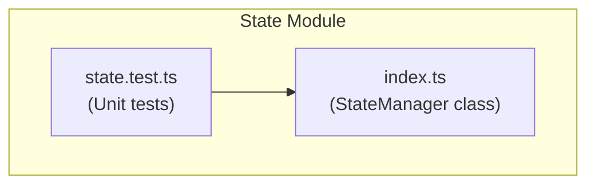
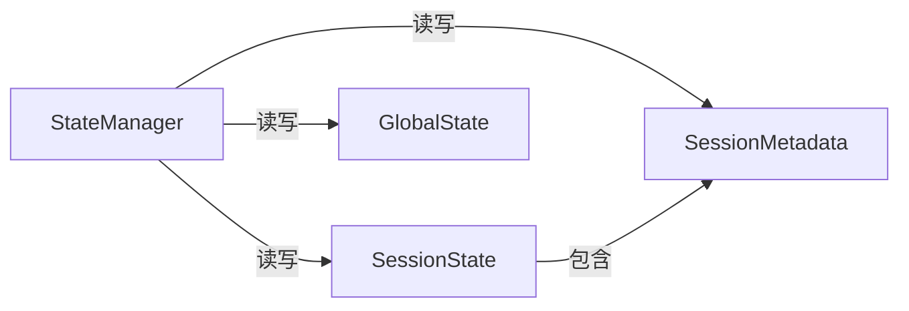
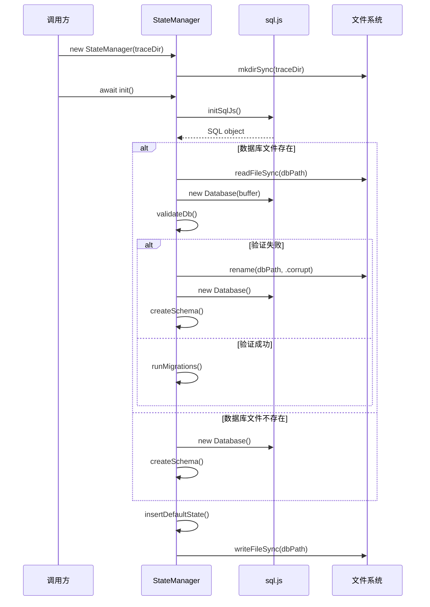
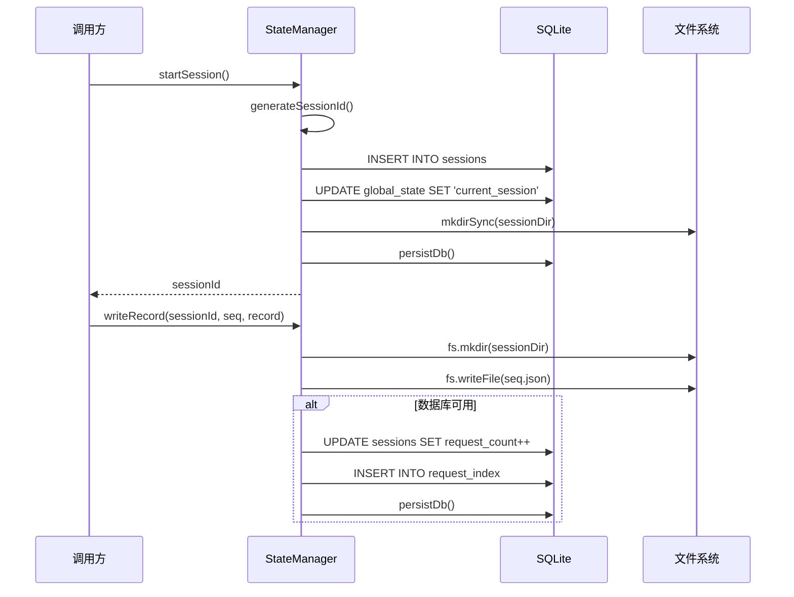
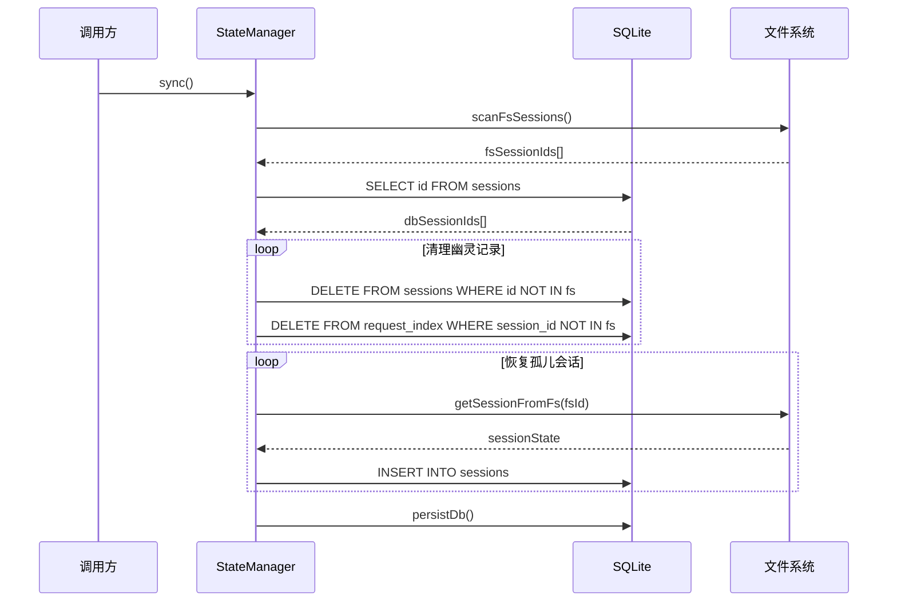

# M001.6-State

## 概述

StateManager 模块解决了会话状态持久化和全局配置管理的核心问题。它作为系统的"记忆中枢"，在 Domain Layer 中负责维护所有 trace session 的生命周期状态、请求索引和全局开关配置。如果移除此模块，系统将无法持久化会话信息、无法追踪活跃会话、也无法支持跨会话的全局配置管理。

---

## 元数据

| 字段 | 值 |
|------|-----|
| 模块 ID | M001.6 |
| 路径 | packages/core/src/state/ |
| 文件数 | 2 |
| 代码行数 | 1033 |
| 主要语言 | TypeScript |
| 所属层 | Domain Layer |
| 父模块 | M001-Core |
| 依赖于 | 外部: sql.js |
| 被依赖于 | M001.1-Store, M001.5-Record |

---

## 子模块

（无子模块）

---

## 文件结构



| 文件 | 职责 | 行数 | 主要导出 |
|------|------|------|----------|
| index.ts | StateManager 类实现，SQLite 状态管理 | 595 | StateManager, SessionState, SessionMetadata, GlobalState |
| state.test.ts | 单元测试 | 438 | - |

---

## 功能树

```
M001.6-State (状态管理)
└── index.ts
    ├── interface: SessionState — 会话状态数据结构
    ├── interface: SessionMetadata — 会话元数据结构
    ├── interface: GlobalState — 全局状态数据结构
    └── class: StateManager — 状态管理核心类
        ├── method: init() — 初始化 SQLite 数据库
        ├── method: getGlobalState(key) — 获取全局状态值
        ├── method: setGlobalState(key, value) — 设置全局状态值
        ├── method: startSession(sessionId?) — 创建并启动新会话
        ├── method: stopSession(sessionId) — 停止会话
        ├── method: getSession(sessionId) — 获取会话详情
        ├── method: getActiveSession() — 获取当前活跃会话
        ├── method: listSessions() — 列出所有会话
        ├── method: writeRecord(sessionId, seq, record) — 写入请求记录
        ├── method: sync() — 同步文件系统与数据库状态
        ├── method: updateSessionMetadata(sessionId, metadata) — 更新会话元数据
        ├── method: setSessionEnabled(sessionId, enabled) — 设置会话启用状态
        ├── method: getSessionEnabled(sessionId) — 获取会话启用状态
        ├── method: isTraceEnabled(sessionId?) — 检查追踪是否启用
        ├── method: addSubSession(parentId, childId) — 添加子会话关联
        ├── method: reload() — 从磁盘重新加载数据库
        └── private methods:
            ├── validateDb() — 验证数据库结构
            ├── getSchemaVersion() — 获取数据库版本
            ├── runMigrations() — 执行数据库迁移
            ├── handleCorruptDb() — 处理损坏的数据库
            ├── createSchema() — 创建数据库表结构
            ├── insertDefaultState() — 插入默认全局状态
            ├── persistDb() — 持久化数据库到磁盘
            ├── generateSessionId() — 生成 UUID 会话 ID
            ├── scanFsSessions() — 扫描文件系统会话目录
            ├── getSessionFromFs(sessionId) — 从文件系统恢复会话
            ├── listSessionsFromFs() — 从文件系统列出会话
            ├── getMetadataPath(sessionId) — 获取元数据文件路径
            ├── readMetadataFile(sessionId) — 读取元数据文件
            └── writeMetadataFile(sessionId, metadata) — 写入元数据文件
```

### 功能清单

| 名称 | 类型 | 文件 | 行号 | 描述 |
|------|------|------|------|------|
| SessionState | interface | index.ts | L9-20 | 会话状态数据结构定义 |
| SessionMetadata | interface | index.ts | L22-28 | 会话元数据结构定义 |
| GlobalState | interface | index.ts | L30-34 | 全局状态数据结构定义 |
| StateManager | class | index.ts | L47-595 | 状态管理核心类 |
| init | method | index.ts | L62-96 | 异步初始化 SQLite 数据库，支持损坏恢复 |
| getGlobalState | method | index.ts | L239-245 | 根据 key 获取全局状态值 |
| setGlobalState | method | index.ts | L247-253 | 设置全局状态键值对 |
| startSession | method | index.ts | L255-274 | 创建新会话并设为当前活跃会话 |
| stopSession | method | index.ts | L276-288 | 停止会话并清理活跃状态 |
| getSession | method | index.ts | L290-309 | 获取单个会话的完整状态信息 |
| getActiveSession | method | index.ts | L311-327 | 获取当前活跃会话 ID |
| writeRecord | method | index.ts | L329-355 | 异步写入请求记录并更新索引 |
| sync | method | index.ts | L357-385 | 同步文件系统会话与数据库记录 |
| listSessions | method | index.ts | L387-407 | 按时间倒序列出所有会话 |
| updateSessionMetadata | method | index.ts | L534-549 | 更新会话元数据（title, parentID, folderPath） |
| isTraceEnabled | method | index.ts | L577-585 | 检查全局或会话级别的追踪开关 |
| addSubSession | method | index.ts | L587-595 | 建立父子会话关联 |

### 职责边界

**做什么**

- 管理 SQLite 数据库的生命周期（初始化、验证、迁移、持久化）
- 维护会话状态（创建、查询、停止、列表）
- 存储全局配置（current_session, plugin_enabled, global_trace_enabled）
- 建立请求索引（session_id, seq, url, method, purpose, request_at）
- 管理会话元数据（title, parentID, subSessions, enabled, folderPath）
- 提供文件系统降级模式（SQLite 不可用时）
- 同步文件系统与数据库状态（发现孤儿会话、清理幽灵记录）

**不做什么**

- 不处理网络请求（由 Record 模块负责）
- 不执行 trace 数据分析（由 Query 模块负责）
- 不提供 REST API（由 CLI 和 Plugin 负责）
- 不管理 trace 数据格式转换（由 Format 模块负责）

---

## 公共接口契约

### 接口关系图



### 类型定义

```typescript
// [File: packages/core/src/state/index.ts:9]
export interface SessionState {
  id: string;
  status: "active" | "stopped" | "archived";
  startedAt: string | null;
  endedAt: string | null;
  requestCount: number;
  title?: string;
  parentID?: string;
  subSessions?: string[];
  enabled?: boolean;
  folderPath?: string;
}
```

| 类型名 | 字段/方法 | 类型 | 描述 | 位置 |
|--------|-----------|------|------|------|
| SessionState | id | string | 会话唯一标识符 | index.ts:10 |
| SessionState | status | "active" \| "stopped" \| "archived" | 会话状态 | index.ts:11 |
| SessionState | startedAt | string \| null | 会话开始时间 ISO 字符串 | index.ts:12 |
| SessionState | endedAt | string \| null | 会话结束时间 ISO 字符串 | index.ts:13 |
| SessionState | requestCount | number | 请求计数 | index.ts:14 |
| SessionState | title | string (optional) | 会话标题 | index.ts:15 |
| SessionState | parentID | string (optional) | 父会话 ID | index.ts:16 |
| SessionState | subSessions | string[] (optional) | 子会话 ID 列表 | index.ts:17 |
| SessionState | enabled | boolean (optional) | 是否启用追踪 | index.ts:18 |
| SessionState | folderPath | string (optional) | 关联的项目路径 | index.ts:19 |

```typescript
// [File: packages/core/src/state/index.ts:22]
export interface SessionMetadata {
  title?: string;
  parentID?: string;
  subSessions?: string[];
  enabled?: boolean;
  folderPath?: string;
}
```

```typescript
// [File: packages/core/src/state/index.ts:30]
export interface GlobalState {
  key: string;
  value: string | null;
  updatedAt: string;
}
```

### 导出类

#### `StateManager`

| 方法 | 签名 | 描述 | 位置 |
|------|------|------|------|
| constructor | `(traceDir: string)` | 创建状态管理器实例 | index.ts:53-60 |
| init | `async (): Promise<void>` | 初始化 SQLite 数据库 | index.ts:62-96 |
| getGlobalState | `(key: string): string \| null` | 获取全局状态值 | index.ts:239-245 |
| setGlobalState | `(key: string, value: string \| null): void` | 设置全局状态值 | index.ts:247-253 |
| startSession | `(sessionId?: string): string` | 创建并启动新会话，返回会话 ID | index.ts:255-274 |
| stopSession | `(sessionId: string): void` | 停止会话 | index.ts:276-288 |
| getSession | `(sessionId: string): SessionState \| null` | 获取会话详情 | index.ts:290-309 |
| getActiveSession | `(): string \| null` | 获取当前活跃会话 ID | index.ts:311-327 |
| listSessions | `(): SessionState[]` | 列出所有会话（按时间倒序） | index.ts:387-407 |
| writeRecord | `async (sessionId: string, seq: number, record: TraceRecord): Promise<void>` | 写入请求记录 | index.ts:329-355 |
| sync | `(): void` | 同步文件系统与数据库状态 | index.ts:357-385 |
| updateSessionMetadata | `(sessionId: string, metadata: {title?, parentID?, folderPath?}): void` | 更新会话元数据 | index.ts:534-549 |
| setSessionEnabled | `(sessionId: string, enabled: boolean): void` | 设置会话追踪开关 | index.ts:551-554 |
| getSessionEnabled | `(sessionId: string): boolean` | 获取会话追踪开关状态 | index.ts:556-559 |
| isTraceEnabled | `(sessionId?: string): boolean` | 检查追踪是否启用 | index.ts:577-585 |
| addSubSession | `(parentSessionId: string, subSessionId: string): void` | 添加子会话关联 | index.ts:587-595 |
| reload | `(): void` | 从磁盘重新加载数据库 | index.ts:561-575 |

**使用示例**：

```typescript
import { StateManager } from '@opencode-trace/core/state'

const manager = new StateManager('/path/to/trace/dir')
await manager.init()

// 会话管理
const sessionId = manager.startSession()
manager.stopSession(sessionId)
const session = manager.getSession(sessionId)
const activeId = manager.getActiveSession()
const sessions = manager.listSessions()

// 全局状态
const currentSession = manager.getGlobalState('current_session')
manager.setGlobalState('global_trace_enabled', 'true')

// 追踪开关
if (manager.isTraceEnabled(sessionId)) {
  await manager.writeRecord(sessionId, 1, record)
}

// 元数据管理
manager.updateSessionMetadata(sessionId, { title: 'My Session' })
manager.addSubSession(parentId, childId)
```

---

## 内部实现

### 核心内部逻辑

| 函数/类 | 文件 | 行号 | 用途 |
|---------|------|------|------|
| validateDb | index.ts | L98-107 | 验证 SQLite 表结构完整性（schema_version, sessions, global_state） |
| getSchemaVersion | index.ts | L109-122 | 从 schema_version 表读取当前数据库版本号 |
| runMigrations | index.ts | L124-144 | 按版本号顺序执行待执行的数据库迁移脚本 |
| handleCorruptDb | index.ts | L146-164 | 将损坏的数据库文件重命名为 .corrupt 后缀或删除 |
| createSchema | index.ts | L166-202 | 创建初始数据库表结构（schema_version, sessions, global_state, request_index） |
| insertDefaultState | index.ts | L204-224 | 插入默认全局状态键（current_session=null, plugin_enabled=true, global_trace_enabled=false） |
| persistDb | index.ts | L226-237 | 将内存中的 SQLite 数据导出并写入磁盘文件 |
| scanFsSessions | index.ts | L413-432 | 扫描 traceDir 下所有子目录作为潜在会话 |
| getSessionFromFs | index.ts | L434-484 | 从文件系统重建会话状态（读取 JSON 文件统计请求） |
| listSessionsFromFs | index.ts | L486-498 | 纯文件系统模式下列出所有会话 |
| readMetadataFile | index.ts | L504-522 | 读取会话目录下的 metadata.json 文件 |
| writeMetadataFile | index.ts | L524-532 | 写入会话目录下的 metadata.json 文件 |

### 设计模式

| 模式 | 使用位置 | 使用原因 | 代码证据 |
|------|----------|----------|----------|
| Graceful Degradation | init(), getSession(), listSessions() | SQLite 失败时自动降级到纯文件系统模式，保证系统可用性 | index.ts:73-85, index.ts:291-293, index.ts:388-390 |
| Repository Pattern | 全类 | 将数据访问逻辑封装在 StateManager 中，上层模块无需关心存储细节 | index.ts:47-595 |
| Migration Pattern | runMigrations(), MIGRATIONS | 支持数据库 schema 版本升级，预留迁移框架 | index.ts:40-45, index.ts:124-144 |

### 关键算法 / 策略

| 算法/策略 | 用途 | 复杂度 | 文件 |
|-----------|------|--------|------|
| 双层存储策略 | SQLite 作为主索引 + 文件系统存储详细记录 | O(1) 索引查询 | index.ts:329-355 |
| 同步算法 | 对比文件系统目录与 SQLite 记录，修复孤儿会话和清理幽灵记录 | O(n+m) | index.ts:357-385 |
| 元数据合并策略 | 数据库基本状态 + metadata.json 扩展字段合并返回 | O(1) | index.ts:307-308 |

---

## 关键流程

### 流程 1：StateManager 初始化

**调用链**

```text
constructor() → init() → initSqlJs() → validateDb() → runMigrations() → createSchema() → insertDefaultState() → persistDb()
```

**时序图**



**步骤详解**

| 步骤 | 说明 | 文件位置 |
|------|------|----------|
| 1 | 构造函数创建 traceDir 目录（如不存在） | index.ts:57-59 |
| 2 | init() 异步加载 sql.js WebAssembly 模块 | index.ts:64-65 |
| 3 | 尝试从磁盘加载现有数据库文件 | index.ts:67-70 |
| 4 | 验证数据库表结构完整性 | index.ts:71, L98-107 |
| 5 | 验证失败时处理损坏数据库（重命名或删除） | index.ts:78, L146-164 |
| 6 | 创建新数据库或执行迁移 | index.ts:72, L124-144, L166-202 |
| 7 | 插入默认全局状态键 | index.ts:87, L204-224 |
| 8 | 持久化数据库到磁盘 | index.ts:88, L226-237 |

### 流程 2：会话创建与记录写入

**调用链**

```text
startSession() → mkdirSync() → setGlobalState() → persistDb()
writeRecord() → fs.mkdir() → fs.writeFile() → UPDATE sessions → INSERT request_index → persistDb()
```

**时序图**



**步骤详解**

| 步骤 | 说明 | 文件位置 |
|------|------|----------|
| 1 | startSession 生成或使用指定的会话 ID | index.ts:256 |
| 2 | 在 sessions 表插入新记录（status=active） | index.ts:264-267 |
| 3 | 更新 global_state 表的 current_session | index.ts:268 |
| 4 | 创建会话目录 | index.ts:270 |
| 5 | 持久化数据库 | index.ts:271 |
| 6 | writeRecord 异步写入 JSON 文件 | index.ts:331-336 |
| 7 | 更新 sessions 表的 request_count 计数 | index.ts:340 |
| 8 | 插入 request_index 索引记录 | index.ts:341-344 |
| 9 | 持久化数据库 | index.ts:345 |

### 流程 3：同步文件系统与数据库

**调用链**

```text
sync() → scanFsSessions() → getSessionFromFs() → INSERT/DELETE sessions → persistDb()
```

**时序图**



**步骤详解**

| 步骤 | 说明 | 文件位置 |
|------|------|----------|
| 1 | 扫描文件系统获取所有会话目录 ID | index.ts:360, L413-432 |
| 2 | 从 SQLite 查询所有已记录的会话 ID | index.ts:361-362 |
| 3 | 删除 SQLite 中存在但文件系统不存在的幽灵记录 | index.ts:364-369 |
| 4 | 为文件系统存在但 SQLite 中不存在的孤儿会话重建索引 | index.ts:371-382 |
| 5 | 持久化数据库 | index.ts:384 |

---

## 依赖

### 内部依赖（项目内其他模块）

| 模块 | 使用的接口 | 调用位置 |
|------|-----------|----------|
| M001-Types | TraceRecord 类型 | index.ts:6, L329 |
| M001-Logger | logger 实例 | index.ts:7, L74, L116, L134, L140, L153, L159, L232, L346, L425, L466, L514, L569 |

### 外部依赖（第三方包）

| 包名 | 版本 | 用途 | 可替代性 |
|------|------|------|----------|
| sql.js | ^1.14.1 | 浏览器端 SQLite WASM 实现，提供嵌入式数据库 | 中（可替换为 better-sqlite3 等 Node.js SQLite 库） |
| Node.js:crypto | built-in | randomUUID 生成会话 ID | 低（Node.js 内置） |
| Node.js:fs | built-in | 文件系统操作 | 低（Node.js 内置） |
| Node.js:path | built-in | 路径处理 | 低（Node.js 内置） |

---

## 代码质量与风险

### 代码坏味道

| 问题 | 类型 | 文件 | 严重度 | 建议 |
|------|------|------|--------|------|
| SQL 注入风险 | 硬编码 | index.ts:242, 250, 266, 280 等 | 高 | 使用参数化查询或 escape 函数 |
| 过长类 | 过大类 | index.ts:47-595 | 中 | 考虑拆分为 SessionRepo, GlobalStateRepo, MetadataManager |
| 重复的错误处理模式 | 重复代码 | 多处 catch 块 | 低 | 抽取统一的错误处理工具函数 |

### 潜在风险

| 风险 | 触发条件 | 影响 | 文件 | 建议 |
|------|----------|------|------|------|
| SQL 注入 | sessionId 包含单引号等特殊字符 | 数据库错误或数据损坏 | index.ts:多处 | 使用参数化查询 |
| 并发写入 | 多进程同时写入 state.db | 数据丢失或数据库损坏 | index.ts:226-237 | 添加文件锁或使用支持并发的存储 |
| 内存泄漏 | 长期运行不重启，db 实例未关闭 | 内存占用持续增长 | index.ts:49 | 在 close/dispose 方法中释放 db |

### 测试覆盖

| 测试类型 | 覆盖情况 | 测试文件 | 说明 |
|----------|----------|----------|------|
| 单元测试 | 有 | state.test.ts | 覆盖初始化、会话管理、元数据、追踪开关、文件同步等核心功能 |
| 集成测试 | 部分 | state.test.ts | 包含文件系统与数据库同步测试 |

---

## 开发指南

### 洞察

1. **双层存储架构**：SQLite 作为快速索引层存储会话元数据和请求索引，文件系统作为数据层存储完整请求记录。这种设计平衡了查询性能和存储容量。

2. **优雅降级机制**：当 SQLite 初始化失败或数据库损坏时，系统自动降级到纯文件系统模式，保证基本可用性。这是高可用设计的关键特性。

3. **迁移框架预留**：MIGRATIONS 数组和 runMigrations 方法已预留数据库版本升级能力，当前版本为 1，后续可添加迁移脚本。

4. **元数据分离存储**：会话扩展元数据（title, parentID, folderPath）存储在独立的 metadata.json 文件中，便于用户直接编辑，同时保持 SQLite schema 简洁。

### 扩展指南

**添加新的全局状态键**：
1. 在 `insertDefaultState()` 方法中添加默认值
2. 添加对应的 getter 方法（如 `getPluginEnabled()`）

**添加新的会话元数据字段**：
1. 更新 `SessionState` 和 `SessionMetadata` 接口
2. 在 `updateSessionMetadata()` 中添加字段处理逻辑
3. 在 `readMetadataFile()` 中自动支持新字段

**添加数据库迁移**：
1. 增加 `CURRENT_SCHEMA_VERSION` 常量
2. 在 `MIGRATIONS` 数组中添加迁移对象
3. 迁移对象包含 `version` 和 `migrate` 方法

### 风格与约定

- **错误处理**：所有错误使用 logger.error 记录，不抛出异常，保证优雅降级
- **日志格式**：`logger.error("操作描述", { traceDir, error: String(err) })`
- **SQL 命名**：使用 snake_case（started_at, request_count），TypeScript 使用 camelCase
- **异步模式**：只有 `init()` 和 `writeRecord()` 是异步方法，其他方法均为同步

### 设计哲学

1. **可用性优先**：即使数据库完全损坏，系统也能从文件系统恢复基本功能
2. **简单查询**：不使用 ORM，直接使用 SQL 保持简单可控
3. **渐进增强**：从基本文件存储开始，逐步添加 SQLite 索引能力

### 修改检查清单

- [ ] 修改 SQL 语句时检查是否存在注入风险
- [ ] 添加新的会话字段时同步更新 SessionState 和 SessionMetadata 接口
- [ ] 修改数据库 schema 时递增 CURRENT_SCHEMA_VERSION 并添加迁移脚本
- [ ] 修改元数据结构时确保向后兼容（新字段应为可选）
- [ ] 测试修改是否影响 M001.1-Store 和 M001.5-Record 模块
- [ ] 运行 `npm run test` 确保所有单元测试通过
