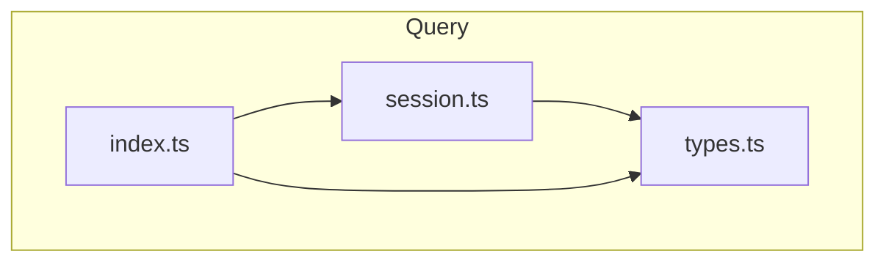
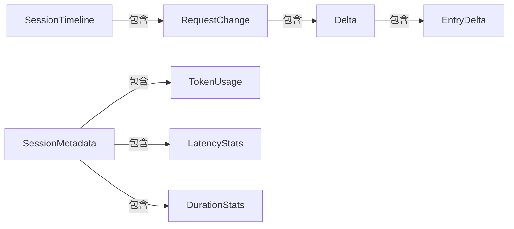
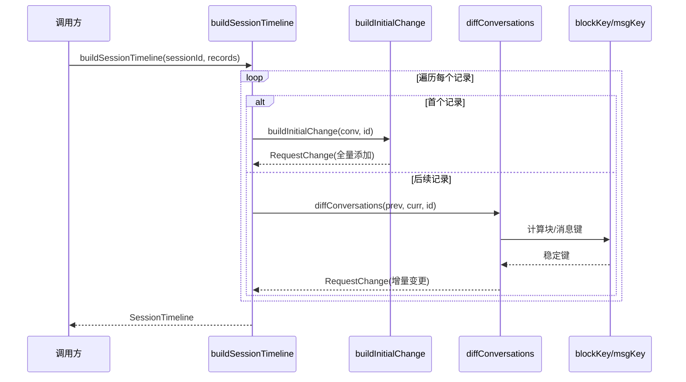

# M001.4-Query

## 概述

Query 模块负责对解析后的对话数据进行查询和分析，提供会话时间线构建、对话差异比对、以及元数据聚合功能。它在业务层扮演数据分析器的角色，将原始的 trace 记录转换为可读的时间线视图和统计摘要。如果移除该模块，系统将无法生成会话视图、无法进行对话版本的差异对比、也无法展示 token 使用量和延迟统计等关键指标。

---

## 元数据

| 字段 | 值 |
|------|-----|
| 模块 ID | M001.4 |
| 路径 | packages/core/src/query/ |
| 文件数 | 3 |
| 代码行数 | 335 |
| 主要语言 | TypeScript |
| 所属层 | Business Layer |
| 父模块 | M001-Core |
| 依赖于 | M001.2-Parse, M001.8-Schemas |
| 被依赖于 | M004.1-Server, M002-CLI, M001.6-Format |

---

## 文件结构



| 文件 | 职责 | 行数 | 主要导出 |
|------|------|------|----------|
| types.ts | 类型定义，定义时间线和元数据的数据结构 | 67 | EntryDelta, Delta, RequestChange, SessionTimeline, SessionMetadata, TokenUsage, LatencyStats |
| session.ts | 核心逻辑，实现对话差异算法和时间线构建 | 268 | diffConversations, buildSessionTimeline, buildSessionMetadata |
| index.ts | 模块入口，统一导出公共 API | 2 | 重新导出所有公共函数和类型 |

---

## 功能树

```
M001.4-Query (query and analysis)
├── types.ts
│   ├── type: EntryDelta — 单条消息的变更（添加/删除的块）
│   ├── type: Delta — 完整的变更集（系统、工具、消息）
│   ├── type: RequestChange — 单次请求的变更记录
│   ├── type: SessionTimeline — 会话时间线
│   ├── type: TokenUsage — token 使用统计
│   ├── type: LatencyStats — 延迟统计（TTFT、TPOT）
│   ├── type: DurationStats — 持续时间统计
│   ├── type: SessionMetadata — 会话元数据汇总
│   └── type: TimelineRecord — 时间线记录输入格式
└── session.ts
    ├── fn: blockKey(block: Block): string — 为块生成稳定的比较键
    ├── fn: msgKey(msg: Entry): string — 为消息生成稳定的比较键
    ├── fn: diffConversations(prev, curr, requestId, requestMsgs?): RequestChange — 计算两次对话之间的差异
    ├── fn: buildInitialChange(conv, requestId, requestMsgs?): RequestChange — 构建首次请求的初始变更
    ├── fn: checkIsUserCall(msgs: Entry[]): boolean — 判断是否为用户发起的调用
    ├── fn: buildSessionTimeline(sessionId, records): SessionTimeline — 从记录序列构建时间线
    └── fn: buildSessionMetadata(sessionId, records, folderPath?): SessionMetadata — 聚合会话元数据
```

### 功能清单

| 名称 | 类型 | 文件 | 行号 | 描述 |
|------|------|------|------|------|
| EntryDelta | type | types.ts | L3 | 单条消息的变更记录 |
| Delta | type | types.ts | L9 | 完整变更集，包含系统/工具/消息变更 |
| RequestChange | type | types.ts | L15 | 单次请求的变更，含请求间间隔 |
| SessionTimeline | type | types.ts | L22 | 会话完整时间线 |
| TokenUsage | type | types.ts | L28 | Token 使用统计，含缓存命中率 |
| LatencyStats | type | types.ts | L36 | 流式请求延迟统计 |
| SessionMetadata | type | types.ts | L49 | 会话元数据汇总 |
| TimelineRecord | type | types.ts | L62 | 时间线构建的输入记录类型 |
| blockKey | fn | session.ts | L6 | 为 Block 生成稳定的比较键 |
| msgKey | fn | session.ts | L27 | 为 Entry 生成稳定的比较键 |
| diffConversations | fn | session.ts | L31 | 比较两次对话并返回差异 |
| buildInitialChange | fn | session.ts | L111 | 构建首次请求的初始变更 |
| checkIsUserCall | fn | session.ts | L129 | 判断是否为用户文本调用 |
| buildSessionTimeline | fn | session.ts | L136 | 构建会话时间线 |
| buildSessionMetadata | fn | session.ts | L177 | 聚合会话元数据 |

### 职责边界

**做什么**

- 计算两次对话状态之间的差异（消息增删、块变更）
- 构建会话请求的时间线视图，展示每次请求的变化
- 聚合 token 使用统计（输入/输出/缓存命中）
- 计算延迟指标（TTFT、TPOT）和持续时间统计
- 识别用户发起的请求（通过检查最后消息是否为文本块）

**不做什么**

- 不负责数据存储（由 Store 模块处理）
- 不负责数据解析（由 Parse 模块处理）
- 不负责数据格式化输出（由 Format 模块处理）
- 不负责 API 路由和服务（由 Server 模块处理）

---

## 公共接口契约

### 接口关系图



### 类型定义

```typescript
// [File: types.ts:3-7]
export interface EntryDelta {
  id: string;
  added?: Block[];
  removed?: Block[];
}
```

```typescript
// [File: types.ts:9-13]
export interface Delta {
  sys?: EntryDelta;
  tool?: EntryDelta;
  msgs: EntryDelta[];
}
```

```typescript
// [File: types.ts:15-20]
export interface RequestChange {
  requestId: number;
  delta: Delta;
  interRequestDuration: number | null;
  isUserCall: boolean;
}
```

```typescript
// [File: types.ts:22-26]
export interface SessionTimeline {
  sessionId: string;
  totalRequests: number;
  changes: RequestChange[];
}
```

```typescript
// [File: types.ts:28-34]
export interface TokenUsage {
  inputMissTokens: number;
  inputHitTokens: number;
  outputTokens: number;
  totalTokens: number;
  cacheHitRate: number;
}
```

```typescript
// [File: types.ts:36-42]
export interface LatencyStats {
  avgTTFT: number | null;
  maxTTFT: number | null;
  avgTPOT: number | null;
  maxTPOT: number | null;
  streamRequestCount: number;
}
```

```typescript
// [File: types.ts:49-60]
export interface SessionMetadata {
  sessionId: string;
  tokenUsage: TokenUsage;
  requestCount: number;
  subSessions: string[];
  parentSession: string | null;
  createdAt: string | null;
  updatedAt: string | null;
  folderPath?: string;
  latencyStats: LatencyStats | null;
  durationStats: DurationStats | null;
}
```

| 类型名 | 字段/方法 | 类型 | 描述 | 位置 |
|--------|-----------|------|------|------|
| EntryDelta | id | string | 消息标识符 | types.ts:4 |
| EntryDelta | added | Block[] | 新增的内容块 | types.ts:5 |
| EntryDelta | removed | Block[] | 删除的内容块 | types.ts:6 |
| Delta | sys | EntryDelta | 系统提示变更 | types.ts:10 |
| Delta | tool | EntryDelta | 工具定义变更 | types.ts:11 |
| Delta | msgs | EntryDelta[] | 消息变更列表 | types.ts:12 |
| RequestChange | requestId | number | 请求序号 | types.ts:16 |
| RequestChange | delta | Delta | 变更内容 | types.ts:17 |
| RequestChange | interRequestDuration | number \| null | 请求间间隔(ms) | types.ts:18 |
| RequestChange | isUserCall | boolean | 是否用户发起 | types.ts:19 |
| TokenUsage | cacheHitRate | number | 缓存命中率(0-1) | types.ts:33 |
| LatencyStats | avgTTFT | number \| null | 平均首token时间 | types.ts:37 |
| LatencyStats | avgTPOT | number \| null | 平均每token时间 | types.ts:39 |

### 导出函数

#### `diffConversations()`

```typescript
// [File: session.ts:31-109]
export function diffConversations(
  prev: Conversation,
  curr: Conversation,
  currRequestId: number,
  requestMsgs?: Entry[]
): RequestChange
```

| 参数 | 类型 | 必需 | 描述 |
|------|------|------|------|
| prev | Conversation | 是 | 上一次请求的对话状态 |
| curr | Conversation | 是 | 当前请求的对话状态 |
| currRequestId | number | 是 | 当前请求的序号 |
| requestMsgs | Entry[] | 否 | 发送请求时的消息列表（用于判断 isUserCall） |

- **返回**：`RequestChange` — 包含所有变更（系统提示、工具定义、消息）和请求间间隔的记录
- **算法**：使用基于键的集合比较，通过 blockKey/msgKey 生成稳定键，计算两个集合的差集

**使用示例**：

```typescript
import { diffConversations } from "@opencode-trace/core/query";
const change = diffConversations(prevConv, currConv, 2);
console.log(change.delta.msgs); // 新增/删除的消息
```

#### `buildSessionTimeline()`

```typescript
// [File: session.ts:136-175]
export function buildSessionTimeline(
  sessionId: string,
  records: TimelineRecord[]
): SessionTimeline
```

| 参数 | 类型 | 必需 | 描述 |
|------|------|------|------|
| sessionId | string | 是 | 会话标识符 |
| records | TimelineRecord[] | 是 | 按顺序排列的请求记录 |

- **返回**：`SessionTimeline` — 完整的时间线，包含每次请求的变更和请求间间隔

**使用示例**：

```typescript
import { buildSessionTimeline } from "@opencode-trace/core/query";
const timeline = buildSessionTimeline("session-123", records);
console.log(timeline.totalRequests, timeline.changes);
```

#### `buildSessionMetadata()`

```typescript
// [File: session.ts:177-268]
export function buildSessionMetadata(
  sessionId: string,
  records: { id: number; record?: TraceRecord; parsed: Conversation }[],
  folderPath?: string
): SessionMetadata
```

| 参数 | 类型 | 必需 | 描述 |
|------|------|------|------|
| sessionId | string | 是 | 会话标识符 |
| records | object[] | 是 | 包含解析后对话和原始记录的数据 |
| folderPath | string | 否 | 可选的文件夹路径 |

- **返回**：`SessionMetadata` — 聚合的会话元数据，含 token 统计、延迟统计、持续时间统计

**使用示例**：

```typescript
import { buildSessionMetadata } from "@opencode-trace/core/query";
const meta = buildSessionMetadata("session-123", records);
console.log(meta.tokenUsage.totalTokens, meta.latencyStats?.avgTTFT);
```

---

## 内部实现

### 核心内部逻辑

| 函数/类 | 文件 | 行号 | 用途 |
|---------|------|------|------|
| blockKey | session.ts | L6 | 为不同类型的 Block 生成唯一键用于比较：text 用前50字符，thinking 用前50字符，tc 用 id+name 等 |
| msgKey | session.ts | L27 | 为 Entry 生成唯一键：`id:role` 格式 |
| buildInitialChange | session.ts | L111 | 为第一个请求构建初始变更（所有内容都是新增的） |
| checkIsUserCall | session.ts | L129 | 检查最后一条消息是否包含文本块，判断是否为用户文本调用 |

### 设计模式

| 模式 | 使用位置 | 使用原因 | 代码证据 |
|------|----------|----------|----------|
| Key-based Diff | session.ts:31-109 | 使用稳定键比较两个集合的差异，避免深度比较，提高性能 | `blockKey()` 和 `msgKey()` 生成键后用 Set 计算差集 |
| Builder Pattern | session.ts:136-175, 177-268 | 分步骤构建复杂对象，保持构建逻辑清晰 | `buildSessionTimeline` 和 `buildSessionMetadata` 逐步聚合数据 |

---

## 关键流程

### 流程 1：构建会话时间线

**调用链**

```text
buildSessionTimeline(session.ts:136) → buildInitialChange(session.ts:111) / diffConversations(session.ts:31)
```

**时序图**



**步骤详解**

| 步骤 | 说明 | 文件位置 |
|------|------|----------|
| 1 | 初始化变更列表和前一个对话状态为 null | session.ts:140-142 |
| 2 | 遍历每个记录，计算请求间间隔 | session.ts:144-154 |
| 3 | 如果是首个记录，调用 buildInitialChange 构建初始变更 | session.ts:157-158 |
| 4 | 否则调用 diffConversations 计算与前一状态的差异 | session.ts:159-160 |
| 5 | 设置请求间间隔并添加到变更列表 | session.ts:163-164 |
| 6 | 更新前一个对话状态用于下次比较 | session.ts:166-167 |
| 7 | 返回完整的 SessionTimeline | session.ts:170-174 |

### 流程 2：聚合会话元数据

**调用链**

```text
buildSessionMetadata(session.ts:177) → extractLatency(parse/detect.ts:123)
```

**步骤详解**

| 步骤 | 说明 | 文件位置 |
|------|------|----------|
| 1 | 初始化 token 计数器、延迟值数组、时间戳数组 | session.ts:182-191 |
| 2 | 遍历记录，累加 token 使用量 | session.ts:193-199 |
| 3 | 如果有原始记录，提取延迟信息和时间戳 | session.ts:201-214 |
| 4 | 计算 cache hit rate | session.ts:217-219 |
| 5 | 计算延迟统计（平均/最大 TTFT、TPOT） | session.ts:221-235 |
| 6 | 计算持续时间统计（wall time、总请求时间） | session.ts:237-248 |
| 7 | 返回完整的 SessionMetadata | session.ts:250-267 |

---

## 依赖

### 内部依赖（项目内其他模块）

| 模块 | 使用的接口 | 调用位置 |
|------|-----------|----------|
| M001.2-Parse | `Block`, `Entry`, `Conversation` | types.ts:1 |
| M001.2-Parse | `extractLatency()` | session.ts:4, 202 |
| M001.1-Store | `TraceRecord` | types.ts:2 (通过 session.ts:2) |

### 外部依赖（第三方包）

| 包名 | 版本 | 用途 | 可替代性 |
|------|------|------|----------|
| 无 | - | 本模块纯 TypeScript 实现，无第三方依赖 | - |

---

## 代码质量与风险

### 代码坏味道

| 问题 | 类型 | 文件 | 严重度 | 建议 |
|------|------|------|--------|------|
| blockKey 使用字符串截断 | 硬编码 | session.ts:9,11,19,21 | 低 | 截断长度 50 字符可能导致碰撞，但对于差异比对影响有限 |
| 多个 reduce 聚合统计 | 可优化 | session.ts:223-226,239-242 | 低 | 可合并为单次遍历，但当前实现清晰度更好 |

### 潜在风险

| 风险 | 触发条件 | 影响 | 文件 | 建议 |
|------|----------|------|------|------|
| blockKey 碰撞 | 两个不同块前50字符相同 | 差异比对可能遗漏变更 | session.ts:9-24 | 对于生产环境可考虑增加哈希或使用完整内容 |
| 空记录处理 | 传入空 records 数组 | 返回空的统计和 null 延迟 | session.ts:136,177 | 已有防御，但调用方应检查 |

### 测试覆盖

| 测试类型 | 覆盖情况 | 测试文件 | 说明 |
|----------|----------|----------|------|
| 单元测试 | 完整 | session.test.ts | 406 行测试覆盖所有导出函数和边界情况 |
| 集成测试 | 无 | - | 作为纯函数模块，单元测试已足够 |

---

## 开发指南

### 洞察

1. **差异算法基于键比较**：blockKey/msgKey 为每个块和消息生成稳定键，通过 Set 差集运算计算变更，避免了深度递归比较，时间复杂度 O(n)
2. **首请求特殊处理**：首个请求没有前驱状态，所有内容都视为"新增"，使用 buildInitialChange 独立处理
3. **延迟统计依赖流式数据**：TTFT/TPOT 只有在 TraceRecord 包含 requestSentAt/firstTokenAt/lastTokenAt 时才可计算

### 风格与约定

- 函数均为纯函数，无副作用，便于测试和推理
- 使用 `?:` 表示可选的变更字段（added/removed），未定义表示无变化
- 统计计算使用 null 表示"无数据"，而非 0 或 undefined

### 设计哲学

- **增量优于全量**：时间线存储每次请求的变更而非完整状态，节省存储和传输
- **延迟计算**：统计信息按需计算，不在存储时预计算

### 修改检查清单

- [ ] 修改 diffConversations 时，确保所有块类型（text/thinking/td/tc/tr/image/other）都有正确的键生成
- [ ] 修改 buildSessionMetadata 时，确保新增的统计字段在所有边界情况下返回合理的 null/0 值
- [ ] 新增导出类型时，更新 index.ts 的类型导出
- [ ] 确保测试覆盖新增/修改的逻辑分支
