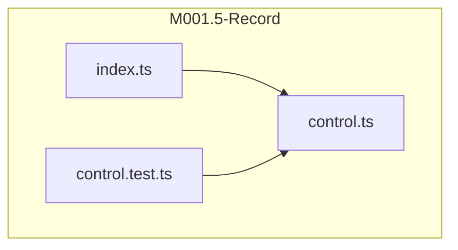
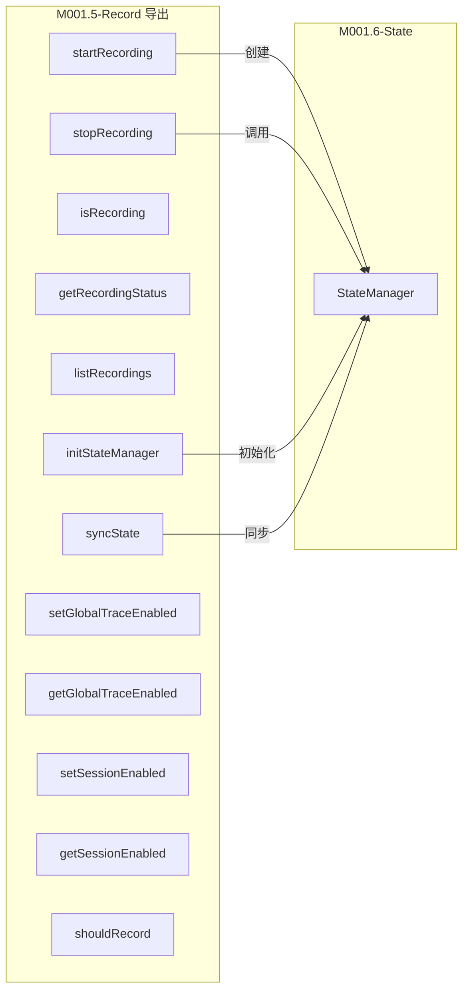
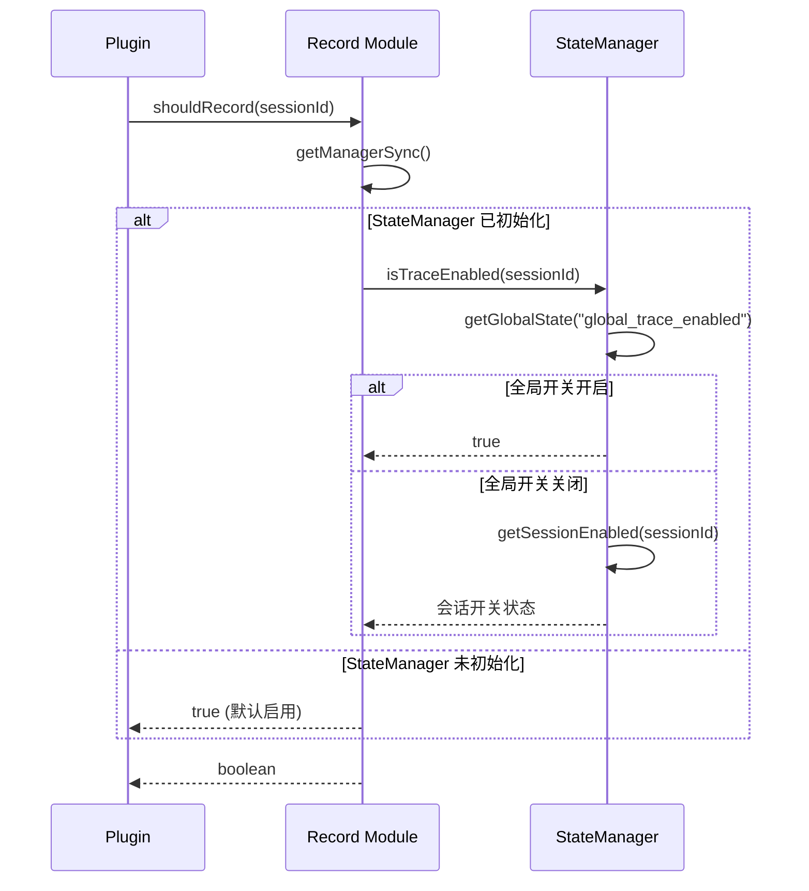
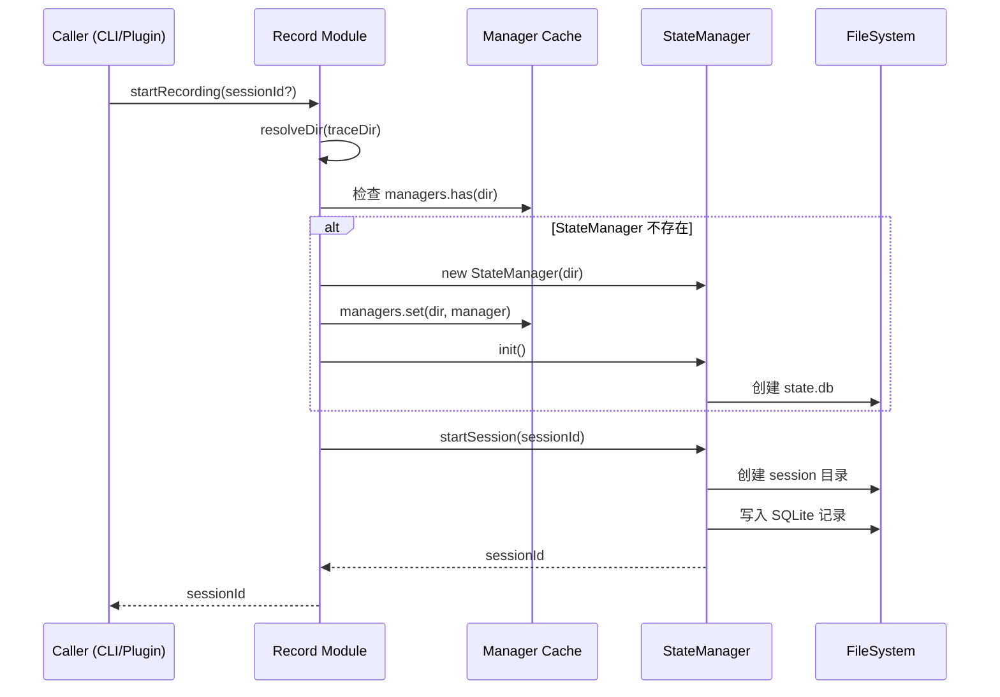

# M001.5-Record

## 概述

Record 模块负责管理 trace 录制状态的控制，包括全局开关和会话级别的录制控制。它作为业务层的核心组件，为 Plugin 和 CLI 提供统一的录制状态查询和管理接口。如果移除该模块，系统将失去按需启用/禁用 trace 录制的能力，所有请求都会被无条件记录，导致存储浪费和性能下降。

---

## 元数据

| 字段 | 值 |
|------|-----|
| 模块 ID | M001.5 |
| 路径 | packages/core/src/record/ |
| 文件数 | 3 (control.ts, control.test.ts, index.ts) |
| 代码行数 | 349 (含测试 134 行) |
| 主要语言 | TypeScript |
| 所属层 | 业务层 (Business Layer) |
| 父模块 | M001-Core |
| 依赖于 | M001.6-State (StateManager, SessionState) |
| 被依赖于 | M003-Plugin, M002-CLI, M005-Viewer |

---

## 子模块

无子模块。

---

## 文件结构



| 文件 | 职责 | 行数 | 主要导出 |
|------|------|------|----------|
| control.ts | 核心录制控制逻辑，管理 StateManager 缓存和录制状态 | 201 | 12 个导出函数，1 个类型 |
| index.ts | 模块入口，重导出所有公共接口 | 15 | - |
| control.test.ts | 单元测试 | 134 | - |

---

## 功能树

```
M001.5-Record (录制控制)
└── control.ts
    ├── const: DEFAULT_TRACE_DIR — 默认 trace 目录路径 (~/.opencode-trace)
    ├── const: RECORDING_MARKER — 录制标记文件名 (.recording)
    ├── const: managers — StateManager 实例缓存 Map
    ├── const: initPromises — 初始化 Promise 缓存 Map
    ├── type: RecordingStatus — 录制状态信息接口
    ├── fn: resolveDir(traceDir?) — 解析 trace 目录路径
    ├── fn: getManager(traceDir) — 异步获取或创建 StateManager 实例
    ├── fn: getManagerSync(traceDir) — 同步获取已初始化的 StateManager
    ├── fn: sessionToRecording(session) — 转换 SessionState 为 RecordingStatus
    ├── fn: startRecording(sessionId?, traceDir?) — 开始录制会话
    ├── fn: stopRecording(sessionId, traceDir?) — 停止录制会话
    ├── fn: setGlobalTraceEnabled(enabled, traceDir?) — 设置全局录制开关
    ├── fn: getGlobalTraceEnabled(traceDir?) — 获取全局录制开关状态
    ├── fn: setSessionEnabled(sessionId, enabled, traceDir?) — 设置会话级录制开关
    ├── fn: getSessionEnabled(sessionId, traceDir?) — 获取会话级录制开关状态
    ├── fn: shouldRecord(sessionId?, traceDir?) — 判断是否应录制（综合全局与会话开关）
    ├── fn: isRecording(sessionId, traceDir?) — 检查会话是否正在录制
    ├── fn: getRecordingStatus(sessionId, traceDir?) — 获取会话录制状态详情
    ├── fn: listRecordings(traceDir?) — 列出所有活动录制会话
    ├── fn: initStateManager(traceDir?) — 初始化 StateManager
    └── fn: syncState(traceDir?) — 同步状态到磁盘
```

### 功能清单

| 名称 | 类型 | 文件 | 行号 | 描述 |
|------|------|------|------|------|
| RecordingStatus | type | control.ts | L10-14 | 录制状态信息接口，包含 active, sessionId, startedAt |
| startRecording | fn | control.ts | L46-50 | 开始录制，返回会话 ID |
| stopRecording | fn | control.ts | L52-74 | 停止录制，返回操作是否成功 |
| setGlobalTraceEnabled | fn | control.ts | L76-82 | 设置全局录制开关 |
| getGlobalTraceEnabled | fn | control.ts | L84-91 | 获取全局录制开关状态，默认 true |
| setSessionEnabled | fn | control.ts | L93-99 | 设置指定会话的录制开关 |
| getSessionEnabled | fn | control.ts | L101-108 | 获取指定会话的录制开关状态，默认 true |
| shouldRecord | fn | control.ts | L110-117 | 判断是否应录制（综合全局与会话开关） |
| isRecording | fn | control.ts | L119-130 | 检查指定会话是否正在录制 |
| getRecordingStatus | fn | control.ts | L132-159 | 获取会话录制状态详情 |
| listRecordings | fn | control.ts | L161-189 | 列出所有活动录制会话 |
| initStateManager | fn | control.ts | L191-194 | 初始化 StateManager（异步） |
| syncState | fn | control.ts | L196-202 | 同步状态到磁盘 |

### 职责边界

**做什么**

- 管理 StateManager 实例的生命周期和缓存
- 提供全局和会话级别的录制控制开关
- 实现录制状态的查询和变更接口
- 提供优雅降级：当 StateManager 未初始化时回退到文件系统检查

**不做什么**

- 不直接操作文件系统（委托给 StateManager）
- 不解析或处理 trace 数据
- 不提供 HTTP 或 CLI 接口（由接入层模块负责）
- 不管理 trace 数据的写入队列

---

## 公共接口契约

### 接口关系图



### 类型定义

```typescript
// [File: packages/core/src/record/control.ts:10-14]
export interface RecordingStatus {
  active: boolean;        // 是否正在录制
  sessionId?: string;      // 会话 ID
  startedAt?: string;      // 开始时间 (ISO 8601)
}
```

| 类型名 | 字段/方法 | 类型 | 描述 | 位置 |
|--------|-----------|------|------|------|
| RecordingStatus | active | boolean | 是否正在录制 | control.ts:11 |
| RecordingStatus | sessionId | string \| undefined | 会话标识符 | control.ts:12 |
| RecordingStatus | startedAt | string \| undefined | 录制开始时间 | control.ts:13 |

### 导出函数

#### `startRecording(sessionId?, traceDir?)`

```typescript
// [File: packages/core/src/record/control.ts:46-50]
export async function startRecording(sessionId?: string, traceDir?: string): Promise<string>
```

| 参数 | 类型 | 必需 | 描述 |
|------|------|------|------|
| sessionId | string | 否 | 指定会话 ID，不传则自动生成 UUID |
| traceDir | string | 否 | trace 目录路径，默认 ~/.opencode-trace |

- **返回**：`Promise<string>` — 会话 ID
- **抛出**：无（内部错误被捕获并记录日志）

**使用示例**：

```typescript
import { startRecording } from '@opencode-trace/core/record'

// 自动生成会话 ID
const sessionId = await startRecording()

// 指定会话 ID 和目录
const sessionId = await startRecording('my-session', '/custom/trace/dir')
```

#### `stopRecording(sessionId, traceDir?)`

```typescript
// [File: packages/core/src/record/control.ts:52-74]
export function stopRecording(sessionId: string, traceDir?: string): boolean
```

| 参数 | 类型 | 必需 | 描述 |
|------|------|------|------|
| sessionId | string | 是 | 要停止的会话 ID |
| traceDir | string | 否 | trace 目录路径 |

- **返回**：`boolean` — 是否成功停止（false 表示会话不存在或操作失败）

#### `setGlobalTraceEnabled(enabled, traceDir?)`

```typescript
// [File: packages/core/src/record/control.ts:76-82]
export function setGlobalTraceEnabled(enabled: boolean, traceDir?: string): void
```

| 参数 | 类型 | 必需 | 描述 |
|------|------|------|------|
| enabled | boolean | 是 | true 启用全局录制，false 禁用 |
| traceDir | string | 否 | trace 目录路径 |

- **返回**：`void`

#### `getGlobalTraceEnabled(traceDir?)`

```typescript
// [File: packages/core/src/record/control.ts:84-91]
export function getGlobalTraceEnabled(traceDir?: string): boolean
```

- **返回**：`boolean` — 全局录制开关状态，默认 true（未初始化时）

#### `setSessionEnabled(sessionId, enabled, traceDir?)`

```typescript
// [File: packages/core/src/record/control.ts:93-99]
export function setSessionEnabled(sessionId: string, enabled: boolean, traceDir?: string): void
```

#### `getSessionEnabled(sessionId, traceDir?)`

```typescript
// [File: packages/core/src/record/control.ts:101-108]
export function getSessionEnabled(sessionId: string, traceDir?: string): boolean
```

- **返回**：`boolean` — 会话级录制开关状态，默认 true

#### `shouldRecord(sessionId?, traceDir?)`

```typescript
// [File: packages/core/src/record/control.ts:110-117]
export function shouldRecord(sessionId?: string, traceDir?: string): boolean
```

- **返回**：`boolean` — 是否应该录制
- **逻辑**：全局开则 true；全局关 + 有 sessionId 且会话开则 true；否则 false

**使用示例**：

```typescript
import { shouldRecord, setGlobalTraceEnabled } from '@opencode-trace/core/record'

// 全局禁用后检查
setGlobalTraceEnabled(false)
shouldRecord()           // false (无 sessionId)
shouldRecord('session1') // 取决于 session1 的设置
```

#### `isRecording(sessionId, traceDir?)`

```typescript
// [File: packages/core/src/record/control.ts:119-130]
export function isRecording(sessionId: string, traceDir?: string): boolean
```

- **返回**：`boolean` — 会话是否处于 active 录制状态

#### `getRecordingStatus(sessionId, traceDir?)`

```typescript
// [File: packages/core/src/record/control.ts:132-159]
export function getRecordingStatus(sessionId: string, traceDir?: string): RecordingStatus
```

- **返回**：`RecordingStatus` — 完整的录制状态信息

#### `listRecordings(traceDir?)`

```typescript
// [File: packages/core/src/record/control.ts:161-189]
export function listRecordings(traceDir?: string): RecordingStatus[]
```

- **返回**：`RecordingStatus[]` — 所有活动录制的状态列表

#### `initStateManager(traceDir?)`

```typescript
// [File: packages/core/src/record/control.ts:191-194]
export async function initStateManager(traceDir?: string): Promise<void>
```

- **返回**：`Promise<void>` — 初始化完成后返回
- **说明**：必须在调用其他同步函数前调用，否则会回退到文件系统检查

#### `syncState(traceDir?)`

```typescript
// [File: packages/core/src/record/control.ts:196-202]
export function syncState(traceDir?: string): void
```

- **返回**：`void`
- **说明**：同步 SQLite 状态与文件系统

---

## 内部实现

### 核心内部逻辑

| 函数/类 | 文件 | 行号 | 用途 |
|---------|------|------|------|
| managers | control.ts | L20 | StateManager 实例缓存，按 traceDir 为 key |
| initPromises | control.ts | L21 | 初始化 Promise 缓存，防止重复初始化 |
| getManager | control.ts | L23-31 | 异步获取 StateManager，单例模式 |
| getManagerSync | control.ts | L33-35 | 同步获取已初始化的 StateManager |
| sessionToRecording | control.ts | L37-44 | SessionState 到 RecordingStatus 的转换器 |
| resolveDir | control.ts | L16-18 | 解析目录路径，提供默认值 |

### 设计模式

| 模式 | 使用位置 | 使用原因 | 代码证据 |
|------|----------|----------|----------|
| 单例模式 | getManager | 避免重复创建 StateManager，确保全局状态一致性 | control.ts:20-31 |
| 优雅降级 | isRecording, listRecordings | 当 StateManager 未初始化时回退到文件系统检查 | control.ts:119-130, 161-189 |
| 适配器模式 | sessionToRecording | 将 StateManager 的 SessionState 适配为 RecordingStatus | control.ts:37-44 |

---

## 关键流程

### 流程 1：录制状态判断流程

**调用链**

```
plugin-instance.ts:60 → control.ts:110 → control.ts:112 → state/index.ts:577
```

**时序图**



**步骤详解**

| 步骤 | 说明 | 文件位置 |
|------|------|----------|
| 1 | Plugin 调用 shouldRecord 判断是否录制 | plugin-instance.ts:97 |
| 2 | Record 获取缓存的 StateManager | control.ts:112 |
| 3 | StateManager 检查全局开关 | state/index.ts:578 |
| 4 | 全局关闭时检查会话级开关 | state/index.ts:584 |
| 5 | 返回综合判断结果 | control.ts:114-116 |

### 流程 2：会话录制启动流程

**调用链**

```
CLI/Plugin → control.ts:46 → control.ts:23 → state/index.ts:255
```

**时序图**



---

## 依赖

### 内部依赖（项目内其他模块）

| 模块 | 使用的接口 | 调用位置 |
|------|-----------|----------|
| M001.6-State | StateManager | control.ts:4, 23-31 |
| M001.6-State | SessionState | control.ts:4, 37-44 |
| Core-Logger | logger | control.ts:5, 67-72 |

### 外部依赖（第三方包）

| 包名 | 版本 | 用途 | 可替代性 |
|------|------|------|----------|
| node:path | - | 路径处理 | 低 (Node.js 内置) |
| node:os | - | 获取 home 目录 | 低 (Node.js 内置) |
| node:fs | - | 文件系统操作（降级场景） | 低 (Node.js 内置) |

---

## 代码质量与风险

### 代码坏味道

| 问题 | 类型 | 文件 | 严重度 | 建议 |
|------|------|------|--------|------|
| 部分函数较长 | 过长函数 | control.ts:161-189 | 低 | 可考虑拆分 listRecordings 的降级逻辑 |
| 魔法字符串 | 硬编码 | control.ts:80 | 低 | 可提取为常量 |

### 潜在风险

| 风险 | 触发条件 | 影响 | 文件 | 建议 |
|------|----------|------|------|------|
| StateManager 未初始化时的降级行为 | 调用方忘记调用 initStateManager | 返回默认值 true，可能导致意外录制 | control.ts:84-90, 101-107 | 文档强调初始化要求，或考虑强制初始化检查 |
| managers Map 无限增长 | 多个不同 traceDir 实例 | 内存泄漏风险 | control.ts:20 | 添加清理机制或限制实例数 |

### 测试覆盖

| 测试类型 | 覆盖情况 | 测试文件 | 说明 |
|----------|----------|----------|------|
| 单元测试 | 有 | control.test.ts | 覆盖主要功能：启动/停止录制、开关状态判断 |
| 集成测试 | 部分 | control.test.ts | 与 StateManager 集成测试 |

---

## 开发指南

### 洞察

1. **单例缓存策略**：通过 `managers` Map 和 `initPromises` Map 实现按 traceDir 的单例缓存，避免重复创建 StateManager 实例，同时支持多个不同 traceDir 的并行使用。

2. **优雅降级设计**：当 StateManager 未初始化时，`isRecording` 和 `listRecordings` 会回退到文件系统检查（.recording 标记文件），这为初始化失败提供了容错能力。

3. **双层开关逻辑**：`shouldRecord` 实现了"全局开关 OR 会话开关"的逻辑：全局开则全部录制；全局关则按会话设置判断。这提供了灵活的录制控制粒度。

### 扩展指南

要添加新的录制控制功能，需要：

1. 在 `control.ts` 中添加新函数
2. 如需新的状态存储，在 StateManager 中添加对应方法
3. 在 `index.ts` 中导出新函数
4. 添加对应的单元测试到 `control.test.ts`

### 风格与约定

- 异步初始化函数返回 `Promise<void>`，同步操作函数返回具体值或 void
- 所有公开函数都接受可选的 `traceDir` 参数，默认使用 `~/.opencode-trace`
- 错误处理：内部捕获异常并记录日志，不向上抛出

### 设计哲学

1. **状态委托**：Record 模块不直接存储状态，而是完全委托给 StateManager，保持单一职责。

2. **同步优先**：大部分函数设计为同步，仅 `startRecording` 和 `initStateManager` 为异步，减少调用方的异步复杂度。

3. **容错默认值**：当无法确定状态时，默认返回 `true`（启用录制），确保系统不会因状态检查失败而错过重要记录。

### 修改检查清单

- [ ] 修改后检查所有导出函数的签名兼容性（被 CLI、Plugin、Viewer 依赖）
- [ ] 确保 `shouldRecord` 的逻辑变更与 StateManager.isTraceEnabled 保持一致
- [ ] 更新 `index.ts` 的导出列表
- [ ] 同步更新 `control.test.ts` 中的测试用例
- [ ] 检查是否需要更新 StateManager 的接口
