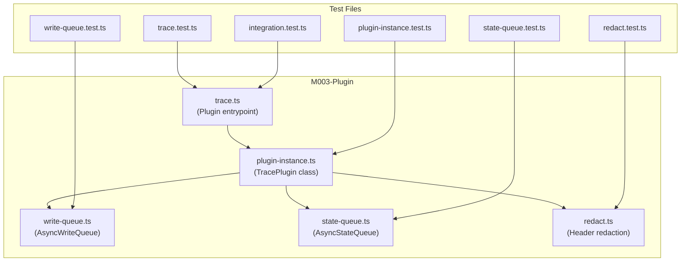
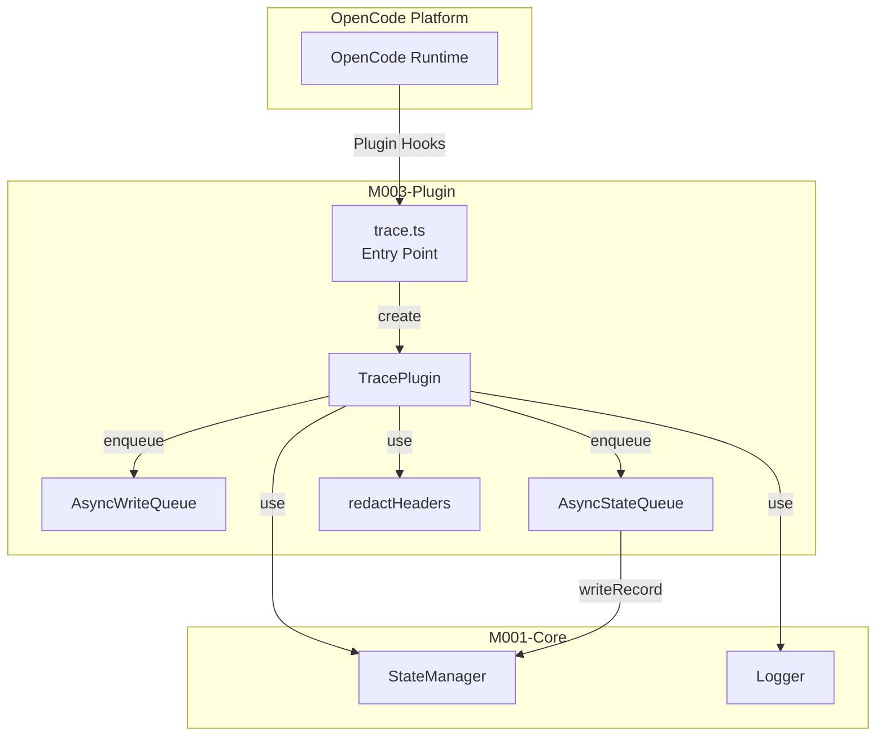
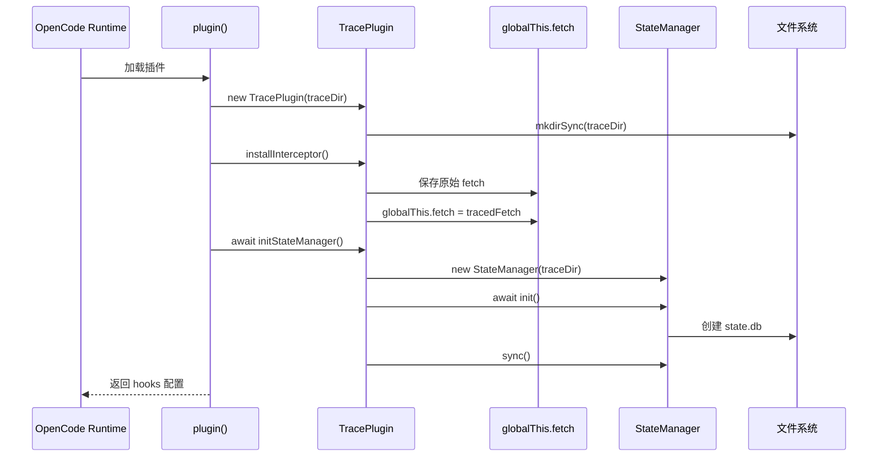
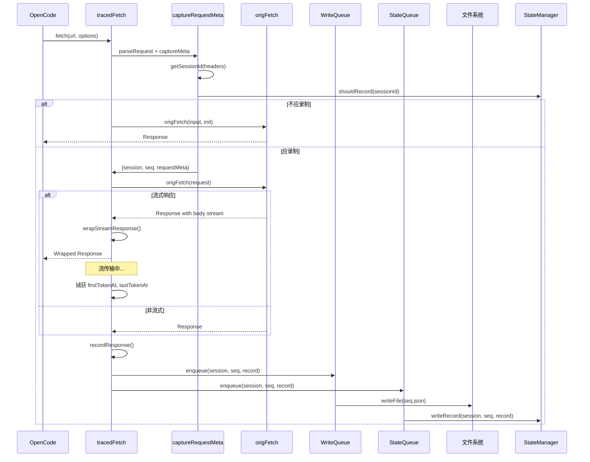
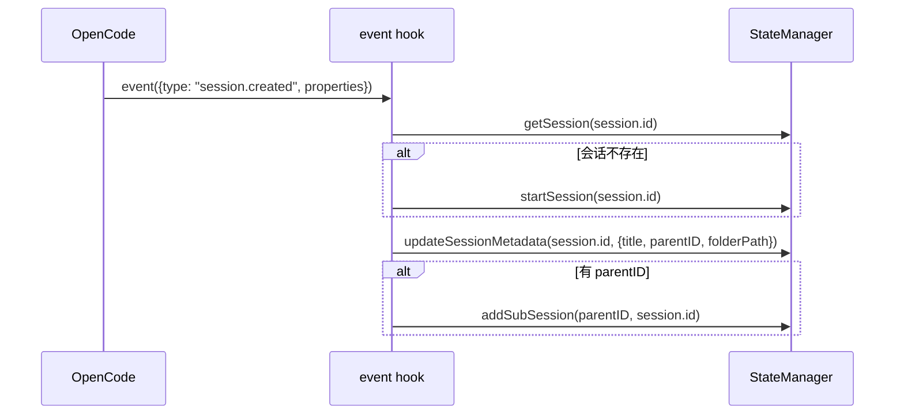

# M003-Plugin

## 概述

Plugin 模块是 OpenCode Trace 的接入层核心组件，负责拦截 OpenCode SDK 的所有 HTTP 请求并记录完整的请求/响应 trace 数据。它作为 OpenCode 插件运行，实现了 `@opencode-ai/plugin` 接口，通过全局 fetch 拦截机制捕获 AI 模型交互数据。如果移除此模块，系统将无法自动捕获 OpenCode 与 AI 提供商之间的通信，无法生成 trace 数据。

---

## 元数据

| 字段 | 值 |
|------|-----|
| 模块 ID | M003 |
| 路径 | packages/plugin/src/ |
| 文件数 | 6 (源文件) + 5 (测试文件) |
| 代码行数 | 1462 (含测试) |
| 主要语言 | TypeScript |
| 所属层 | 接入层 (Integration Layer) |
| 父模块 | 无 |
| 依赖于 | M001-Core (logger, StateManager), @opencode-ai/plugin, @opencode-ai/sdk |
| 被依赖于 | 无 (顶层插件) |

---

## 子模块

无子模块。

---

## 文件结构



| 文件 | 职责 | 行数 | 主要导出 |
|------|------|------|----------|
| trace.ts | OpenCode 插件入口，定义 hooks 和 tools | 151 | Plugin entrypoint, TraceRecord, TraceRequest, TraceResponse |
| plugin-instance.ts | TracePlugin 核心类，fetch 拦截和记录 | 247 | TracePlugin class |
| write-queue.ts | 异步文件写入队列 | 72 | AsyncWriteQueue class |
| state-queue.ts | 异步状态写入队列 | 51 | AsyncStateQueue class |
| redact.ts | 敏感 HTTP 头脱敏 | 42 | redactHeaders function |
| *.test.ts | 单元测试和集成测试 | 899 | - |

---

## 功能树

```
M003-Plugin (插件接入层)
├── trace.ts
│   ├── interface: TraceRequest — HTTP 请求数据结构
│   ├── interface: TraceResponse — HTTP 响应数据结构
│   ├── interface: TraceRecord — trace 记录数据结构
│   ├── fn: getTraceDir() — 获取默认 trace 目录
│   ├── fn: _resetForTesting() — 测试重置函数
│   ├── const: plugin — 插件工厂函数
│   ├── const: hooks — OpenCode 钩子配置
│   │   ├── hook: event — 会话事件处理
│   │   └── hook: tool.execute.after — Task 工具后置钩子
│   └── const: tools — OpenCode 工具定义
│       ├── tool: trace_enable — 启用会话录制
│       ├── tool: trace_disable — 禁用会话录制
│       └── tool: trace_status — 查询录制状态
├── plugin-instance.ts
│   └── class: TracePlugin — 插件实例核心类
│       ├── method: tracedFetch() — 拦截并记录 fetch 请求
│       ├── method: installInterceptor() — 安装 fetch 拦截器
│       ├── method: uninstallInterceptor() — 卸载 fetch 拦截器
│       ├── method: initStateManager() — 初始化状态管理器
│       ├── method: getStateManager() — 获取状态管理器实例
│       └── private methods:
│           ├── getSessionId() — 从请求头提取会话 ID
│           ├── shouldRecord() — 判断是否应录制
│           ├── parseBody() — 解析请求/响应体
│           ├── headersToObject() — Headers 转 Object
│           ├── classifyPurpose() — 分类请求用途
│           ├── parseRequest() — 解析 Request 对象
│           ├── captureRequestMeta() — 捕获请求元数据
│           ├── wrapStreamResponse() — 包装流式响应
│           ├── recordResponse() — 记录响应数据
│           ├── sanitizeStackTrace() — 脱敏堆栈跟踪
│           └── createTraceRecord() — 创建 trace 记录
├── write-queue.ts
│   └── class: AsyncWriteQueue — 异步文件写入队列
│       ├── method: enqueue() — 入队 trace 记录
│       ├── method: flush() — 等待队列清空
│       └── private methods:
│           ├── processQueue() — 处理写入队列
│           ├── writeBatch() — 批量写入文件
│           └── writeFallback() — 写入失败降级
├── state-queue.ts
│   └── class: AsyncStateQueue — 异步状态写入队列
│       ├── method: setStateManager() — 设置状态管理器
│       ├── method: enqueue() — 入队 trace 记录
│       ├── method: flush() — 等待队列清空
│       └── private method: processQueue() — 处理状态队列
└── redact.ts
    ├── const: SENSITIVE_HEADERS — 敏感头列表
    ├── fn: isSensitiveHeader() — 判断是否敏感头
    └── fn: redactHeaders() — 脱敏 HTTP 头
```

### 功能清单

| 名称 | 类型 | 文件 | 行号 | 描述 |
|------|------|------|------|------|
| TraceRequest | interface | trace.ts | L8-13 | HTTP 请求结构定义 |
| TraceResponse | interface | trace.ts | L15-20 | HTTP 响应结构定义 |
| TraceRecord | interface | trace.ts | L22-33 | trace 记录完整结构 |
| getTraceDir | fn | trace.ts | L35-37 | 获取默认 trace 目录 (~/.opencode-trace) |
| plugin | fn | trace.ts | L48-144 | 插件工厂函数，返回 hooks 配置 |
| TracePlugin | class | plugin-instance.ts | L9-247 | 插件实例核心类 |
| tracedFetch | method | plugin-instance.ts | L25-54 | 拦截并记录 fetch 请求 |
| installInterceptor | method | plugin-instance.ts | L224-229 | 安装全局 fetch 拦截器 |
| uninstallInterceptor | method | plugin-instance.ts | L231-235 | 卸载全局 fetch 拦截器 |
| initStateManager | method | plugin-instance.ts | L237-242 | 初始化 StateManager |
| AsyncWriteQueue | class | write-queue.ts | L6-72 | 异步文件写入队列 |
| AsyncStateQueue | class | state-queue.ts | L5-51 | 异步状态写入队列 |
| redactHeaders | fn | redact.ts | L20-42 | 脱敏敏感 HTTP 头 |

### 职责边界

**做什么**

- 拦截 OpenCode SDK 的所有 HTTP fetch 请求
- 捕获完整的请求/响应数据（包括流式响应的时间戳）
- 通过异步队列写入 trace 文件到磁盘
- 通过异步队列更新 StateManager 的请求索引
- 脱敏敏感 HTTP 头（authorization, api-key 等）
- 提供 OpenCode 工具（trace_enable, trace_disable, trace_status）
- 处理会话事件（创建、更新、子会话关联）

**不做什么**

- 不解析或分析 trace 数据（由 Query 模块负责）
- 不提供 CLI 命令（由 CLI 模块负责）
- 不提供 Web UI（由 Viewer 模块负责）
- 不管理会话生命周期（由 StateManager 负责，Plugin 只是调用）

---

## 公共接口契约

### 接口关系图



### 类型定义

```typescript
// [File: packages/plugin/src/trace.ts:8-13]
export interface TraceRequest {
  method: string;
  url: string;
  headers: Record<string, string>;
  body: unknown;
}
```

```typescript
// [File: packages/plugin/src/trace.ts:15-20]
export interface TraceResponse {
  status: number;
  statusText: string;
  headers: Record<string, string>;
  body: unknown;
}
```

```typescript
// [File: packages/plugin/src/trace.ts:22-33]
export interface TraceRecord {
  id: number;
  purpose: string;
  requestAt: string;
  responseAt: string;
  request: TraceRequest;
  response: TraceResponse | null;
  error: { message: string; stack?: string } | null;
  requestSentAt?: number;
  firstTokenAt?: number;
  lastTokenAt?: number;
}
```

| 类型名 | 字段/方法 | 类型 | 描述 | 位置 |
|--------|-----------|------|------|------|
| TraceRequest | method | string | HTTP 方法 | trace.ts:9 |
| TraceRequest | url | string | 请求 URL | trace.ts:10 |
| TraceRequest | headers | Record<string, string> | 请求头（已脱敏） | trace.ts:11 |
| TraceRequest | body | unknown | 请求体 | trace.ts:12 |
| TraceResponse | status | number | HTTP 状态码 | trace.ts:16 |
| TraceResponse | statusText | string | 状态文本 | trace.ts:17 |
| TraceResponse | headers | Record<string, string> | 响应头（已脱敏） | trace.ts:18 |
| TraceResponse | body | unknown | 响应体 | trace.ts:19 |
| TraceRecord | id | number | 序列号 | trace.ts:23 |
| TraceRecord | purpose | string | 请求用途（如 [meta]） | trace.ts:24 |
| TraceRecord | requestAt | string | 请求时间 ISO 字符串 | trace.ts:25 |
| TraceRecord | responseAt | string | 响应时间 ISO 字符串 | trace.ts:26 |
| TraceRecord | request | TraceRequest | 请求数据 | trace.ts:27 |
| TraceRecord | response | TraceResponse \| null | 响应数据 | trace.ts:28 |
| TraceRecord | error | object \| null | 错误信息 | trace.ts:29 |
| TraceRecord | requestSentAt | number (optional) | 请求发送时间戳 | trace.ts:30 |
| TraceRecord | firstTokenAt | number (optional) | 首个 token 时间戳 | trace.ts:31 |
| TraceRecord | lastTokenAt | number (optional) | 最后 token 时间戳 | trace.ts:32 |

### 导出类

#### `TracePlugin`

| 方法 | 签名 | 描述 | 位置 |
|------|------|------|------|
| constructor | `(traceDir: string)` | 创建插件实例 | plugin-instance.ts:18-23 |
| tracedFetch | `async (input, init?): Promise<Response>` | 拦截并记录 fetch 请求 | plugin-instance.ts:25-54 |
| installInterceptor | `(): void` | 安装全局 fetch 拦截器 | plugin-instance.ts:224-229 |
| uninstallInterceptor | `(): void` | 卸载全局 fetch 拦截器 | plugin-instance.ts:231-235 |
| initStateManager | `async (): Promise<void>` | 初始化 StateManager | plugin-instance.ts:237-242 |
| getStateManager | `(): StateManager \| null` | 获取 StateManager 实例 | plugin-instance.ts:244-246 |

**使用示例**：

```typescript
import { TracePlugin } from '@opencode-trace/plugin'

const plugin = new TracePlugin('/path/to/trace/dir')
plugin.installInterceptor()
await plugin.initStateManager()

// 现在 fetch 请求会被自动拦截和记录
const response = await fetch('https://api.openai.com/v1/chat/completions', {
  method: 'POST',
  headers: { 'x-opencode-session': 'session-123' },
  body: JSON.stringify({ model: 'gpt-4', messages: [...] })
})

// 清理
plugin.uninstallInterceptor()
```

#### `AsyncWriteQueue`

| 方法 | 签名 | 描述 | 位置 |
|------|------|------|------|
| constructor | `(traceDir: string, batchSize?: number)` | 创建写入队列 | write-queue.ts:12-15 |
| enqueue | `(session, seq, record): void` | 入队 trace 记录 | write-queue.ts:17-22 |
| flush | `async (): Promise<void>` | 等待队列清空 | write-queue.ts:37-41 |

#### `AsyncStateQueue`

| 方法 | 签名 | 描述 | 位置 |
|------|------|------|------|
| constructor | `(batchSize?: number)` | 创建状态队列 | state-queue.ts:11-13 |
| setStateManager | `(manager: StateManager): void` | 设置 StateManager | state-queue.ts:15-17 |
| enqueue | `(session, seq, record): void` | 入队 trace 记录 | state-queue.ts:19-24 |
| flush | `async (): Promise<void>` | 等待队列清空 | state-queue.ts:46-50 |

#### `redactHeaders`

```typescript
// [File: packages/plugin/src/redact.ts:20-42]
export function redactHeaders(headers: Record<string, string>): Record<string, string>
```

- **参数**：`headers` - 原始 HTTP 头对象
- **返回**：脱敏后的 HTTP 头对象
- **功能**：将敏感头（authorization, api-key 等）替换为 `[REDACTED]`

**使用示例**：

```typescript
import { redactHeaders } from '@opencode-trace/plugin'

const rawHeaders = {
  'authorization': 'Bearer sk-xxx',
  'content-type': 'application/json'
}
const safeHeaders = redactHeaders(rawHeaders)
// { 'authorization': 'Bearer [REDACTED]', 'content-type': 'application/json' }
```

---

## 内部实现

### 核心内部逻辑

| 函数/类 | 文件 | 行号 | 用途 |
|---------|------|------|------|
| getSessionId | plugin-instance.ts | L56-58 | 从请求头提取会话 ID（x-opencode-session, x-session-affinity, session_id） |
| shouldRecord | plugin-instance.ts | L60-64 | 判断是否应录制（调用 StateManager.isTraceEnabled） |
| parseBody | plugin-instance.ts | L66-72 | 解析请求/响应体（JSON 或文本） |
| headersToObject | plugin-instance.ts | L74-78 | Headers 对象转为普通对象 |
| classifyPurpose | plugin-instance.ts | L80-83 | 分类请求用途（tools 请求为空，其他为 [meta]） |
| parseRequest | plugin-instance.ts | L85-91 | 解析 fetch 参数为 Request 对象 |
| captureRequestMeta | plugin-instance.ts | L93-128 | 捕获请求元数据（会话、序列号、时间戳等） |
| wrapStreamResponse | plugin-instance.ts | L130-153 | 包装流式响应，捕获首 token 和末 token 时间 |
| recordResponse | plugin-instance.ts | L155-186 | 记录响应数据到队列 |
| sanitizeStackTrace | plugin-instance.ts | L188-195 | 脱敏堆栈跟踪（用户路径、IP、端口） |
| createTraceRecord | plugin-instance.ts | L197-218 | 创建完整的 TraceRecord 对象 |
| processQueue | write-queue.ts | L24-35 | 处理文件写入队列（批量写入） |
| writeBatch | write-queue.ts | L43-53 | 批量写入 trace 文件 |
| writeFallback | write-queue.ts | L55-71 | 写入失败降级到 fallback 目录 |
| processQueue | state-queue.ts | L26-44 | 处理状态写入队列（批量更新 SQLite） |

### 设计模式

| 模式 | 使用位置 | 使用原因 | 代码证据 |
|------|----------|----------|----------|
| 单例模式 | trace.ts:39-59, plugin-instance.ts:39 | 确保全局只有一个插件实例拦截 fetch | testPlugin 全局变量 |
| 拦截器模式 | plugin-instance.ts:224-229 | 全局替换 fetch 实现请求拦截 | globalThis.fetch = this.getInterceptor() |
| 生产者-消费者模式 | write-queue.ts, state-queue.ts | 异步队列解耦请求拦截和写入操作 | enqueue 推入队列，processQueue 消费 |
| 适配器模式 | plugin-instance.ts:130-153 | 包装流式响应以捕获时间戳信息 | TransformStream 包装 |
| 健壮降级模式 | write-queue.ts:55-71 | 写入失败时保存到 fallback 目录 | writeFallback 方法 |

### 关键算法 / 策略

| 算法/策略 | 用途 | 复杂度 | 文件 |
|-----------|------|--------|------|
| 双队列策略 | 同时写入文件系统和 SQLite 索引 | O(n) 批处理 | write-queue.ts, state-queue.ts |
| 流式响应包装 | 捕获首 token 和末 token 时间 | O(1) 每次 transform | plugin-instance.ts:130-153 |
| 敏感头脱敏 | 保护 API Key 等敏感信息 | O(n) n=header 数量 | redact.ts:20-42 |
| 批量写入策略 | 减少 I/O 次数，提高性能 | O(batchSize) | write-queue.ts:27-29 |

---

## 关键流程

### 流程 1：插件初始化流程

**调用链**

```
OpenCode Runtime → trace.ts:plugin() → plugin-instance.ts:constructor → installInterceptor() → initStateManager()
```

**时序图**



**步骤详解**

| 步骤 | 说明 | 文件位置 |
|------|------|----------|
| 1 | OpenCode 加载插件模块 | trace.ts:146-149 |
| 2 | 插件工厂函数创建 TracePlugin 实例 | trace.ts:48-51 |
| 3 | 安装全局 fetch 拦截器 | plugin-instance.ts:224-229 |
| 4 | 初始化 StateManager | plugin-instance.ts:237-242 |
| 5 | 同步文件系统状态 | plugin-instance.ts:240-241 |
| 6 | 返回 hooks 配置给 OpenCode | trace.ts:61-141 |

### 流程 2：请求拦截与记录流程

**调用链**

```
OpenCode fetch() → tracedFetch() → captureRequestMeta() → origFetch() → wrapStreamResponse() → recordResponse() → enqueue()
```

**时序图**



**步骤详解**

| 步骤 | 说明 | 文件位置 |
|------|------|----------|
| 1 | tracedFetch 解析请求参数 | plugin-instance.ts:26-27 |
| 2 | 捕获请求元数据（会话、序列号、时间） | plugin-instance.ts:93-128 |
| 3 | 检查是否应录制 | plugin-instance.ts:60-64, 97 |
| 4 | 发送原始请求 | plugin-instance.ts:34-42 |
| 5 | 流式响应：包装 Response 以捕获时间戳 | plugin-instance.ts:46-49, 130-153 |
| 6 | 记录响应数据 | plugin-instance.ts:51, 155-186 |
| 7 | 入队文件写入 | plugin-instance.ts:171, write-queue.ts:17-22 |
| 8 | 入队状态更新 | plugin-instance.ts:172, state-queue.ts:19-24 |

### 流程 3：会话事件处理流程

**调用链**

```
OpenCode event → hooks.event → StateManager.startSession → StateManager.updateSessionMetadata
```

**时序图**



**步骤详解**

| 步骤 | 说明 | 文件位置 |
|------|------|----------|
| 1 | OpenCode 发送 session.created 或 session.updated 事件 | trace.ts:62-82 |
| 2 | 检查会话是否存在，不存在则创建 | trace.ts:68-70 |
| 3 | 更新会话元数据（title, parentID, folderPath） | trace.ts:73-77 |
| 4 | 如果有 parentID，建立子会话关联 | trace.ts:79-81 |

---

## 依赖

### 内部依赖（项目内其他模块）

| 模块 | 使用的接口 | 调用位置 |
|------|-----------|----------|
| M001-Core/Logger | logger 实例 | plugin-instance.ts:6, 106, write-queue.ts:3, 70, state-queue.ts:2, 35 |
| M001-Core/State | StateManager | plugin-instance.ts:3, 237-246, state-queue.ts:1, 33 |
| M001-Core/Types | TraceRecord 类型 | state-queue.ts:3, write-queue.ts:4 |

### 外部依赖（第三方包）

| 包名 | 版本 | 用途 | 可替代性 |
|------|------|------|----------|
| @opencode-ai/plugin | ^1.14.22 | OpenCode 插件接口定义 | 低（核心依赖） |
| @opencode-ai/sdk | ^1.14.41 | OpenCode SDK 类型定义 | 低（核心依赖） |
| Node.js:fs | built-in | 文件系统操作 | 低（Node.js 内置） |
| Node.js:path | built-in | 路径处理 | 低（Node.js 内置） |
| Node.js:os | built-in | 获取 home 目录 | 低（Node.js 内置） |

---

## 代码质量与风险

### 代码坏味道

| 问题 | 类型 | 文件 | 严重度 | 建议 |
|------|------|------|--------|------|
| 全局变量 | 污染全局命名空间 | trace.ts:39 | 中 | 可考虑使用模块级 Map 缓存 |
| fetch 替换 | 隐式修改全局状态 | plugin-instance.ts:227 | 高 | 无法避免，但需确保卸载时恢复 |
| 魔法字符串 | 硬编码 | plugin-instance.ts:57 | 低 | 可提取为常量 |

### 潜在风险

| 风险 | 触发条件 | 影响 | 文件 | 建议 |
|------|----------|------|------|------|
| fetch 替换竞态 | 多插件同时替换 globalThis.fetch | 拦截器丢失 | plugin-instance.ts:227 | 使用备份链或注册机制 |
| 队列溢出 | 高频请求时写入队列积压 | 内存增长 | write-queue.ts:7, state-queue.ts:6 | 添加队列大小限制和背压机制 |
| 流式响应未完成时关闭 | 应用在流传输中退出 | 最后 token 时间未捕获 | plugin-instance.ts:130-153 | 提供 flush 钩子，优雅关闭 |
| 敏感信息泄露 | 环境变量 OPENCODE_TRACE_REDACT=false | API Key 被记录 | redact.ts:23-26 | 生产环境强制脱敏 |

### 测试覆盖

| 测试类型 | 覆盖情况 | 测试文件 | 说明 |
|----------|----------|----------|------|
| 单元测试 | 有 | trace.test.ts, plugin-instance.test.ts, write-queue.test.ts, state-queue.test.ts, redact.test.ts | 覆盖核心功能 |
| 集成测试 | 有 | integration.test.ts | 测试插件与 OpenCode 集成 |

---

## 开发指南

### 洞察

1. **全局拦截设计**：通过替换 `globalThis.fetch` 实现零侵入请求拦截，无需修改 OpenCode SDK 代码。这是 OpenCode 插件系统的关键设计。

2. **双队列策略**：同时维护 AsyncWriteQueue（文件系统）和 AsyncStateQueue（SQLite），确保数据完整性和查询效率。两个队列独立工作，避免相互阻塞。

3. **流式响应时间捕获**：通过 TransformStream 包装流式响应，精确捕获 firstTokenAt 和 lastTokenAt，这对分析 AI 模型响应延迟至关重要。

4. **敏感信息脱敏**：redactHeaders 确保敏感头（authorization, api-key）不会被记录到 trace 文件，保护用户安全。可通过环境变量关闭（仅用于调试）。

### 扩展指南

**添加新的 OpenCode Hook**：
1. 在 `trace.ts` 的 `hooks` 对象中添加新的 hook 定义
2. 实现 hook 处理逻辑
3. 添加对应的单元测试

**添加新的 OpenCode Tool**：
1. 在 `trace.ts` 的 `tools` 对象中添加新的 tool 定义
2. 实现 tool 的 execute 方法
3. 添加对应的单元测试

**修改 trace 记录格式**：
1. 更新 `TraceRecord` 接口定义
2. 修改 `createTraceRecord` 方法
3. 确保向后兼容（新字段应为可选）
4. 更新 Viewer 模块以支持新格式

### 风格与约定

- **错误处理**：捕获异常并记录日志，不抛出，保证插件不影响主流程
- **日志格式**：`logger.error("描述", { context, error: String(err) })`
- **异步模式**：initStateManager 是异步的，其他方法尽可能同步
- **队列批处理**：默认 batchSize 为 10，可根据性能需求调整

### 设计哲学

1. **零侵入原则**：不修改 OpenCode SDK 代码，通过全局拦截实现功能
2. **容错优先**：即使 StateManager 初始化失败，插件也能降级到纯文件记录
3. **性能优先**：异步队列避免阻塞主流程，批量写入减少 I/O 开销
4. **安全优先**：默认脱敏敏感头，避免泄露 API Key

### 修改检查清单

- [ ] 修改 fetch 拦截逻辑时确保 uninstallInterceptor 正确恢复原始 fetch
- [ ] 添加新的敏感头字段到 SENSITIVE_HEADERS 数组
- [ ] 修改 TraceRecord 结构时确保向后兼容
- [ ] 添加新的测试用例覆盖新功能
- [ ] 运行 `npm run test` 确保所有测试通过
- [ ] 测试插件在 OpenCode 环境中的实际运行效果
