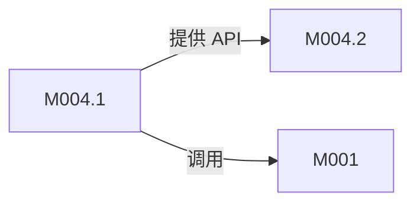
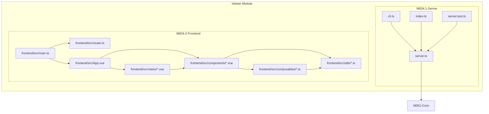
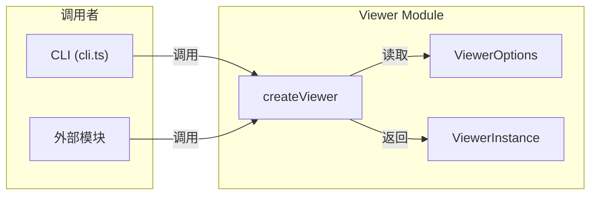
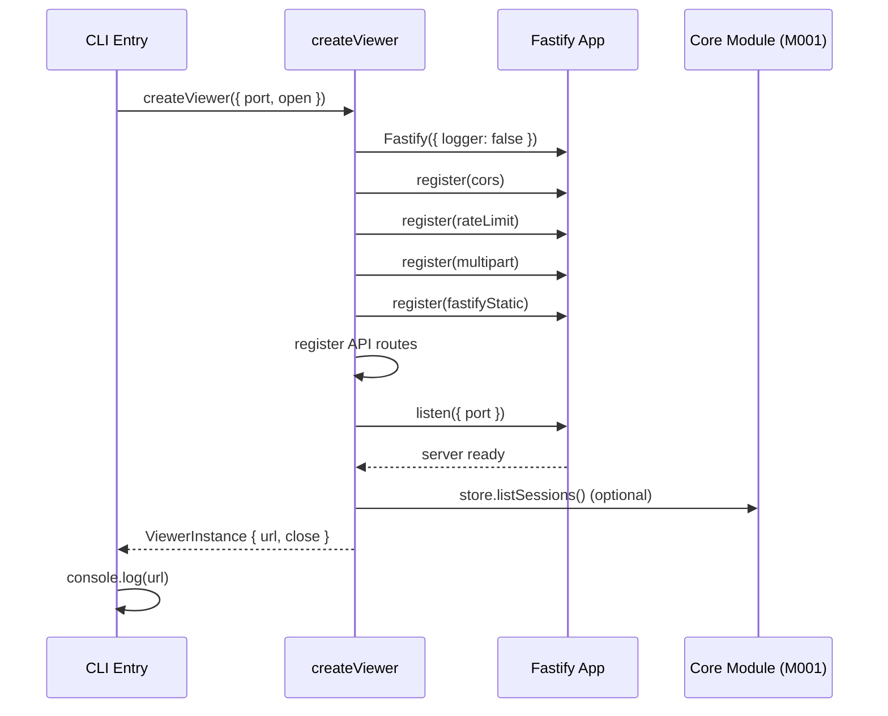
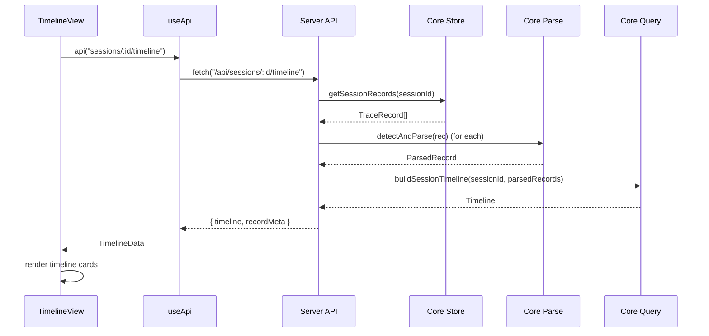
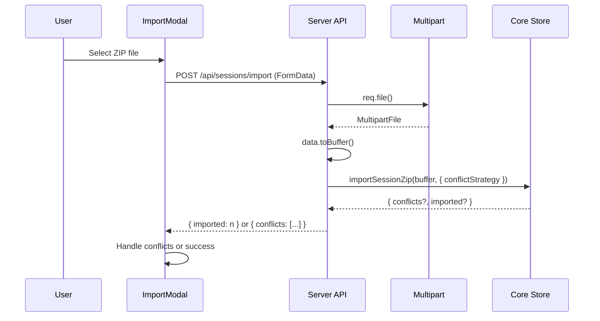

# M004-Viewer

## 概述

Viewer 模块是 opencode-trace 项目的 Web 可视化入口，负责提供 HTTP API 服务和前端 UI，让用户能够浏览、查看和管理已记录的 AI 会话追踪数据。它位于系统的 Access Layer（访问层），作为唯一的用户交互界面。如果移除该模块，用户将无法通过 Web 方式查看追踪数据，只能依赖命令行工具进行原始数据查询，丧失可视化分析能力。

---

## 元数据

| 字段 | 值 |
|------|-----|
| 模块 ID | M004 |
| 路径 | packages/viewer/src/ |
| 文件数 | 41 (含编译产物) |
| 代码行数 | ~2000 (源码) |
| 主要语言 | TypeScript, Vue 3 |
| 所属层 | Access Layer |
| 父模块 | 无 |
| 依赖于 | M001-Core (@opencode-trace/core) |
| 被依赖于 | 无（入口点） |

---

## 子模块

| ID | 名称 | 职责 | 文档链接 |
|----|------|------|----------|
| [M004.1] | Server | HTTP API 服务器（Fastify），提供 RESTful 接口 | [Details](./M004/M004.1-Server.md) |
| [M004.2] | Frontend | Vue 3 SPA 前端界面，会话浏览与数据可视化 | [Details](./M004/M004.2-Frontend.md) |

### 子模块依赖关系



---

## 文件结构



| 文件 | 责 | 行数 | 主要导出 |
|------|------|------|----------|
| server.ts | Fastify HTTP 服务器，定义所有 API 路由 | 409 | createViewer, ViewerOptions, ViewerInstance |
| cli.ts | CLI 入口，解析命令行参数启动服务器 | 24 | - |
| index.ts | 模块公共 API 导出 | 2 | createViewer, ViewerOptions, ViewerInstance |
| server.test.ts | API 端点单元测试 | 123 | - |
| frontend/src/main.ts | Vue 应用入口 | 8 | - |
| frontend/src/router.ts | Vue Router 路由配置 | 16 | router |
| frontend/src/App.vue | 根组件，全局状态管理 | 166 | - |
| frontend/src/views/SessionsView.vue | 会话列表视图 | 603 | - |
| frontend/src/views/TimelineView.vue | 时间线视图 | 477 | - |
| frontend/src/views/RecordView.vue | 单条记录详情视图 | 306 | - |
| frontend/src/utils/format.ts | 格式化工具函数 | 56 | esc, formatTime, relativeTime, formatNumber, formatLatency, formatDuration |
| frontend/src/utils/block-defs.ts | Block 类型定义与渲染 | 168 | Block, BlockDef, BLOCK_DEFS, formatJsonLines, formatXmlLines, renderContent |
| frontend/src/composables/useApi.ts | API 调用封装 | 22 | api, apiPost, apiDelete |
| frontend/src/composables/useTheme.ts | 主题切换逻辑 | 31 | useTheme |
| frontend/src/composables/useToast.ts | Toast 提示状态 | 38 | useToast, Toast |
| frontend/src/composables/useKeyboard.ts | 键盘快捷键 | 23 | useKeyboard |

---

## 功能树

```text
M004-Viewer (Web 可视化服务)
├── M004.1-Server (HTTP API 服务)
│   └── server.ts
│       ├── fn: createViewer(options?: ViewerOptions): Promise<ViewerInstance> — 创建并启动 Viewer 服务器
│       ├── fn: validateSessionId(sessionId: string): boolean — 校验会话 ID 格式
│       ├── fn: validateRecordId(recordId: string): { valid: boolean; value: number } — 校验记录 ID 格式
│       ├── fn: validateParams(reply, sessionId, recordId?): number | null — 统一参数校验
│       ├── type: ViewerOptions — 服务器配置选项
│       └── type: ViewerInstance — 服务器实例接口
│   └── cli.ts
│       └── fn: main() — CLI 入口，解析参数并启动服务器
│   └── index.ts
│       └── export: createViewer, ViewerOptions, ViewerInstance — 模块公共导出
│
├── M004.2-Frontend (Vue 3 SPA)
│   └── main.ts
│       └── fn: main() — 创建 Vue 应用并挂载
│   └── router.ts
│       └── const: router — Vue Router 实例，定义三个路由
│   └── App.vue
│       ├── fn: loadTraceStatus() — 加载全局追踪状态
│       ├── fn: toggleTraceEnabled() — 切换追踪开关
│       ├── fn: exportSession(sessionId) — 导出会话为 ZIP
│       └── fn: showConfirm(title, message, onConfirm) — 显示确认对话框
│   └── views/SessionsView.vue
│       ├── fn: loadSessions() — 加载会话树列表
│       ├── fn: groupTreeByFolder(nodes) — 按文件夹分组
│       ├── fn: sortGroups(groups, mode) — 排序分组
│       └── fn: deleteSession(id) — 删除会话
│   └── views/TimelineView.vue
│       ├── fn: loadTimeline() — 加载时间线和元数据
│       ├── fn: getChange(recordId) — 获取变更数据
│       └── fn: getModel(recordId) — 获取模型名称
│   └── views/RecordView.vue
│       ├── fn: loadRecord() — 加载单条记录详情
│       └── computed: metadataSections — 构建元数据展示区
│   └── components/BlockRenderer.vue
│       ├── fn: toggleView() — 切换原始/渲染视图
│       ├── fn: copyContent() — 复制内容到剪贴板
│       └── fn: renderMarkdown(text) — 渲染 Markdown
│   └── composables/useApi.ts
│       ├── fn: api<T>(path): Promise<T> — GET API 调用
│       ├── fn: apiPost<T>(path, body): Promise<T> — POST API 调用
│       └── fn: apiDelete<T>(path): Promise<T> — DELETE API 调用
│   └── utils/format.ts
│       ├── fn: esc(s): string — HTML 转义
│       ├── fn: formatTime(iso): string — 格式化时间
│       ├── fn: relativeTime(iso): string — 相对时间描述
│       ├── fn: formatNumber(n): string — 数字千分位格式化
│       ├── fn: formatLatency(n): string — 延迟格式化
│       └── fn: formatDuration(ms): string — 持续时间格式化
│   └── utils/block-defs.ts
│       ├── type: Block — Block 数据结构
│       ├── type: BlockDef — Block 渲染定义
│       ├── const: BLOCK_DEFS — 各类型 Block 的渲染配置
│       ├── fn: formatJsonLines(obj): string — JSON 行号渲染
│       ├── fn: formatXmlLines(xml): string — XML 行号渲染
│       └── fn: renderContent(content): string — 智能内容渲染
```

### 功能清单

| 名称 | 类型 | 文件 | 行号 | 描述 |
|------|------|------|------|------|
| createViewer | fn | server.ts | L52 | 创建并启动 Fastify HTTP 服务器，注册所有 API 路由和插件 |
| validateSessionId | fn | server.ts | L13 | 校验 sessionId 格式（长度、字符集）防止注入攻击 |
| validateRecordId | fn | server.ts | L17 | 校验 recordId 格式并转换为数字 |
| ViewerOptions | type | server.ts | L40 | 服务器配置选项（port, traceDir, open, corsOrigin） |
| ViewerInstance | type | server.ts | L47 | 服务器实例（url, close 方法） |
| api | fn | useApi.ts | L3 | 封装 fetch GET 请求，返回 JSON 数据 |
| apiPost | fn | useApi.ts | L9 | 封装 fetch POST 请求 |
| apiDelete | fn | useApi.ts | L18 | 封装 fetch DELETE 请求（实际用 POST） |
| useTheme | fn | useTheme.ts | L5 | 主题切换 composable，支持 dark/light 模式 |
| useToast | fn | useToast.ts | L14 | Toast 提示 composable，管理消息队列 |
| useKeyboard | fn | useKeyboard.ts | L3 | 键盘快捷键 composable，注册全局按键监听 |
| BLOCK_DEFS | const | block-defs.ts | L25 | Block 类型渲染配置映射表 |
| esc | fn | format.ts | L1 | HTML 安全转义函数 |
| formatDuration | fn | format.ts | L40 | 将毫秒转为可读时间格式（ms/s/m/h） |

### 职责边界

**做什么**

- 提供 RESTful HTTP API 查询会话、记录、时间线、元数据
- 提供 Web UI 浏览会话列表、时间线、记录详情
- 支持会话导入/导出（ZIP 格式）
- 支持全局追踪开关控制
- 支持键盘快捷键和主题切换

**不做什么**

- 不负责追踪数据的录制（由 M001-Core 和 M003-Plugin 负责）
- 不负责数据存储底层逻辑（由 M001-Core 的 store 子模块负责）
- 不负责数据解析逻辑（由 M001-Core 的 parse 子模块负责）
- 不提供用户认证或权限控制

---

## 公共接口契约

### 接口关系图



### 类型定义

```typescript
// [File: packages/viewer/src/server.ts:40]
export interface ViewerOptions {
  port?: number;           // 服务端口，默认 3210
  traceDir?: string;       // 追踪数据目录路径
  open?: boolean;          // 是否自动打开浏览器
  corsOrigin?: string | string[] | RegExp | boolean;  // CORS 配置
}

// [File: packages/viewer/src/server.ts:47]
export interface ViewerInstance {
  url: string;             // 服务器地址，如 http://localhost:3210
  close: () => Promise<void>;  // 关闭服务器方法
}
```

| 类型名 | 字段/方法 | 类型 | 描述 | 位置 |
|--------|-----------|------|------|------|
| ViewerOptions | port | number? | 服务端口，默认 3210 | server.ts:41 |
| ViewerOptions | traceDir | string? | 追踪数据目录路径 | server.ts:42 |
| ViewerOptions | open | boolean? | 是否自动打开浏览器 | server.ts:43 |
| ViewerOptions | corsOrigin | string | string[] | RegExp | boolean? | CORS 配置 | server.ts:44 |
| ViewerInstance | url | string | 服务器地址 | server.ts:48 |
| ViewerInstance | close | () => Promise<void> | 关闭服务器 | server.ts:49 |

### 导出函数

#### `createViewer()`

```typescript
// [File: packages/viewer/src/server.ts:52]
export async function createViewer(options?: ViewerOptions): Promise<ViewerInstance>
```

| 参数 | 类型 | 必需 | 描述 |
|------|------|------|------|
| options | ViewerOptions | 否 | 服务器配置选项 |

- **返回**：`Promise<ViewerInstance>` — 服务器实例，包含 url 和 close 方法
- **抛出**：无显式抛出，但端口冲突时 Fastify 会报错

**使用示例**：

```typescript
import { createViewer } from "@opencode-trace/viewer";

const viewer = await createViewer({ port: 3210, open: true });
console.log(`Viewer running at ${viewer.url}`);

// 关闭服务器
await viewer.close();
```

---

## 内部实现

### 核心内部逻辑

| 函数/类 | 文件 | 行号 | 用途 |
|---------|------|------|------|
| validateSessionId | server.ts | L13 | 校验 sessionId 格式，防止路径注入攻击 |
| validateRecordId | server.ts | L17 | 校验 recordId 为有效正整数 |
| validateParams | server.ts | L22 | 统一参数校验入口，返回校验后的 recordId 或 null |
| groupTreeByFolder | SessionsView.vue | L243 | 将会话树节点按 folderPath 分组 |
| sortGroups | SessionsView.vue | L268 | 根据排序模式对会话分组排序 |
| getRecordDuration | TimelineView.vue | L256 | 计算单条记录的执行时长 |
| formatJsonLines | block-defs.ts | L104 | JSON 内容行号渲染与语法高亮 |

### 设计模式

| 模式 | 使用位置 | 使用原因 | 代码证据 |
|------|----------|----------|----------|
| Singleton | useToast.ts:11 | 全局 Toast 状态管理，避免重复实例 | `const toasts = ref<Toast[]>([])` 全局单例 |
| Singleton | useTheme.ts:3 | 全局主题状态，跨组件共享 | `const theme = ref<string>("dark")` 全局单例 |
| Factory | server.ts:52 | createViewer 工厂函数创建服务器实例 | `export async function createViewer()` |
| Composable | useApi.ts, useTheme.ts, useToast.ts, useKeyboard.ts | Vue 3 Composition API 复用逻辑 | 所有 composables 导出函数 |
| Template Method | BLOCK_DEFS | Block 渲染策略表，不同类型使用不同渲染方法 | block-defs.ts:25 定义各类型渲染配置 |

### 关键算法 / 策略

| 算法/策略 | 用途 | 复杂度 | 文件 |
|-----------|------|--------|------|
| 会话分组算法 | 将会话树按 folderPath 分组，提取项目名 | O(n) | SessionsView.vue:243 |
| 相对时间计算 | 将 ISO 时间转换为 "just now", "5m ago", "2d ago" 等可读格式 | O(1) | format.ts:19 |
| JSON 语法高亮 | 正则匹配 JSON 语法元素并添加样式类 | O(n) | block-defs.ts:104 |
| 内容智能渲染 | 根据内容特征（JSON/XML）选择渲染方式 | O(n) | block-defs.ts:150 |

---

## 关键流程

### 流程 1：启动 Viewer 服务器

**调用链**

```text
cli.ts:16 → server.ts:52 → Fastify.register(cors/rateLimit/multipart/static) → server.ts:389 listen
```

**时序图**



**步骤详解**

| 步骤 | 说明 | 文件位置 |
|------|------|----------|
| 1 | 解析 CLI 参数（port, --no-open） | cli.ts:4-14 |
| 2 | 调用 createViewer 创建服务器 | cli.ts:16 |
| 3 | 创建 Fastify 实例，禁用日志 | server.ts:57 |
| 4 | 注册 CORS、Rate Limit、Multipart、Static 插件 | server.ts:59-75 |
| 5 | 注册 API 路由（sessions, records, trace 等） | server.ts:86-387 |
| 6 | 启动 HTTP 监听 | server.ts:389 |
| 7 | 返回 ViewerInstance | server.ts:405-408 |
| 8 | 可选：自动打开浏览器 | server.ts:393-403 |

---

### 流程 2：加载会话时间线

**调用链**

```text
TimelineView.vue:307 → useApi.ts:3 → fetch("/api/sessions/:id/timeline") → server.ts:96 → store.getSessionRecords → parse.detectAndParse → query.buildSessionTimeline
```

**时序图**



**步骤详解**

| 步骤 | 说明 | 文件位置 |
|------|------|----------|
| 1 | TimelineView 调用 api() 发起请求 | TimelineView.vue:311 |
| 2 | Server 接收请求，校验 sessionId | server.ts:98-101 |
| 3 | 从 store 获取会话所有记录 | server.ts:102 |
| 4 | 对每条记录执行 detectAndParse 解析 | server.ts:103-127 |
| 5 | 过滤掉 unknown provider 或无消息的记录 | server.ts:127 |
| 6 | 调用 query.buildSessionTimeline 构建时间线 | server.ts:128 |
| 7 | 返回时间线和 recordMeta | server.ts:134 |

---

### 流程 3：会话导入处理

**调用链**

```text
ImportModal.vue:82 → fetch("/api/sessions/import") → server.ts:335 → multipart → store.importSessionZip
```

**时序图**



**步骤详解**

| 步骤 | 说明 | 文件位置 |
|------|------|----------|
| 1 | 用户选择 ZIP 文件 | ImportModal.vue:72 |
| 2 | 构建 FormData 并 POST | ImportModal.vue:79-82 |
| 3 | Server 获取 multipart 文件 | server.ts:337 |
| 4 | 转换为 Buffer | server.ts:343 |
| 5 | 获取 conflictStrategy 参数 | server.ts:344 |
| 6 | 调用 store.importSessionZip | server.ts:352 |
| 7 | 处理冲突或返回导入结果 | server.ts:357-366 |

---

## 依赖

### 内部依赖（项目内其他模块）

| 模块 | 使用的接口 | 调用位置 |
|------|-----------|----------|
| M001-Core | store.listSessions, store.listSessionsTree, store.getSessionRecords, store.getRecord, store.getSSEStream, store.exportSessionZip, store.importSessionZip, store.deleteSession, store.getTraceDir | server.ts:87, 92, 102, 180, 228, 318, 352, 376, 308 |
| M001-Core | parse.detectAndParse, parse.detectProvider, parse.openaiChatParser.parseRequest, parse.openaiResponsesParser.parseRequest, parse.anthropicParser.parseRequest, parse.extractUsage, parse.extractLatency | server.ts:105-117, 185, 201, 217, 234-244 |
| M001-Core | query.buildSessionTimeline, query.buildSessionMetadata | server.ts:128, 158 |
| M001-Core | transform.sseAnthropicToMessages, transform.sseOpenaiResponsesToMessages, transform.sseOpenaiChatToMessages | server.ts:239-244 |
| M001-Core | record.getGlobalTraceEnabled, record.setGlobalTraceEnabled | server.ts:293, 298, 303 |

### 外部依赖（第三方包）

| 包名 | 版本 | 用途 | 可替代性 |
|------|------|------|----------|
| fastify | ^5.8.5 | HTTP 服务器框架 | 中（可替换为 Express，但需重写路由） |
| @fastify/cors | ^11.2.0 | CORS 支持 | 高 |
| @fastify/rate-limit | ^10.3.0 | 请求限流 | 高 |
| @fastify/multipart | ^10.0.0 | 文件上传处理 | 中 |
| @fastify/static | ^8.1.0 | 静态文件服务 | 高 |
| vue | ^3.5.13 | 前端框架 | 低（核心依赖） |
| vue-router | ^4.5.0 | 路由管理 | 低 |
| marked | (dev) | Markdown 渲染 | 高 |
| vite | ^6.0.0 | 前端构建工具 | 中 |

---

## 代码质量与风险

### 代码坏味道

| 问题 | 类型 | 文件 | 严重度 | 建议 |
|------|------|------|--------|------|
| server.ts 路由定义过长 | 过长函数 | server.ts:52-408 | 中 | 拆分为路由模块，按资源分组 |
| 重复的 validateSessionId 调用 | 重复代码 | server.ts 各路由 | 低 | 可考虑 Fastify schema 验证插件 |
| 前端组件 CSS 过长 | 过长样式 | 各 Vue 文件 | 低 | 提取公共样式类 |

### 潜在风险

| 风险 | 触发条件 | 影响 | 文件 | 建议 |
|------|----------|------|------|------|
| 端口冲突 | 指定端口已被占用 | 服务启动失败 | server.ts:389 | 添加端口自动重试或错误提示 |
| CORS 配置过于宽松 | 生产环境未配置 corsOrigin | 安全风险 | server.ts:60 | 生产环境应配置白名单 |
| XSS 风险 | 前端使用 v-html 渲染用户内容 | 潜在 XSS | BlockRenderer.vue:26 | 已有 esc() 转义，但需持续审计 |
| Session ID 注入 | 恶意 sessionId 路径穿越 | 数据泄露 | server.ts:13 | 已有 validateSessionId 校验 |

### 测试覆盖

| 测试类型 | 覆盖情况 | 测试文件 | 说明 |
|----------|----------|----------|------|
| 单元测试 | 部分 | server.test.ts | 仅覆盖 latency 端点，其他路由未测试 |
| 集成测试 | 无 | - | 需补充 E2E 测试 |
| 前端测试 | 部分 | MetadataCard.test.ts | 仅一个组件有测试 |

---

## 开发指南

### 洞察

- Server 与 Frontend 完全解耦，通过 REST API 通信，便于独立开发和测试
- 前端使用 Vue 3 Composition API，逻辑通过 composables 复用，代码结构清晰
- Block 渲染系统设计灵活，通过 BLOCK_DEFS 配置不同类型渲染策略
- 参数校验函数统一处理，避免路由内重复代码

### 扩展指南

**添加新 API 端点**：
1. 在 server.ts 中添加 `app.get/post/delete` 路由定义
2. 添加参数校验（使用 validateSessionId/validateRecordId 或自定义）
3. 调用 M001-Core 模块的相应函数处理数据
4. 返回 JSON 或流式响应

**添加前端新页面**：
1. 在 frontend/src/views/ 创建新 Vue 组件
2. 在 router.ts 中添加路由配置
3. 在 App.vue 或现有组件中添加导航入口
4. 使用 useApi.ts 获取后端数据

**添加新 Block 类型**：
1. 在 block-defs.ts 的 BLOCK_DEFS 中添加新类型定义
2. 定义 tag、toggle、getRaw、renderRaw、renderRendered 等配置
3. 在 BlockRenderer.vue 中处理新类型的渲染逻辑

### 风格与约定

- 前端组件使用 `<script setup lang="ts">` 语法
- API 路径使用 `/api/sessions/:sessionId/...` 统一格式
- 错误响应统一返回 `{ error: string }` 格式
- 使用 CSS 变量（var(--xxx)) 实现主题切换
- composables 以 `use` 前缀命名（useApi, useTheme, useToast）

### 设计哲学

- **API 优先设计**：Server 先定义 API，Frontend 依赖 API 响应格式
- **最小化后端渲染**：Server 仅返回 JSON，所有 UI 渲染由 Frontend 完成
- **渐进式交互**：先显示数据，再提供操作（导出、删除等）
- **安全默认值**：Rate limit、CORS 白名单、参数校验内置

### 修改检查清单

- [ ] 新增 API 路由时检查参数校验是否完整
- [ ] 修改 API 响应格式时同步更新前端 TypeScript 类型
- [ ] 添加新 Block 类型时更新 BLOCK_DEFS 和 BlockRenderer
- [ ] 修改 CSS 变量时检查 light/dark 主题都有对应值
- [ ] 新增前端组件时检查键盘快捷键是否需要支持
- [ ] 生产部署时检查 CORS 和 Rate Limit 配置

