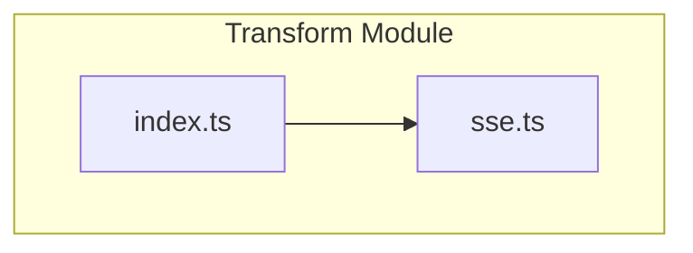
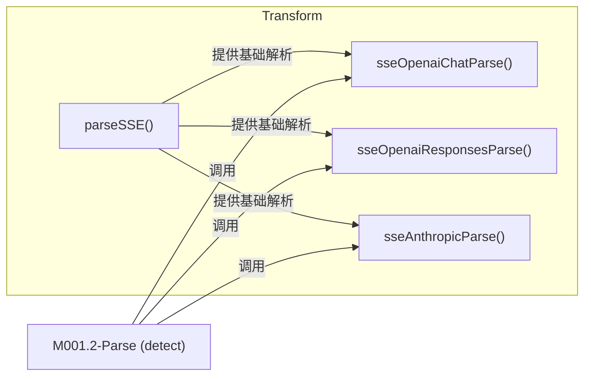
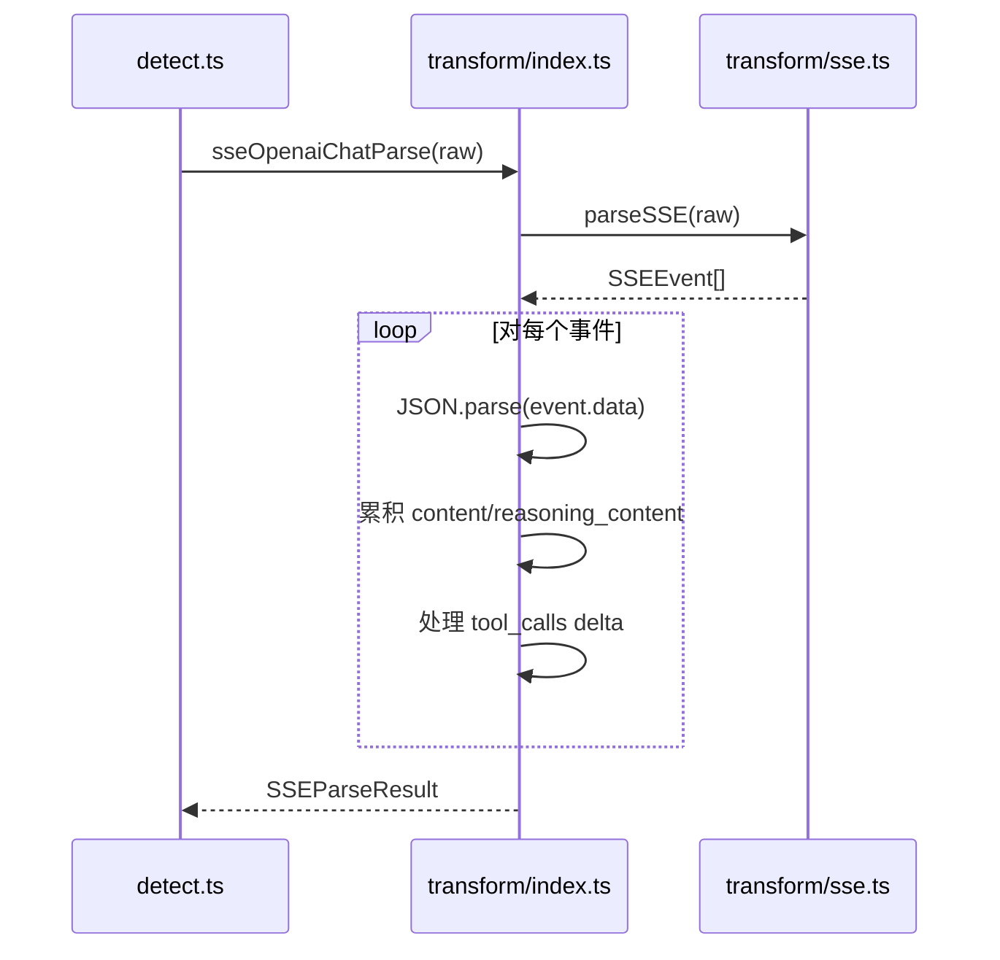

# M001.3-Transform

## 概述

Transform 模块负责将 SSE（Server-Sent Events）流式响应数据转换为结构化的消息格式。它解决了不同 AI 提供商（OpenAI Chat、OpenAI Responses、Anthropic）流式响应格式不一致的问题，为上层解析模块提供统一的消息结构。作为 Domain Layer 的核心组件，它将原始网络协议数据转换为领域模型。如果移除此模块，系统将无法解析任何流式 AI 响应，只能处理完整的非流式响应。

---

## 元数据

| 字段 | 值 |
|------|-----|
| 模块 ID | M001.3 |
| 路径 | packages/core/src/transform/ |
| 文件数 | 2 |
| 代码行数 | 376 |
| 主要语言 | TypeScript |
| 所属层 | Domain Layer |
| 父模块 | M001-Core |
| 依赖于 | M001.8-Schemas (types), 内部 logger |
| 被依赖于 | M001.2-Parse |

---

## 文件结构



| 文件 | 职责 | 行数 | 主要导出 |
|------|------|------|----------|
| sse.ts | SSE 协议解析，处理原始 SSE 文本 | 65 | parseSSE, isSSEData, SSEEvent |
| index.ts | 提供商特定格式转换（OpenAI/Anthropic） | 311 | sseOpenaiChatParse, sseOpenaiResponsesParse, sseAnthropicParse |

---

## 功能树

```
M001.3-Transform (SSE 转换)
├── sse.ts
│   ├── type: SSEEvent — SSE 事件结构定义
│   ├── fn: parseSSE(raw: string): SSEEvent[] — 解析原始 SSE 文本为事件数组
│   └── fn: isSSEData(data: string): boolean — 检测字符串是否为 SSE 数据格式
└── index.ts
    ├── type: SSEParseResult — 解析结果（消息 + 用量信息）
    ├── fn: sseOpenaiChatParse(raw: string): SSEParseResult — 解析 OpenAI Chat 流式响应
    ├── fn: sseOpenaiChatToMessages(raw: string): Entry[] — 仅返回消息部分
    ├── fn: sseOpenaiResponsesParse(raw: string): SSEParseResult — 解析 OpenAI Responses API 流式响应
    ├── fn: sseOpenaiResponsesToMessages(raw: string): Entry[] — 仅返回消息部分
    ├── fn: sseAnthropicParse(raw: string): SSEParseResult — 解析 Anthropic 流式响应
    └── fn: sseAnthropicToMessages(raw: string): Entry[] — 仅返回消息部分
```

### 功能清单

| 名称 | 类型 | 文件 | 行号 | 描述 |
|------|------|------|------|------|
| SSEEvent | type | sse.ts | L1-5 | SSE 事件结构（id、event、data 字段） |
| parseSSE | fn | sse.ts | L7-61 | 将原始 SSE 文本解析为结构化事件数组 |
| isSSEData | fn | sse.ts | L63-65 | 快速检测字符串是否为 SSE 数据格式 |
| SSEParseResult | type | index.ts | L10-13 | 解析结果，包含消息和用量信息 |
| sseOpenaiChatParse | fn | index.ts | L20-104 | 解析 OpenAI Chat Completions API 流式响应 |
| sseOpenaiChatToMessages | fn | index.ts | L15-18 | sseOpenaiChatParse 的便捷封装，仅返回消息 |
| sseOpenaiResponsesParse | fn | index.ts | L111-223 | 解析 OpenAI Responses API 流式响应 |
| sseOpenaiResponsesToMessages | fn | index.ts | L106-109 | sseOpenaiResponsesParse 的便捷封装 |
| sseAnthropicParse | fn | index.ts | L230-309 | 解析 Anthropic Messages API 流式响应 |
| sseAnthropicToMessages | fn | index.ts | L225-228 | sseAnthropicParse 的便捷封装 |

### 职责边界

**做什么**

- 解析标准 SSE 协议格式（`parseSSE`）
- 将 OpenAI Chat Completions 流式响应转换为 Entry 消息
- 将 OpenAI Responses API 流式响应转换为 Entry 消息
- 将 Anthropic Messages 流式响应转换为 Entry 消息
- 提取流式响应中的 token 用量信息

**不做什么**

- 不处理非流式响应（由 Parse 模块的 parser 处理）
- 不进行 HTTP 请求（由调用方处理）
- 不验证消息内容的语义正确性
- 不处理流式传输的网络错误（仅记录解析错误日志）

---

## 公共接口契约

### 接口关系图



### 类型定义

```typescript
// [File: sse.ts:1-5]
export interface SSEEvent {
  id?: string;       // SSE 事件 ID（可选）
  event?: string;    // SSE 事件类型（可选）
  data: string;      // SSE 数据内容（必需）
}

// [File: index.ts:10-13]
export interface SSEParseResult {
  messages: Entry[];           // 转换后的消息数组
  usage: Conversation["usage"]; // Token 用量信息
}
```

| 类型名 | 字段/方法 | 类型 | 描述 | 位置 |
|--------|-----------|------|------|------|
| SSEEvent | id | string \| undefined | SSE 事件 ID | sse.ts:2 |
| SSEEvent | event | string \| undefined | SSE 事件类型名称 | sse.ts:3 |
| SSEEvent | data | string | SSE 数据内容 | sse.ts:4 |
| SSEParseResult | messages | Entry[] | 解析后的消息条目 | index.ts:11 |
| SSEParseResult | usage | Conversation["usage"] | Token 用量（可含缓存命中） | index.ts:12 |

### 导出函数

#### `parseSSE()`

```typescript
// [File: sse.ts:7-61]
export function parseSSE(raw: string): SSEEvent[]
```

| 参数 | 类型 | 必需 | 描述 |
|------|------|------|------|
| raw | string | 是 | 原始 SSE 文本内容 |

- **返回**：`SSEEvent[]` — 解析后的事件数组，每个事件包含 id、event、data 字段
- **行为**：按 SSE 规范解析，忽略注释行（以 `:` 开头），合并连续的 data 行

**使用示例**：

```typescript
import { parseSSE } from '@opencode-trace/core/transform';
const events = parseSSE('data: {"text": "hello"}\n\ndata: [DONE]\n\n');
// events = [{ data: '{"text": "hello"}' }, { data: '[DONE]' }]
```

#### `sseOpenaiChatParse()`

```typescript
// [File: index.ts:20-104]
export function sseOpenaiChatParse(raw: string): SSEParseResult
```

| 参数 | 类型 | 必需 | 描述 |
|------|------|------|------|
| raw | string | 是 | OpenAI Chat Completions API 的 SSE 响应文本 |

- **返回**：`SSEParseResult` — 包含 assistant 消息和 token 用量
- **行为**：累积 delta 内容，处理 reasoning_content、tool_calls

**使用示例**：

```typescript
import { sseOpenaiChatParse } from '@opencode-trace/core/transform';
const result = sseOpenaiChatParse(sseRawText);
console.log(result.messages); // Entry[]
console.log(result.usage);    // { inputMissTokens, inputHitTokens, outputTokens }
```

#### `sseOpenaiResponsesParse()`

```typescript
// [File: index.ts:111-223]
export function sseOpenaiResponsesParse(raw: string): SSEParseResult
```

| 参数 | 类型 | 必需 | 描述 |
|------|------|------|------|
| raw | string | 是 | OpenAI Responses API 的 SSE 响应文本 |

- **返回**：`SSEParseResult` — 包含 assistant 消息和 token 用量
- **行为**：处理 response.output_text.delta、response.function_call_arguments.delta 等事件类型

#### `sseAnthropicParse()`

```typescript
// [File: index.ts:230-309]
export function sseAnthropicParse(raw: string): SSEParseResult
```

| 参数 | 类型 | 必需 | 描述 |
|------|------|------|------|
| raw | string | 是 | Anthropic Messages API 的 SSE 响应文本 |

- **返回**：`SSEParseResult` — 包含 assistant 消息和 token 用量
- **行为**：处理 content_block_delta、content_block_start 事件，支持 thinking 块

---

## 关键流程

### 流程 1：OpenAI Chat SSE 解析流程

**调用链**

```
detect.ts:39 → index.ts:20 (sseOpenaiChatParse) → sse.ts:7 (parseSSE)
```

**时序图**



**步骤详解**

| 步骤 | 说明 | 文件位置 |
|------|------|----------|
| 1 | 调用 parseSSE 将原始文本分割为 SSE 事件数组 | sse.ts:7-61 |
| 2 | 遍历事件，跳过 `[DONE]` 标记和无效数据 | index.ts:27-28 |
| 3 | 解析 usage 字段，提取 token 用量和缓存命中 | index.ts:33-46 |
| 4 | 累积 delta.content 到 content 字符串 | index.ts:54-55 |
| 5 | 累积 delta.reasoning_content 到 reasoningContent | index.ts:58-59 |
| 6 | 处理 tool_calls delta，按 index 合并参数 | index.ts:62-78 |
| 7 | 构建 Block 数组（thinking、text、toolCall） | index.ts:88-97 |
| 8 | 返回包含消息和用量的结果 | index.ts:103 |

### 流程 2：Anthropic SSE 解析流程

**调用链**

```
detect.ts:39 → index.ts:230 (sseAnthropicParse) → sse.ts:7 (parseSSE)
```

**步骤详解**

| 步骤 | 说明 | 文件位置 |
|------|------|----------|
| 1 | 调用 parseSSE 解析原始 SSE | sse.ts:7-61 |
| 2 | 提取 usage 中的 cache_read_input_tokens | index.ts:244-255 |
| 3 | 处理 content_block_delta 事件，累积 text/thinking | index.ts:257-269 |
| 4 | 处理 content_block_start 事件，创建 tool_use 块 | index.ts:270-283 |
| 5 | 累积 input_json_delta 到 tool arguments | index.ts:264-267 |
| 6 | 构建 Block 数组并返回 | index.ts:293-308 |

---

## 依赖

### 内部依赖（项目内其他模块）

| 模块 | 使用的接口 | 调用位置 |
|------|-----------|----------|
| M001.8-Schemas (parse/types) | Entry, Block, Conversation | index.ts:2 |
| M001.8-Schemas (parse/utils) | createMsgEntry, createTextBlock, createThinkingBlock, createToolCallBlock | index.ts:3 |
| 内部 logger | logger.debug() | index.ts:80, 201, 285 |

### 外部依赖（第三方包）

| 包名 | 版本 | 用途 | 可替代性 |
|------|------|------|----------|
| 无 | - | 仅使用纯 TypeScript | - |

---

## 开发指南

### 洞察

1. **双层解析架构**：`parseSSE` 处理通用 SSE 协议，各提供商特定函数处理业务数据转换
2. **增量累积模式**：流式数据通过字符串累积处理，tool_calls 使用索引定位进行合并
3. **错误容忍设计**：单个事件解析失败仅记录 debug 日志，不中断整体流程

### 扩展指南

添加新提供商的 SSE 解析支持：

1. 在 `index.ts` 中创建新函数 `sse[Provider]Parse(raw: string): SSEParseResult`
2. 复用 `parseSSE()` 解析原始 SSE 事件
3. 按提供商 API 文档处理特定事件类型和字段
4. 使用 `createMsgEntry()`、`createTextBlock()` 等工具函数构建结果
5. 提取 usage 信息时遵循 `inputMissTokens/inputHitTokens/outputTokens` 结构
6. 在 `detect.ts:parseSSEMessagesWithUsage()` 中添加提供商判断分支

### 风格与约定

- 所有解析函数返回 `SSEParseResult`，即使无内容也返回 `{ messages: [], usage: null }`
- 使用 `isRecord()` 类型守卫进行 JSON 对象类型检查
- 错误处理：catch 块仅记录 debug 日志，不抛出异常
- 用量字段统一使用三元结构：`inputMissTokens`（实际消耗）、`inputHitTokens`（缓存命中）、`outputTokens`

### 设计哲学

**选择 SSE 协议解析而非流式 API**：直接处理原始 SSE 文本而非使用流式 API，因为：
1. 数据已完整保存在 TraceRecord 中
2. 避免引入流式处理的复杂性
3. 便于调试和测试（输入输出都是简单字符串）

**提供商特定解析函数**：每个提供商独立函数而非统一接口，因为：
1. 各提供商事件结构差异大（delta vs type 字段）
2. 避免过度抽象导致的复杂条件分支
3. 便于单独维护和测试每个提供商

### 修改检查清单

- [ ] 修改后运行 `npm run test` 确保现有测试通过
- [ ] 如修改 `parseSSE()`，需同时检查所有提供商解析函数
- [ ] 新增提供商解析时，确保返回的 usage 结构一致
- [ ] 修改 Block 构建逻辑时，检查 Block 顺序是否符合预期（thinking → text → toolCalls）
- [ ] 添加新的 delta 字段处理时，在对应测试中覆盖该场景
