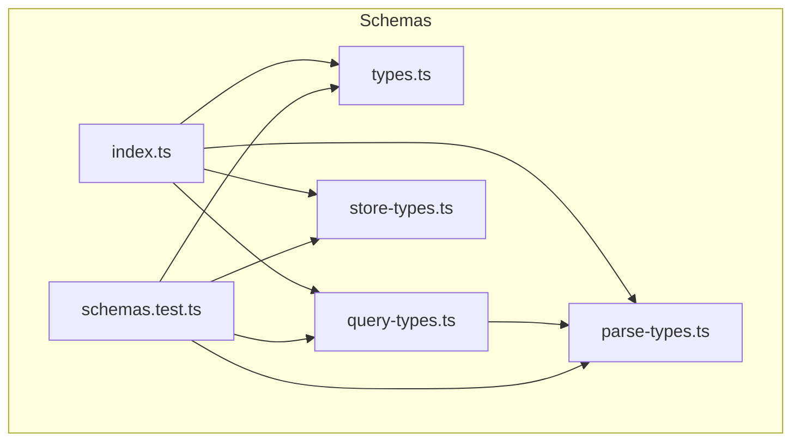
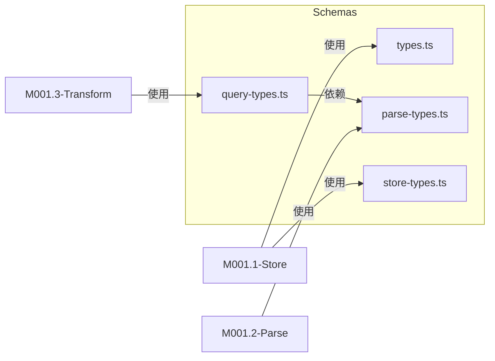

# M001.8-Schemas

## 概述

Schemas 模块为整个项目提供统一的类型验证基础设施。它使用 Zod 库定义运行时验证模式，确保数据在存储、解析和查询过程中符合预期结构。该模块位于基础设施层，作为数据契约的权威定义，为 Store、Parse、Transform 等上层模块提供类型安全保障。如果移除此模块，系统将失去对 API 响应、会话数据、内容块等核心数据结构的验证能力，导致数据一致性无法保证。

---

## 元数据

| 字段 | 值 |
|------|-----|
| 模块 ID | M001.8 |
| 路径 | packages/core/src/schemas/ |
| 文件数 | 6 (5 源文件 + 1 测试文件) |
| 代码行数 | 545 |
| 主要语言 | TypeScript |
| 所属层 | Infrastructure Layer |
| 父模块 | M001-Core |
| 依赖于 | zod (External) |
| 被依赖于 | M001.1-Store, M001.2-Parse, M001.3-Transform |

---

## 文件结构



| 文件 | 职责 | 行数 | 主要导出 |
|------|------|------|----------|
| types.ts | Trace 记录核心验证模式 | 38 | TraceRecordSchema, TraceRequestSchema, TraceResponseSchema, TraceErrorSchema |
| parse-types.ts | 内容解析相关验证模式 | 75 | BlockSchema, EntrySchema, ConversationSchema |
| query-types.ts | 查询结果验证模式 | 72 | SessionMetadataSchema, SessionTimelineSchema, TimelineRecordSchema |
| store-types.ts | 存储持久化验证模式 | 58 | SessionMetadataFileSchema, ExportManifestSchema, ImportResultSchema |
| index.ts | 模块统一导出入口 | 42 | 重导出所有 schema |
| schemas.test.ts | 单元测试 | 260 | - |

---

## 功能树

```text
M001.8-Schemas (validation schemas)
├── types.ts (trace record schemas)
│   ├── const: TraceRequestSchema — Validate HTTP request structure
│   ├── const: TraceResponseSchema — Validate HTTP response structure
│   ├── const: TraceErrorSchema — Validate error information
│   ├── const: TraceRecordSchema — Validate complete trace record
│   └── type: TraceRecordValidated — Inferred type from schema
├── parse-types.ts (content parsing schemas)
│   ├── const: TextBlockSchema — Validate text content block
│   ├── const: ThinkingBlockSchema — Validate thinking block
│   ├── const: ToolDefinitionBlockSchema — Validate tool definition
│   ├── const: ToolCallBlockSchema — Validate tool call block
│   ├── const: ToolResultBlockSchema — Validate tool result block
│   ├── const: ImageBlockSchema — Validate image block
│   ├── const: OtherBlockSchema — Validate unknown block type
│   ├── const: BlockSchema — Discriminated union of all block types
│   ├── const: EntrySchema — Validate conversation entry
│   ├── const: UsageSchema — Validate token usage stats
│   └── const: ConversationSchema — Validate full conversation
├── query-types.ts (query result schemas)
│   ├── const: EntryDeltaSchema — Validate entry changes
│   ├── const: DeltaSchema — Validate conversation delta
│   ├── const: RequestChangeSchema — Validate request change event
│   ├── const: SessionTimelineSchema — Validate session timeline
│   ├── const: TokenUsageSchema — Validate token usage summary
│   ├── const: LatencyStatsSchema — Validate latency statistics
│   ├── const: DurationStatsSchema — Validate duration statistics
│   ├── const: SessionMetadataSchema — Validate session metadata
│   └── const: TimelineRecordSchema — Validate timeline record
├── store-types.ts (persistence schemas)
│   ├── const: SessionMetaSchema — Validate session metadata
│   ├── const: SessionTreeNodeSchema — Validate tree node with children
│   ├── const: SessionMetadataFileSchema — Validate file-based metadata
│   ├── const: ExportManifestSchema — Validate export manifest
│   ├── const: ConflictInfoSchema — Validate conflict information
│   ├── const: ImportedSessionInfoSchema — Validate imported session info
│   └── const: ImportResultSchema — Validate import result
└── index.ts (module exports)
    └── export * — Re-export all schemas
```

### 功能清单

| 名称 | 类型 | 文件 | 行号 | 描述 |
|------|------|------|------|------|
| TraceRequestSchema | const | types.ts | L3-L8 | HTTP 请求结构验证 |
| TraceResponseSchema | const | types.ts | L10-L15 | HTTP 响应结构验证 |
| TraceErrorSchema | const | types.ts | L17-L20 | 错误信息结构验证 |
| TraceRecordSchema | const | types.ts | L22-L33 | 完整 trace 记录验证 |
| BlockSchema | const | parse-types.ts | L43-L51 | 内容块联合类型验证 |
| EntrySchema | const | parse-types.ts | L53-L57 | 会话条目验证 |
| ConversationSchema | const | parse-types.ts | L65-L73 | 完整会话结构验证 |
| SessionMetadataSchema | const | query-types.ts | L50-L61 | 会话元数据验证 |
| SessionMetadataFileSchema | const | store-types.ts | L18-L26 | 文件格式会话元数据验证 |
| ExportManifestSchema | const | store-types.ts | L28-L33 | 导出清单验证 |

### 职责边界

**做什么**

- 定义所有核心数据结构的 Zod 验证模式
- 提供运行时类型验证能力
- 导出推断类型供其他模块使用
- 作为数据契约的单一真实来源

**不做什么**

- 不包含业务逻辑或数据处理
- 不执行数据库操作
- 不包含格式转换逻辑
- 不处理验证失败的错误恢复

---

## 公共接口契约

### 接口关系图



### 类型定义

```typescript
// [File: types.ts:22-33]
export const TraceRecordSchema = z.object({
  id: z.number().int().positive(),
  purpose: z.string(),
  requestAt: z.string(),
  responseAt: z.string(),
  request: TraceRequestSchema,
  response: TraceResponseSchema.nullable(),
  error: TraceErrorSchema.nullable(),
  requestSentAt: z.number().optional(),
  firstTokenAt: z.number().optional(),
  lastTokenAt: z.number().optional(),
});

export type TraceRecordValidated = z.infer<typeof TraceRecordSchema>;
```

```typescript
// [File: parse-types.ts:43-51]
export const BlockSchema = z.discriminatedUnion("type", [
  TextBlockSchema,
  ThinkingBlockSchema,
  ToolDefinitionBlockSchema,
  ToolCallBlockSchema,
  ToolResultBlockSchema,
  ImageBlockSchema,
  OtherBlockSchema,
]);
```

```typescript
// [File: store-types.ts:18-26]
export const SessionMetadataFileSchema = z.object({
  sessionId: z.string(),
  title: z.string().optional(),
  enabled: z.boolean().optional(),
  parentID: z.string().optional(),
  subSessions: z.array(z.string()).optional(),
  createdAt: z.string().optional(),
  updatedAt: z.string().optional(),
});
```

### Schema 清单

| Schema 名称 | 来源文件 | 用途 | 位置 |
|-------------|----------|------|------|
| TraceRecordSchema | types.ts | Trace 记录验证 | L22 |
| TraceRequestSchema | types.ts | HTTP 请求验证 | L3 |
| TraceResponseSchema | types.ts | HTTP 响应验证 | L10 |
| TraceErrorSchema | types.ts | 错误信息验证 | L17 |
| BlockSchema | parse-types.ts | 内容块联合验证 | L43 |
| EntrySchema | parse-types.ts | 会话条目验证 | L53 |
| ConversationSchema | parse-types.ts | 完整会话验证 | L65 |
| SessionTimelineSchema | query-types.ts | 时间线验证 | L23 |
| SessionMetadataSchema | query-types.ts | 会话元数据验证 | L50 |
| TimelineRecordSchema | query-types.ts | 时间线记录验证 | L63 |
| SessionMetadataFileSchema | store-types.ts | 文件元数据验证 | L18 |
| ExportManifestSchema | store-types.ts | 导出清单验证 | L28 |
| ImportResultSchema | store-types.ts | 导入结果验证 | L54 |

---

## 依赖

### 内部依赖（项目内其他模块）

| 模块 | 使用的接口 | 调用位置 |
|------|-----------|----------|
| 无 | - | - |

### 外部依赖（第三方包）

| 包名 | 版本 | 用途 | 可替代性 |
|------|------|------|----------|
| zod | ^4.4.3 | 运行时类型验证与类型推断 | 低 |

---

## 代码质量与风险

### 代码坏味道

| 问题 | 类型 | 文件 | 严重度 | 建议 |
|------|------|------|--------|------|
| 无明显坏味道 | - | - | - | - |

### 潜在风险

| 风险 | 触发条件 | 影响 | 文件 | 建议 |
|------|----------|------|------|------|
| Schema 演进兼容性 | 修改已有 Schema 结构 | 可能导致历史数据无法解析 | 全部 | 添加版本控制或迁移逻辑 |
| unknown 类型字段 | body、inputSchema 使用 z.unknown() | 无法严格验证嵌套数据 | types.ts, parse-types.ts | 如有规范可定义更精确类型 |

### 测试覆盖

| 测试类型 | 覆盖情况 | 测试文件 | 说明 |
|----------|----------|----------|------|
| 单元测试 | 部分 | schemas.test.ts | 覆盖主要 Schema 的解析和拒绝用例 |
| 集成测试 | 无 | - | - |

---

## 开发指南

### 洞察

该模块采用 Schema-First 设计理念，所有数据结构定义以此模块为唯一真实来源。使用 Zod 的 discriminatedUnion 实现类型安全的联合类型（如 BlockSchema），避免手动类型守卫。文件按职责域划分，便于独立演进和维护。

### 扩展指南

添加新的 Schema 需遵循以下步骤：

1. 确定归属域（trace/parse/query/store）
2. 在对应 `*-types.ts` 文件中定义 Schema
3. 如需导出推断类型，使用 `z.infer<typeof SchemaName>`
4. 在 `index.ts` 中添加导出
5. 在 `schemas.test.ts` 中添加验证测试用例

### 风格与约定

- Schema 命名：`{Entity}Schema` 后缀
- 类型命名：`{Entity}Validated` 或直接使用 `z.infer`
- 使用 `z.discriminatedUnion` 而非 `z.union` 处理联合类型
- 可选字段统一使用 `.optional()` 或 `.nullable()`
- 时间戳字段使用 ISO 8601 字符串格式

### 设计哲学

选择 Zod 而非手动类型守卫的原因：
1. 运行时验证与编译时类型推断合一
2. 详细的错误信息有助于调试
3. discriminatedUnion 提供类型安全的联合类型处理

### 修改检查清单

- [ ] Schema 变更是否影响已有数据的向后兼容性
- [ ] 是否更新了 index.ts 导出
- [ ] 是否添加了对应的测试用例
- [ ] 如添加新文件，是否在 index.ts 中重导出
- [ ] 变更是否通知了 M001.1-Store、M001.2-Parse、M001.3-Transform 模块维护者
