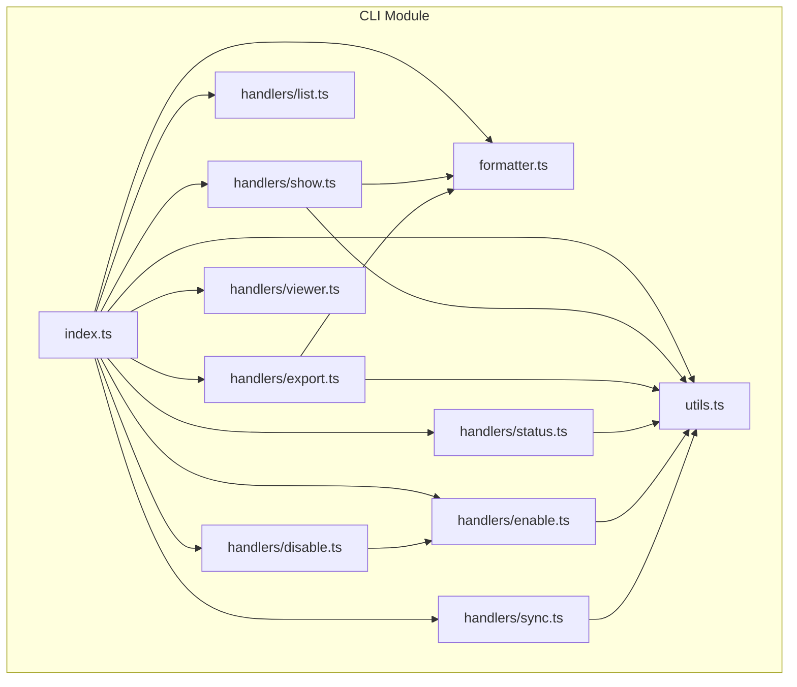
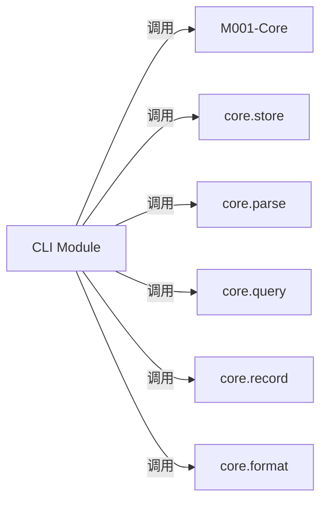
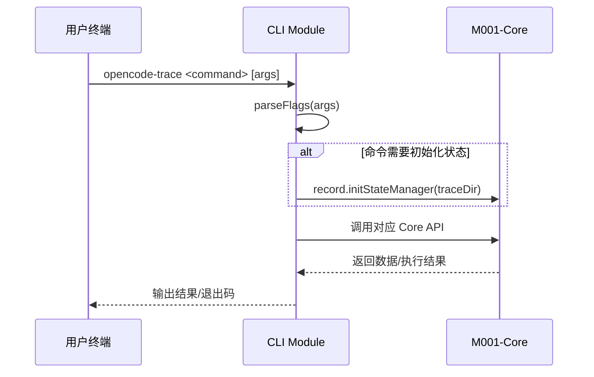
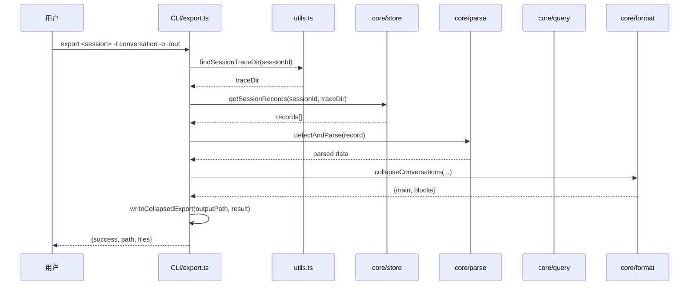

# M002-CLI

## 概述

CLI 模块是 opencode-trace 项目的命令行入口，提供完整的 trace 数据管理功能。它通过命令行接口暴露核心模块的记录、查询、存储和格式化能力。如果移除此模块，用户将无法通过终端控制 trace 记录、查看会话数据、导出分析结果或启动 Web 查看器。

---

## 元数据

| 字段 | 值 |
|------|-----|
| 模块 ID | M002 |
| 路径 | packages/cli/src/ |
| 文件数 | 11 (不含测试) |
| 代码行数 | ~830 (不含测试) |
| 主要语言 | TypeScript |
| 所属层 | Access Layer |
| 父模块 | 无 |
| 依赖于 | M001-Core |
| 被依赖于 | 无 (Entry Point) |

---

## 子模块

无。CLI 是扁平模块结构，所有处理器直接在 handlers/ 目录下。

---

## 文件结构



| 文件 | 职责 | 行数 | 主要导出 |
|------|------|------|----------|
| index.ts | CLI 入口，命令路由和分发 | 122 | main() |
| utils.ts | 通用工具函数（参数解析、范围处理、路径查找） | 113 | parseFlags, parseRange, inRange, findSessionTraceDir |
| formatter.ts | 数据格式化输出（JSON/XML、折叠导出） | 84 | outputData, parseCollapse, writeCollapsedExport |
| handlers/enable.ts | 启用 trace 记录 | 26 | cmdEnable, cmdSetEnabled |
| handlers/disable.ts | 禁用 trace 记录 | 5 | cmdDisable |
| handlers/status.ts | 查询 trace 状态 | 30 | cmdStatus |
| handlers/list.ts | 列出所有会话 | 23 | cmdList |
| handlers/show.ts | 显示会话数据（metadata/conversation/changes） | 91 | cmdShow |
| handlers/export.ts | 导出会话数据到文件 | 176 | cmdExport |
| handlers/viewer.ts | 启动 Web 查看器 | 20 | cmdViewer |
| handlers/sync.ts | 同步 SQLite 与文件系统 | 21 | cmdSync |

---

## 功能树

```
M002-CLI (Command Line Interface)
├── index.ts
│   └── fn: main() — Entry point, parses args and dispatches to handlers
│   └── fn: help() — Displays usage information
├── utils.ts
│   ├── const: GLOBAL_TRACE_DIR — ~/.opencode-trace
│   ├── const: LOCAL_TRACE_DIR — ./.opencode-trace
│   ├── fn: parseFlags(args) — Parse CLI arguments into positional + flags
│   ├── fn: parseRange(rangeStr, lastReqId) — Parse "N" or "N:M" range syntax
│   ├── fn: inRange(reqId, range) — Check if request ID is in range
│   └── fn: findSessionTraceDir(sessionId) — Find session in local/global dirs
├── formatter.ts
│   ├── fn: outputData(data, format, compact) — Output data in JSON/XML
│   ├── fn: parseCollapse(value) — Parse collapse options (sys,tool,msgs)
│   ├── fn: parseCollapseBlocks(value) — Parse block types to collapse
│   ├── fn: writeCollapsedExport(path, result, format) — Write main + blocks files
│   └── fn: isConversationsMap(data), isDeltasMap(data) — Type guards
└── handlers/
    ├── enable.ts
    │   ├── fn: cmdEnable(args) — Enable trace (global or session)
    │   └── fn: cmdSetEnabled(args, enable) — Shared enable/disable logic
    ├── disable.ts
    │   └── fn: cmdDisable(args) — Disable trace (global or session)
    ├── status.ts
    │   └── fn: cmdStatus(args) — Show global/session enabled status
    ├── list.ts
    │   └── fn: cmdList(args) — List all sessions (local + global)
    ├── sync.ts
    │   └── fn: cmdSync(args) — Sync SQLite with filesystem
    ├── show.ts
    │   └── fn: cmdShow(args) — Show session data (metadata/conversation/changes)
    ├── export.ts
    │   └── fn: cmdExport(args) — Export session data to folder/ZIP
    └── viewer.ts
        └── fn: cmdViewer(args) — Spawn viewer CLI as child process
```

### 功能清单

| 名称 | 类型 | 文件 | 行号 | 描述 |
|------|------|------|------|------|
| main | fn | index.ts | L54 | CLI 主入口，解析参数并分发到对应处理器 |
| help | fn | index.ts | L11 | 打印帮助信息 |
| parseFlags | fn | utils.ts | L55 | 解析命令行参数为位置参数和标志 |
| parseRange | fn | utils.ts | L18 | 解析请求范围语法 "N" 或 "N:M" |
| inRange | fn | utils.ts | L48 | 判断请求 ID 是否在范围内 |
| findSessionTraceDir | fn | utils.ts | L99 | 在本地/全局目录中查找会话 |
| outputData | fn | formatter.ts | L6 | 输出数据到控制台 (JSON/XML) |
| parseCollapse | fn | formatter.ts | L60 | 解析折叠选项 |
| writeCollapsedExport | fn | formatter.ts | L68 | 写入折叠导出的多文件结构 |
| cmdEnable | fn | handlers/enable.ts | L4 | 启用 trace 记录 |
| cmdSetEnabled | fn | handlers/enable.ts | L8 | 启用/禁用的共享逻辑 |
| cmdDisable | fn | handlers/disable.ts | L3 | 禁用 trace 记录 |
| cmdStatus | fn | handlers/status.ts | L4 | 显示 trace 状态 |
| cmdList | fn | handlers/list.ts | L4 | 列出所有会话 |
| cmdSync | fn | handlers/sync.ts | L5 | 同步状态数据库 |
| cmdShow | fn | handlers/show.ts | L5 | 显示会话数据 |
| cmdExport | fn | handlers/export.ts | L7 | 导出会话数据 |
| cmdViewer | fn | handlers/viewer.ts | L7 | 启动 Web 查看器 |

### 职责边界

**做什么**

- 解析命令行参数并分发到对应处理器
- 调用 Core 模块的 store、parse、query、record、format 功能
- 格式化输出数据（JSON/XML、折叠导出）
- 管理 trace 启用/禁用状态
- 列出、查看、导出会话数据
- 启动 Web 查看器子进程

**不做什么**

- 不直接处理文件 I/O（委托给 Core/store）
- 不直接解析 trace 数据（委托给 Core/parse）
- 不直接构建查询结果（委托给 Core/query）
- 不包含任何业务逻辑，仅作为 CLI 适配层

---

## 公共接口契约

### 接口关系图



### 类型定义

```typescript
// [File: src/utils.ts:8-11]
export interface ParsedFlags {
  positional: string[];
  flags: Record<string, string | boolean>;
}

// [File: src/utils.ts:13-16]
export interface RequestRange {
  start: number;
  end: number | null;
}
```

| 类型名 | 字段/方法 | 类型 | 描述 | 位置 |
|--------|-----------|------|------|------|
| ParsedFlags | positional | string[] | 位置参数列表 | utils.ts:9 |
| ParsedFlags | flags | Record<string, string \| boolean> | 解析后的标志 | utils.ts:10 |
| RequestRange | start | number | 范围起始（包含） | utils.ts:14 |
| RequestRange | end | number \| null | 范围结束（不包含），null 表示到末尾 | utils.ts:15 |

### 导出函数

#### `parseFlags(argv: string[]): ParsedFlags`

```typescript
// [File: src/utils.ts:55]
export function parseFlags(argv: string[]): ParsedFlags
```

| 参数 | 类型 | 必需 | 描述 |
|------|------|------|------|
| argv | string[] | 是 | 原始命令行参数数组 |

- **返回**：`ParsedFlags` — 包含位置参数和解析后标志的对象
- **支持的标志**：`-s/--session`, `-r`, `-o`, `-t`, `--format`, `--compact`, `--collapse`, `--collapse-blocks`, `--repair`

**使用示例**：

```typescript
import { parseFlags } from "./utils.js";
const { positional, flags } = parseFlags(["show", "session-123", "metadata", "--format", "json"]);
// positional: ["session-123", "metadata"]
// flags: { format: "json" }
```

#### `parseRange(rangeStr: string, lastReqId: number): RequestRange`

```typescript
// [File: src/utils.ts:18]
export function parseRange(rangeStr: string, lastReqId: number): RequestRange
```

| 参数 | 类型 | 必需 | 描述 |
|------|------|------|------|
| rangeStr | string | 是 | 范围字符串，格式 "N" 或 "N:M" |
| lastReqId | number | 是 | 最后一个请求 ID，用于推断单数字的结束 |

- **返回**：`RequestRange` — 解析后的范围对象
- **抛出**：`process.exit(1)` — 格式无效或范围不合法时退出

#### `findSessionTraceDir(sessionId: string): string | null`

```typescript
// [File: src/utils.ts:99]
export function findSessionTraceDir(sessionId: string): string | null
```

| 参数 | 类型 | 必需 | 描述 |
|------|------|------|------|
| sessionId | string | 是 | 会话 ID |

- **返回**：`string | null` — 会话所在目录路径，未找到返回 null
- **查找顺序**：先查本地目录 (`./.opencode-trace`)，再查全局目录 (`~/.opencode-trace`)

---

## 内部实现

### 核心内部逻辑

| 函数/类 | 文件 | 行号 | 用途 |
|---------|------|------|------|
| main() | index.ts | L54 | 命令分发主循环，switch-case 路由 |
| cmdSetEnabled() | handlers/enable.ts | L8 | enable/disable 共享实现，避免重复代码 |
| cmdShow() | handlers/show.ts | L5 | 统一处理 metadata/conversation/changes 三种子命令 |
| cmdExport() | handlers/export.ts | L7 | 处理四种导出类型，包含文件写入逻辑 |
| outputData() | formatter.ts | L6 | 根据数据类型自动选择 JSON/XML 输出格式 |

### 设计模式

| 模式 | 使用位置 | 使用原因 | 代码证据 |
|------|----------|----------|----------|
| Command Pattern | index.ts:85-116 | 将每个 CLI 命令封装为独立处理器函数，便于扩展和维护 | switch-case 分发到 cmdEnable, cmdDisable 等独立函数 |
| Template Method | handlers/enable.ts:8 | enable/disable 共享参数解析和状态管理逻辑，仅切换 boolean | cmdSetEnabled(args, enable) 参数化启用状态 |
| Adapter Pattern | 整个 CLI 模块 | 将 Core 模块的函数式 API 适配为命令行接口 | 所有 handlers 调用 core.* 模块 |

### 关键算法 / 策略

| 算法/策略 | 用途 | 复杂度 | 文件 |
|-----------|------|--------|------|
| 参数解析 | 解析命令行参数为结构化数据 | O(n) | utils.ts:55-97 |
| 会话查找 | 在本地和全局目录中查找会话 | O(1) ~ O(n) | utils.ts:99-113 |

---

## 关键流程

### 流程 1：CLI 命令处理流程

**调用链**

```text
index.ts:54 (main) → index.ts:85 (switch) → handlers/*.ts (cmdXxx) → core/*.ts
```

**时序图**



**步骤详解**

| 步骤 | 说明 | 文件位置 |
|------|------|----------|
| 1 | 解析命令行参数，提取命令名和参数 | index.ts:55-56 |
| 2 | 根据命令名分发到对应处理器 | index.ts:85-116 |
| 3 | 处理器调用 parseFlags 解析参数 | handlers/*.ts |
| 4 | 如需要，初始化状态管理器 | handlers/enable.ts:12 |
| 5 | 调用 Core 模块执行业务逻辑 | handlers/*.ts |
| 6 | 格式化并输出结果 | formatter.ts |

### 流程 2：导出会话数据流程

**调用链**

```text
export.ts:7 (cmdExport) → utils.ts:99 (findSessionTraceDir) → core/store (getSessionRecords) → core/parse (detectAndParse) → core/query (buildSessionTimeline) → core/format (collapseXxx) → formatter.ts:68 (writeCollapsedExport)
```

**时序图**



---

## 依赖

### 内部依赖（项目内其他模块）

| 模块 | 使用的接口 | 调用位置 |
|------|-----------|----------|
| M001-Core (store) | listSessions, getSessionRecords, readSessionMetadata, exportSessionZip | handlers/list.ts:5-6, handlers/show.ts:25, handlers/export.ts:32 |
| M001-Core (parse) | detectAndParse | handlers/show.ts:39,61, handlers/export.ts:52,77 |
| M001-Core (query) | buildSessionMetadata, buildSessionTimeline | handlers/show.ts:42,74, handlers/export.ts:55,106 |
| M001-Core (record) | initStateManager, setGlobalTraceEnabled, setSessionEnabled, getGlobalTraceEnabled, getSessionEnabled, syncState | handlers/enable.ts:12,20,23, handlers/status.ts:8,22,23, handlers/sync.ts:18,19 |
| M001-Core (format) | collapseConversations, collapseDeltas, conversationsMapToXML, deltasMapToXML | handlers/export.ts:84,118,158,160, formatter.ts:11,13 |
| M001-Core (logger) | logger.info | handlers/sync.ts:20 |
| M001-Core (schemas) | BlockType (type) | formatter.ts:4 |

### 外部依赖（第三方包）

| 包名 | 版本 | 用途 | 可替代性 |
|------|------|------|----------|
| @opencode-trace/core | 0.0.1 | 核心功能模块 | 无（项目内部） |
| adm-zip | ^0.5.17 | ZIP 文件处理（导出 raw 类型） | 中（可用 archiver 替代） |
| archiver | ^7.0.0 | 归档处理 | 中（可用 adm-zip 替代） |
| marked | ^18.0.0 | Markdown 解析（Viewer 相关） | 中（可用其他 Markdown 库替代） |

---

## 代码质量与风险

### 代码坏味道

| 问题 | 类型 | 文件 | 严重度 | 建议 |
|------|------|------|--------|------|
| index.ts 中 switch-case 过长 | 过长函数 | index.ts:85-116 | 低 | 可考虑命令注册表模式 |
| 错误处理使用 process.exit(1) | 硬编码 | 多处 | 低 | 可考虑统一的错误处理机制 |
| 部分类型使用 any | 类型安全 | handlers/show.ts:47, export.ts:46 | 低 | 可定义更精确的类型 |

### 潜在风险

| 风险 | 触发条件 | 影响 | 文件 | 建议 |
|------|----------|------|------|------|
| 会话不存在时静默失败 | findSessionTraceDir 返回 null | 用户看到错误信息 | handlers/show.ts:16-19 | 已有检查，风险可控 |
| 子进程启动失败 | viewer CLI 文件不存在 | 启动失败 | handlers/viewer.ts:12-14 | 已有错误处理 |

### 测试覆盖

| 测试类型 | 覆盖情况 | 测试文件 | 说明 |
|----------|----------|----------|------|
| 单元测试 | 部分 | index.test.ts, viewer.test.ts | 仅测试参数解析和 viewer 启动 |
| 集成测试 | 无 | - | 需要补充完整命令流程测试 |

---

## 开发指南

### 洞察

1. **扁平处理器结构**：每个命令一个文件，职责清晰，易于维护
2. **共享状态管理**：enable/disable 共享 cmdSetEnabled 避免代码重复
3. **类型防护**：formatter.ts 中的 isConversationsMap/isDeltasMap 提供运行时类型检查

### 扩展指南

添加新命令的步骤：

1. 在 `handlers/` 目录下创建 `xxx.ts`，导出 `cmdXxx(args: string[]): Promise<void>`
2. 在 `index.ts` 顶部导入新处理器
3. 在 `index.ts` 的 switch-case 中添加新分支
4. 更新 `help()` 函数添加命令说明
5. 如有新参数，更新 `utils.ts` 的 `parseFlags()` 函数

### 风格与约定

- 处理器函数统一命名为 `cmdXxx`，参数为 `args: string[]`
- 错误处理使用 `console.error()` + `process.exit(1)`
- 成功输出使用 `console.log()` + `process.exit(0)` 或自然结束
- 异步处理器必须返回 `Promise<void>`

### 设计哲学

- **CLI 作为适配层**：不包含业务逻辑，仅作为 Core 模块的命令行接口
- **命令隔离**：每个命令独立处理，互不影响
- **状态分离**：通过 traceDir 参数区分全局和本地会话

### 修改检查清单

- [ ] 新命令是否添加到 index.ts 的 switch-case 和 help()？
- [ ] 新参数是否添加到 parseFlags() 和类型定义？
- [ ] 是否正确处理会话不存在的情况？
- [ ] 是否调用了 `record.initStateManager(traceDir)`（如需要）？
- [ ] 错误消息是否清晰？
- [ ] 输出格式是否符合 CLI 约定？
