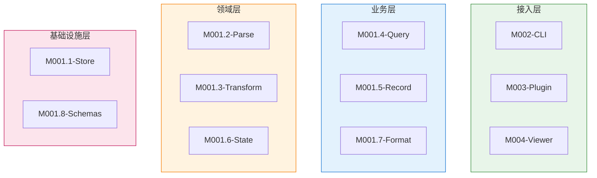
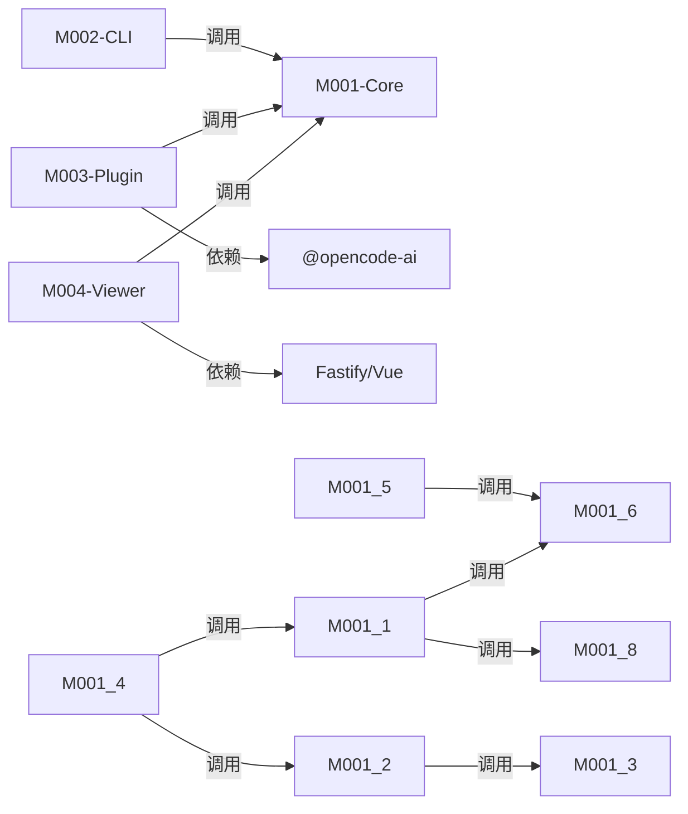

# 模块总览

## 模块划分说明

本项目采用 **技术层次 + 功能职责** 的混合划分策略。顶层按技术层次分为四个独立 Package（CLI、Plugin、Viewer、Core），其中 Core Package 内部按功能职责细分八个子模块。这种划分映射到架构文档的四层结构：接入层（CLI/Plugin/Viewer）、业务层（Query/Format/Record）、领域层（Parse/Transform/State）、基础设施层（Store/Schemas/Logger）。

---

## 模块层次树

```text
opencode-trace
├── M001-Core          # 核心功能包：解析、存储、查询、格式化
│   ├── M001.1-Store   # 数据持久化（文件读写、SQLite 状态）
│   ├── M001.2-Parse   # AI Provider 解析器（OpenAI/Anthropic）
│   ├── M001.3-Transform # SSE 流转换（Stream → Messages）
│   ├── M001.4-Query   # 查询构建（Timeline、Metadata、Diff）
│   ├── M001.5-Record  # 录制控制（全局/会话开关）
│   ├── M001.6-State   # 状态管理（StateManager 类）
│   ├── M001.7-Format  # 格式化导出（XML、Collapse）
│   └── M001.8-Schemas # Zod Schema 定义
├── M002-CLI           # 命令行工具包（enable/disable/list/show/export/viewer）
├── M003-Plugin        # OpenCode 插件包（fetch 拦截、hooks、tools）
└── M004-Viewer        # Web 查看器包（Fastify 服务器 + Vue 前端）
    ├── M004.1-Server  # HTTP API 服务
    ├── M004.2-Frontend # Vue Web UI
```

---

## 模块清单

| ID | 名称 | 职责 | 路径 | 所属层 | 文档链接 |
|----|------|------|------|--------|----------|
| M001 | Core | 核心功能包，提供所有数据处理能力 | `packages/core/src/` | 基础设施层 + 领域层 + 业务层 | — |
| M001.1 | Store | 数据持久化，管理 session 文件和 SQLite 状态 | `packages/core/src/store/` | 基础设施层 | — |
| M001.2 | Parse | AI Provider 解析，提取对话结构和 usage | `packages/core/src/parse/` | 领域层 | — |
| M001.3 | Transform | SSE 流数据转换为消息格式 | `packages/core/src/transform/` | 领域层 | — |
| M001.4 | Query | 构建 timeline、metadata、diff 查询结果 | `packages/core/src/query/` | 业务层 | — |
| M001.5 | Record | 录制控制，管理全局和会话级别的 trace 开关 | `packages/core/src/record/` | 业务层 | — |
| M001.6 | State | StateManager 类，管理 session 状态和 SQLite | `packages/core/src/state/` | 领域层 | — |
| M001.7 | Format | XML 格式化和折叠导出 | `packages/core/src/format/` | 业务层 | — |
| M001.8 | Schemas | Zod Schema 定义和校验 | `packages/core/src/schemas/` | 基础设施层 | — |
| M002 | CLI | 命令行工具，提供用户管理接口 | `packages/cli/src/` | 接入层 | — |
| M003 | Plugin | OpenCode 插件，拦截 fetch 并提供 tools | `packages/plugin/src/` | 接入层 | — |
| M004 | Viewer | Web 查看器，提供 HTTP API 和 Vue UI | `packages/viewer/src/` | 接入层 | — |
| M004.1 | Server | Fastify HTTP API 服务 | `packages/viewer/src/server.ts` | 接入层 | — |
| M004.2 | Frontend | Vue 3 Web UI | `packages/viewer/src/frontend/` | 接入层 | — |

---

## 模块分层视图



---

## 模块依赖



### 依赖矩阵

| ↓ 调用 \ 被调用 → | M001 | M002 | M003 | M004 |
|--------------------|------|------|------|------|
| M001 | — | | | |
| M002 | ✓ | — | | |
| M003 | ✓ | | — | |
| M004 | ✓ | | | — |

### 外部依赖映射

| 模块 | 外部包/服务 | 版本 | 用途 | 风险 |
|------|-------------|------|------|------|
| M001.1 | sql.js | 1.14.1 | SQLite in-memory | 低（稳定） |
| M001.8 | zod | 4.4.3 | Schema 校验 | 低（稳定） |
| M001.1 | winston | 3.19.0 | 结构化日志 | 低（稳定） |
| M003 | @opencode-ai/plugin | 1.14.22 | Plugin API | 中（版本依赖） |
| M003 | @opencode-ai/sdk | 1.14.41 | Session 管理 | 中（版本依赖） |
| M004.1 | fastify | 5.8.5 | HTTP 服务 | 低（稳定） |
| M004.2 | vue | 3.5.13 | 前端框架 | 低（稳定） |
| M004.2 | vue-router | 4.5.0 | 路由 | 低（稳定） |
| M004.1 | vite | 6.0.0 | 前端构建 | 低（稳定） |
| M002 | adm-zip | 0.5.17 | ZIP 操作 | 低（稳定） |
| M002 | archiver | 7.0.0 | ZIP 打包 | 低（稳定） |

### 耦合热点分析

| 模块 | 被依赖次数 | 风险等级 | 说明 |
|------|-----------|----------|------|
| M001-Core | 3 | 高 | CLI、Plugin、Viewer 都依赖 Core，是核心热点 |
| M001.1-Store | 2 | 中 | Query 和 Viewer Server 都调用 Store |
| M001.2-Parse | 2 | 中 | Query 和 Viewer Server 都调用 Parse |
| M001.6-State | 2 | 中 | Store 和 Record 都调用 State |

---

## 通信模式

| 模式 | 使用场景 | 涉及模块 | 实现方式 | 关键文件 |
|------|----------|----------|----------|----------|
| 直接函数调用 | Core 内部模块通信 | M001.x | import + 函数调用 | `packages/core/src/index.ts:1-18` |
| HTTP API | Viewer 与浏览器通信 | M004 ↔ 浏览器 | REST JSON | `packages/viewer/src/server.ts:86-387` |
| Plugin Hooks | Plugin 与 OpenCode 通信 | M003 ↔ OpenCode | Hook callback | `packages/plugin/src/trace.ts:61-141` |
| 异步队列 | Plugin 写入数据 | M003 → M001.1 | AsyncWriteQueue | `packages/plugin/src/write-queue.ts` |
| 文件系统 | Store 持久化数据 | M001.1 ↔ FS | Node.js fs API | `packages/core/src/store/index.ts` |
| SQLite | State 状态管理 | M001.6 ↔ DB | sql.js | `packages/core/src/state/index.ts:64-96` |

---

## 模块功能详述

### M001-Core 核心包

**职责**：提供所有数据处理能力，包括解析 AI Provider 数据、存储 trace 记录、构建查询结果、格式化输出。

**导出结构** (`packages/core/src/index.ts`)：
- `store` — 数据持久化
- `parse` — AI Provider 解析
- `transform` — SSE 流转换
- `query` — 查询构建
- `record` — 录制控制
- `state` — 状态管理
- `format` — 格式化导出
- `schemas` — Zod Schema
- `logger` — 结构化日志

**核心类型**：
- `TraceRecord` — 单次请求/响应记录
- `Conversation` — 解析后的对话结构
- `SessionTimeline` — 会话时间线

### M002-CLI 命令行工具

**职责**：提供用户命令行接口，管理 trace 会话。

**命令列表** (`packages/cli/src/index.ts:11-51`)：
| 命令 | 功能 | Handler 文件 |
|------|------|-------------|
| enable | 启用 trace | `handlers/enable.ts` |
| disable | 禁用 trace | `handlers/disable.ts` |
| status | 查看状态 | `handlers/status.ts` |
| list | 列出会话 | `handlers/list.ts` |
| show | 显示详情 | `handlers/show.ts` |
| export | 导出数据 | `handlers/export.ts` |
| sync | 同步状态 | `handlers/sync.ts` |
| viewer | 启动查看器 | `handlers/viewer.ts` |

### M003-Plugin OpenCode 插件

**职责**：拦截 OpenCode 的 fetch 请求，记录 AI API 交互，提供 trace control tools。

**核心类** (`packages/plugin/src/plugin-instance.ts`)：
- `TracePlugin` — 插件实例，管理拦截器和状态

**Hooks** (`packages/plugin/src/trace.ts:61-141`)：
| Hook | 用途 |
|------|------|
| `event` | 监听 session.created/updated |
| `tool.execute.after` | 监听 task 工具执行（子会话关联） |

**Tools**：
| Tool | 功能 |
|------|------|
| `trace_enable` | 启用当前会话 trace |
| `trace_disable` | 禁用当前会话 trace |
| `trace_status` | 查看当前 trace 状态 |

### M004-Viewer Web 查看器

**职责**：提供 HTTP API 和 Vue Web UI，供用户浏览和分析 trace 数据。

**API 端点** (`packages/viewer/src/server.ts`)：
| 端点 | 功能 |
|------|------|
| `GET /api/sessions` | 列出所有会话 |
| `GET /api/sessions/tree` | 树形会话结构 |
| `GET /api/sessions/:id/timeline` | 会话时间线 |
| `GET /api/sessions/:id/metadata` | 会话元数据 |
| `GET /api/sessions/:id/records/:seq` | 单条记录 |
| `GET /api/sessions/:id/records/:seq/parsed` | 解析后的记录 |
| `GET /api/sessions/:id/records/:seq/sse` | SSE 流数据 |
| `POST /api/sessions/:id/export` | 导出 ZIP |
| `POST /api/sessions/import` | 导入 ZIP |
| `POST /api/sessions/:id/delete` | 删除会话 |
| `GET /api/trace/status` | 全局 trace 状态 |
| `GET /api/trace/enable` | 启用全局 trace |
| `GET /api/trace/disable` | 禁用全局 trace |