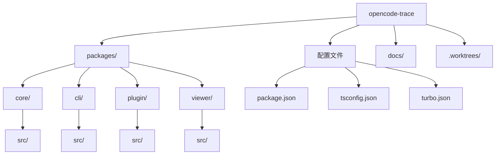
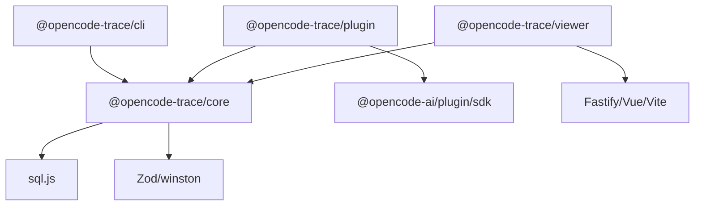

# 概览

## 快速摘要

**opencode-trace** 是一个用于追踪和分析 OpenCode AI 交互的工具套件。它通过拦截 HTTP 请求记录 AI API（OpenAI、Anthropic）的完整交互过程，提供 CLI 管理、Web 查看器和 OpenCode 插件三种使用方式，帮助开发者分析 AI 对话历史、token 使用量和延迟统计等关键数据。

---

## 核心技术栈

| 类别 | 名称 | 版本 | 用途 |
|------|------|------|------|
| 语言 | TypeScript | 5.3.0 | 主要开发语言 |
| 构建工具 | turbo | 2.0.0 | Monorepo 任务编排 |
| 编译器 | tsc (composite) | 5.3.0 | TypeScript 项目引用构建 |
| 测试框架 | vitest | 4.1.5 | 单元测试 |
| Web 服务器 | Fastify | 5.8.5 | Viewer HTTP 服务 |
| 前端框架 | Vue 3 | 3.5.13 | Viewer 前端 UI |
| 前端构建 | Vite | 6.0.0 | 前端打包 |
| 数据库 | sql.js | 1.14.1 | SQLite in-memory 存储 |
| 日志 | winston | 3.19.0 | 结构化日志 |
| Schema 验证 | Zod | 4.4.3 | 数据校验 |
| OpenCode SDK | @opencode-ai/plugin | 1.14.22 | OpenCode 插件 API |
| OpenCode SDK | @opencode-ai/sdk | 1.14.41 | OpenCode 会话管理 |

---

## 目录结构



| 目录 | 用途 | 关键文件 |
|------|------|----------|
| `packages/core/` | 核心功能模块（解析、存储、查询、格式化） | `src/index.ts`, `src/store/index.ts`, `src/parse/index.ts` |
| `packages/cli/` | CLI 命令行工具 | `src/index.ts`, `src/handlers/*.ts` |
| `packages/plugin/` | OpenCode 插件（拦截 fetch） | `src/trace.ts`, `src/plugin-instance.ts` |
| `packages/viewer/` | Web 查看器（Fastify + Vue） | `src/server.ts`, `src/frontend/` |
| `docs/` | 文档目录 | `superpowers/` |
| `.worktrees/` | Git worktree 开发分支 | 多个并行开发分支 |

---

## 快速开始

### 前置条件

- Node.js >= 18.0.0
- npm >= 10.0.0

### 安装

```bash
git clone https://github.com/user/opencode-trace.git
cd opencode-trace
npm install
```

### 运行

```bash
# 构建所有包
npm run build

# 运行 CLI
npm run cli -- list

# 运行 Web Viewer
npm run viewer

# 开发模式（watch + serve）
npm run dev
```

### 测试

```bash
# 运行所有测试
npm run test

# 单包测试
cd packages/core && npm run test
```

---

## 环境变量

| 变量名 | 用途 | 默认值 | 必需 | 来源文件 |
|--------|------|--------|------|----------|
| — | 本项目不使用环境变量，配置通过命令行参数或 `~/.opencode-trace/` 目录管理 | — | — | — |

---

## 部署

| 部署方式 | 配置文件 | 说明 |
|----------|----------|------|
| 本地 CLI | `packages/cli/package.json` (bin) | 作为 npm bin 安装使用 |
| OpenCode 插件 | `packages/plugin/dist/trace.js` | 作为 OpenCode plugin 加载 |
| Web Viewer | `packages/viewer/src/server.ts` | Fastify 服务，默认端口 3210 |

---

## 包依赖关系



| 包 | 依赖 | 被依赖 |
|------|------|--------|
| `@opencode-trace/core` | sql.js, zod, winston | cli, plugin, viewer |
| `@opencode-trace/cli` | core, adm-zip, archiver, marked | — |
| `@opencode-trace/plugin` | core, @opencode-ai/plugin, @opencode-ai/sdk | — |
| `@opencode-trace/viewer` | core, fastify, vue, vue-router | — |