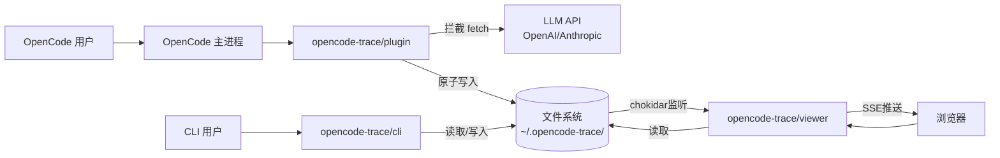
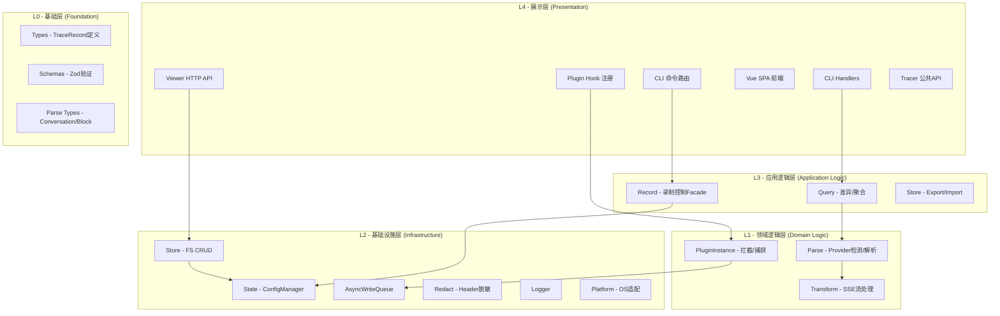
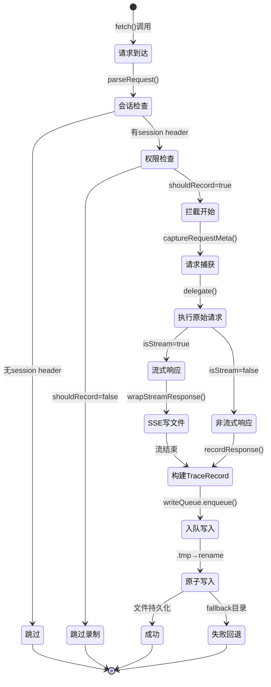
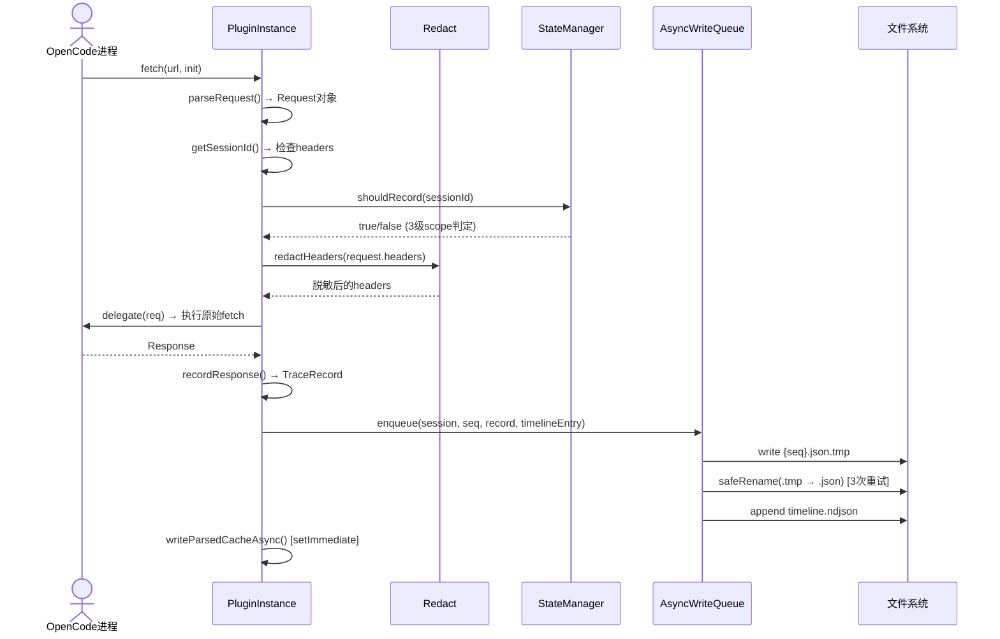
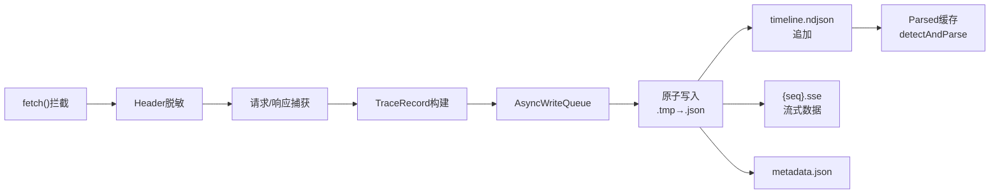

# 系统架构

## 1. 系统边界

### 1.1 系统边界图

### 1.2 外部参与者与外部系统

|类型|名称|用途|集成方式|关键文件|
|-|-|-|-|-|
|外部系统|OpenCode Plugin SDK|插件生命周期管理、Hook 注册、Tool 定义|`@opencode-ai/plugin` 接口实现|`plugin/src/trace.ts`|
|外部系统|OpenCode SDK Types|Session/Event/Part 类型引用|类型导入（仅 TypeScript）|`plugin/src/trace.ts`|
|外部系统|LLM APIs (OpenAI/Anthropic)|追踪的对象（不是直接调用方）|通过 `globalThis.fetch` 拦截间接接触|`plugin/src/plugin-instance.ts:243-466`|
|外部用户|OpenCode 用户|通过 `/trace` 命令控制录制|Slash command Hook|`plugin/src/trace.ts:175-312`|
|外部用户|AI Agent|通过 `trace_on/off/status` 工具控制|OpenCode Tool 注册|`plugin/src/trace.ts:316-355`|
|外部用户|浏览器用户|通过 Web Viewer 查看/导出/删除会话|HTTP REST + SSE|`viewer/src/server.ts`|
|外部用户|CLI 用户|通过命令行查看/导出/同步/控制|`process.argv`|`cli/src/index.ts`|
|基础设施|文件系统|唯一的持久化存储|`fs.writeFileSync/readFileSync` + 异步写入队列|`core/src/store/`, `plugin/src/write-queue.ts`|
|基础设施|Winston Logger|结构化日志|日志库导入|`core/src/logger.ts`|
|基础设施|Fastify|HTTP 服务框架|插件注册|`viewer/src/server.ts`|
|基础设施|chokidar|文件变更监听|事件监听 → SSE 推送|`viewer/src/server.ts:759-842`|

---

## 2. 系统分层

|层次|职责|关键组件|禁止事项|
|-|-|-|-|
|L0 基础层|纯数据类型定义和验证 Schema|types.ts, schemas/, parse/types.ts|不得包含任何业务逻辑或 I/O 操作|
|L1 领域逻辑层|数据解析、流处理、请求拦截|parse/, transform/, plugin-instance.ts|不得直接操作文件系统（通过 L2 代理）|
|L2 基础设施层|文件系统 CRUD、配置管理、原子写入、日志|store/, state/, write-queue.ts, logger.ts|不得包含领域逻辑（差异计算等）|
|L3 应用逻辑层|聚合查询、录制控制、导出/导入编排|query/, record/control.ts, store export/import|不得包含 HTTP/CLI 呈现逻辑|
|L4 展示层|HTTP API、CLI 命令、Vue 前端、Plugin Hook|server.ts, cli/index.ts, frontend/, trace.ts|不得直接操作文件系统（通过 L2/L3）|

**注意**: `store` 模块横跨 L2（FS CRUD）和 L3（Export/Import 编排），是已识别的职责越界问题。理想情况下 Export/Import 应独立为 L3 模块。

---

## 3. 跨切面关注点

|关注点|实现方式|关键文件|说明|
|-|-|-|-|
|错误处理|混合模式：catch-log-return-null（core）、catch-throw（plugin fetch）、catch-fallback（write-queue）|plugin-instance.ts, write-queue.ts, store/index.ts|无自定义 Error 类型层级；`TraceError` 是数据类型不是异常类型|
|日志|Winston 单实例，3 种模式（file/console/off），文件轮转 5MB×2|logger.ts|Plugin 拦截决策不记录到日志，调试"为什么没录制"很困难|
|数据验证|Zod `safeParse()` 读取时验证，写入时无验证|schemas/, store/index.ts|写入路径（plugin → write-queue）直接写 JSON 不经过 Schema 验证|
|安全/脱敏|Header 脱敏（11 个敏感字段），栈跟踪路径替换，CORS localhost-only|redact.ts, plugin-instance.ts, server.ts|**请求/响应 Body 未脱敏**；API key 可能出现在 payload 中|
|原子写入|`.tmp` + `safeRename()`（3次重试+指数退避）用于 record 写入；`renameSync` 用于 config 写入|write-queue.ts, state/index.ts|**state/index.ts 的 ConfigManager 用 sync renameSync**，在 Windows 上有风险|
|缓存一致性|3 个独立的 ConfigManager 缓存 Map（store, record, plugin）|store/index.ts, record/control.ts, plugin-instance.ts|**无缓存失效协议**；一个写入后其他缓存可能过时|
|配置管理|3 级 Scope（global → local → session），2 级 Storage（global/local）|state/index.ts, record/control.ts, plugin-instance.ts|Enable 最大 scope 生效；Storage 最小 scope 生效|
|缓存版本化|`PARSED_CACHE_VERSION = "1"`，`.parsed` 文件带 `_pcv` 标记|parse/index.ts, store/index.ts|格式变更时需手动递增；遗忘会导致 Viewer 展示过时数据|

---

## 4. 核心业务流程

### 4.1 入口点分析

|入口类型|入口文件|触发方式|说明|
|-|-|-|-|
|OpenCode 插件启动|`plugin/src/trace.ts` → `plugin()`|OpenCode 加载 `.opencode/opencode.json`|初始化 TracePlugin，安装 fetch 拦截器，注册 Hook 和 Tool|
|CLI 命令|`cli/src/index.ts`|`opencode-trace <command>`|手动 arg 解析，路由到 8 个 handler|
|Viewer 启动|`viewer/src/cli.ts`|`opencode-trace-viewer [options]`|解析 --port/--trace-dir/--no-open，创建 Fastify 服务|
|fetch 拦截|`plugin/src/plugin-instance.ts:tracedFetch()`|任何 OpenCode 进程中的 `fetch()` 调用|自动拦截所有 HTTP 请求，过滤出有 session header 的 LLM 调用|
|SSE 推送|`viewer/src/server.ts:/api/events`|浏览器连接 SSE endpoint|15s 心跳 + 文件变更推送|
|文件监听|`viewer/src/server.ts:chokidar.watch()`|文件系统变更事件|add/change/unlink → SSE broadcast|

### 4.2 状态管理策略

|状态类型|管理方式|存储位置|作用域|关键文件|
|-|-|-|-|-|
|全局配置|ConfigManager 单例+缓存|`~/.opencode-trace/config.json`|跨所有项目|state/index.ts|
|项目配置|ConfigManager 单例+缓存|`<project>/.opencode-trace/config.json`|仅当前项目|state/index.ts|
|会话元数据|独立 JSON 文件|`<traceDir>/<sessionId>/metadata.json`|仅当前会话|state/index.ts|
|录制序列号|Map<string, number>|内存中（TracePlugin.ids）|仅当前会话|plugin-instance.ts:274|
|写入队列|内部数组 + 异步批处理|内存中（AsyncWriteQueue.queue）|全局（一次写入队列）|write-queue.ts|
|Viewer SSE|Set<SSEClient>|内存中|服务进程生命周期|server.ts|
|Config 缓存|ConfigManager.configCache|内存中|ConfigManager 实例生命周期|state/index.ts|

**数据流向**：单向（文件系统 → Viewer → 浏览器）；双向（Plugin → 文件系统 ← CLI）

### 4.3 核心流程

#### 流程 1：Trace 录制流程（Fetch 拦截 → 文件写入）

**触发条件**：OpenCode 进程中任何 `fetch()` 调用携带 session header 且 `shouldRecord()` 返回 true
**涉及模块**：M17 (PluginInstance), M19 (WriteQueue), M2 (Parse), M20 (Redact), M8 (State)
**关键文件**：plugin-instance.ts:128-466, write-queue.ts:43-218, redact.ts:23-45

**状态流转**

**跨模块序列图**

#### 流程 2：Trace 查看/查询流程（Viewer → 文件读取 → SSE推送）

**触发条件**：浏览器请求 Viewer API 或 chokidar 检测到文件变更
**涉及模块**：M21 (ViewerServer), M4 (Store), M2 (Parse), M5 (Query)
**关键文件**：server.ts:182-425, store/index.ts:157-773

**关键决策点**：
1. **ndjson 存在性**：决定快路径（缓存）vs 慢路径（全量解析）
2. **Parsed cache 版本**：`_pcv` 检查决定是否需要重新解析
3. **Session dir 位置**：global vs local 目录查找

#### 流程 3：Parse 解析流程（原始数据 → Conversation 格式）

**触发条件**：`detectAndParse(record)` 被调用（录制缓存写入、查看器查询、CLI 展示）
**涉及模块**：M2 (Parse), M3 (Transform), M9 (Schemas)
**关键文件**：parse/detect.ts:65-98, transform/index.ts

**关键决策点**：
1. **Provider 匹配**：URL pattern 匹配选择解析器（openai-chat/openai-responses/anthropic）
2. **流式判定**：`stream=true` + `isSSEBody()` → SSE 解析器路径
3. **无匹配**：`fallbackParse()` 通用提取

#### 流程 4：状态/配置管理流程

**触发条件**：`/trace on/off/status` 命令、`trace_on/off/status` 工具、Viewer API
**涉及模块**：M16 (TraceEntry), M8 (State), M7 (Record)
**关键文件**：trace.ts:175-355, state/index.ts:73-489

**Scope 规则**：
- Enable：最大 scope 生效（global > local > session）
- Storage：最小 scope 生效（session > global config）

#### 流程 5：导出/导入流程

**触发条件**：CLI `export` 命令或 Viewer `/api/sessions/:id/export`
**涉及模块**：M13 (Handlers), M4 (Store), M2 (Parse), M5 (Query), M6 (Format)
**关键文件**：handlers/export.ts, store/index.ts:478-683

### 4.4 端到端数据流

|数据流|输入|输出|经过模块|变换说明|
|-|-|-|-|-|
|录制写入|fetch Request+Response|`{seq}.json` + `timeline.ndjson` + `{seq}.parsed`|M17→M19→M4→M2|Request→redact→TraceRecord→atomic write→detectAndParse→cache|
|查看读取|Session ID|SessionTimeline + SessionMetadata|M21→M4→M2→M5|FS→ndjson/parsed cache/detectAndParse→buildSessionTimeline|
|导出|Session ID + type|ZIP/JSON/XML 文件|M13→M4→M2→M5→M6|FS→records→detectAndParse→buildTimeline→collapse→XML/ZIP|
|导入|ZIP 文件|Session 目录|M4→archiver/adm-zip|ZIP→temp→manifest validation→conflict resolution→copy→cleanup|
|状态控制|Scope flags + direction|config.json/metadata.json 更新|M16→M8|M7|flags→scope resolution→ConfigManager.set→atomic write|

---

## 5. 扩展性与集成能力

### 5.1 插件/扩展机制

|扩展点|类型|位置|说明|
|-|-|-|-|
|Parser 注册|Plugin|`parse/registry.ts` + `registerParser()`|新 Provider 可通过创建 parser 模块 + 调用 registerParser() 添加|
|OpenCode Hook|Hook|`plugin/src/trace.ts:80-355`|注册 7 个 Hook（event, tool.execute.after, chat.message, 等）|
|OpenCode Tool|Tool|`plugin/src/trace.ts:316-355`|注册 3 个 Agent Tool（trace_on, trace_off, trace_status）|
|Tracer 公共 API|Facade|`plugin/src/tracer.ts`|第三方 OpenCode 插件集成（wrap, getInterceptor, installInterceptor）|
|Viewer SSE|Event|`viewer/src/server.ts:598-617`|前端通过 `/api/events` 接收实时更新|
|Config scope|Config|3 级 Scope + 2 级 Storage|通过 config.json 和 metadata.json 扩展控制粒度|

### 5.2 对外 API 边界

|协议|端点/定义文件|文档化程度|说明|
|-|-|-|-|
|REST HTTP|`viewer/src/server.ts` 15+ endpoints|无|无 OpenAPI/Swagger 规范，仅有内联代码|
|SSE|`/api/events`|无|15s 心跳 + 5 种事件类型|
|CLI|`cli/src/index.ts` 10 个命令|部分|AGENTS.md 有简要说明，无 per-command --help|
|OpenCode Plugin|`plugin/src/trace.ts` PluginModule|部分|OpenCode SDK 文档覆盖|
|Tracer API|`plugin/src/tracer.ts` createTracer()|无|第三方集成入口，无独立文档|
|Core Export|`@opencode-trace/core` + `/state`|部分|package.json exports 定义，无 API 文档|

---

## 6. 架构风险与技术债务

### 6.1 系统级风险

|风险|影响范围|概率|严重度|优先级|建议措施|
|-|-|-|-|-|-|
|ConfigManager 缓存不一致|3 个独立缓存 Map（store/record/plugin）|高|高|P1|引入统一缓存管理器或事件驱动的失效通知|
|Windows renameSync 不安全|state/index.ts ConfigManager.writeConfig()|中|高|P2|改用 safeRename() 或 AsyncWriteQueue 统一写入|
|Viewer API 无认证|所有 REST+SSE endpoints|低（本地工具）|中|P3|添加 optional auth middleware 或至少 API key|
|请求 Body 未脱敏|所有录制数据|中|高|P2|实现 body-level redaction（至少对 known API key patterns）|

### 6.2 技术债务

|区域|债务类型|原因|严重度|偿还建议|
|-|-|-|-|-|
|store 模块过重（792行,6职责）|设计债|随功能增长逐步累积|严重|拆分为 store-read + store-write + export|
|parse↔transform 双向依赖|设计债|SSE解析需要 parse types，detect需要 SSE parsers|中等|提取共享 model 模块打破循环|
|CLI 手动 arg 解析|代码债|项目初期未引入 commander/yargs|轻微|引入 CLI 框架或至少提取公共 flag parser|
|`__TRACE_HANDLED__` magic string|代码债|用 Error throw 作为控制流信号|中等|使用 OpenCode SDK 提供的正式完成机制|
|无 API 文档|文档债|Viewer 15+ endpoints 无 OpenAPI spec|中等|生成 OpenAPI spec 或至少写 route-level docs|
|metadata.json 非原子写入|代码债|writeMetadataFile 直接 writeFileSync|轻微|改用 .tmp + safeRename 模式|
|`getSessionEnabled` 默认 true|代码债|与 AGENTS.md 文档（默认 null→OFF）矛盾|中等|修正默认值为 null→false|

### 6.3 扩展性瓶颈

|瓶颈点|当前限制|触发条件|突破方案|
|-|-|-|-|
|文件系统目录扫描|无索引时必须 readdir+stat 每个 session|数百个 sessions|timeline.ndjson 累积索引已部分解决|
|单进程写入队列|AsyncWriteQueue batchSize=10，单次处理|高频 LLM 调用（>100 req/s）|增大 batchSize 或多队列分片|
|Provider URL 匹配|硬编码 `includes("openai.com")`等|使用代理 URL 或自定义 endpoint|支持 URL pattern 注册或 config-based provider map|
|Parsed cache 全量刷新|格式变更需删除所有 .parsed 文件|PARSED_CACHE_VERSION 递增后|支持增量 cache 更新或 lazy re-parse|