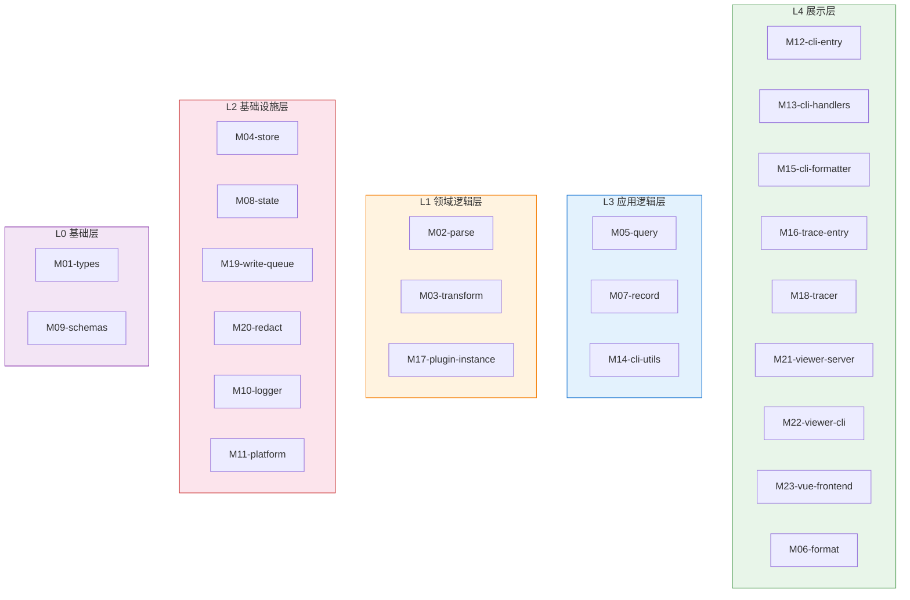
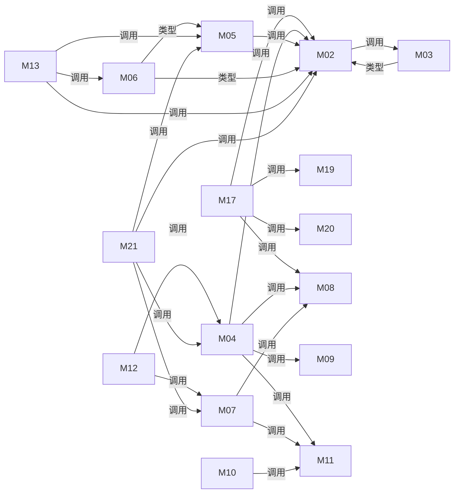

# 模块总览

## 模块划分说明

本项目按**功能领域和数据流管道阶段**划分模块，遵循 "数据从捕获到呈现的完整生命周期" 组织原则：

1. **数据捕获** → Plugin 拦截 fetch，提取请求/响应元数据
2. **数据持久化** → AsyncWriteQueue 原子写入文件系统，ConfigManager 管理配置
3. **数据解析** → Parse/Transform 将原始 TraceRecord 转换为 Conversation 模型
4. **数据查询** → Query 计算差异、聚合时间线和元数据
5. **数据格式化** → Format 序列化为 XML/collapsed 输出
6. **数据呈现** → Viewer HTTP+SSE、CLI 命令、Vue SPA

**Scope 分离**：Core（领域独立）← CLI（人类交互）← Plugin（运行时拦截）← Viewer（Web UI）

**隐藏设计决策**：`record/control.ts` 是 `state/ConfigManager` 的**薄Facade**，提供扁平函数签名（`traceDir?` optional），避免消费者直接管理 ConfigManager 生命周期。

---

## 模块层次树

```text
opencode-trace
├── M01-types              # TraceRecord/Request/Response/Error 原始数据类型定义
├── M02-parse              # Provider 检测、请求/响应解析、latency 提取
│   ├── M02.1-detect       # detectAndParse() 主编排器
│   ├── M02.2-registry     # Parser 注册表（registerParser/getParsers）
│   ├── M02.3-openai-chat  # OpenAI Chat Completions 解析器
│   ├── M02.4-openai-resp  # OpenAI Responses API 解析器
│   ├── M02.5-anthropic    # Anthropic Messages API 解析器
│   ├── M02.6-types        # Conversation/Entry/Block 领域模型类型
│   └── M02.7-utils        # createMsgEntry/createTextBlock 等工厂函数
├── M03-transform          # SSE 流解析与转换（OpenAI/Anthropic streaming）
│   ├── M03.1-sse-parser   # parseSSE() 通用 SSE 事件解析
│   ├── M03.2-openai-chat  # sseOpenaiChatParse()
│   ├── M03.3-openai-resp  # sseOpenaiResponsesParse()
│   └── M03.4-anthropic    # sseAnthropicParse()
├── M04-store              # 文件系统 CRUD（6职责：list/read/write/cache/export/import）
├── M05-query              # Diff 计算、SessionTimeline/Metadata 聚合
├── M06-format             # XML 渲染、collapse/explode、block 文件分割
├── M07-record             # 录制生命周期控制（start/stop/enable/disable facade）
├── M08-state              # ConfigManager（全局/本地/会话配置持久化+scope解析）
├── M09-schemas            # Zod 验证 schema（TraceRecord/Conversation/Block/Delta/Meta）
├── M10-logger             # Winston 日志（file/console/off 三模式）
├── M11-platform           # OS 适配（traceDir 路径、sanitizePath）
├── M12-cli-entry          # CLI 命令路由（10 个子命令）
├── M13-cli-handlers       # 8 个命令实现（enable/disable/status/list/show/export/sync/viewer）
├── M14-cli-utils          # Flag 解析、range 解析、session 查找
├── M15-cli-formatter      # 输出格式化、collapsed export 写入
├── M16-trace-entry        # OpenCode Plugin 注册（7 Hook + 3 Tool）
├── M17-plugin-instance    # fetch 拦截、请求/响应捕获、stream wrapping、scope 解析
├── M18-tracer             # 第三方公共 API facade（wrap/getInterceptor/installInterceptor）
├── M19-write-queue        # AsyncWriteQueue（batched atomic write、ndjson append、parsed cache）
├── M20-redact             # Header 脱敏（11 个敏感字段）
├── M21-viewer-server      # Fastify HTTP（REST + SSE + chokidar + SPA fallback）
├── M22-viewer-cli         # Viewer CLI 入口（port/no-open/trace-dir）
└── M23-vue-frontend       # Vue 3 SPA（sessions/timeline/conversation/changes/metadata views）
```

---

## 模块清单

|ID|名称|职责|路径|所属层|文档链接|
|-|-|-|-|-|-|
|M01|types|TraceRecord 原始数据类型定义|`core/src/types.ts`|L0 基础层|[Details](modules/M01-types.md)|
|M02|parse|Provider 检测与请求/响应解析→Conversation|`core/src/parse/`|L1 领域逻辑层|[Details](modules/M02-parse.md)|
|M03|transform|SSE 流解析与 Entry/Block 转换|`core/src/transform/`|L1 领域逻辑层|[Details](modules/M03-transform.md)|
|M04|store|文件系统 CRUD（6职责混合）|`core/src/store/`|L2+L3 混合层|[Details](modules/M04-store.md)|
|M05|query|Diff 计算与时间线/元数据聚合|`core/src/query/`|L3 应用逻辑层|[Details](modules/M05-query.md)|
|M06|format|XML 渲染与 collapse/explode 输出|`core/src/format/`|L4 展示层|[Details](modules/M06-format.md)|
|M07|record|录制控制 facade（start/stop/enable/disable）|`core/src/record/`|L3 应用逻辑层|[Details](modules/M07-record.md)|
|M08|state|ConfigManager 配置/会话持久化+scope解析|`core/src/state/`|L2 基础设施层|[Details](modules/M08-state.md)|
|M09|schemas|Zod 验证 schema 全集|`core/src/schemas/`|L0 基础层|[Details](modules/M09-schemas.md)|
|M10|logger|Winston 结构化日志|`core/src/logger.ts`|L2 基础设施层|[Details](modules/M10-logger.md)|
|M11|platform|OS 路径适配与 sanitize|`core/src/platform.ts`|L2 基础设施层|[Details](modules/M11-platform.md)|
|M12|cli-entry|CLI 命令路由|`cli/src/index.ts`|L4 展示层|[Details](modules/M12-cli-entry.md)|
|M13|cli-handlers|8 个命令实现|`cli/src/handlers/`|L3 应用逻辑层|[Details](modules/M13-cli-handlers.md)|
|M14|cli-utils|Flag/range/session 解析工具|`cli/src/utils.ts`|L3 应用逻辑层|[Details](modules/M14-cli-utils.md)|
|M15|cli-formatter|输出格式化与 export 写入|`cli/src/formatter.ts`|L4 展示层|[Details](modules/M15-cli-formatter.md)|
|M16|trace-entry|OpenCode Plugin Hook+Tool 注册|`plugin/src/trace.ts`|L4 展示层|[Details](modules/M16-trace-entry.md)|
|M17|plugin-instance|fetch 拦截引擎核心|`plugin/src/plugin-instance.ts`|L1 领域逻辑层|[Details](modules/M17-plugin-instance.md)|
|M18|tracer|第三方公共 API facade|`plugin/src/tracer.ts`|L4 展示层|[Details](modules/M18-tracer.md)|
|M19|write-queue|异步批量原子写入队列|`plugin/src/write-queue.ts`|L2 基础设施层|[Details](modules/M19-write-queue.md)|
|M20|redact|Header 脱敏|`plugin/src/redact.ts`|L2 基础设施层|[Details](modules/M20-redact.md)|
|M21|viewer-server|Fastify HTTP 服务+SSE+chokidar|`viewer/src/server.ts`|L2 基础设施层|[Details](modules/M21-viewer-server.md)|
|M22|viewer-cli|Viewer CLI 入口|`viewer/src/cli.ts`|L4 展示层|[Details](modules/M22-viewer-cli.md)|
|M23|vue-frontend|Vue 3 SPA 前端|`viewer/src/frontend/`|L4 展示层|[Details](modules/M23-vue-frontend.md)|

---

## 模块分层视图



---

## 模块依赖



### 依赖矩阵

|↓ 调用 \ 被调用 →|M01|M02|M03|M04|M05|M06|M07|M08|M09|M10|M11|M19|M20|
|-|-|-|-|-|-|-|-|-|-|-|-|-|-|
|M01 types|—|✓|✓|✓|✓|✓|✓|✓|✓|—|—|—|—|
|M02 parse|—|—|✓|—|—|—|—|—|—|✓|—|—|—|
|M03 transform|—|✓|—|—|—|—|—|—|—|✓|—|—|—|
|M04 store|✓|✓|—|—|—|—|—|✓|✓|✓|✓|—|—|
|M05 query|✓|✓|—|—|—|—|—|—|—|—|—|—|—|
|M06 format|—|✓|—|—|✓|—|—|—|—|—|—|—|—|
|M07 record|—|—|—|—|—|—|—|✓|—|✓|✓|—|—|
|M13 handlers|—|✓|—|✓|✓|✓|✓|—|—|—|—|—|—|
|M17 plugin-inst|—|✓|—|—|—|—|—|✓|—|✓|✓|✓|✓|
|M21 viewer-srv|✓|✓|—|✓|✓|—|✓|—|—|—|—|—|—|

### 外部依赖映射

|模块|外部包/服务|版本|用途|风险|
|-|-|-|-|-|
|M04 store|archiver|^7.0.1|ZIP 导出|低（稳定库）|
|M04 store|adm-zip|^0.5.16|ZIP 导入|低（稳定库）|
|M08 state|node:crypto|内置|randomUUID（session ID）|无|
|M09 schemas|zod|^4.4.3|运行时验证|中（v4 是大版本变更）|
|M10 logger|winston|^3.19.0|日志框架|低（成熟库）|
|M16 trace-entry|@opencode-ai/plugin|^1.14.22|Plugin SDK|高（外部依赖，版本绑定OpenCode）|
|M16 trace-entry|@opencode-ai/sdk|^1.14.41|类型引用|高（同上）|
|M21 viewer-server|fastify|^5.8.5|HTTP 服务|低|
|M21 viewer-server|@fastify/cors|^11.2.0|CORS|低|
|M21 viewer-server|@fastify/rate-limit|^10.3.0|限流|低|
|M21 viewer-server|@fastify/multipart|^10.0.0|文件上传|低|
|M21 viewer-server|@fastify/static|^8.1.0|SPA 静态|低|
|M21 viewer-server|chokidar|^3.6.0|文件监听|中（v3 是旧版，v4 已发布）|
|M23 vue-frontend|vue|^3.5.13|SPA 框架|低|
|M23 vue-frontend|vue-router|^4.5.0|路由|低|

### 耦合热点分析

|模块|被依赖次数|风险等级|说明|
|-|-|-|-|
|M01 types|~37|🔴 高|TraceRecord 是所有模块的基础类型；变更影响面大|
|M02 parse (types)|~35|🔴 高|Conversation/Entry/Block 是解析领域模型；parse↔transform 循环依赖|
|M08 state|3 internal + 2 external|🟡 中|ConfigManager 是配置唯一入口；store/record/plugin 各维护独立缓存|
|M04 store|4|🟡 中|被 CLI/Viewer 直接调用；792行6职责，重构首选目标|
|M10 logger|~10|🟢 低|日志基础设施，接口稳定|
|M11 platform|2 internal + 1 external|🟢 低|路径工具，接口极简|

---

## 通信模式

|模式|使用场景|涉及模块|实现方式|关键文件|
|-|-|-|-|-|
|直接函数调用|Core 内部模块通信|所有 Core 模块|import + 同步/异步函数调用|各模块 index.ts|
|文件系统共享状态|Plugin → Viewer 数据传递|M17→M4→M21|Plugin 写文件，Viewer 读同一目录|plugin-instance.ts, server.ts|
|SSE 推送|Viewer Server → 浏览器实时更新|M21→M23|`/api/events` SSE endpoint|server.ts:598-617|
|HTTP REST|浏览器 → Viewer Server|M23→M21|15+ API endpoints|server.ts|
|chokidar 事件|文件变更 → SSE|M21|FS watch → SSE broadcast|server.ts:759-842|
|fetch 拦截|Plugin → 全进程 HTTP|M17|globalThis.fetch monkey-patch|plugin-instance.ts:587-591|
|OpenCode Hook|OpenCode → Plugin 事件通知|M16|SDK Hook 注册|trace.ts:80-355|
|ConfigManager 缓存|配置读写|M04↔M07↔M17|Map<string, ConfigManager> 各自维护|store/index.ts, record/control.ts, plugin-instance.ts|