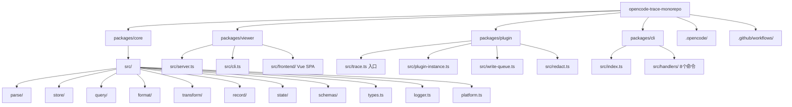

# 概览

opencode-trace 是一个为 OpenCode AI 编程助手设计的对话追踪与分析生态系统。它通过拦截 `globalThis.fetch` 捕获 LLM API 请求/响应，将完整的对话数据持久化到文件系统（无数据库），并提供 Web 查看器与 CLI 工具进行会话回溯、差异对比和数据导出。

**核心设计哲学**：文件系统是唯一的真实来源（Source of Truth），所有数据以 JSON 文件存储在 `~/.opencode-trace/`，通过原子写入（`.tmp` + `safeRename`）确保崩溃安全。

## 核心技术栈

|类别|名称|版本|用途|
|-|-|-|-|
|语言|TypeScript|5.3.0+|全栈开发语言，ES2022 target|
|运行时|Node.js|≥18.0.0（CI用24）|服务端运行环境|
|包格式|ESM|`"type": "module"`|所有包使用 ESNext 模块系统|
|构建工具|tsc -b (project references)|5.3.0+|增量构建，依赖顺序由 references 控制|
|构建编排|Turbo|2.0.0|Monorepo 构建流水线（dependsOn: ^build）|
|前端框架|Vue 3|3.5.13|Viewer SPA 前端|
|前端构建|Vite|6.0.0|Vue SPA 编译到 dist/public/|
|HTTP 服务|Fastify|5.8.5|Viewer REST + SSE 推送|
|文件监听|chokidar|3.6.0|实时文件变更 → SSE 推送|
|数据验证|Zod|4.4.3|TraceRecord/Conversation Schema 验证|
|日志|Winston|3.19.0|结构化日志，文件/控制台/关闭三种模式|
|压缩|archiver/adm-zip|7.0.1/0.5.16|ZIP 导出/导入|
|OpenCode SDK|@opencode-ai/plugin|1.14.22|Plugin 注册、Hook 系统和 Tool 定义|
|OpenCode SDK|@opencode-ai/sdk|1.14.41|类型引用（Event, Session, Part）|
|测试|Vitest|4.1.5|单元测试，jsdom env，Vue test-utils|
|路由|Vue Router|4.5.0|Viewer SPA 路由|
|HTTP 中间件|@fastify/cors|11.2.0|CORS 策略|
|HTTP 中间件|@fastify/rate-limit|10.3.0|1000 req/min，localhost 白名单|
|HTTP 中间件|@fastify/multipart|10.0.0|ZIP 导入文件上传|
|HTTP 中间件|@fastify/static|8.1.0|SPA 静态资源服务|

---

## 目录结构



|目录|用途|关键文件|
|-|-|-|
|`packages/core/src/`|核心业务逻辑（解析、存储、查询、格式化、状态）|types.ts, parse/, store/, state/, query/, format/|
|`packages/cli/src/`|CLI 命令行工具（8个子命令）|index.ts, handlers/*.ts|
|`packages/plugin/src/`|OpenCode 插件（fetch拦截、Hook注册、Tool定义）|trace.ts, plugin-instance.ts, write-queue.ts|
|`packages/viewer/src/`|Web 查看器（Fastify服务 + Vue SPA）|server.ts, cli.ts, frontend/|
|`.opencode/`|OpenCode 插件配置|opencode.json|
|`.github/workflows/`|CI/CD（test+lint, publish, release）|ci.yml, publish.yml, release.yml|

---

## 快速开始

### 前置条件

- Node.js ≥ 18.0.0（推荐 24.x，CI 使用 24）
- npm ≥ 10.0.0
- macOS / Linux / Windows（跨平台支持，Windows CI 有特殊处理）

### 安装

```bash
# 从源码构建（Monorepo）
npm ci              # 安装所有 workspace 依赖
npm run build       # turbo run build — 按依赖顺序构建 core → cli → plugin → viewer
```

### 运行

```bash
# 启动 Web 查看器（默认端口 3210）
npm run viewer      # node packages/viewer/dist/cli.js

# 或通过 CLI 启动
npm run cli viewer  # opencode-trace viewer

# 插件通过 OpenCode 自动加载（.opencode/opencode.json 配置）
# 无需手动启动
```

### 测试

```bash
# 运行所有测试（turbo 依赖 build，会先构建）
npm run test

# 仅类型检查
npx tsc --noEmit

# 清理构建产物（解决 stale tsbuildinfo 问题）
npm run clean       # rm -rf dist *.tsbuildinfo
```

---

## 环境变量

|变量名|用途|默认值|必需|来源文件|
|-|-|-|-|-|
|`OPENTRACE_LOG`|日志模式：`file`/`console`/`stderr`/`off`/`silent`/`none`|`file`|否|`packages/core/src/logger.ts`|
|`OPENTRACE_LOG_LEVEL`|Winston 日志级别|`info`|否|`packages/core/src/logger.ts`|
|`OPENTRACE_LOG_FILE`|自定义日志文件路径|`~/.opencode-trace/plugin.log`|否|`packages/core/src/logger.ts`|
|`OPENCODE_TRACE_REDACT`|设为 `false` 禁用 header 脱敏|隐式 `true`（默认脱敏）|否|`packages/plugin/src/redact.ts`|
|`FORCE_JAVASCRIPT_ACTIONS_TO_NODE24`|CI 中强制使用 Node 24|—|否（CI专用）|`.github/workflows/ci.yml`|
|`NPM_TOKEN`|npm 发布认证|—|否（CI专用）|`.github/workflows/publish.yml`|
|`GITHUB_TOKEN`|GitHub Release 认证|—|否（CI专用）|`.github/workflows/release.yml`|

---

## 部署

|部署方式|配置文件|说明|
|-|-|-|
|npm 发布（CI自动）|`.github/workflows/publish.yml`|推送 `v*` tag → 按依赖顺序发布：core → cli → plugin → viewer|
|GitHub Release（CI自动）|`.github/workflows/release.yml`|推送 `v*` tag → 创建 GitHub Release|
|CI 测试|`.github/workflows/ci.yml`|Matrix [ubuntu, windows] Node 24 → build + test；lint job 做 tsc --noEmit|
|本地开发|`turbo.json`, `package.json`|`npm run dev` = concurrently "tsc -b --watch" + "nodemon viewer"|
|OpenCode 插件|`.opencode/opencode.json`|声明 `"plugin": ["@opencode-trace/plugin"]`，OpenCode 自动加载|