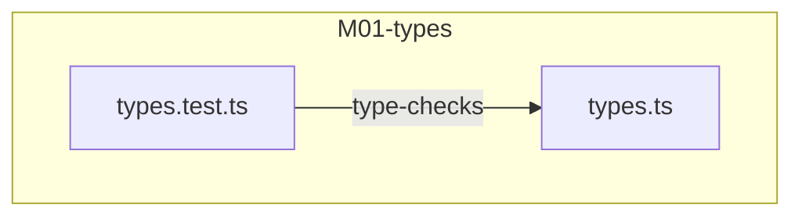
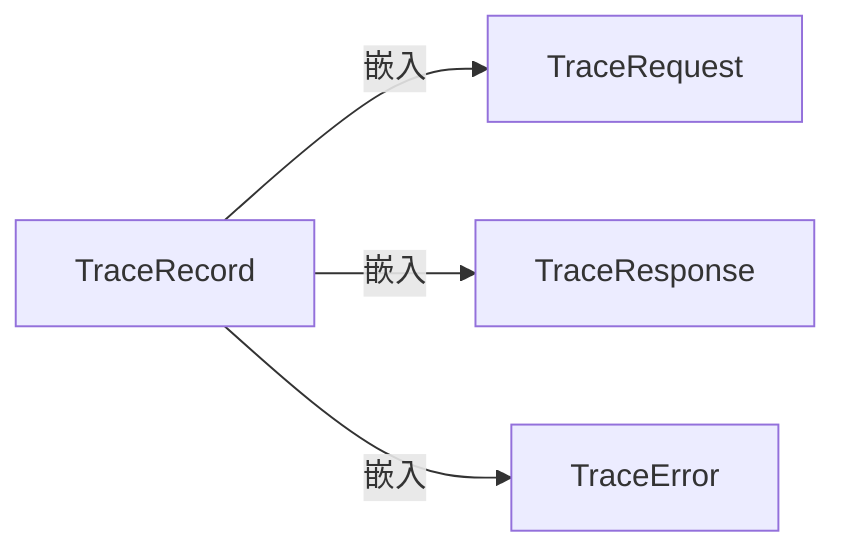
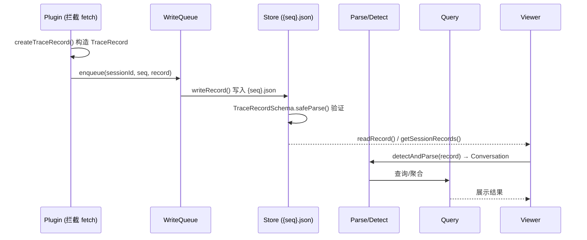
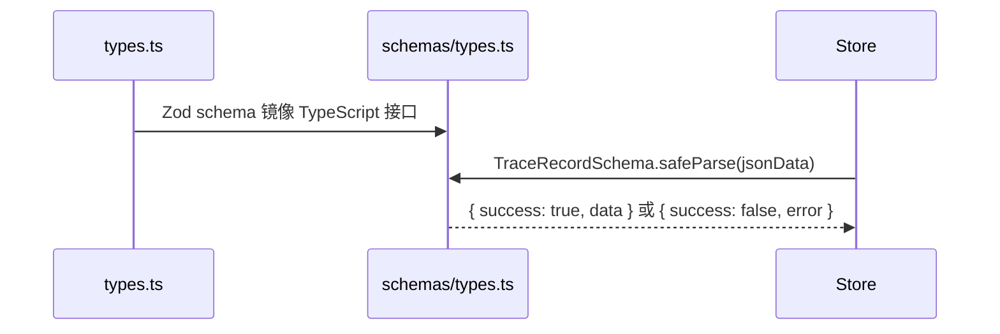

# M01-types

## 概述

M01-types 定义了 OpenCode Trace 系统的核心数据模型——`TraceRecord` 及其组成部分（`TraceRequest`、`TraceResponse`、`TraceError`）。这些接口是整个追踪系统的"原子观测单元"，构成文件系统中 `{seq}.json` 文件的 JSON Schema 基础。若此模块被移除，系统将失去对 HTTP 请求/响应/错误的类型描述能力，所有依赖 TraceRecord 的存储、解析、查询、格式化模块都将无法编译或运行。

---

## 元数据

|字段|值|
|-|-|
|模块 ID|M01|
|路径|packages/core/src/types.ts, packages/core/src/types.test.ts|
|文件数|2|
|代码行数|80 (31 + 49)|
|主要语言|TypeScript|
|所属层|Foundation (L0) — 系统最底层的数据契约定义|

---

## 文件结构



|文件|职责|行数|主要导出|
|-|-|-|-|
|types.ts|定义 TraceRecord 及子类型的接口契约|31|TraceRequest, TraceResponse, TraceError, TraceRecord|
|types.test.ts|验证 TraceRecord 延迟字段的类型约束|49|—（仅单元测试）|

---

## 功能树

```text
M01-types (raw trace data model)
└── types.ts
    ├── type: TraceRequest — HTTP 请求的原始数据结构
    │   ├── field: method — 请求方法（GET/POST 等）
    │   ├── field: url — 请求 URL
    │   ├── field: headers — 请求头字典
    │   └── field: body — 请求体（未知类型）
    ├── type: TraceResponse — HTTP 响应的原始数据结构
    │   ├── field: status — HTTP 状态码
    │   ├── field: statusText — 状态描述文本
    │   ├── field: headers — 响应头字典
    │   └── field: body — 响应体（未知类型）
    ├── type: TraceError — 请求失败时的错误信息
    │   ├── field: message — 错误消息
    │   └── field: stack — 可选的错误堆栈
    └── type: TraceRecord — 单次 HTTP 交互的完整追踪记录
        ├── field: id — 序号（正整数，对应文件名 {id}.json）
        ├── field: purpose — 请求用途描述
        ├── field: requestAt — 请求发起时间戳（ISO 8601）
        ├── field: responseAt — 响应完成时间戳（ISO 8601）
        ├── field: request — 嵌入 TraceRequest
        ├── field: response — TraceResponse | null
        ├── field: error — TraceError | null
        ├── field: requestSentAt — 可选：请求实际发送的高精度时间（DOMHighResTimeStamp）
        ├── field: firstTokenAt — 可选：首个 token 到达的高精度时间
        └── field: lastTokenAt — 可选：最后一个 token 到达的高精度时间
```

### 功能清单

|名称|类型|文件|行号|描述|
|-|-|-|-|-|
|TraceRequest|type|types.ts:1|1-6|HTTP 请求原始数据接口|
|TraceResponse|type|types.ts:8|8-13|HTTP 响应原始数据接口|
|TraceError|type|types.ts:15|15-18|请求错误信息接口|
|TraceRecord|type|types.ts:20|20-31|单次 HTTP 交互的完整追踪记录接口|

### 职责边界

**做什么**

- 定义原始追踪数据（HTTP 请求/响应/错误）的 TypeScript 接口契约
- 作为 `{seq}.json` 文件内容的类型锚点（文件系统中的数据必须符合此接口）
- 提供延迟元数据字段（requestSentAt, firstTokenAt, lastTokenAt）供流式响应性能分析

**不做什么**

- 不提供 Zod 验证 schema（由 M07-schemas 模块的 `schemas/types.ts` 负责）
- 不包含任何解析、格式化或查询逻辑
- 不定义高阶数据结构（Conversation, Block, Entry 等由 M03-parse/types.ts 定义）
- 不参与运行时逻辑——纯类型声明，零运行时代码

---

## 公共接口契约

### 接口关系图



TraceRecord 是复合接口，将 TraceRequest、TraceResponse、TraceError 作为嵌入字段组合成完整的追踪记录。

### 类型定义

```typescript
// [File: packages/core/src/types.ts:1]
export interface TraceRequest {
  method: string;              // HTTP 方法（GET、POST、PUT 等）
  url: string;                 // 请求的完整 URL
  headers: Record<string, string>;  // 请求头键值对
  body: unknown;               // 请求体内容（任意 JSON 可序列化值）
}
```

```typescript
// [File: packages/core/src/types.ts:8]
export interface TraceResponse {
  status: number;              // HTTP 状态码（200、404 等）
  statusText: string;          // HTTP 状态描述（"OK"、"Not Found" 等）
  headers: Record<string, string>;  // 响应头键值对
  body: unknown;               // 响应体内容（任意 JSON 可序列化值）
}
```

```typescript
// [File: packages/core/src/types.ts:15]
export interface TraceError {
  message: string;             // 错误消息文本
  stack?: string;              // 可选的错误调用堆栈
}
```

```typescript
// [File: packages/core/src/types.ts:20]
export interface TraceRecord {
  id: number;                  // 序号，对应 {id}.json 文件名
  purpose: string;             // 本次请求的用途/意图描述
  requestAt: string;           // 请求发起时间（ISO 8601 字符串）
  responseAt: string;          // 响应完成时间（ISO 8601 字符串）
  request: TraceRequest;       // 嵌入的请求数据
  response: TraceResponse | null;  // 嵌入的响应数据（null 表示无响应）
  error: TraceError | null;    // 嵌入的错误数据（null 表示无错误）
  requestSentAt?: number;      // 可选：请求实际发出时间（高精度毫秒时间戳）
  firstTokenAt?: number;       // 可选：首个流式 token 到达时间（高精度毫秒时间戳）
  lastTokenAt?: number;        // 可选：最后一个流式 token 到达时间（高精度毫秒时间戳）
}
```

|类型名|字段/方法|类型|描述|位置|
|-|-|-|-|-|
|TraceRequest|method|string|HTTP 方法|types.ts:2|
|TraceRequest|url|string|请求 URL|types.ts:3|
|TraceRequest|headers|Record<string, string>|请求头字典|types.ts:4|
|TraceRequest|body|unknown|请求体|types.ts:5|
|TraceResponse|status|number|HTTP 状态码|types.ts:9|
|TraceResponse|statusText|string|状态描述文本|types.ts:10|
|TraceResponse|headers|Record<string, string>|响应头字典|types.ts:11|
|TraceResponse|body|unknown|响应体|types.ts:12|
|TraceError|message|string|错误消息|types.ts:16|
|TraceError|stack|string (可选)|错误堆栈|types.ts:17|
|TraceRecord|id|number|记录序号|types.ts:21|
|TraceRecord|purpose|string|请求用途|types.ts:22|
|TraceRecord|requestAt|string|请求时间|types.ts:23|
|TraceRecord|responseAt|string|响应时间|types.ts:24|
|TraceRecord|request|TraceRequest|请求数据|types.ts:25|
|TraceRecord|response|TraceResponse \| null|响应数据|types.ts:26|
|TraceRecord|error|TraceError \| null|错误数据|types.ts:27|
|TraceRecord|requestSentAt|number (可选)|请求发出高精度时间|types.ts:28|
|TraceRecord|firstTokenAt|number (可选)|首 token 高精度时间|types.ts:29|
|TraceRecord|lastTokenAt|number (可选)|末 token 高精度时间|types.ts:30|

### 导出函数

无导出函数——此模块仅导出类型接口。

### 导出类

无导出类——此模块仅导出类型接口。

---

## 内部实现

### 核心内部逻辑

|函数/类|文件|行号|用途|
|-|-|-|-|
|TraceRequest (interface)|types.ts|1-6|HTTP 请求原始数据结构定义|
|TraceResponse (interface)|types.ts|8-13|HTTP 响应原始数据结构定义|
|TraceError (interface)|types.ts|15-18|错误信息结构定义|
|TraceRecord (interface)|types.ts|20-31|完整追踪记录的复合接口定义|

### 设计模式

|模式|使用位置|使用原因|代码证据|
|-|-|-|-|
|Composite Type Pattern|types.ts:20-31|TraceRecord 将 TraceRequest、TraceResponse、TraceError 组合为单一复合接口，保持数据的原子性：一条 TraceRecord = 一次完整的 HTTP 交互，不拆分存储|types.ts:25-27|
|Optional Fields for Extensibility|types.ts:28-30|延迟字段（requestSentAt, firstTokenAt, lastTokenAt）使用 `?` 可选修饰符而非 null 联合类型，使得旧版记录文件无需包含这些字段即可通过类型检查，实现向前兼容的增量扩展|types.ts:28-30|
|Type-only Module (Zero Runtime)|types.ts (全文)|整个文件仅使用 `export interface` 而无任何运行时代码，确保 TypeScript 编译后此文件不会产生任何 JS 输出，类型定义纯粹服务于编译期检查|types.ts:1-31|

### 关键算法 / 策略

|算法/策略|用途|复杂度|文件|
|-|-|-|-|
|ISO 8601 时间戳 + DOMHighResTimeStamp 双时间体系|requestAt/responseAt 使用 ISO 8601 字符串（人类可读），requestSentAt/firstTokenAt/lastTokenAt 使用高精度毫秒数值（流式 token 延迟分析）|O(1)|types.ts|

---

## 关键流程

### 流程 1：TraceRecord 的生命周期（从创建到消费）

**调用链**

```text
plugin/trace.ts:15-40 (构造 TraceRecord) → plugin/write-queue.ts:43 (排队写入) → core/store/index.ts:334 (持久化 {seq}.json) → core/store/index.ts:256-288 (读取 TraceRecord[]) → core/parse/detect.ts:1 (解析 TraceRecord → Conversation) → core/query/session.ts (查询) → viewer/server.ts (展示)
```

**时序图**



**步骤详解**

|步骤|说明|文件位置|
|-|-|-|
|1|Plugin 拦截 HTTP fetch 请求/响应，构造 TraceRecord 对象|plugin/src/plugin-instance.ts:529|
|2|TraceRecord 进入 AsyncWriteQueue 排队写入|plugin/src/write-queue.ts:43|
|3|Store 模块将 TraceRecord 序列化为 JSON 写入 `{seq}.json` 文件（文件系统即真相）|core/src/store/index.ts:334|
|4|Store 读取时使用 TraceRecordSchema.safeParse() 验证 JSON 数据符合类型契约|core/src/store/index.ts:275|
|5|Parse 模块将 TraceRecord 解析为 Conversation 结构化对话数据|core/src/parse/detect.ts:1|
|6|Query/Viewer 消费解析后的数据进行展示|viewer/src/server.ts:359|

### 流程 2：TraceRecord 的 Zod 验证流程

**调用链**

```text
types.ts (TypeScript 接口) → schemas/types.ts (Zod schema 镜像) → store/index.ts:275 (safeParse 验证)
```

**时序图**



**步骤详解**

|步骤|说明|文件位置|
|-|-|-|
|1|types.ts 定义 TypeScript 接口，schemas/types.ts 定义 Zod schema 严格镜像|core/src/schemas/types.ts:22-33|
|2|Store 读取 JSON 文件后，使用 TraceRecordSchema.safeParse() 验证数据完整性|core/src/store/index.ts:275|
|3|验证成功时返回 parsed.data（类型安全的 TraceRecordValidated）；失败时丢弃或日志记录|core/src/store/index.ts:276-278|

---

## 依赖

### 内部依赖（项目内其他模块）

|模块|使用的接口|调用位置|
|-|-|-|
|无|—|—|

**说明**：types.ts 无任何内部 import 语句，是纯独立的类型定义模块。

### 外部依赖（第三方包）

|包名|版本|用途|可替代性|
|-|-|-|-|
|无|—|—|—|

**说明**：types.ts 不依赖任何第三方包，甚至连 zod 也不在此文件中引入——Zod schema 定义在 `schemas/types.ts` 中。

---

## 代码质量与风险

### 代码坏味道

|问题|类型|文件|严重度|建议|
|-|-|-|-|-|
|Plugin 与 Core 的类型定义存在重复|重复代码|plugin/src/trace.ts:15-40|中|考虑统一引用 `@opencode-trace/core` 的 TraceRecord，而非在 plugin 中重新定义一套几乎相同的接口。当前 plugin 的 TraceRecord 将 error 内联为 `{ message: string; stack?: string } | null` 而非引用 TraceError 接口，存在细微不一致|
|body 字段使用 `unknown` 类型缺乏结构化约束|硬编码/弱类型|types.ts:5, 12|低|这是有意设计——body 内容取决于 LLM API 的多样请求/响应格式，无法统一约束。但可以在注释中补充说明|
|缺乏 JSDoc 注释|文档不足|types.ts (全文)|低|添加字段级 JSDoc 注释以提升可读性和 IDE 智能提示效果|

### 潜在风险

|风险|触发条件|影响|文件|建议|
|-|-|-|-|-|
|Plugin 与 Core TraceRecord 类型不一致|Plugin 中 error 字段内联定义而非引用 TraceError 接口|如果 Core 的 TraceError 接口增加字段，Plugin 的 TraceRecord 不会自动同步|plugin/src/trace.ts:39|统一为从 core 引入，或将 Plugin 的 TraceRecord 定义为 Core TraceRecord 的子类型|
|延迟字段语义不明确|requestSentAt / firstTokenAt / lastTokenAt 缺乏单位说明|开发者可能误解为秒而非毫秒，或混淆 DOMHighResTimeStamp 与 Unix 时间戳|types.ts:28-30|在字段注释中明确标注单位（毫秒，DOMHighResTimeStamp）和时间基准|
|接口变更影响面广|TraceRecord 是 37+ 导入者的基础类型|任何字段增删改都会引发全项目编译级连锁影响|types.ts:20-31|变更时必须同步更新 Zod schema（schemas/types.ts）并检查 PARSED_CACHE_VERSION 是否需要递增|

### 测试覆盖

|测试类型|覆盖情况|测试文件|说明|
|-|-|-|-|
|单元测试|部分|types.test.ts|仅覆盖延迟字段（requestSentAt/firstTokenAt/lastTokenAt）的可选性验证，未覆盖 TraceRequest/TraceResponse/TraceError 的字段约束|
|集成测试|无|—|类型接口本身无运行时逻辑，集成测试由消费模块（store、parse）间接覆盖|

---

## 开发指南

### 洞察

types.ts 是整个系统的"数据宪法"——它定义了文件系统中 `{seq}.json` 的 JSON 结构契约。因为文件系统是真相之源（File System is Source of Truth），此接口必须与 JSON 文件的实际格式严格一致。任何字段变更都意味着磁盘上所有历史记录文件的兼容性影响。

模块设计遵循"类型先行"哲学：先定义数据契约（interface），再由 Zod schema 镜像验证，再由 store 写入/读取。这确保了类型定义与运行时验证的一致性。

### 扩展指南

要为 TraceRecord 新增字段，按以下顺序操作：

1. **在 types.ts 中添加字段**：使用 `?` 可选修饰符（保证向前兼容）或 `| null` 联合类型
2. **在 schemas/types.ts 中同步更新 TraceRecordSchema**：为新增字段添加对应的 Zod 验证规则
3. **评估 PARSED_CACHE_VERSION 是否需要递增**：如果新增字段影响 parse 输出的 Conversation 类型结构，必须递增 `PARSED_CACHE_VERSION`（packages/core/src/parse/index.ts）
4. **在 plugin 中同步更新**：如果 Plugin 使用了自己的 TraceRecord 定义（plugin/src/trace.ts），也必须同步添加字段
5. **更新 types.test.ts**：添加测试验证新字段的类型约束（可选性、类型匹配）
6. **全项目编译检查**：运行 `npx tsc --noEmit` 确保所有消费模块的类型兼容

### 风格与约定

- **命名约定**：所有接口使用 `Trace` 前缀（TraceRequest、TraceResponse、TraceError、TraceRecord），保持命名空间一致性
- **时间字段约定**：ISO 8601 时间使用 `string` 类型并以 `At` 后缀命名（requestAt、responseAt）；高精度时间使用 `number` 类型（DOMHighResTimeStamp 毫秒）
- **可选字段约定**：使用 `?` TypeScript 可选修饰符而非 `| null`，区分"字段不存在"（向前兼容旧数据）和"字段值为空"两种语义
- **body 字段约定**：使用 `unknown` 类型，因为 LLM API 的请求/响应体格式不可预测
- **错误字段约定**：`error: TraceError | null`，null 表示请求成功无错误

### 设计哲学

- **零运行时原则**：types.ts 仅包含 `export interface` 声明，不产生任何 JS 代码，纯粹服务于 TypeScript 编译期类型检查
- **向前兼容的增量扩展**：新增字段一律使用 `?` 可选修饰符，确保旧版 JSON 记录文件无需修改即可通过类型检查
- **双时间体系设计**：ISO 8601 字符串（人类可读、日志友好） + DOMHighResTimeStamp 数值（高精度、延迟分析友好）并存，满足不同消费场景需求
- **类型与验证分离**：TypeScript 接口定义数据契约，Zod schema 定义运行时验证规则，两者独立维护但必须保持一致

### 修改检查清单

- [ ] 新增字段是否使用 `?` 可选修饰符（确保向前兼容）
- [ ] schemas/types.ts 的 Zod schema 是否同步更新（TraceRecordSchema 等）
- [ ] plugin/src/trace.ts 的本地 TraceRecord 定义是否同步更新
- [ ] PARSED_CACHE_VERSION 是否需要递增（影响 parse 输出结构时必须递增）
- [ ] types.test.ts 是否补充新字段的类型约束测试
- [ ] 运行 `npx tsc --noEmit` 确保全项目类型兼容
- [ ] 运行 `npm run test` 确保测试通过
- [ ] 检查所有直接导入 types.ts 的消费模块（store、parse、query、state、format、viewer、cli）是否受影响