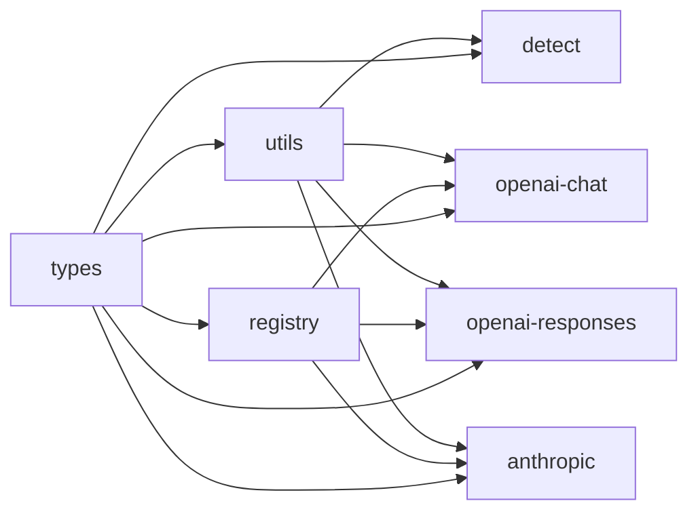
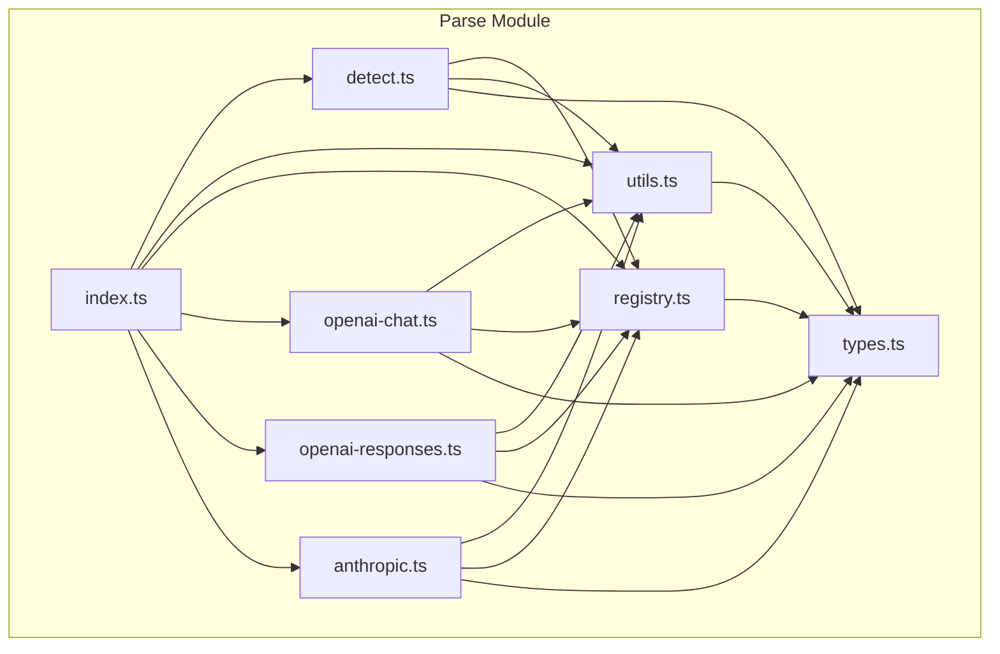
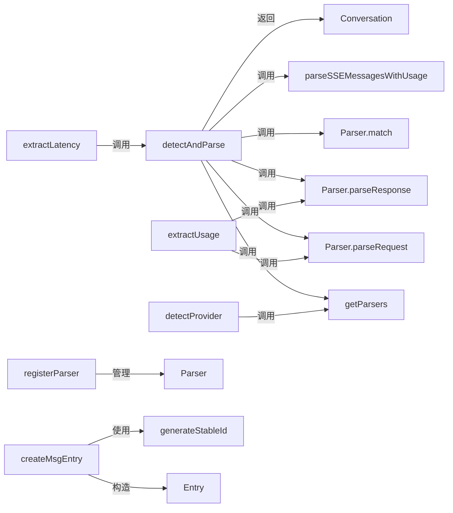
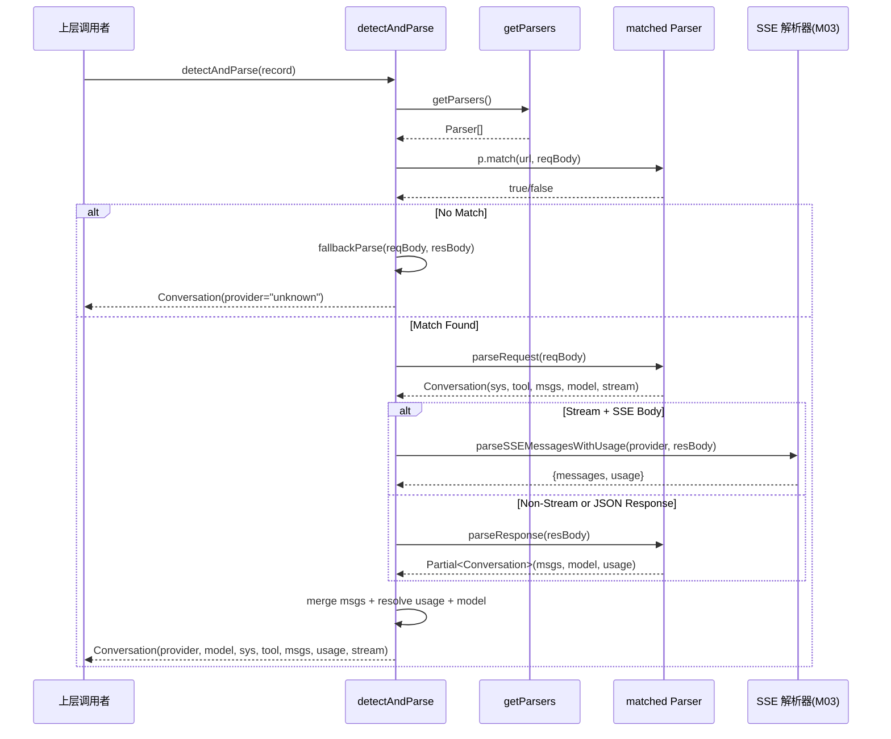

# M02-Parse

## 概述

Parse 模块解决了多 LLM 提供商 API 格式差异的问题——OpenAI Chat Completions、OpenAI Responses API 和 Anthropic Messages API 各有不同的请求/响应结构、消息格式和工具调用约定。该模块在 Domain Logic (L1) 层中扮演"数据解释器"角色，将原始 HTTP TraceRecord 转换为统一的 Conversation 模型，使上层 store/query/format/viewer 无需关心提供商差异。如果移除该模块，系统将丧失所有对话解析能力，viewer 将无法展示结构化对话内容，只能看到原始 JSON。

---

## 元数据

|字段|值|
|-|-|
|模块 ID|M02|
|路径|packages/core/src/parse/|
|文件数|8 (源码) + 7 (测试)|
|代码行数|1,251 (源码) / 2,820 (测试)|
|主要语言|TypeScript|
|所属层|Domain Logic (L1) — 数据解释与转换|

---

## 子模块

|ID|名称|职责|文档链接|
|-|-|-|-|
|M02.1|detect|核心解析管线：提供商检测、请求/响应解析调度、SSE 流处理路由|[Details](./M02/M02.1-detect.md)|
|M02.2|registry|解析器注册表：管理 Parser 实例的注册、查询与测试清理|[Details](./M02/M02.2-registry.md)|
|M02.3|utils|工厂辅助：Entry/Block 构造器、稳定 ID 生成|[Details](./M02/M02.3-utils.md)|
|M02.4|types|类型定义：Conversation、Entry、Block、Parser 等核心类型契约|[Details](./M02/M02.4-types.md)|
|M02.5|openai-chat-parser|OpenAI Chat Completions API 请求/响应解析器|[Details](./M02/M02.5-openai-chat-parser.md)|
|M02.6|openai-responses-parser|OpenAI Responses API 请求/响应解析器（含 reasoning、web_search 等新类型）|[Details](./M02/M02.6-openai-responses-parser.md)|
|M02.7|anthropic-parser|Anthropic Messages API 请求/响应解析器（含 thinking、tool_use 等类型）|[Details](./M02/M02.7-anthropic-parser.md)|

### 子模块依赖关系



---

## 文件结构



|文件|职责|行数|主要导出|
|-|-|-|-|
|types.ts|定义核心类型契约（Block、Entry、Conversation、Parser）|84|BlockType, TextBlock, ThinkingBlock, ToolDefinitionBlock, ToolCallBlock, ToolResultBlock, ImageBlock, OtherBlock, Block, Entry, Conversation, Parser|
|registry.ts|解析器注册表管理|20|registerParser, getParsers, clearParsersForTesting|
|utils.ts|Entry/Block 构造工厂与 ID 生成|89|generateId, generateStableId, createSysEntry, createToolEntry, createMsgEntry, createTextBlock, createThinkingBlock, createToolDefinitionBlock, createToolCallBlock, createToolResultBlock, createImageBlock, createOtherBlock|
|detect.ts|核心解析管线：检测提供商、调度解析、处理 SSE 流|164|detectAndParse, detectProvider, extractUsage, extractLatency, LatencyInfo|
|openai-chat.ts|OpenAI Chat Completions 格式解析器|260|openaiChatParser (Parser object)|
|openai-responses.ts|OpenAI Responses API 格式解析器|359|openaiResponsesParser (Parser object)|
|anthropic.ts|Anthropic Messages API 格式解析器|224|anthropicParser (Parser object)|
|index.ts|Barrel 导出 + PARSED_CACHE_VERSION + 侧效果自注册触发|51|PARSED_CACHE_VERSION, 所有子模块导出|

---

## 功能树

```text
M02-Parse (multi-provider LLM parsing)
├── types.ts
│   ├── type: BlockType — Block 类型枚举 ("text"|"thinking"|"td"|"tc"|"tr"|"image"|"other")
│   ├── interface: TextBlock — 文本内容块
│   ├── interface: ThinkingBlock — 推理/思考内容块
│   ├── interface: ToolDefinitionBlock — 工具定义块 (td)
│   ├── interface: ToolCallBlock — 工具调用块 (tc)
│   ├── interface: ToolResultBlock — 工具结果块 (tr)
│   ├── interface: ImageBlock — 图片块
│   ├── interface: OtherBlock — 未识别内容兜底块
│   ├── type: Block — 所有块类型联合
│   ├── interface: Entry — 对话条目 (含 id, role, blocks)
│   ├── interface: Conversation — 完整对话模型 (provider, model, sys, tool, msgs, usage, stream)
│   └── interface: Parser — 解析器契约 (provider, match, parseRequest, parseResponse)
├── registry.ts
│   ├── fn: registerParser(parser: Parser) — 注册解析器（防重复）
│   ├── fn: getParsers() — 获取所有已注册解析器
│   └── fn: clearParsersForTesting() — 清空注册表（仅测试用）
├── utils.ts
│   ├── fn: generateId() — 生成随机短 ID
│   ├── fn: generateStableId(role, blocks) — 基于 role+blocks 内容生成确定性 ID
│   ├── fn: createSysEntry(blocks) — 构建系统提示条目
│   ├── fn: createToolEntry(blocks) — 构建工具定义条目
│   ├── fn: createMsgEntry(role, blocks) — 构建消息条目（含稳定 ID）
│   ├── fn: createTextBlock(text) — 构造 TextBlock
│   ├── fn: createThinkingBlock(thinking) — 构造 ThinkingBlock
│   ├── fn: createToolDefinitionBlock(name, desc, schema) — 构造 ToolDefinitionBlock
│   ├── fn: createToolCallBlock(id, name, args) — 构造 ToolCallBlock
│   ├── fn: createToolResultBlock(toolCallId, content) — 构造 ToolResultBlock
│   ├── fn: createImageBlock(source) — 构造 ImageBlock
│   └── fn: createOtherBlock(raw) — 构造 OtherBlock
├── detect.ts
│   ├── fn: detectAndParse(record: TraceRecord) — 核心管线：检测提供商 → 解析请求 → 处理响应/SSE → 组装 Conversation
│   ├── fn: detectProvider(url, body) — 仅检测提供商名称
│   ├── fn: extractUsage(record) — 提取 token 使用量
│   ├── fn: extractLatency(record) — 提取延迟指标 (TTFT/TPOT)
│   ├── type: LatencyInfo — 延迟信息结构
│   ├── fn: fallbackParse(reqBody, resBody) — 无匹配解析器时的兜底解析
│   ├── fn: parseSSEMessagesWithUsage(provider, raw) — SSE 流路由到对应提供商解析器
│   └── fn: isSSEBody(body) — 判断响应体是否为 SSE 格式
├── openai-chat.ts
│   ├── const: openaiChatParser — OpenAI Chat Completions Parser 对象
│   │   ├── method: match(url, body) — 匹配 /chat/completions URL 或 openai.com 域名
│   │   ├── method: parseRequest(body) — 解析请求：system, developer, tools, messages, stream
│   │   └── method: parseResponse(body) — 解析响应：choices[0].message, tool_calls, usage
│   ├── fn: extractMessages(body) — 从 messages 数组提取 Entry[]
│   ├── fn: extractTools(body) — 从 tools 数组提取工具定义 Entry
│   ├── fn: extractSystem(body) — 从 system/developer/instructions + system messages 提取系统提示
│   └── fn: extractUsage(body) — 从 usage 对象提取 token 统计（含 cached_tokens）
├── openai-responses.ts
│   ├── const: openaiResponsesParser — OpenAI Responses API Parser 对象
│   │   ├── method: match(url, body) — 匹配 /responses URL 或 openai.com 域名
│   │   ├── method: parseRequest(body) — 解析请求：instructions, input, tools, stream
│   │   └── method: parseResponse(body) — 解析响应：output 数组 (message, function_call, reasoning, web_search_call, etc.), usage
│   └── fn: extractInputMessages(input) — 从 input 字段提取 Entry[]（支持 string/array/function_call/function_call_output）
├── anthropic.ts
│   └── const: anthropicParser — Anthropic Messages API Parser 对象
│       ├── method: match(url, body) — 匹配 /v1/messages URL
│       ├── method: parseRequest(body) — 解析请求：system, tools, messages, stream
│       └── method: parseResponse(body) — 解析响应：content 数组 (text, thinking, tool_use), usage
└── index.ts
    ├── const: PARSED_CACHE_VERSION — 解析缓存版本号（当前 "1"）
    ├── import: "./openai-chat.js" — 侧效果导入触发自注册
    ├── import: "./openai-responses.js" — 侧效果导入触发自注册
    └── import: "./anthropic.js" — 侧效果导入触发自注册
```

### 功能清单

|名称|类型|文件|行号|描述|
|-|-|-|-|-|
|PARSED_CACHE_VERSION|const|index.ts|8|解析输出格式版本号，变更时需递增|
|detectAndParse|fn|detect.ts|62|核心管线函数：TraceRecord → Conversation|
|detectProvider|fn|detect.ts|100|检测 TraceRecord 对应的 LLM 提供商|
|extractUsage|fn|detect.ts|105|提取 token 使用量（含 cache token 分离）|
|extractLatency|fn|detect.ts|136|提取延迟指标（TTFT, TPOT, totalDuration）|
|LatencyInfo|type|detect.ts|127|延迟信息结构体|
|registerParser|fn|registry.ts|5|注册 Parser 实例（防重复注册）|
|getParsers|fn|registry.ts|14|返回所有已注册解析器（浅拷贝）|
|clearParsersForTesting|fn|registry.ts|18|清空解析器注册表（仅供测试）|
|generateId|fn|utils.ts|13|生成随机 9 位 base36 ID|
|generateStableId|fn|utils.ts|17|基于 role+blocks 生成确定性 ID（hashString）|
|createSysEntry|fn|utils.ts|37|构建系统提示条目 (id="sys")|
|createToolEntry|fn|utils.ts|41|构建工具定义条目 (id="tool")|
|createMsgEntry|fn|utils.ts|45|构建消息条目（含稳定 ID + role）|
|createTextBlock|fn|utils.ts|52|构造 TextBlock|
|createThinkingBlock|fn|utils.ts|56|构造 ThinkingBlock|
|createToolDefinitionBlock|fn|utils.ts|60|构造 ToolDefinitionBlock (td)|
|createToolCallBlock|fn|utils.ts|68|构造 ToolCallBlock (tc)|
|createToolResultBlock|fn|utils.ts|76|构造 ToolResultBlock (tr)|
|createImageBlock|fn|utils.ts|83|构造 ImageBlock|
|createOtherBlock|fn|utils.ts|87|构造 OtherBlock（兜底）|
|BlockType|type|types.ts|1|Block 类型枚举字符串联合|
|TextBlock|interface|types.ts|10|文本内容块|
|ThinkingBlock|interface|types.ts|15|推理/思考内容块|
|ToolDefinitionBlock|interface|types.ts|20|工具定义块|
|ToolCallBlock|interface|types.ts|27|工具调用块|
|ToolResultBlock|interface|types.ts|34|工具结果块|
|ImageBlock|interface|types.ts|40|图片块|
|OtherBlock|interface|types.ts|45|兜底块|
|Block|type|types.ts|50|所有 Block 类型联合|
|Entry|interface|types.ts|59|对话条目|
|Conversation|interface|types.ts|65|完整对话模型|
|Parser|interface|types.ts|79|解析器策略契约|
|openaiChatParser|const|openai-chat.ts|174|OpenAI Chat Completions 解析器实例|
|openaiResponsesParser|const|openai-responses.ts|122|OpenAI Responses API 解析器实例|
|anthropicParser|const|anthropic.ts|19|Anthropic Messages API 解析器实例|

### 职责边界

**做什么**

- 将多提供商 LLM API 的原始 HTTP 请求/响应 JSON 解析为统一的 Conversation 模型
- 检测 TraceRecord 对应的 LLM 提供商（OpenAI Chat / OpenAI Responses / Anthropic）
- 处理 SSE 流式响应的增量数据合并为完整消息
- 提取 token 使用量（含 cache token 分离为 inputMiss/inputHit）
- 提取延迟指标（TTFT、TPOT、totalDuration）
- 通过 Registry 模式支持提供商解析器的可扩展注册
- 维护解析缓存版本号以检测格式变更导致的缓存过期

**不做什么**

- 不存储或持久化解析结果（由 M04-store 负责）
- 不执行 HTTP 请求/拦截（由 M17-plugin 负责）
- 不渲染对话内容（由 viewer 前端负责）
- 不处理 SSE 底层解析（parseSSE 函数在 M03-transform 中实现）
- 不验证 API 请求的正确性或完整性（仅做尽力解析）

---

## 公共接口契约

### 接口关系图



### 类型定义

```typescript
// [File: types.ts:1]
export type BlockType =
  | "text"
  | "thinking"
  | "td"
  | "tc"
  | "tr"
  | "image"
  | "other";

// [File: types.ts:10]
export interface TextBlock {
  type: "text";
  text: string;
}

// [File: types.ts:15]
export interface ThinkingBlock {
  type: "thinking";
  thinking: string;
}

// [File: types.ts:20]
export interface ToolDefinitionBlock {
  type: "td";
  name: string;
  description: string | null;
  inputSchema: unknown;
}

// [File: types.ts:27]
export interface ToolCallBlock {
  type: "tc";
  id: string;
  name: string;
  arguments: string;
}

// [File: types.ts:34]
export interface ToolResultBlock {
  type: "tr";
  toolCallId: string;
  content: string;
}

// [File: types.ts:40]
export interface ImageBlock {
  type: "image";
  source: unknown;
}

// [File: types.ts:45]
export interface OtherBlock {
  type: "other";
  raw: unknown;
}

// [File: types.ts:50]
export type Block =
  | TextBlock
  | ThinkingBlock
  | ToolDefinitionBlock
  | ToolCallBlock
  | ToolResultBlock
  | ImageBlock
  | OtherBlock;

// [File: types.ts:59]
export interface Entry {
  id: string;
  role?: "user" | "assistant" | "tool";
  blocks: Block[];
}

// [File: types.ts:65]
export interface Conversation {
  provider: string;
  model: string | null;
  sys?: Entry;
  tool?: Entry;
  msgs: Entry[];
  usage: {
    inputMissTokens: number | null;
    inputHitTokens: number | null;
    outputTokens: number | null;
  } | null;
  stream: boolean;
}

// [File: types.ts:79]
export interface Parser {
  readonly provider: string;
  match(url: string, body: unknown): boolean;
  parseRequest(body: unknown): Conversation;
  parseResponse(body: unknown): Partial<Conversation>;
}

// [File: detect.ts:127]
export interface LatencyInfo {
  requestSentAt: number | null;
  firstTokenAt: number | null;
  lastTokenAt: number | null;
  ttft: number | null;
  tpot: number | null;
  totalDuration: number | null;
}
```

|类型名|字段/方法|类型|描述|位置|
|-|-|-|-|-|
|BlockType|"text"|"thinking"|"td"|"tc"|"tr"|"image"|"other"|Block 类型标签枚举|types.ts:1|
|TextBlock|type + text|"text" + string|文本内容块|types.ts:10|
|ThinkingBlock|type + thinking|"thinking" + string|推理/思考内容块|types.ts:15|
|ToolDefinitionBlock|type + name + description + inputSchema|"td" + string + string?null + unknown|工具定义块|types.ts:20|
|ToolCallBlock|type + id + name + arguments|"tc" + string + string + string|工具调用块|types.ts:27|
|ToolResultBlock|type + toolCallId + content|"tr" + string + string|工具结果块|types.ts:34|
|ImageBlock|type + source|"image" + unknown|图片块|types.ts:40|
|OtherBlock|type + raw|"other" + unknown|兜底块|types.ts:45|
|Entry|id + role? + blocks|string + "user"|"assistant"|"tool"? + Block[]|对话条目|types.ts:59|
|Conversation|provider + model + sys? + tool? + msgs + usage + stream|完整对话模型|types.ts:65|
|Parser|provider + match + parseRequest + parseResponse|解析器策略接口|types.ts:79|
|LatencyInfo|requestSentAt + firstTokenAt + lastTokenAt + ttft + tpot + totalDuration|延迟信息结构|detect.ts:127|

### 导出函数

#### `detectAndParse()`

```typescript
// [File: detect.ts:62]
export function detectAndParse(record: TraceRecord): Conversation
```

|参数|类型|必需|描述|
|-|-|-|-|
|record|TraceRecord|yes|原始 HTTP 追踪记录|

- **返回**：`Conversation` — 包含 provider、model、sys、tool、msgs、usage、stream 的完整对话模型。无匹配解析器时返回 provider="unknown" 的兜底 Conversation
- **抛出**：无显式抛出（内部 SSE 解析异常由 try/catch 吞并并 debug 日志记录）

**使用示例**：

```typescript
import { detectAndParse } from '@opencode-trace/core/parse'
const conversation = detectAndParse(traceRecord)
console.log(conversation.provider, conversation.msgs.length)
```

#### `detectProvider()`

```typescript
// [File: detect.ts:100]
export function detectProvider(url: string, body: unknown): string | null
```

|参数|类型|必需|描述|
|-|-|-|-|
|url|string|yes|请求 URL|
|body|unknown|yes|请求体 JSON|

- **返回**：`string | null` — 匹配的提供商名称（"openai-chat"/"openai-responses"/"anthropic"），无匹配时返回 null

#### `extractUsage()`

```typescript
// [File: detect.ts:105]
export function extractUsage(record: TraceRecord): Conversation["usage"]
```

|参数|类型|必需|描述|
|-|-|-|-|
|record|TraceRecord|yes|原始 HTTP 追踪记录|

- **返回**：`{ inputMissTokens, inputHitTokens, outputTokens } | null` — token 使用量。将 cache token 从 input token 中分离为 inputHitTokens，计算 inputMissTokens = input - cache

#### `extractLatency()`

```typescript
// [File: detect.ts:136]
export function extractLatency(record: TraceRecord): LatencyInfo | null
```

|参数|类型|必需|描述|
|-|-|-|-|
|record|TraceRecord|yes|必须包含 requestSentAt、firstTokenAt、lastTokenAt 字段|

- **返回**：`LatencyInfo | null` — 延迟指标。缺失时间戳字段时返回 null。TTFT = firstTokenAt - requestSentAt; TPOT = (lastTokenAt - firstTokenAt) / outputTokens; totalDuration = lastTokenAt - requestSentAt

#### `registerParser()`

```typescript
// [File: registry.ts:5]
export function registerParser(parser: Parser): void
```

|参数|类型|必需|描述|
|-|-|-|-|
|parser|Parser|yes|解析器实例，需实现 provider, match, parseRequest, parseResponse|

- **抛出**：`Error` — provider 名称已注册时抛出重复注册错误

#### `getParsers()`

```typescript
// [File: registry.ts:14]
export function getParsers(): Parser[]
```

- **返回**：`Parser[]` — 所有已注册解析器的浅拷贝数组

#### `clearParsersForTesting()`

```typescript
// [File: registry.ts:18]
export function clearParsersForTesting(): void
```

- **用途**：仅在测试环境中清空注册表，确保测试隔离

#### `generateId()`

```typescript
// [File: utils.ts:13]
export function generateId(): string
```

- **返回**：9 位随机 base36 字符串

#### `createMsgEntry()`

```typescript
// [File: utils.ts:45]
export function createMsgEntry(role: "user" | "assistant" | "tool", blocks: Block[]): Entry
```

|参数|类型|必需|描述|
|-|-|-|-|
|role|"user" | "assistant" | "tool"|yes|消息角色|
|blocks|Block[]|yes|消息内容块数组|

- **返回**：`Entry` — 含稳定 ID（generateStableId 基于 role+blocks hash）的消息条目

#### Block 构造工厂函数

```typescript
// [File: utils.ts:52]
export function createTextBlock(text: string): Block
export function createThinkingBlock(thinking: string): Block
export function createToolDefinitionBlock(name: string, description: string | null, inputSchema: unknown): ToolDefinitionBlock
export function createToolCallBlock(id: string, name: string, args: string): Block
export function createToolResultBlock(toolCallId: string, content: string): Block
export function createImageBlock(source: unknown): Block
export function createOtherBlock(raw: unknown): Block
```

### 导出常量

#### `PARSED_CACHE_VERSION`

```typescript
// [File: index.ts:8]
export const PARSED_CACHE_VERSION = "1";
```

- **用途**：标记 `detectAndParse()` 输出格式版本。当 Conversation 类型字段变更时必须递增，确保 viewer 检测到 stale `.parsed` 缓存文件并回退到重新解析

#### Parser 对象常量

```typescript
// [File: openai-chat.ts:174]
export const openaiChatParser: Parser  // provider: "openai-chat"
// [File: openai-responses.ts:122]
export const openaiResponsesParser: Parser  // provider: "openai-responses"
// [File: anthropic.ts:19]
export const anthropicParser: Parser  // provider: "anthropic"
```

---

## 内部实现

### 核心内部逻辑

|函数/类|文件|行号|用途|
|-|-|-|-|
|fallbackParse|detect.ts|15|无匹配 Parser 时的兜底解析：尝试从 messages 数组提取基础对话|
|parseSSEMessagesWithUsage|detect.ts|49|路由 SSE 流解析：按 provider 名称分发到 transform 模块的对应 SSE 解析器|
|isSSEBody|detect.ts|58|判断响应体是否为 SSE 格式（typeof string && includes "data:"）|
|isRecord|detect.ts|11|类型守卫：判断值是否为非 null 非数组的 object|
|hashString|utils.ts|3|DJB2 变体哈希：将字符串压缩为 9 位 base36 ID（用于 generateStableId）|
|generateStableId|utils.ts|17|确定性 ID 生成：基于 role + blocks 内容特征拼接后 hashString|
|extractMessages|openai-chat.ts|20|从 OpenAI Chat messages 数组提取 Entry[]（处理 system/developer 过滤、tool_calls、reasoning_content）|
|extractTools|openai-chat.ts|104|从 OpenAI Chat tools 数组提取工具定义 Entry|
|extractSystem|openai-chat.ts|123|从 OpenAI Chat system/developer/instructions + system messages 提取系统提示|
|extractUsage|openai-chat.ts|147|从 OpenAI Chat usage 对象提取 token 统计（含 prompt_tokens_details.cached_tokens 分离）|
|extractInputMessages|openai-responses.ts|18|从 OpenAI Responses input 字段提取 Entry[]（支持 string/array/message/function_call/function_call_output 类型）|
|isRecord (各 parser)|openai-chat.ts:16, openai-responses.ts:14, anthropic.ts:15|—|各 parser 文件内独立定义的 isRecord 类型守卫（代码重复）|

### 设计模式

|模式|使用位置|使用原因|代码证据|
|-|-|-|-|
|Registry (注册表)|registry.ts + 各 parser 文件底部|解耦解析器实现与核心管线：新增提供商只需创建 parser 文件并调用 registerParser()，无需修改 detect.ts。支持运行时扩展和测试隔离|openai-chat.ts:259 `registerParser(openaiChatParser)`; index.ts:10-12 侧效果导入触发自注册|
|Strategy (策略)|types.ts:79 Parser 接口|统一不同提供商的解析策略：match/parseRequest/parseResponse 三方法构成策略契约，detectAndParse 通过 getParsers().find() 选择策略|detect.ts:67 `getParsers().find(p => p.match(url, reqBody))`; 各 parser 实现 Parser 接口|
|Factory (工厂)|utils.ts 全部 create* 函数|集中构造 Block/Entry 对象，确保类型标签正确且结构一致。避免各 parser 直接构造裸对象导致字段遗漏或类型标签错误|openai-chat.ts:36 `createMsgEntry("user", [createTextBlock(String(msg))])`|
|Side-effect Import (侧效果导入)|index.ts:10-12|通过 import 语句触发 parser 文件末尾的 registerParser() 调用，实现"导入即注册"。无需手动维护注册列表|index.ts:10 `import "./openai-chat.js"` → openai-chat.ts:259 `registerParser(openaiChatParser)`|
|Cache Versioning (缓存版本)|index.ts:8 PARSED_CACHE_VERSION|标记解析输出格式版本，使 viewer 能检测 stale `.parsed` 文件。版本不一致时回退到从 .json 重新解析，避免展示过时数据|index.ts:8; viewer 中读取 .parsed 时检查 _pcv 字段|

### 关键算法 / 策略

|算法/策略|用途|复杂度|文件|
|-|-|-|-|
|Provider Matching (URL + Body 双条件)|匹配 TraceRecord 到对应 Parser|O(n) n=已注册 Parser 数量|detect.ts:67|
|Stable ID Generation (hashString)|为 Entry 生成内容确定性 ID，确保相同对话内容产生相同 ID|O(k) k=block 内容长度|utils.ts:3-11|
|Cache Token Separation (input - cached = miss)|将 OpenAI/Anthropic 的 cache token 从 input token 中分离，计算实际未命中 token 数|O(1)|openai-chat.ts:147-171, anthropic.ts:195-212|
|TPOT Calculation (duration / outputTokens)|计算每输出 token 的平均延迟时间|O(1)|detect.ts:148-153|

---

## 关键流程

### 流程 1：detectAndParse — 完整解析管线

**调用链**

```text
detect.ts:62 → detect.ts:67 (getParsers().find) → parser.match → parser.parseRequest:70 → detect.ts:76 (isSSEBody) → parseSSEMessagesWithUsage:49 → transform/sseOpenaiChatParse or sseAnthropicParse → detect.ts:87 (merge msgs)
```

**时序图**



**步骤详解**

|步骤|说明|文件位置|
|-|-|-|
|1|从 TraceRecord 提取 url、reqBody、resBody|detect.ts:63-65|
|2|遍历已注册 Parser，调用 match(url, reqBody) 找到匹配的解析器|detect.ts:67|
|3|无匹配时调用 fallbackParse：尝试从 messages 数组提取基础对话，provider 设为 "unknown"|detect.ts:68|
|4|匹配时调用 parser.parseRequest(reqBody)：提取 system prompt、工具定义、请求消息、model、stream 标记|detect.ts:70|
|5|判断是否为 SSE 流式响应（stream=true 且 resBody 含 "data:"）|detect.ts:76|
|6|SSE 响应路由到 transform 模块对应提供商的 SSE 解析器（sseOpenaiChatParse/sseOpenaiResponsesParse/sseAnthropicParse）|detect.ts:49-55|
|7|非 SSE 响应调用 parser.parseResponse(resBody)：提取响应消息、model、usage|detect.ts:81-84|
|8|合并请求消息与响应消息为完整 msgs 数组|detect.ts:87|
|9|组装最终 Conversation：provider、model（优先用响应 model）、sys、tool、msgs、usage、stream|detect.ts:89-97|

### 流程 2：SSE 流解析路由

**调用链**

```text
detect.ts:49 parseSSEMessagesWithUsage → transform/sseOpenaiChatParse or sseOpenaiResponsesParse or sseAnthropicParse → parseSSE → JSON.parse each event → accumulate content/reasoning/tool_calls → assemble Entry[]
```

**步骤详解**

|步骤|说明|文件位置|
|-|-|-|
|1|detect.ts 中判断 provider 名称路由到对应的 SSE 解析器|detect.ts:49-55|
|2|SSE 解析器调用 parseSSE(raw) 将 SSE 文本拆分为 SSEEvent[]|transform/index.ts:25-29|
|3|遍历 SSEEvent，JSON.parse(event.data)，累积 text content / reasoning / tool_calls|transform/index.ts:32-105|
|4|SSE 流结束时（[DONE] 或 response.completed）组装 Block[] 并创建 Entry|transform/index.ts:107-129|
|5|从 SSE 事件中的 usage 字段提取 token 统计|transform/index.ts:38-69|
|6|返回 SSEParseResult: {messages, usage}|transform/index.ts:129|

### 流程 3：缓存版本检测与失效

**调用链**

```text
viewer → read .parsed file → check _pcv field → compare with PARSED_CACHE_VERSION → mismatch: fall back to .json + detectAndParse → match: use cached .parsed
```

**步骤详解**

|步骤|说明|文件位置|
|-|-|-|
|1|viewer 读取 {seq}.parsed 文件|— (viewer 侧)|
|2|检查 _pcv 字段是否等于当前 PARSED_CACHE_VERSION|— (viewer 侧)|
|3|版本不一致时：忽略 .parsed，从 {seq}.json 重新调用 detectAndParse()|— (viewer 侧)|
|4|版本一致时：直接使用 .parsed 缓存数据，跳过解析|— (viewer 侧)|
|5|PARSED_CACHE_VERSION 在 index.ts 中定义，需在 Conversation 类型变更时手动递增|index.ts:8|

---

## 依赖

### 内部依赖（项目内其他模块）

|模块|使用的接口|调用位置|
|-|-|-|
|M03-transform|sseOpenaiChatParse, sseOpenaiResponsesParse, sseAnthropicParse|detect.ts:6-9, detect.ts:49-55|
|M01-types|TraceRecord|detect.ts:1|
|M10-logger|(间接通过 transform 模块)|transform/index.ts:12|

### 外部依赖（第三方包）

|包名|版本|用途|可替代性|
|-|-|-|-|
|无|—|parse 模块不直接使用任何第三方包|—|

> **注意**：parse 模块与 transform 模块之间存在循环依赖：detect.ts 导入 transform 的 SSE 函数，而 transform/index.ts 导入 parse/types.js 和 parse/utils.js。这在 TypeScript project references 下通过 tsc -b 正常工作（因为两者在同一包 core 中），但逻辑上构成了架构耦合。

---

## 代码质量与风险

### 代码坏味道

|问题|类型|文件|严重度|建议|
|-|-|-|-|-|
|isRecord() 函数在 detect.ts、openai-chat.ts、openai-responses.ts、anthropic.ts 中重复定义（4 处）|重复代码|detect.ts:11, openai-chat.ts:16, openai-responses.ts:14, anthropic.ts:15|中|抽取到 utils.ts 作为共享导出|
|openai-responses.ts 的 parseRequest 和 parseResponse 方法较长（分别为 89 行和 128 行）|过长函数|openai-responses.ts:131-220, openai-responses.ts:223-355|中|将工具类型提取逻辑独立为 extractTools 函数（类似 openai-chat.ts 的做法）|
|PARSED_CACHE_VERSION 需手动递增，无自动化检查|硬编码|index.ts:8|中|考虑在 Conversation 类型定义中添加注释标注需递增的场景，或添加 CI 检查|
|parser.match() 依赖 URL 字符串匹配（includes），不够精确|硬编码|openai-chat.ts:177, anthropic.ts:22|低|考虑使用 URL 正则或路径解析提高匹配精确度|

### 潜在风险

|风险|触发条件|影响|文件|建议|
|-|-|-|-|-|
|parse ↔ transform 循环依赖|如果将 core 包拆分为更细粒度的子包，循环依赖会导致构建失败|构建/架构耦合|detect.ts:6-9, transform/index.ts:5-8|将 SSE 解析函数移入 parse 模块，或将共享类型/工厂移入独立的 types 子包|
|PARSED_CACHE_VERSION 未递增|Conversation 类型字段变更（添加/删除/重命名）但忘记递增版本号|viewer 展示过时的 .parsed 缓存数据，用户可能看到缺失字段或错误结构|index.ts:8|添加 CHANGELOG 注释或 CI lint 规则检查 Conversation 类型变更是否伴随版本递增|
|提供商匹配顺序依赖|getParsers() 返回顺序决定哪个 parser 先被 match() 感知；如果多个 parser 对同一 URL 返回 true，只有第一个被使用|OpenAI Chat 和 OpenAI Responses parser 的 fallback 条件（url.includes("openai.com")) 可能导致错误匹配|detect.ts:67|改进 match() 逻辑使其更精确，或为 match 结果添加优先级排序|
|fallbackParse 信息丢失|当无匹配 parser 时，response body 完全被忽略，只解析 request messages|遗漏响应内容、model、usage 等关键信息|detect.ts:15-47|在 fallback 中尝试从 response body 提取更多通用信息（如 model 字段）|

### 测试覆盖

|测试类型|覆盖情况|测试文件|说明|
|-|-|-|-|
|单元测试|有|detect.test.ts (678 行)|覆盖 detectAndParse、detectProvider、extractUsage、extractLatency、fallbackParse、SSE 路由|
|单元测试|有|openai-chat.test.ts (759 行)|覆盖 match、parseRequest、parseResponse（含 tool_calls、reasoning、stream）|
|单元测试|有|openai-responses.test.ts (1062 行)|覆盖 match、parseRequest、parseResponse（含 function_call、reasoning、web_search、file_search、computer_use）|
|单元测试|有|anthropic.test.ts (652 行)|覆盖 match、parseRequest、parseResponse（含 thinking、tool_use、tool_result、image）|
|单元测试|有|registry.test.ts (51 行)|覆盖 registerParser（防重复）、getParsers、clearParsersForTesting|
|单元测试|有|utils.test.ts (304 行)|覆盖 generateStableId 确定性、create* 工厂函数|
|集成测试|有|provider-registration.test.ts (14 行)|验证侧效果导入后 3 个 parser 已自动注册|

---

## 开发指南

### 洞察

Parse 模块的核心设计洞察是：**LLM API 格式差异是不可避免的，但统一的数据模型是必需的**。通过 Strategy + Registry 模式，新增提供商只需实现 Parser 接口并注册，无需触碰核心管线。这实现了"开放扩展、封闭修改"的原则。而 Side-effect Import 模式进一步简化了注册流程——导入即注册，无需手动维护注册清单。

### 扩展指南

**添加新的 LLM 提供商解析器**：

1. **创建 parser 文件**：在 `packages/core/src/parse/` 下创建 `new-provider.ts`
2. **定义 Parser 对象**：实现 `Parser` 接口的三个方法：
   - `match(url, body)` — URL 和请求体匹配逻辑
   - `parseRequest(body)` — 解析请求为 Conversation
   - `parseResponse(body)` — 解析响应为 Partial<Conversation>
3. **使用工厂函数**：所有 Entry/Block 构造使用 `createMsgEntry`、`createTextBlock` 等 utils 工厂，确保类型标签和结构一致
4. **添加自注册**：在文件末尾添加 `import { registerParser } from "./registry.js"; registerParser(newProviderParser);`
5. **添加 SSE 解析**：如需支持流式响应，在 `packages/core/src/transform/index.ts` 中添加对应的 `sseNewProviderParse` 函数，并在 detect.ts 的 `parseSSEMessagesWithUsage` 中添加路由
6. **更新 index.ts**：添加 `import "./new-provider.js"` (侧效果) 和 `export { newProviderParser } from "./new-provider.js"`
7. **更新 PARSED_CACHE_VERSION**：如果新 parser 导致 Conversation 结构变更（新增字段），递增 `PARSED_CACHE_VERSION`
8. **编写测试**：创建 `new-provider.test.ts`，覆盖 match、parseRequest、parseResponse 各种场景

### 风格与约定

- **Block 类型标签使用缩写**：`td`（tool definition）、`tc`（tool call）、`tr`（tool result），不使用全名。这是有意为之——缩短 JSON 序列化后的字段名，减小 .parsed 缓存文件体积
- **isRecord 类型守卫**：虽然目前在各 parser 文件中重复定义，但这是出于模块独立性的考虑——每个 parser 文件可独立编译和测试，不依赖 utils 的内部实现
- **fallback 策略**：所有解析都是"尽力而为"——不验证 API 格式完整性，遇到不认识的字段统一归入 OtherBlock，确保不丢失原始数据
- **usage 命名约定**：`inputMissTokens`（cache miss 的 input token）和 `inputHitTokens`（cache hit 的 input token），语义明确区分缓存命中与未命中

### 设计哲学

- **尽力解析而非严格验证**：Parse 模块的目标是从可能不完整、格式变化的 API 响应中提取尽可能多的信息，而非验证 API 格式的正确性。因此使用大量 `?? ""`、`?? null` 兜底和 `isRecord` 类型守卫
- **Registry 优先于 switch/case**：通过 Registry 模式管理 parser 选择，而非在 detectAndParse 中硬编码 provider 分支。这使得新增提供商成为"添加"而非"修改"
- **Side-effect Import 简化注册**：parser 的自注册通过 import 语句触发（"导入即注册"），避免了在 index.ts 中手动维护注册列表的遗漏风险
- **工厂函数保证类型一致性**：所有 Block/Entry 构造通过 utils.ts 工厂函数完成，确保类型标签（如 "td"而非"tool_definition"）和字段结构在整个模块中一致

### 修改检查清单

- [ ] 新增 Parser 后：确认 index.ts 添加了侧效果 import 和 export
- [ ] Conversation 类型字段变更时：递增 PARSED_CACHE_VERSION（index.ts:8）
- [ ] 修改 Block 类型定义时：检查所有 parser 的 create* 工厂调用是否需要同步更新
- [ ] 修改 SSE 解析逻辑时：检查 detect.ts 中 parseSSEMessagesWithUsage 的路由是否覆盖新场景
- [ ] 修改 Entry.id 生成逻辑时：检查 viewer 侧依赖稳定 ID 的功能（如消息定位、diff）是否受影响
- [ ] 修改 usage 计算逻辑时：检查 transform 模块中 SSE 解析器的 usage 提取是否与 parseRequest/parseResponse 一致
- [ ] 提交前：运行 `npm run test` 确保 parse 模块所有测试通过（含 provider-registration.test.ts 自注册验证）