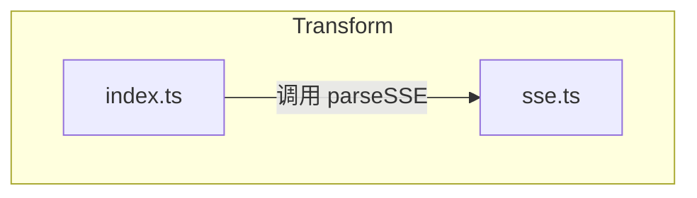
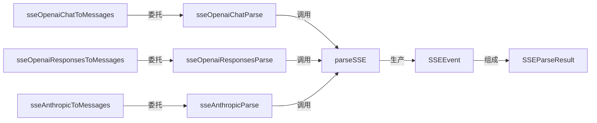
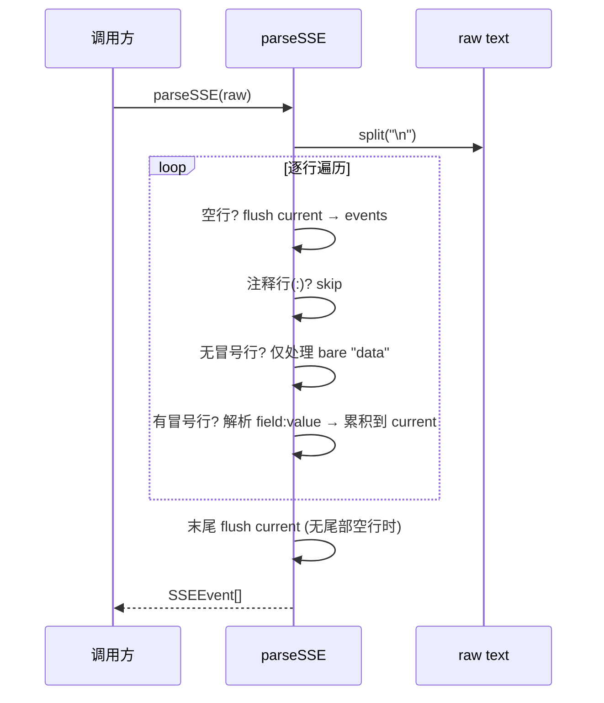
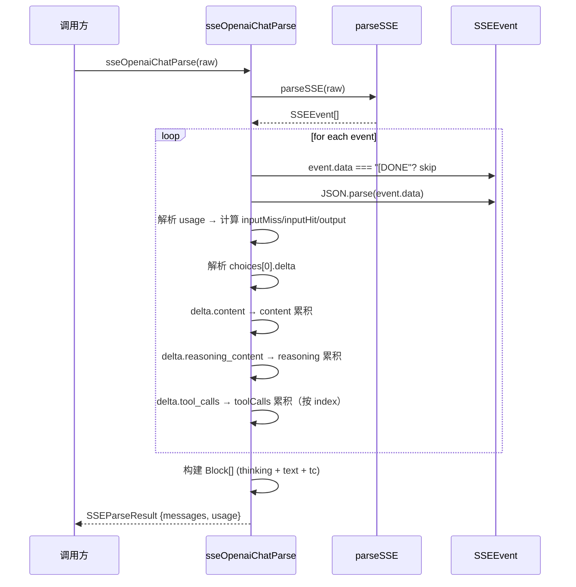

# M03-Transform

## 概述

M03-transform 模块解决的核心问题是：将 LLM API 返回的原始 SSE（Server-Sent Events）流文本解析并转换为结构化的 Entry/Block/Usage 对象，供上层 parse 模块使用。它在系统架构中位于 Domain Logic 层（L1），作为 parse 模块的下游协作模块，专门处理流式响应的增量数据拼接与语义还原。如果该模块被移除，系统将丧失对 OpenAI Chat、OpenAI Responses、Anthropic 三种 SSE 流格式的解析能力，无法将流式对话还原为完整的思维链、文本内容和工具调用序列。

---

## 元数据

|字段|值|
|-|-|
|模块 ID|M03|
|路径|packages/core/src/transform/|
|文件数|2 (sse.ts, index.ts) + 2 test|
|代码行数|448 (sse.ts: 68, index.ts: 380)|
|主要语言|TypeScript|
|所属层|Domain Logic (L1)|

---

## 文件结构



|文件|职责|行数|主要导出|
|-|-|-|-|
|sse.ts|SSE 协议解析：将原始文本拆分为 SSEEvent 结构|68|`SSEEvent`, `parseSSE`, `isSSEData`|
|index.ts|Provider-specific SSE 累积器：将 SSEEvent 流转换为 Entry[] + Usage|380|`SSEParseResult`, 6 个 parser 函数, re-export sse.ts|

---

## 功能树

```text
M03-Transform (SSE stream parsing & conversion)
├── sse.ts
│   ├── type: SSEEvent — SSE 事件结构 (id, event, data)
│   ├── fn: parseSSE(raw: string): SSEEvent[] — 将原始 SSE 文本解析为事件数组
│   └── fn: isSSEData(data: string): boolean — 检测字符串是否为 SSE data 行
└── index.ts
│   ├── type: SSEParseResult — 解析结果 (messages + usage)
│   ├── fn: sseOpenaiChatToMessages(raw: string): Entry[] — OpenAI Chat 简化入口
│   ├── fn: sseOpenaiChatParse(raw: string): SSEParseResult — OpenAI Chat 完整解析
│   ├── fn: sseOpenaiResponsesToMessages(raw: string): Entry[] — OpenAI Responses 简化入口
│   ├── fn: sseOpenaiResponsesParse(raw: string): SSEParseResult — OpenAI Responses 完整解析
│   ├── fn: sseAnthropicToMessages(raw: string): Entry[] — Anthropic 简化入口
│   ├── fn: sseAnthropicParse(raw: string): SSEParseResult — Anthropic 完整解析
│   ├── fn: isRecord(v: unknown): v is Record<string, unknown> — 内部类型守卫
│   └── re-export: parseSSE, isSSEData, SSEEvent from sse.ts
```

### 功能清单

|名称|类型|文件|行号|描述|
|-|-|-|-|-|
|SSEEvent|type|sse.ts|4|SSE 事件结构体，含可选 id/event 和必需 data|
|parseSSE|fn|sse.ts|7|将原始 SSE 文本解析为 SSEEvent 数组，遵循 SSE 协议规范|
|isSSEData|fn|sse.ts|66|快速检测字符串是否以 "data:" 开头（SSE 数据行）|
|SSEParseResult|type|index.ts|15|解析结果结构：messages (Entry[]) + usage|
|sseOpenaiChatToMessages|fn|index.ts|20|OpenAI Chat SSE → Entry[] 简化接口|
|sseOpenaiChatParse|fn|index.ts|25|OpenAI Chat SSE 完整解析，累积 content/reasoning_content/tool_calls + usage|
|sseOpenaiResponsesToMessages|fn|index.ts|129|OpenAI Responses SSE → Entry[] 简化接口|
|sseOpenaiResponsesParse|fn|index.ts|134|OpenAI Responses SSE 完整解析，处理 output_text.delta/reasoning/function_call 事件|
|sseAnthropicToMessages|fn|index.ts|273|Anthropic SSE → Entry[] 简化接口|
|sseAnthropicParse|fn|index.ts|278|Anthropic SSE 完整解析，处理 content_block_start/delta + tool_use + thinking|
|isRecord|fn|index.ts|11|内部类型守卫：判断值是否为 Record<string, unknown>|

### 职责边界

**做什么**

- 将原始 SSE 文本流解析为结构化 SSEEvent 数组（sse.ts）
- 按 Provider 规范累积 SSE 增量数据，还原完整内容（text、thinking、tool_calls）
- 从 SSE 流中提取 token usage 信息（含 cache 命令详情）
- 将累积结果转换为统一的 Entry/Block 结构

**不做什么**

- 不做 HTTP 请求或 SSE 连接管理（仅处理已接收的完整文本）
- 不做 Provider 自动检测（由 parse/detect.ts 的 registry 决定使用哪个 parser）
- 不做 Block 语义解释（仅按类型还原，不解析 JSON arguments 的内部结构）
- 不做请求侧解析（仅处理响应体 SSE 流）

---

## 公共接口契约

### 接口关系图



### 类型定义

```typescript
// [File: packages/core/src/transform/sse.ts:4]
export interface SSEEvent {
  id?: string;     // SSE 事件 ID（可选）
  event?: string;  // SSE 事件类型（可选）
  data: string;    // SSE 数据载荷（必需）
}

// [File: packages/core/src/transform/index.ts:15]
export interface SSEParseResult {
  messages: Entry[];                    // 解析后的消息列表
  usage: Conversation["usage"];         // token 使用量（含 cache 详情）
}
```

|类型名|字段/方法|类型|描述|位置|
|-|-|-|-|-|
|SSEEvent|id|string \| undefined|SSE 事件 ID|sse.ts:5|
|SSEEvent|event|string \| undefined|SSE 事件类型名称|sse.ts:6|
|SSEEvent|data|string|SSE 数据载荷（多行 data 用 \n 连接）|sse.ts:7|
|SSEParseResult|messages|Entry[]|解析产生的 Entry 数组|index.ts:16|
|SSEParseResult|usage|Conversation["usage"]|token 使用量，含 inputMiss/inputHit/output|index.ts:17|

### 导出函数

#### `parseSSE()`

```typescript
// [File: packages/core/src/transform/sse.ts:7]
export function parseSSE(raw: string): SSEEvent[]
```

|参数|类型|必需|描述|
|-|-|-|-|
|raw|string|是|原始 SSE 流文本（完整响应体）|

- **返回**：`SSEEvent[]` — 解析出的 SSE 事件数组；空输入返回空数组
- **行为**：严格遵循 SSE 协议——空行分隔事件、冒号行忽略（注释）、多行 data 用 \n 拼接、末尾无空行时自动 flush

#### `isSSEData()`

```typescript
// [File: packages/core/src/transform/sse.ts:66]
export function isSSEData(data: string): boolean
```

|参数|类型|必需|描述|
|-|-|-|-|
|data|string|是|待检测的字符串|

- **返回**：`boolean` — 是否以 "data:" 开头（SSE 数据行标识）

#### `sseOpenaiChatParse()`

```typescript
// [File: packages/core/src/transform/index.ts:25]
export function sseOpenaiChatParse(raw: string): SSEParseResult
```

|参数|类型|必需|描述|
|-|-|-|-|
|raw|string|是|OpenAI Chat Completions SSE 响应流文本|

- **返回**：`SSEParseResult` — 含 messages (最多 1 个 assistant Entry) 和 usage
- **行为**：累积 choices[0].delta.content、delta.reasoning_content、delta.tool_calls 增量；遇到 `[DONE]` 跳过；提取 usage 含 cache 详情；空流返回 {messages: [], usage: null}

#### `sseOpenaiChatToMessages()`

```typescript
// [File: packages/core/src/transform/index.ts:20]
export function sseOpenaiChatToMessages(raw: string): Entry[]
```

- **返回**：`Entry[]` — 直接返回 `sseOpenaiChatParse(raw).messages` 的简化接口

#### `sseOpenaiResponsesParse()`

```typescript
// [File: packages/core/src/transform/index.ts:134]
export function sseOpenaiResponsesParse(raw: string): SSEParseResult
```

|参数|类型|必需|描述|
|-|-|-|-|
|raw|string|是|OpenAI Responses API SSE 响应流文本|

- **返回**：`SSEParseResult` — 含 messages 和 usage
- **行为**：按 type 事件分发处理：output_text.delta（文本）、reasoning_summary_text.delta（思维）、output_item.added/function_call_arguments.delta/output_item.done（工具调用）；response.completed 时构建最终 Entry；无 completed 时在流末尾 fallback 构建

#### `sseOpenaiResponsesToMessages()`

```typescript
// [File: packages/core/src/transform/index.ts:129]
export function sseOpenaiResponsesToMessages(raw: string): Entry[]
```

- **返回**：`Entry[]` — 直接返回 `sseOpenaiResponsesParse(raw).messages` 的简化接口

#### `sseAnthropicParse()`

```typescript
// [File: packages/core/src/transform/index.ts:278]
export function sseAnthropicParse(raw: string): SSEParseResult
```

|参数|类型|必需|描述|
|-|-|-|-|
|raw|string|是|Anthropic Messages API SSE 响应流文本|

- **返回**：`SSEParseResult` — 含 messages (最多 1 个 assistant Entry) 和 usage
- **行为**：content_block_start 识别 thinking/tool_use 块起始；content_block_delta 累积 text_delta/thinking_delta/input_json_delta 增量；thinking 块的初始内容从 content_block_start.content_block.thinking 获取

#### `sseAnthropicToMessages()`

```typescript
// [File: packages/core/src/transform/index.ts:273]
export function sseAnthropicToMessages(raw: string): Entry[]
```

- **返回**：`Entry[]` — 直接返回 `sseAnthropicParse(raw).messages` 的简化接口

---

## 内部实现

### 核心内部逻辑

|函数/类|文件|行号|用途|
|-|-|-|-|
|isRecord|index.ts|11|类型守卫，防止 JSON.parse 结果被误用为 Record|
|parseSSE|sse.ts|7|SSE 协议层解析：将 raw text 拆为 SSEEvent 数组|
|sseOpenaiChatParse|index.ts|25|OpenAI Chat 累积器：单轮 content/reasoning/tool_calls → Entry|
|sseOpenaiResponsesParse|index.ts|134|OpenAI Responses 累积器：事件驱动式多轮 → Entry[]|
|sseAnthropicParse|index.ts|278|Anthropic 累积器：content_block 生命周期式 → Entry|

### 设计模式

|模式|使用位置|使用原因|代码证据|
|-|-|-|-|
|策略模式 (Strategy)|index.ts|三种 Provider 的 SSE 格式差异大，需要各自独立的累积逻辑，通过统一入口 parseSSEMessagesWithUsage (detect.ts:49) 按 provider 字符串分发|index.ts:25,134,278 三组独立 parser 函数|
|门面模式 (Facade)|index.ts|简化接口 sseXxxToMessages 仅返回 messages，隐藏 SSEParseResult 的 usage 字段，适用于不需要 usage 的场景|index.ts:20-22,129-131,273-275|
|累积器模式 (Accumulator)|index.ts|SSE 流的增量特性要求将离散 delta 拼接为完整内容；三个 parser 均用 let content/thinking/toolCalls 变量逐步累积|index.ts:27-30 (OpenAI Chat), index.ts:136-141 (Responses), index.ts:280-282 (Anthropic)|
|容错模式 (Fault Tolerance)|index.ts|SSE 流中可能混杂无效 JSON、非标准字段；每个 event 均用 try-catch 包裹，失败仅 log debug 不中断整流|index.ts:34-104 (Chat), index.ts:145-247 (Responses), index.ts:286-354 (Anthropic) |

### 关键算法 / 策略

> ⚠️ 此模块为 MEDIUM 优先级，Key Algorithms/Strategies 部分已省略。核心策略已在设计模式表格中描述。

---

## 关键流程

### 流程 1：parseSSE — SSE 协议层解析

**调用链**

```text
sse.ts:7 parseSSE(raw) → sse.ts:12 split("\n") → sse.ts:15 逐行处理 → sse.ts:14-22 空行→flush → sse.ts:25-53 字段→累积 → sse.ts:55-61 末尾→flush
```

**时序图**



**步骤详解**

|步骤|说明|文件位置|
|-|-|-|
|1|将 raw text 按 `\n` 分割为行数组|sse.ts:9|
|2|初始化 `current: Partial<SSEEvent>` 为空对象|sse.ts:10|
|3|遍历每行：空行 → 将 current flush 为 SSEEvent 并重置|sse.ts:13-22|
|4|遍历每行：以 `:` 开头 → 跳过（SSE 注释/心跳）|sse.ts:25|
|5|遍历每行：无冒号 → 仅处理 bare `data`（设为空字符串）|sse.ts:28-35|
|6|遍历每行：有冒号 → 解析 field/value，按 field 名累积到 current（event/id/data）|sse.ts:27-52|
|7|data 字段多行拼接用 `\n` 连接（SSE 协议规定）|sse.ts:47-50|
|8|流结束后 flush 未闭合的 current（处理无尾部空行的情况）|sse.ts:55-61|

### 流程 2：sseOpenaiChatParse — OpenAI Chat 累积

**调用链**

```text
index.ts:25 sseOpenaiChatParse(raw) → sse.ts:7 parseSSE(raw) → index.ts:27-30 初始化累积器 → index.ts:32-104 逐 event 处理 → index.ts:107-110 空结果判断 → index.ts:112-125 构建 Block[] → index.ts:126 返回 SSEParseResult
```

**时序图**



**步骤详解**

|步骤|说明|文件位置|
|-|-|-|
|1|调用 parseSSE(raw) 获取 SSEEvent 数组|index.ts:26|
|2|初始化累积器：content, reasoningContent, toolCalls[], usage|null|index.ts:27-30|
|3|遍历 events：跳过空 data 和 `[DONE]`|index.ts:33|
|4|try-catch 包裹 JSON.parse，失败仅 log.debug 不中断|index.ts:34-103|
|5|解析 usage：从 prompt_tokens/completion_tokens 和 cache 详情计算 inputMiss/inputHit/output|index.ts:38-67|
|6|解析 choices[0].delta：累积 content 字符串|index.ts:74-75|
|7|解析 choices[0].delta：累积 reasoning_content 字符串|index.ts:78-79|
|8|解析 choices[0].delta.tool_calls：按 index 累积 id/name/arguments|index.ts:82-98|
|9|空结果判断：content/reasoning/toolCalls 全空 → 返回 {messages: [], usage}|index.ts:107-109|
|10|构建 Block[]：thinking → text → tool_calls，空时 fallback 空 text|index.ts:112-124|
|11|返回 {messages: [createMsgEntry("assistant", blocks)], usage}|index.ts:126|

### 流程 3：sseAnthropicParse — Anthropic 累积

**调用链**

```text
index.ts:278 sseAnthropicParse(raw) → sse.ts:7 parseSSE(raw) → index.ts:280-282 初始化累积器 → index.ts:285-354 逐 event 处理 → index.ts:357-359 空结果判断 → index.ts:361-375 构建 Block[] → index.ts:376 返回 SSEParseResult
```

**步骤详解**

|步骤|说明|文件位置|
|-|-|-|
|1|调用 parseSSE(raw) 获取 SSEEvent 数组|index.ts:279|
|2|初始化累积器：content, thinking, toolCalls[], usage|null|index.ts:280-283|
|3|解析 usage：从 input_tokens/output_tokens/cache_read_input_tokens 计算|index.ts:292-312|
|4|content_block_delta：text_delta → content 累积；thinking_delta → thinking 累积；input_json_delta → 最后一个 toolCall.arguments 累积|index.ts:314-331|
|5|content_block_start：tool_use → 新建 toolCall 入口（id/name）；thinking → 获取初始 thinking 内容|index.ts:333-347|
|6|空结果判断 → 构建 Block[]（thinking + text + tc），空时 fallback|index.ts:357-374|
|7|返回 {messages: [createMsgEntry("assistant", blocks)], usage}|index.ts:376|

---

## 依赖

### 内部依赖（项目内其他模块）

|模块|使用的接口|调用位置|
|-|-|-|
|M02-parse/types|`Entry`, `Block`, `Conversation` (type imports)|index.ts:2|
|M02-parse/utils|`createMsgEntry`, `createTextBlock`, `createThinkingBlock`, `createToolCallBlock`|index.ts:4-8|
|M10-logger|`logger` (debug logging)|index.ts:9|

> ⚠️ **循环依赖说明**：M02-parse/detect.ts 导入了 M03-transform 的三个 parser 函数（sseOpenaiChatParse, sseOpenaiResponsesParse, sseAnthropicParse，见 detect.ts:6-9），形成 M02→M03→M02 的双向依赖。当前通过 TypeScript 的 `import type`（transform 仅 type-import parse）缓解了运行时循环，但模块边界不够清晰——理想情况下，types 和 utils 应下沉为独立 M02.0 子模块，使 M03 仅依赖类型定义而非整个 parse 模块。

### 外部依赖（第三方包）

|包名|版本|用途|可替代性|
|-|-|-|-|
|(无直接第三方依赖)|—|模块仅依赖项目内部模块|—|

---

## 代码质量与风险

### 代码坏味道

|问题|类型|文件|严重度|建议|
|-|-|-|-|-|
|isRecord 重复定义|重复代码|index.ts:11 vs detect.ts:11|中|M02 和 M03 各自定义了相同的 isRecord 类型守卫，应提取到共享 utils 或 parse/types|
|三个 parser 结构高度相似|重复代码|index.ts|中|OpenAI Chat 和 Anthropic 的累积器结构几乎相同（content+thinking+toolCalls→blocks），考虑提取通用累积器模板|
|sseOpenaiChatParse 函数过长|过长函数|index.ts:25-127|低|函数约 100 行含 try-catch 和多层级嵌套，但逻辑线性、职责单一，可接受|

### 潜在风险

|风险|触发条件|影响|文件|建议|
|-|-|-|-|-|
|循环依赖|parse 模块重构时可能打破依赖平衡|类型层面安全（import type），但运行时加载顺序敏感|index.ts:2, detect.ts:6-9|将 types/utils 抽为独立子模块 M02.0|
|tool_calls 累积顺序依赖|Anthropic 的 input_json_delta 总追加到最后一个 toolCall|如果 tool_use 块和 content 块交错发送且 index 不连续，arguments 可能错误拼接|index.ts:328-330|考虑用 Map<number, toolCall> 替代数组，以 content_block.index 为 key|
|SSE 截断流|网络中断导致 SSE 流不完整（无 [DONE] 或 response.completed）|OpenAI Chat 会返回部分累积内容；Anthropic 同理；但 OpenAI Responses 的 fallback 仅在流末尾触发|index.ts:250-268|考虑为 OpenAI Chat 也增加末尾 fallback（当前依赖 [DONE] 标记）|
|usage 覆盖|多个 SSE event 都包含 usage 字段时，后者覆盖前者|如果 provider 在不同 chunk 中分别发送不同维度的 usage，早期数据丢失|index.ts:38-67, 151-174, 292-312|考虑 usage 字段级合并而非整体覆盖|

### 测试覆盖

|测试类型|覆盖情况|测试文件|说明|
|-|-|-|-|
|单元测试|有|index.test.ts (487 行)|覆盖所有 6 个导出函数，含空流、累积、thinking、tool_call、usage、容错场景|
|单元测试|有|sse.test.ts (150 行)|覆盖 parseSSE 协议细节（空行、注释、多行 data、bare data、无尾部空行）和 isSSEData|
|集成测试|无|—|SSE 解析为纯数据转换，无需外部依赖，单元测试充分|

---

## 开发指南

### 洞察

1. **SSE 协议的"最后一块"问题**：parseSSE 实现了完整的 SSE 协议（含末尾无空行自动 flush），这是生产级解析的关键——许多 SSE 实现忽略了流的最后一个事件可能没有尾部空行分隔符。

2. **Provider 格式的演进**：OpenAI 有两套 SSE 格式（Chat Completions 和 Responses API），后者使用 event-driven 模型（按 type 字段分发），比 Chat 的 choices[0].delta 结构更显式。Anthropic 使用 content_block 生命周期（start/delta/stop）模型。三种模式反映了对"流式增量"的不同设计哲学。

3. **容错优先**：每个 SSE event 的 JSON.parse 均用 try-catch 包裹，失败仅 log.debug。这是因为 SSE 流经常混杂心跳注释、空行、不完整 JSON——中断整个流解析是不可接受的。

### 风格与约定

- 所有 parser 函数名遵循 `sse<Provider><Format>` 模式：`sseOpenaiChatParse`, `sseOpenaiResponsesParse`, `sseAnthropicParse`
- 简化接口命名统一为 `sseXxxToMessages`（仅返回 Entry[]）
- 累积器变量命名约定：`content`（文本）、`reasoningContent`/`currentThinking`/`thinking`（思维链）、`toolCalls`（工具调用）
- Usage 结构统一为 `{inputMissTokens, inputHitTokens, outputTokens}`，由各 provider 从不同字段名映射到相同结构

### 设计哲学

- **协议层与语义层分离**：parseSSE 处理 SSE 协议（文本→事件），三个 parser 处理语义（事件→结构）。这使得协议层可独立测试，且新增 Provider 只需添加语义层。
- **容错优于严格**：宁可跳过单个异常 event 保留整体流完整性，也不因一个坏 event 丢弃整条对话。
- **统一输出结构**：无论 Provider 格式如何不同，最终都映射到相同的 `{Entry[], Usage}` 结构，上层只需处理一种数据模型。

### 修改检查清单

- [ ] 新增 Provider parser 时，必须同时添加 `sseXxxParse` 和 `sseXxxToMessages` 两个导出
- [ ] 新增 Provider parser 时，必须在 parse/detect.ts 的 `parseSSEMessagesWithUsage` 中注册
- [ ] 修改 SSEEvent 结构时，需检查 parseSSE 和所有三个 parser 的兼容性
- [ ] 修改 Usage 结构时，需检查所有 Provider 的 usage 映射逻辑和 viewer 端的消费代码
- [ ] 修改 createMsgEntry/createTextBlock/createThinkingBlock/createToolCallBlock 时，需验证 transform 的 Block 构建逻辑
- [ ] 解决循环依赖时，优先考虑将 parse/types 和 parse/utils 抽为独立子模块