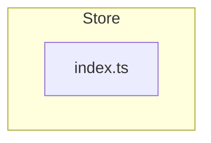
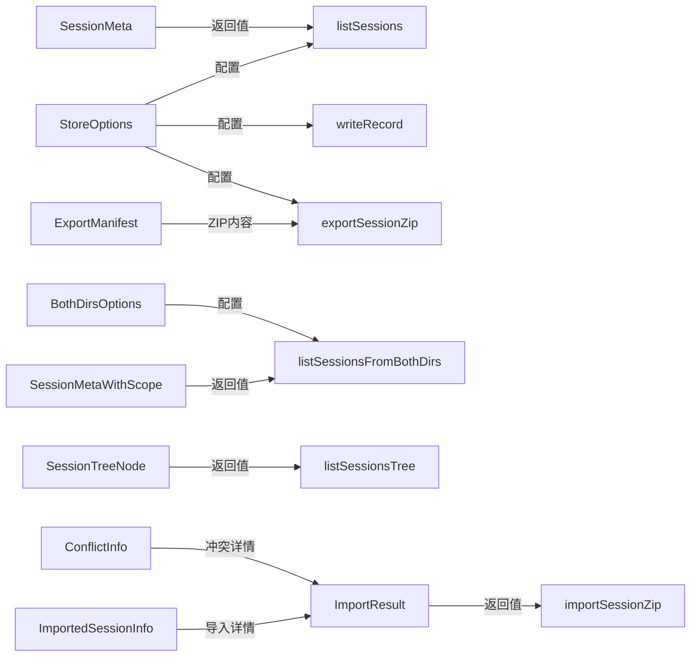
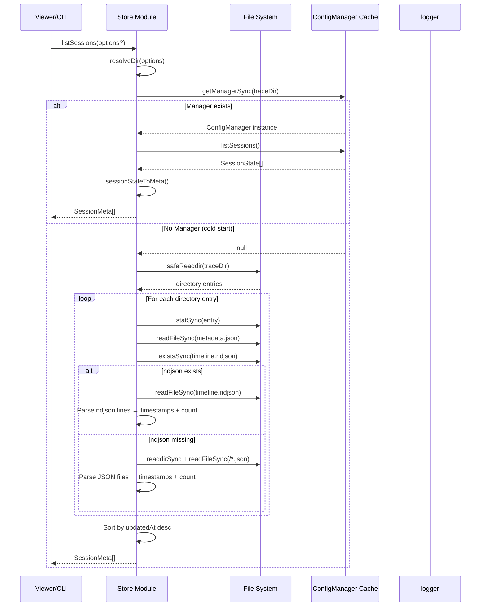
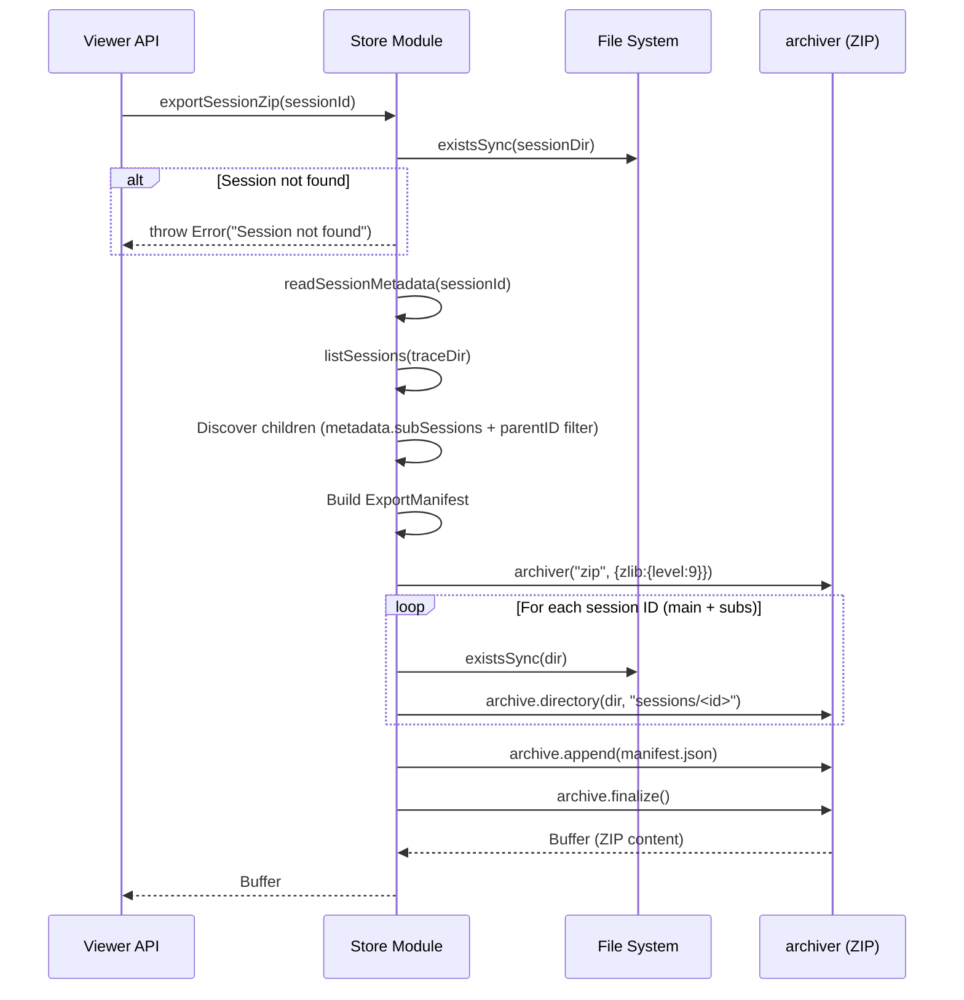

# M04-Store

## 概述

Store 模块是 opencode-trace 项目中文件系统操作的唯一入口（CRUD 网关），负责所有 trace 数据的读写、会话列表构建、时间线索引读取、元数据管理以及 ZIP 导出/导入。它在系统架构中处于 L2（基础设施层）与 L3（应用逻辑层）的混合位置——既封装了底层文件系统操作（L2），又承载了会话树构建、冲突检测等业务逻辑（L3）。如果移除此模块，系统将完全失去持久化能力：无法列出会话、无法读写记录、无法导出/导入数据，viewer 和 CLI 都将无法运作。

---

## 元数据

|字段|值|
|-|-|
|模块 ID|M04|
|路径|core/src/store/|
|文件数|2 (index.ts, index.test.ts)|
|代码行数|792 (index.ts) + 1535 (index.test.ts)|
|主要语言|TypeScript|
|所属层|混合 L2+L3（基础设施 + 应用逻辑）|

---

## 文件结构



|文件|职责|行数|主要导出|
|-|-|-|-|
|index.ts|文件系统 CRUD 网关 — 全部 6 个职责域|792|18 个导出函数 + 11 个导出类型|

---

## 功能树

```text
M04-Store (file-system CRUD gateway)
├── index.ts
│   ├── Session Listing / Tree Building
│   │   ├── fn: listSessions(options?) → SessionMeta[] — List all sessions from a single trace dir
│   │   ├── fn: listSessionsTree(options?) → SessionTreeNode[] — Build parent-child tree from single dir
│   │   ├── fn: listSessionsFromBothDirs(options) → SessionMetaWithScope[] — Merge sessions from global + local dirs
│   │   └── fn: listSessionsTreeFromBothDirs(options) → SessionTreeNodeWithScope[] — Build tree from merged dirs
│   ├── Record Read / Write
│   │   ├── fn: getRecord(sessionId, recordId, options?) → TraceRecord | null — Read single record by seq number
│   │   ├── fn: getSessionRecords(sessionId, options?) → TraceRecord[] — Read all records for a session
│   │   ├── fn: getSSEStream(sessionId, recordId, options?) → string | null — Read raw SSE stream file
│   │   └── fn: writeRecord(sessionId, seq, record, options?) → Promise<void> — Write a trace record via ConfigManager
│   │   └── fn: initStore(options?) → Promise<void> — Initialize ConfigManager for a trace dir
│   ├── Parsed Cache Reading
│   │   └── fn: getCachedParsed(sessionId, seq, options?) → Record<string, unknown> | null — Read parsed cache with version validation
│   ├── Timeline Index Reading
│   │   └── fn: readTimelineIndex(sessionId, options?) → TimelineEntry[] — Read timeline.ndjson summary index
│   ├── Metadata CRUD
│   │   ├── fn: readSessionMetadata(sessionId, traceDir) → SessionMetadataFile | null — Read session metadata.json
│   │   └── fn: writeSessionMetadata(sessionId, metadata, traceDir) → void — Write session metadata.json (non-atomic)
│   ├── Export / Import ZIP
│   │   ├── fn: exportSessionZip(sessionId, options?) → Promise<Buffer> — Export session tree as ZIP archive
│   │   └── fn: importSessionZip(zipBuffer, options?) → Promise<ImportResult> — Import ZIP with conflict detection
│   ├── Session Deletion
│   │   ├── fn: deleteSession(sessionId, options?) → Promise<void> — Delete session and all child sessions
│   │   └── fn: deleteSessions(sessionIds, options?) → Promise<{deleted, errors}> — Batch delete sessions
│   └── Utility / Internal
│       ├── fn: getTraceDir(options?) → string — Resolve trace directory path
│       ├── fn: resolveDir(options?) → string — Internal: resolve trace dir with fallback
│       ├── fn: safeReaddir(dir) → string[] — Internal: error-tolerant directory listing
│       ├── fn: getManager(traceDir) → Promise<ConfigManager> — Internal: get/create cached ConfigManager
│       ├── fn: getManagerSync(traceDir) → ConfigManager | null — Internal: get cached ConfigManager synchronously
│       └── fn: sessionStateToMeta(session) → SessionMeta — Internal: convert SessionState to SessionMeta
```

### 功能清单

|名称|类型|文件|行号|描述|
|-|-|-|-|-|
|StoreOptions|interface|index.ts|21|Options with optional traceDir override|
|BothDirsOptions|interface|index.ts|25|Options for listing from both global and local dirs|
|SessionMeta|interface|index.ts|34|Session summary metadata (id, requestCount, timestamps, title, parentID)|
|SessionMetaWithScope|interface|index.ts|46|SessionMeta with required scope (global/local)|
|SessionTreeNodeWithScope|interface|index.ts|50|SessionMetaWithScope with children array|
|SessionTreeNode|interface|index.ts|54|SessionMeta with children array|
|TimelineEntry|interface|index.ts|58|Timeline summary line (seq, url, method, timestamps, tokens, duration)|
|SessionMetadataFile|interface|index.ts|417|Full session metadata file structure|
|ExportManifest|interface|index.ts|427|Export ZIP manifest format|
|ImportResult|interface|index.ts|538|Import result status (success/conflict)|
|ConflictInfo|interface|index.ts|544|Conflict detail with existing/importing comparison|
|ImportedSessionInfo|interface|index.ts|550|Imported session detail with strategy and newId|
|ImportOptions|interface|index.ts|557|Import options extending StoreOptions with conflictStrategy|
|listSessions|fn|index.ts|117|List sessions from a single trace directory|
|listSessionsTree|fn|index.ts|234|Build parent-child tree from single directory|
|listSessionsFromBothDirs|fn|index.ts|738|Merge sessions from global + local dirs with deduplication|
|listSessionsTreeFromBothDirs|fn|index.ts|772|Build tree from merged global + local dirs|
|getSessionRecords|fn|index.ts|253|Read all records for a session, sorted by seq|
|getRecord|fn|index.ts|287|Read a single record by session + seq|
|getSSEStream|fn|index.ts|308|Read raw SSE stream file (.sse)|
|getTraceDir|fn|index.ts|327|Resolve trace directory path|
|writeRecord|fn|index.ts|331|Write a trace record via ConfigManager async path|
|initStore|fn|index.ts|342|Initialize ConfigManager for a trace directory|
|readTimelineIndex|fn|index.ts|347|Read timeline.ndjson entries|
|getCachedParsed|fn|index.ts|378|Read parsed cache with version + mtime validation|
|readSessionMetadata|fn|index.ts|434|Read session metadata.json with schema validation|
|writeSessionMetadata|fn|index.ts|461|Write session metadata.json (non-atomic writeFileSync)|
|exportSessionZip|fn|index.ts|475|Export session + children as ZIP archive|
|importSessionZip|fn|index.ts|561|Import ZIP with conflict detection and 4 strategies|
|deleteSession|fn|index.ts|683|Delete session and all discovered child sessions|
|deleteSessions|fn|index.ts|716|Batch delete with partial success result|

### 职责边界

**做什么**

- 所有 trace 数据的文件系统读写操作（records, metadata, timeline, parsed cache, SSE streams）
- 会话列表构建与树形关系组装（单目录与双目录合并）
- ZIP 导出/导入（含冲突检测和 4 种冲突策略：prompt, rename, skip, overwrite）
- 会话批量删除（含子会话级联删除）
- ConfigManager 缓存管理与初始化
- Parsed cache 版本校验与 mtime 过期检测

**不做什么**

- 不做 HTTP 服务端路由（由 viewer 模块负责）
- 不做数据解析/转换（由 M02-parse 模块负责）
- 不做 CLI 命令解析（由 M15-cli 模块负责）
- 不做 SSE 事件推送（由 viewer 的 chokidar + SSE handler 负责）
- 不做 scope 级别的 trace 开关判断（由 M08-state 和 plugin-instance 负责）

---

## 公共接口契约

### 接口关系图



### 类型定义

```typescript
// [File: core/src/store/index.ts:21]
export interface StoreOptions {
  traceDir?: string;       // 覆盖默认 trace 目录
}

// [File: core/src/store/index.ts:25]
export interface BothDirsOptions {
  globalDir: string;       // 全局 trace 目录路径
  localDir?: string;       // 本地项目 trace 目录路径（可选）
}

// [File: core/src/store/index.ts:34]
export interface SessionMeta {
  id: string;                          // 会话 ID
  requestCount: number;                // 请求数量
  createdAt: string | null;            // 首次请求时间
  updatedAt: string | null;            // 最近响应时间
  title?: string;                      // 会话标题
  parentID?: string;                   // 父会话 ID
  subSessions?: string[];              // 子会话列表
  folderPath?: string;                 // 项目目录路径
  scope?: "global" | "local";         // 存储范围（仅双目录时存在）
}

// [File: core/src/store/index.ts:58]
export interface TimelineEntry {
  seq: number;                          // 记录序号
  url: string;                          // 请求 URL
  method: string;                       // HTTP 方法
  purpose: string;                      // 请求目的
  requestAt: string;                    // 请求时间戳
  responseAt: string | null;            // 响应时间戳
  status: number;                       // HTTP 状态码
  provider: string | null;              // LLM 提供商
  model: string | null;                 // 模型名称
  inputTokens: number | null;           // 输入 token 数
  outputTokens: number | null;          // 输出 token 数
  totalDurationMs: number | null;       // 总耗时（毫秒）
}

// [File: core/src/store/index.ts:417]
export interface SessionMetadataFile {
  sessionId: string;           // 会话 ID
  title?: string;              // 会话标题
  enabled?: boolean;           // trace 开关状态
  parentID?: string;           // 父会话 ID
  subSessions?: string[];      // 子会话 ID 列表
  createdAt?: string;          // 创建时间
  updatedAt?: string;          // 更新时间
}

// [File: core/src/store/index.ts:427]
export interface ExportManifest {
  exportedAt: string;           // 导出时间戳
  mainSession: string;          // 主会话 ID
  sessions: string[];           // 包含的所有会话 ID
  version: string;              // 导出格式版本（"1.0"）
}

// [File: core/src/store/index.ts:538]
export interface ImportResult {
  status: "success" | "conflict";               // 导入状态
  conflicts?: ConflictInfo[];                   // 冲突列表
  importedSessions?: ImportedSessionInfo[];      // 已导入会话列表
}

// [File: core/src/store/index.ts:544]
export interface ConflictInfo {
  sessionId: string;                            // 冲突的会话 ID
  existing: { requestCount: number; createdAt: string };   // 现有会话信息
  importing: { requestCount: number; createdAt: string };  // 导入会话信息
}

// [File: core/src/store/index.ts:550]
export interface ImportedSessionInfo {
  sessionId: string;                            // 原始会话 ID
  requestCount: number;                         // 导入后记录数量
  strategy: "none" | "rename" | "skip" | "overwrite";  // 使用的冲突策略
  newId?: string;                               // rename 后的新 ID
}
```

|类型名|字段/方法|类型|描述|位置|
|-|-|-|-|-|
|StoreOptions|traceDir|string?|覆盖默认 trace 目录|index.ts:22|
|BothDirsOptions|globalDir|string|全局 trace 目录|index.ts:26|
|BothDirsOptions|localDir|string?|本地 trace 目录|index.ts:27|
|SessionMeta|id|string|会话 ID|index.ts:35|
|SessionMeta|requestCount|number|请求数量|index.ts:36|
|SessionMeta|createdAt|string?|首次请求时间|index.ts:37|
|SessionMeta|updatedAt|string?|最近响应时间|index.ts:38|
|SessionMeta|title|string?|会话标题|index.ts:39|
|SessionMeta|parentID|string?|父会话 ID|index.ts:40|
|SessionMeta|scope|"global"|"local"?|存储范围|index.ts:43|
|TimelineEntry|seq|number|记录序号|index.ts:59|
|TimelineEntry|url|string|请求 URL|index.ts:60|
|TimelineEntry|method|string|HTTP 方法|index.ts:61|
|TimelineEntry|purpose|string|请求目的|index.ts:62|
|TimelineEntry|provider|string?|LLM 提供商|index.ts:66|
|TimelineEntry|model|string?|模型名称|index.ts:67|
|TimelineEntry|inputTokens|number?|输入 token 数|index.ts:68|
|TimelineEntry|outputTokens|number?|输出 token 数|index.ts:69|
|ExportManifest|version|string|导出格式版本|index.ts:431|
|ImportResult|status|"success"|"conflict"|导入状态|index.ts:539|
|ConflictInfo|sessionId|string|冲突的会话 ID|index.ts:545|
|ImportedSessionInfo|strategy|"none"|"rename"|"skip"|"overwrite"|冲突策略|index.ts:553|

### 导出函数

#### `listSessions()`

```typescript
// [File: core/src/store/index.ts:117]
export function listSessions(options?: StoreOptions): SessionMeta[]
```

|参数|类型|必需|描述|
|-|-|-|-|
|options|StoreOptions?|否|可指定 traceDir 覆盖默认路径|

- **返回**：`SessionMeta[]` — 会话摘要列表，按 updatedAt 降序排序
- **抛出**：不显式抛出，内部错误静默处理并记录日志

**使用示例**：

```typescript
import { listSessions } from '@opencode-trace/core/store'
const sessions = listSessions({ traceDir: '/custom/path' })
// 返回 [{ id: 'sess-1', requestCount: 5, updatedAt: '2024-...', ... }]
```

#### `listSessionsTree()`

```typescript
// [File: core/src/store/index.ts:234]
export function listSessionsTree(options?: StoreOptions): SessionTreeNode[]
```

|参数|类型|必需|描述|
|-|-|-|-|
|options|StoreOptions?|否|可指定 traceDir|

- **返回**：`SessionTreeNode[]` — 树形结构，根节点为无 parentID 的会话，children 为其子会话

#### `listSessionsFromBothDirs()`

```typescript
// [File: core/src/store/index.ts:738]
export function listSessionsFromBothDirs(options: BothDirsOptions): SessionMetaWithScope[]
```

|参数|类型|必需|描述|
|-|-|-|-|
|options.globalDir|string|是|全局 trace 目录|
|options.localDir|string?|否|本地 trace 目录|

- **返回**：`SessionMetaWithScope[]` — 合并后的会话列表，local 覆盖 global 的同名会话（去重优先 local）

#### `listSessionsTreeFromBothDirs()`

```typescript
// [File: core/src/store/index.ts:772]
export function listSessionsTreeFromBothDirs(options: BothDirsOptions): SessionTreeNodeWithScope[]
```

|参数|类型|必需|描述|
|-|-|-|-|
|options|BothDirsOptions|是|globalDir + optional localDir|

- **返回**：`SessionTreeNodeWithScope[]` — 双目录合并后的树形结构

#### `getRecord()`

```typescript
// [File: core/src/store/index.ts:287]
export function getRecord(sessionId: string, recordId: number, options?: StoreOptions): TraceRecord | null
```

|参数|类型|必需|描述|
|-|-|-|-|
|sessionId|string|是|会话 ID|
|recordId|number|是|记录序号（seq）|
|options|StoreOptions?|否|traceDir 覆盖|

- **返回**：`TraceRecord | null` — 单条记录，读取失败或不存在返回 null
- **行为**：使用 TraceRecordSchema.safeParse 验证 JSON

#### `getSessionRecords()`

```typescript
// [File: core/src/store/index.ts:253]
export function getSessionRecords(sessionId: string, options?: StoreOptions): TraceRecord[]
```

|参数|类型|必需|描述|
|-|-|-|-|
|sessionId|string|是|会话 ID|
|options|StoreOptions?|否|traceDir|

- **返回**：`TraceRecord[]` — 该会话所有记录，按 seq 升序排序

#### `getSSEStream()`

```typescript
// [File: core/src/store/index.ts:308]
export function getSSEStream(sessionId: string, recordId: number, options?: StoreOptions): string | null
```

|参数|类型|必需|描述|
|-|-|-|-|
|sessionId|string|是|会话 ID|
|recordId|number|是|记录序号|
|options|StoreOptions?|否|traceDir|

- **返回**：`string | null` — 原始 SSE 流文本内容

#### `writeRecord()`

```typescript
// [File: core/src/store/index.ts:331]
export async function writeRecord(sessionId: string, seq: number, record: TraceRecord, options?: StoreOptions): Promise<void>
```

|参数|类型|必需|描述|
|-|-|-|-|
|sessionId|string|是|会话 ID|
|seq|number|是|记录序号|
|record|TraceRecord|是|完整 trace 记录|
|options|StoreOptions?|否|traceDir|

- **返回**：`Promise<void>` — 异步写入，通过 ConfigManager 的 AsyncWriteQueue

#### `initStore()`

```typescript
// [File: core/src/store/index.ts:342]
export async function initStore(options?: StoreOptions): Promise<void>
```

- **返回**：`Promise<void>` — 初始化指定 traceDir 的 ConfigManager

#### `readTimelineIndex()`

```typescript
// [File: core/src/store/index.ts:347]
export function readTimelineIndex(sessionId: string, options?: StoreOptions): TimelineEntry[]
```

|参数|类型|必需|描述|
|-|-|-|-|
|sessionId|string|是|会话 ID|
|options|StoreOptions?|否|traceDir|

- **返回**：`TimelineEntry[]` — timeline.ndjson 中的所有条目，跳过格式错误的行

#### `getCachedParsed()`

```typescript
// [File: core/src/store/index.ts:378]
export function getCachedParsed(sessionId: string, seq: number, options?: StoreOptions): Record<string, unknown> | null
```

|参数|类型|必需|描述|
|-|-|-|-|
|sessionId|string|是|会话 ID|
|seq|number|是|记录序号|
|options|StoreOptions?|否|traceDir|

- **返回**：`Record<string, unknown> | null` — 缓存的 parsed 数据（去掉 _pcv 内部标记）
- **校验逻辑**：(1) 检查 _pcv 版本号匹配 PARSED_CACHE_VERSION；(2) 检查 .parsed mtime >= .json mtime（过期返回 null）

#### `readSessionMetadata()`

```typescript
// [File: core/src/store/index.ts:434]
export function readSessionMetadata(sessionId: string, traceDir: string): SessionMetadataFile | null
```

|参数|类型|必需|描述|
|-|-|-|-|
|sessionId|string|是|会话 ID|
|traceDir|string|是|trace 目录（注意：不是 StoreOptions）|

- **返回**：`SessionMetadataFile | null` — 通过 SessionMetadataFileSchema 验证的元数据，注入 sessionId 字段

#### `writeSessionMetadata()`

```typescript
// [File: core/src/store/index.ts:461]
export function writeSessionMetadata(sessionId: string, metadata: SessionMetadataFile, traceDir: string): void
```

|参数|类型|必需|描述|
|-|-|-|-|
|sessionId|string|是|会话 ID|
|metadata|SessionMetadataFile|是|元数据内容|
|traceDir|string|是|trace 目录（注意：不是 StoreOptions）|

- **行为**：使用 writeFileSync 直接写入（非原子写入，无 .tmp+rename 保护）

#### `exportSessionZip()`

```typescript
// [File: core/src/store/index.ts:475]
export async function exportSessionZip(sessionId: string, options?: StoreOptions): Promise<Buffer>
```

|参数|类型|必需|描述|
|-|-|-|-|
|sessionId|string|是|主会话 ID|
|options|StoreOptions?|否|traceDir|

- **返回**：`Promise<Buffer>` — ZIP 文件二进制内容
- **抛出**：`Error("Session not found")` — 会话目录不存在时

**使用示例**：

```typescript
import { exportSessionZip } from '@opencode-trace/core/store'
const zipBuffer = await exportSessionZip('session-abc', { traceDir: '/custom' })
```

#### `importSessionZip()`

```typescript
// [File: core/src/store/index.ts:561]
export async function importSessionZip(zipBuffer: Buffer, options?: ImportOptions): Promise<ImportResult>
```

|参数|类型|必需|描述|
|-|-|-|-|
|zipBuffer|Buffer|是|ZIP 二进制数据|
|options|ImportOptions?|否|traceDir + conflictStrategy (默认 "prompt")|

- **返回**：`ImportResult` — 成功时 status="success"，冲突时 status="conflict" 并返回冲突列表
- **抛出**：`Error("Failed to extract ZIP file")` — ZIP 解压失败；`Error("Invalid export format: missing manifest.json")` — 缺少 manifest

#### `deleteSession()`

```typescript
// [File: core/src/store/index.ts:683]
export async function deleteSession(sessionId: string, options?: StoreOptions): Promise<void>
```

- **抛出**：`Error("Session not found")` — 会话目录不存在
- **行为**：级联删除所有子会话（metadata.subSessions + parentID 反查）

#### `deleteSessions()`

```typescript
// [File: core/src/store/index.ts:716]
export async function deleteSessions(sessionIds: string[], options?: StoreOptions): Promise<{ deleted: string[]; errors: { sessionId: string; error: string }[] }>
```

- **返回**：部分成功结果 — deleted 列表 + errors 列表（不中断）

#### `getTraceDir()`

```typescript
// [File: core/src/store/index.ts:327]
export function getTraceDir(options?: StoreOptions): string
```

- **返回**：`string` — 解析后的 trace 目录路径

---

## 内部实现

### 核心内部逻辑

|函数/类|文件|行号|用途|
|-|-|-|-|
|resolveDir|index.ts|30|将 StoreOptions.traceDir 回退到 getDefaultTraceDir()|
|safeReaddir|index.ts|73|封装 readdirSync，ENOENT 时 warn + 返回 []，其他错误 error + 返回 []|
|managers|index.ts|87|Map<string, ConfigManager> — 每个 traceDir 缓存一个 ConfigManager 实例|
|initPromises|index.ts|88|Map<string, Promise<void> — 防止同一 traceDir 的并发初始化|
|getManager|index.ts|90|获取/创建 ConfigManager 并等待初始化完成（单例模式）|
|getManagerSync|index.ts|100|同步获取已缓存的 ConfigManager（未初始化返回 null）|
|sessionStateToMeta|index.ts|104|将 SessionState (from M08-state) 转换为 SessionMeta|

### 设计模式

|模式|使用位置|使用原因|代码证据|
|-|-|-|-|
|Singleton Cache (per traceDir)|getManager|避免重复创建和初始化 ConfigManager，保证同一 traceDir 只有一个活跃实例|index.ts:87-98|
|Performance Hierarchy (ndjson → JSON fallback)|listSessions|优先读取轻量 timeline.ndjson，仅在 ndjson 不可用时扫描全部 JSON 文件|index.ts:154-211|
|Cache Versioning (_pcv)|getCachedParsed|防止 viewer 使用过期格式的 parsed cache，格式变更时拒绝旧缓存|index.ts:401|
|Mtime-based staleness check|getCachedParsed|比较 .parsed 与 .json 的 mtimeMs，若 source 更新则缓存过期|index.ts:393-395|
|Conflict Strategy Pattern|importSessionZip|支持 4 种策略（prompt/rename/skip/overwrite），prompt 模式返回冲突列表让调用方决定|index.ts:561-681|
|Dedup-by-overwrite (local wins)|listSessionsFromBothDirs|global 先入 Map，local 后入覆盖同名 key — local 优先|index.ts:757-765|

### 关键算法 / 策略

|算法/策略|用途|复杂度|文件|
|-|-|-|-|
|Session tree building (2-pass)|从 flat list 构建 parent-child tree|O(n²) 简单实现（filter per parent）|index.ts:234-251|
|Merged session listing (Map dedup)|global+local 去重，local 覆盖 global|O(n) Map 操作|index.ts:738-770|
|SubSession discovery (metadata + reverse lookup)|export/delete 时合并 metadata.subSessions 与 parentID 反查|O(n) per operation|index.ts:486-498, 694-704|
|Parsed cache validation (version + mtime)|确保缓存与当前 parser 版本和 source 数据一致|O(1) 读取 + 比较|index.ts:382-415|

---

## 关键流程

### 流程 1：Session Listing (单目录)

**调用链**

```text
viewer/listSessions → store/index.ts:117 listSessions →
  index.ts:30 resolveDir → index.ts:100 getManagerSync →
    (有 manager? → index.ts:105 sessionStateToMeta → 直接返回)
    (无 manager? → index.ts:73 safeReaddir →
      index.ts:154-211 ndjson优先/JSON兜底 → index.ts:229 排序返回)
```

**时序图**



**步骤详解**

|步骤|说明|文件位置|
|-|-|-|
|1|解析 traceDir：options?.traceDir ?? getDefaultTraceDir()|index.ts:30-32|
|2|检查是否有缓存的 ConfigManager（快速路径）|index.ts:100-102|
|3|若有 manager，直接调用 manager.listSessions() 获取 SessionState，转换为 SessionMeta|index.ts:104-115|
|4|若无 manager，执行文件系统扫描：safeReaddir 获取目录列表|index.ts:73-85|
|5|对每个目录条目：读取 metadata.json 获取 title/parentID/folderPath|index.ts:137-149|
|6|优先读取 timeline.ndjson（轻量路径）：获取 requestCount、createdAt、updatedAt|index.ts:154-184|
|7|若 ndjson 不可用，回退扫描所有 /^\d+\.json$/ 文件（重量路径）|index.ts:187-211|
|8|按 updatedAt 降序排序返回|index.ts:229-231|

### 流程 2：Record Read (单条记录)

**调用链**

```text
viewer/getRecord → store/index.ts:287 getRecord →
  index.ts:30 resolveDir → index.ts:292 join(sessionDir, seq.json) →
  readFileSync → TraceRecordSchema.safeParse → 返回/null
```

**步骤详解**

|步骤|说明|文件位置|
|-|-|-|
|1|构建文件路径：join(resolveDir(options), sessionId, `${recordId}.json`)|index.ts:292|
|2|readFileSync 读取原始 JSON|index.ts:294|
|3|使用 TraceRecordSchema.safeParse 验证格式|index.ts:295|
|4|验证成功返回 parsed.data，失败或读取异常返回 null 并记录错误日志|index.ts:296-306|

### 流程 3：Export ZIP

**调用链**

```text
viewer/export → store/index.ts:475 exportSessionZip →
  index.ts:434 readSessionMetadata → index.ts:117 listSessions →
  subSession discovery → archiver.directory → archiver.append(manifest) → finalize
```

**时序图**



**步骤详解**

|步骤|说明|文件位置|
|-|-|-|
|1|检查会话目录是否存在，不存在抛出 Error|index.ts:482-484|
|2|读取 metadata.json 获取 subSessions 列表|index.ts:486-487|
|3|调用 listSessions 反查所有 parentID === sessionId 的子会话|index.ts:489-492|
|4|合并两个来源的子会话列表（去重）|index.ts:494-496|
|5|构建 ExportManifest 对象|index.ts:500-505|
|6|使用 archiver 创建 ZIP，遍历所有会话目录添加到 archive|index.ts:507-528|
|7|追加 manifest.json 到 ZIP|index.ts:530-532|
|8|finalize 并通过 Promise 返回 Buffer|index.ts:534|

---

## 依赖

### 内部依赖（项目内其他模块）

|模块|使用的接口|调用位置|
|-|-|-|
|M01-types|TraceRecord 类型|index.ts:14|
|M08-state|ConfigManager, SessionState|index.ts:15|
|M09-schemas|TraceRecordSchema, SessionMetadataFileSchema|index.ts:16,20|
|M02-parse|PARSED_CACHE_VERSION|index.ts:18|
|M10-logger|logger.warn(), logger.error()|index.ts:82,84,204,280,298,320,369,407,452|
|M11-platform|getTraceDir() (getDefaultTraceDir)|index.ts:13|

### 外部依赖（第三方包）

|包名|版本|用途|可替代性|
|-|-|-|-|
|archiver|^7.0|ZIP 导出（流式创建 ZIP archive）|低（流式 API 设计独特）|
|adm-zip|^0.5|ZIP 导入（解压 + 文件读取）|中（可用 jszip 替代，但 adm-zip 同步 API 更简单）|
|zod|—（来自 schemas）|TraceRecordSchema.safeParse 验证|低（项目整体依赖 zod）|

---

## 代码质量与风险

### 代码坏味道

|问题|类型|文件|严重度|建议|
|-|-|-|-|-|
|792 行单文件承载 6 个职责域|过大模块|index.ts|高|拆分为 store-read, store-write, store-export 子模块|
|listSessions 内部 ndjson/JSON 双路径逻辑嵌入 70+ 行|过长函数|index.ts:117-231|中|抽取 readNdjsonIndex() 和 scanJsonFiles() 为独立函数|
|writeSessionMetadata 使用 plain writeFileSync 而非 .tmp+rename|非原子写入|index.ts:465-472|高|改用 safeRename 模式（与 AsyncWriteQueue 保持一致）|
|importSessionZip 文件复制使用 readFileSync + writeFileSync|重复代码|index.ts:661-666|中|考虑 cpSync 或流式复制|
|listSessionsTree 使用 O(n²) filter 查找子会话|低效算法|index.ts:241-246|低|可预构建 parentId→children Map 降为 O(n)|
|readSessionMetadata 参数为 traceDir 而非 StoreOptions（不一致）|接口不一致|index.ts:434-436|中|统一使用 StoreOptions 或明确标注差异原因|

### 潜在风险

|风险|触发条件|影响|文件|建议|
|-|-|-|-|-|
|ConfigManager 缓存永不过期|长运行进程，traceDir 被外部清理或重建|getManager 返回 stale 实例，可能写入不存在目录|index.ts:87-98|添加缓存失效机制或在关键操作前检查目录存在性|
|非原子 metadata 写入|并发写入 metadata.json（viewer API + plugin 同时操作）|数据丢失或 JSON 格式损坏|index.ts:465-472|采用 .tmp+rename atomic write 模式|
|Parsed cache mtime 比较精度|NTFS 上 mtimeMs 精度仅 ~2s，快速连续写入可能误判|缓存被错误地视为过期或过期缓存被错误使用|index.ts:393-395|在 Windows CI 上增加 mtime 容差或使用内容 hash|
|importSessionZip 临时目录清理|进程在 rmSync 前崩溃|留下 .temp-import-* 残留目录|index.ts:568-580|使用 process.on('exit') 清理或在启动时扫描残留|
|deleteSession 级联删除不可逆|用户误删父会话|所有子会话一并删除且无备份|index.ts:683-714|导出前提醒或先移到 .trash/ 而非直接 rmSync|
|同步 I/O 阻塞|大型 trace 目录（数千会话 × 数百记录）|listSessions / getSessionRecords 阻塞事件循环|index.ts:117-231|考虑异步版本或 Worker 线程|

### 测试覆盖

|测试类型|覆盖情况|测试文件|说明|
|-|-|-|-|
|单元测试|部分|index.test.ts (1535 lines)|覆盖 listSessionsTree, exportSessionZip, importSessionZip, deleteSession, listSessionsFromBothDirs, listSessionsTreeFromBothDirs, getSessionRecords, getRecord, getSSEStream, readTimelineIndex, getCachedParsed, deleteSessions — 共 12 个 describe 块|
|集成测试|有|index.test.ts|ZIP 导出→导入往返测试覆盖 export/import 交互|
|缺失覆盖|—|—|writeRecord, writeSessionMetadata, initStore 无直接测试（依赖 ConfigManager 间接覆盖）；listSessions 的 ndjson 快速路径仅部分覆盖|

---

## 开发指南

### 洞察

Store 模块是整个项目的"数据中心"——所有模块对 trace 数据的读写都经过此处。这种集中化设计确保了文件系统操作的一致性（统一使用 safeReaddir、TraceRecordSchema 验证、PARSED_CACHE_VERSION 版本控制），但也导致了模块过重（792 行，6 职责域）。最关键的设计权衡是 **同步 I/O vs 异步 I/O**：读取函数（listSessions, getRecord 等）全部同步，因为 viewer 的 Fastify handler 和 CLI 命令需要在单次请求中返回完整数据；写入函数（writeRecord）异步，因为需要通过 ConfigManager 的 AsyncWriteQueue 保证原子性。

### 扩展指南

要向 Store 模块添加新功能：

1. **新增读取函数**：在 index.ts 末尾添加导出函数，遵循 (sessionId, options?) 参数模式，内部使用 resolveDir + readFileSync/safeReaddir，添加 TraceRecordSchema.safeParse 验证（如涉及 record），添加 logger.error 日志（如涉及错误处理）
2. **新增写入函数**：优先通过 getManager(traceDir) 获取 ConfigManager，利用其 AsyncWriteQueue 保证原子性；若需直接写入，必须使用 .tmp+rename 模式而非裸 writeFileSync
3. **新增类型**：在 index.ts 文件顶部定义 interface（当前所有类型都在此文件中），避免引入单独的类型文件以保持模块内聚性
4. **新增 ZIP 操作**：参考 exportSessionZip/importSessionZip 的 pattern——导出用 archiver（流式），导入用 adm-zip（同步），都需处理 manifest.json 和子会话级联

### 风格与约定

- **参数模式**：读取函数使用 `(sessionId, options?: StoreOptions)` 或 `(sessionId, traceDir: string)`；后者仅在 metadata 函数中使用（历史原因，不推荐新函数采用）
- **错误处理**：读取函数返回 null 而非抛出（getRecord, getCachedParsed, readSessionMetadata）；存在性检查函数抛出 Error（exportSessionZip, deleteSession 在会话不存在时抛出）
- **文件过滤**：始终使用 `/^\d+\.json$/` 正则过滤 record 文件，绝不用 `.endsWith(".json")`（后者会误匹配 metadata.json）
- **日志**：所有 I/O 错误使用 logger.error，目录不存在使用 logger.warn

### 设计哲学

1. **File System is Source of Truth**：Store 模块不维护内存缓存（除了 ConfigManager 实例缓存），所有读取都从磁盘实时获取，确保数据一致性
2. **Graceful Degradation**：safeReaddir 返回 [] 而非抛出，safeParse 失败返回 null，ndjson 不可用回退到 JSON 扫描——每一层都有容错机制
3. **Performance Hierarchy**：timeline.ndjson（轻量） → parsed cache（中量） → raw JSON + detectAndParse（重量）——读取优先使用最快的数据源
4. **Local Wins on Dedup**：双目录合并时 local 覆盖 global，因为 local 目录中的数据更"新鲜"（最近的项目级别 trace）

### 修改检查清单

- [ ] 新增导出函数是否遵循 `(sessionId, options?)` 参数模式
- [ ] 新增文件过滤是否使用 `/^\d+\.json$/` 而非 `.endsWith(".json")`
- [ ] 新增写入操作是否使用 .tmp+rename 或 AsyncWriteQueue（而非裸 writeFileSync）
- [ ] 新增类型是否在 index.ts 中定义并导出
- [ ] 修改 parsed cache 格式是否同步更新 PARSED_CACHE_VERSION（见 AGENTS.md "Parsed Cache Versioning" 章节）
- [ ] 修改 export/import 格式是否更新 ExportManifest.version
- [ ] 新增测试是否使用 `path.join(tmpdir(), ...)` 构建路径（而非硬编码 POSIX 路径）
- [ ] 测试中的文件计数是否使用 `/^\d+\.json$/` 而非 `.endsWith(".json")`