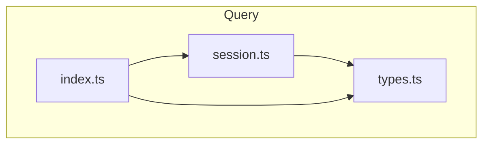
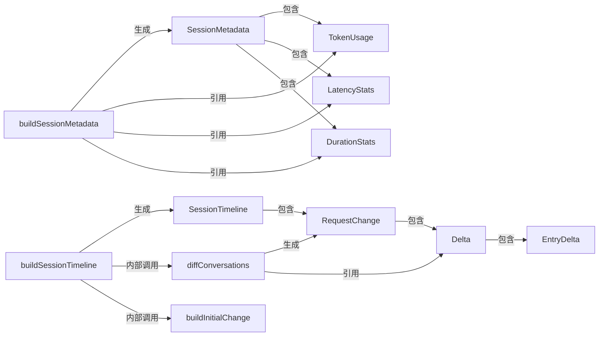
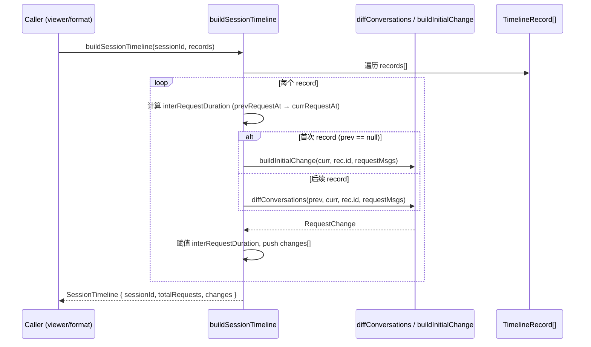
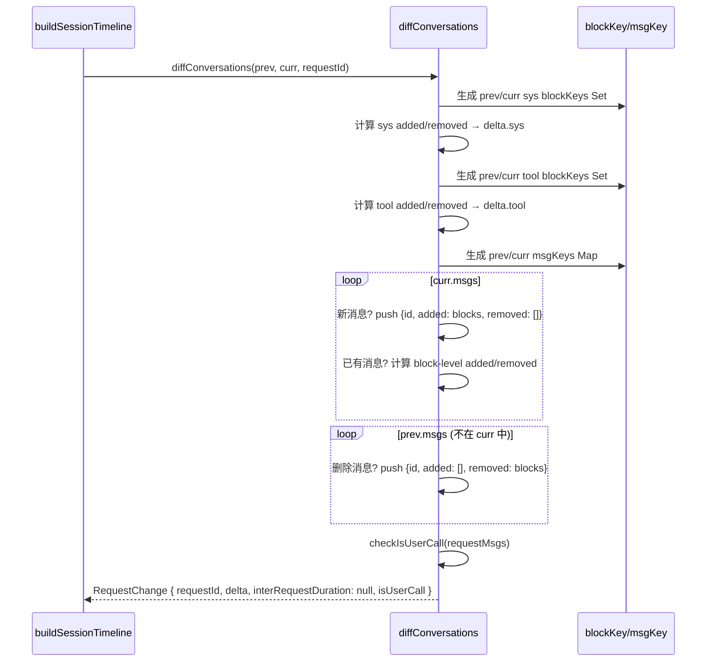
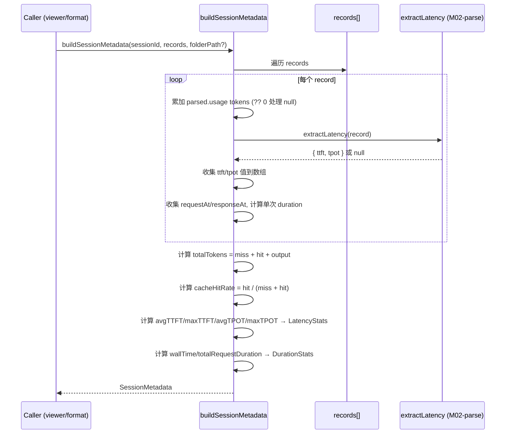

# M05-Query

## 概述

M05-Query 模块负责将已解析的 Conversation 数据聚合为面向会话的高层视图。它解决的核心问题是：原始逐条请求的对话数据难以直接展示，需要计算相邻请求间的增量变化（diff）、汇总整个会话的 token 消耗与延迟统计、以及构建时间线索引。在系统架构中，它位于应用逻辑层（L3），是解析层（M02-parse）与展示层（M06-format / M21-viewer）之间的桥梁。若移除该模块，系统将无法提供会话级别的增量视图和统计摘要，viewer 的时间线面板和统计卡片将失去数据来源。

---

## 元数据

|字段|值|
|-|-|
|模块 ID|M05|
|路径|packages/core/src/query/|
|文件数|3（index.ts, session.ts, types.ts）|
|代码行数|376|
|主要语言|TypeScript|
|所属层|Application Logic (L3)|

---

## 文件结构



|文件|职责|行数|主要导出|
|-|-|-|-|
|types.ts|定义所有查询结果的类型接口（Delta, RequestChange, SessionTimeline, SessionMetadata 等）|67|EntryDelta, Delta, RequestChange, SessionTimeline, TokenUsage, LatencyStats, DurationStats, SessionMetadata, TimelineRecord|
|session.ts|核心实现：diff 计算、时间线构建、元数据聚合|295|diffConversations, buildSessionTimeline, buildSessionMetadata|
|index.ts|模块入口，统一导出函数和类型|14|diffConversations, buildSessionTimeline, buildSessionMetadata, RequestChange, SessionTimeline, Delta, EntryDelta, SessionMetadata, TokenUsage, LatencyStats|

---

## 功能树

```text
M05-Query (session aggregation & diff)
├── types.ts
│   ├── interface: EntryDelta — 单条消息的增量变化
│   ├── interface: Delta — 一个请求内的完整增量
│   ├── interface: RequestChange — 单次请求的变更记录
│   ├── interface: SessionTimeline — 会话时间线
│   ├── interface: TokenUsage — token 使用统计
│   ├── interface: LatencyStats — 延迟统计
│   ├── interface: DurationStats — 时长统计
│   ├── interface: SessionMetadata — 会话元数据
│   └── interface: TimelineRecord — 时间线输入记录
├── session.ts
│   ├── fn: blockKey(block: Block): string — 生成 block 的唯一标识键
│   ├── fn: msgKey(msg: Entry): string — 生成消息的唯一标识键
│   ├── fn: diffConversations(prev, curr, currRequestId, requestMsgs?): RequestChange — 计算两个对话间的增量
│   ├── fn: buildInitialChange(conv, requestId, requestMsgs?): RequestChange — 构建首次请求的初始变更
│   ├── fn: checkIsUserCall(msgs: Entry[]): boolean — 检查请求是否为用户主动调用
│   ├── fn: buildSessionTimeline(sessionId, records): SessionTimeline — 构建会话时间线
│   └── fn: buildSessionMetadata(sessionId, records, folderPath?): SessionMetadata — 构建会话元数据
└── index.ts
    └── re-export: 函数和类型统一导出
```

### 功能清单

|名称|类型|文件|行号|描述|
|-|-|-|-|-|
|EntryDelta|interface|types.ts|6|单条消息的增量（added/removed blocks）|
|Delta|interface|types.ts|12|一次请求的完整增量（sys, tool, msgs）|
|RequestChange|interface|types.ts|15|单次请求变更记录（delta + interRequestDuration + isUserCall）|
|SessionTimeline|interface|types.ts|22|会话时间线（sessionId + totalRequests + changes）|
|TokenUsage|interface|types.ts|28|token 使用汇总（inputMiss, inputHit, output, total, cacheHitRate）|
|LatencyStats|interface|types.ts|36|延迟统计（avgTTFT, maxTTFT, avgTPOT, maxTPOT, streamRequestCount）|
|DurationStats|interface|types.ts|44|时长统计（wallTime, totalRequestDuration）|
|SessionMetadata|interface|types.ts|49|会话完整元数据（tokenUsage + latency + duration + requestCount + sessionInfo）|
|TimelineRecord|interface|types.ts|62|时间线输入记录（id + requestAt + requestMsgs + parsed）|
|blockKey|fn|session.ts|16|生成 Block 的唯一标识键（用于 diff 匹配）|
|msgKey|fn|session.ts|40|生成 Entry 的唯一标识键（用于 diff 匹配）|
|diffConversations|fn|session.ts|41|计算两个 Conversation 间的增量变化|
|buildInitialChange|fn|session.ts|125|构建首次请求的完整变更（所有内容视为新增）|
|checkIsUserCall|fn|session.ts|147|判断请求是否由用户主动发起（最后消息含 text block）|
|buildSessionTimeline|fn|session.ts|154|构建会话时间线（遍历 records，逐条生成 RequestChange）|
|buildSessionMetadata|fn|session.ts|195|构建会话元数据（聚合 token/latency/duration 统计）|

### 职责边界

**做什么**

- 将相邻 Conversation 对比，计算 block-level 的增量（added/removed）
- 将会话内所有请求聚合为时间线（含 interRequestDuration 和 isUserCall 标记）
- 将会话内所有请求的 usage/latency/duration 数据聚合为统计摘要
- 区分 "用户主动调用" vs "工具自动调用"（isUserCall）

**不做什么**

- 不负责解析原始请求/响应数据（由 M02-parse 完成）
- 不负责数据持久化或 I/O 操作（纯计算，无文件读写）
- 不负责数据格式化/展示（由 M06-format 完成）
- 不负责实时事件推送（由 M21-viewer 的 SSE 层完成）

---

## 公共接口契约

### 接口关系图



### 类型定义

```typescript
// [File: packages/core/src/query/types.ts:6]
export interface EntryDelta {
  id: string;
  added?: Block[];
  removed?: Block[];
}

// [File: packages/core/src/query/types.ts:12]
export interface Delta {
  sys?: EntryDelta;
  tool?: EntryDelta;
  msgs: EntryDelta[];
}

// [File: packages/core/src/query/types.ts:15]
export interface RequestChange {
  requestId: number;
  delta: Delta;
  interRequestDuration: number | null;
  isUserCall: boolean;
}

// [File: packages/core/src/query/types.ts:22]
export interface SessionTimeline {
  sessionId: string;
  totalRequests: number;
  changes: RequestChange[];
}

// [File: packages/core/src/query/types.ts:28]
export interface TokenUsage {
  inputMissTokens: number;
  inputHitTokens: number;
  outputTokens: number;
  totalTokens: number;
  cacheHitRate: number;
}

// [File: packages/core/src/query/types.ts:36]
export interface LatencyStats {
  avgTTFT: number | null;
  maxTTFT: number | null;
  avgTPOT: number | null;
  maxTPOT: number | null;
  streamRequestCount: number;
}

// [File: packages/core/src/query/types.ts:44]
export interface DurationStats {
  wallTime: number;
  totalRequestDuration: number;
}

// [File: packages/core/src/query/types.ts:49]
export interface SessionMetadata {
  sessionId: string;
  tokenUsage: TokenUsage;
  requestCount: number;
  subSessions: string[];
  parentSession: string | null;
  createdAt: string | null;
  updatedAt: string | null;
  folderPath?: string;
  latencyStats: LatencyStats | null;
  durationStats: DurationStats | null;
}

// [File: packages/core/src/query/types.ts:62]
export interface TimelineRecord {
  id: number;
  requestAt?: string;
  requestMsgs?: Entry[];
  parsed: Conversation;
}
```

|类型名|字段/方法|类型|描述|位置|
|-|-|-|-|-|
|EntryDelta|id|string|消息 ID|types.ts:7|
|EntryDelta|added|Block[]|新增的 blocks|types.ts:8|
|EntryDelta|removed|Block[]|移除的 blocks|types.ts:9|
|Delta|sys|EntryDelta|系统提示增量|types.ts:13|
|Delta|tool|EntryDelta|工具定义增量|types.ts:14|
|Delta|msgs|EntryDelta[]|消息增量列表|types.ts:15|
|RequestChange|requestId|number|请求序号|types.ts:16|
|RequestChange|delta|Delta|增量详情|types.ts:17|
|RequestChange|interRequestDuration|number|null|相邻请求间隔（ms）|types.ts:18|
|RequestChange|isUserCall|boolean|是否用户主动调用|types.ts:19|
|SessionTimeline|sessionId|string|会话 ID|types.ts:23|
|SessionTimeline|totalRequests|number|总请求数|types.ts:24|
|SessionTimeline|changes|RequestChange[]|变更列表|types.ts:25|
|TokenUsage|inputMissTokens|number|未命中缓存的输入 token|types.ts:29|
|TokenUsage|inputHitTokens|number|命中缓存的输入 token|types.ts:30|
|TokenUsage|outputTokens|number|输出 token|types.ts:31|
|TokenUsage|totalTokens|number|总 token 数|types.ts:32|
|TokenUsage|cacheHitRate|number|缓存命中率|types.ts:33|
|LatencyStats|avgTTFT|number|null|平均首 token 时间|types.ts:37|
|LatencyStats|maxTTFT|number|null|最大首 token 时间|types.ts:38|
|LatencyStats|avgTPOT|number|null|平均每 token 时间|types.ts:39|
|LatencyStats|maxTPOT|number|null|最大每 token 时间|types.ts:40|
|LatencyStats|streamRequestCount|number|流式请求数|types.ts:41|
|DurationStats|wallTime|number|会话墙钟时间（ms）|types.ts:45|
|DurationStats|totalRequestDuration|number|所有请求累计时长（ms）|types.ts:46|
|SessionMetadata|sessionId|string|会话 ID|types.ts:50|
|SessionMetadata|tokenUsage|TokenUsage|token 使用统计|types.ts:51|
|SessionMetadata|requestCount|number|请求总数|types.ts:52|
|SessionMetadata|subSessions|string[]|子会话列表|types.ts:53|
|SessionMetadata|parentSession|string|null|父会话 ID|types.ts:54|
|SessionMetadata|createdAt|string|null|创建时间|types.ts:55|
|SessionMetadata|updatedAt|string|null|更新时间|types.ts:56|
|SessionMetadata|folderPath|string|项目路径（可选）|types.ts:57|
|SessionMetadata|latencyStats|LatencyStats|null|延迟统计|types.ts:58|
|SessionMetadata|durationStats|DurationStats|null|时长统计|types.ts:59|

### 导出函数

#### `diffConversations()`

```typescript
// [File: packages/core/src/query/session.ts:41]
export function diffConversations(
  prev: Conversation,
  curr: Conversation,
  currRequestId: number,
  requestMsgs?: Entry[],
): RequestChange
```

|参数|类型|必需|描述|
|-|-|-|-|
|prev|Conversation|是|前一次请求的对话状态|
|curr|Conversation|是|当前请求的对话状态|
|currRequestId|number|是|当前请求的序号|
|requestMsgs|Entry[]|否|当前请求的消息列表（用于 isUserCall 判断）|

- **返回**：`RequestChange` — 包含 delta（sys/tool/msgs 的 added/removed）、interRequestDuration（null）、isUserCall 标记
- **抛出**：无（纯计算函数，不抛异常）

**使用示例**：

```typescript
import { diffConversations } from '@opencode-trace/core'
const change = diffConversations(prevConversation, currentConversation, requestId)
```

#### `buildSessionTimeline()`

```typescript
// [File: packages/core/src/query/session.ts:154]
export function buildSessionTimeline(
  sessionId: string,
  records: TimelineRecord[],
): SessionTimeline
```

|参数|类型|必需|描述|
|-|-|-|-|
|sessionId|string|是|会话 ID|
|records|TimelineRecord[]|是|按序排列的时间线记录（含 parsed Conversation、requestAt、requestMsgs）|

- **返回**：`SessionTimeline` — 包含 sessionId、totalRequests、按序排列的 RequestChange[]（含 interRequestDuration 计算）
- **抛出**：无（纯计算函数）

**使用示例**：

```typescript
import { buildSessionTimeline } from '@opencode-trace/core'
const timeline = buildSessionTimeline(sessionId, timelineRecords)
```

#### `buildSessionMetadata()`

```typescript
// [File: packages/core/src/query/session.ts:195]
export function buildSessionMetadata(
  sessionId: string,
  records: { id: number; record?: TraceRecord; parsed: Conversation }[],
  folderPath?: string,
): SessionMetadata
```

|参数|类型|必需|描述|
|-|-|-|-|
|sessionId|string|是|会话 ID|
|records|{ id, record?, parsed }[]|是|含原始 TraceRecord 和 parsed Conversation 的记录|
|folderPath|string|否|项目路径|

- **返回**：`SessionMetadata` — 包含 tokenUsage（汇总 inputMiss/inputHit/output/cacheHitRate）、latencyStats（avgTTFT/maxTTFT/avgTPOT/maxTPOT）、durationStats（wallTime/totalRequestDuration）
- **抛出**：无（纯计算函数）

**使用示例**：

```typescript
import { buildSessionMetadata } from '@opencode-trace/core'
const metadata = buildSessionMetadata(sessionId, records, '/path/to/project')
```

---

## 内部实现

### 核心内部逻辑

|函数/类|文件|行号|用途|
|-|-|-|-|
|blockKey|session.ts|16|为每种 Block 类型生成唯一标识键（text/thinking/td/tc/tr/image/other），用于 diff 匹配|
|msgKey|session.ts|40|为 Entry 生成唯一标识键（id:role），用于消息级别的 diff 匹配|
|buildInitialChange|session.ts|125|为首次请求构建初始变更（所有内容视为新增，prev 为 null 时调用）|
|checkIsUserCall|session.ts|147|判断最后一条消息是否包含 text block，标记为用户主动调用|

### 设计模式

|模式|使用位置|使用原因|代码证据|
|-|-|-|-|
|Set-based Diff|session.ts:50-56|使用 Set 存储 prev/curr 的 blockKey/msgKey，高效计算 added/removed|session.ts:50: `new Set(prev.sys.blocks.map(blockKey))`|
|Null-safe Accumulation|session.ts:200-235|所有数值聚合使用 `?? 0` 处理 null/undefined 的 usage 字段，避免 NaN|session.ts:215: `inputMissTokens += usage.inputMissTokens ?? 0`|
|Optional Chain Aggregation|session.ts:222-227|latency/duration 统计仅在数据存在时计算，否则返回 null|session.ts:244: `latencyStats = ... if (ttftValues.length > 0)`|
|Key-based Identity|session.ts:16-34|通过 blockKey/msgKey 生成确定性标识，而非依赖对象引用相等性|session.ts:19: `function blockKey(block: Block): string`|

---

## 关键流程

### 流程 1：buildSessionTimeline — 时间线构建

**调用链**

```text
session.ts:154 → session.ts:162 (遍历 records) → session.ts:178 (首次? buildInitialChange) → session.ts:181 (后续? diffConversations) → session.ts:184 (赋值 interRequestDuration) → session.ts:191 (返回 SessionTimeline)
```

**时序图**



**步骤详解**

|步骤|说明|文件位置|
|-|-|-|
|1|初始化 changes[] 和 prev/prevRequestAt 为 null|session.ts:161-163|
|2|遍历每条 TimelineRecord，取出 parsed Conversation 和 requestMsgs/requestAt|session.ts:165-168|
|3|计算 interRequestDuration：当前 requestAt - 前次 requestAt（毫秒差）|session.ts:170-175|
|4|若 prev 为 null，调用 buildInitialChange（所有内容视为新增）|session.ts:178-179|
|5|若 prev 存在，调用 diffConversations 计算 block/msg 级增量|session.ts:180-181|
|6|将 interRequestDuration 赋值给 change 并推入 changes[]|session.ts:184-185|
|7|更新 prev 和 prevRequestAt，继续下一条|session.ts:187-188|
|8|返回 SessionTimeline 对象|session.ts:191-195|

### 流程 2：diffConversations — 增量计算

**调用链**

```text
session.ts:41 → session.ts:49 (构建 Delta) → session.ts:52-61 (sys diff) → session.ts:63-75 (tool diff) → session.ts:80-106 (msgs diff: 新增消息 + 已有消息的 block diff) → session.ts:111-113 (msgs diff: 删除消息) → session.ts:115 (checkIsUserCall) → session.ts:120-122 (返回 RequestChange)
```

**时序图**



**步骤详解**

|步骤|说明|文件位置|
|-|-|-|
|1|初始化 Delta（msgs 为空数组）|session.ts:49-50|
|2|对比 sys entry：三种情况（双有/单有/单无），用 Set 过滤 added/removed blocks|session.ts:52-61|
|3|对比 tool entry：同 sys 处理逻辑|session.ts:63-75|
|4|构建 prevMsgKeys Map（msgKey → Entry）|session.ts:80-83|
|5|构建 currMsgKeys Map|session.ts:85-88|
|6|遍历 curr.msgs：新消息整条标记为 added；已有消息做 block-level diff|session.ts:90-106|
|7|遍历 prev.msgs：不在 curr 中则整条标记为 removed|session.ts:111-113|
|8|调用 checkIsUserCall 判断是否用户主动调用|session.ts:115|
|9|返回 RequestChange（interRequestDuration 为 null，由 buildSessionTimeline 赋值）|session.ts:120-122|

### 流程 3：buildSessionMetadata — 元数据聚合

**调用链**

```text
session.ts:195 → session.ts:200-205 (初始化累加器) → session.ts:211-235 (遍历 records, 累加 token/latency/duration) → session.ts:237-241 (计算 totalTokens/cacheHitRate) → session.ts:244-261 (构建 latencyStats) → session.ts:263-275 (构建 durationStats) → session.ts:280-294 (返回 SessionMetadata)
```

**时序图**



**步骤详解**

|步骤|说明|文件位置|
|-|-|-|
|1|初始化 token 累加器（inputMiss/inputHit/output = 0）和 latency/duration 收集数组|session.ts:200-212|
|2|遍历每条 record，累加 parsed.usage 中的 token 值（null → 0）|session.ts:214-217|
|3|若 record 存在，调用 extractLatency 获取 ttft/tpot，推入收集数组|session.ts:222-227|
|4|若 record 含 requestAt/responseAt，收集时间戳并计算单次请求 duration|session.ts:229-236|
|5|计算 totalTokens 和 cacheHitRate|session.ts:237-242|
|6|若 ttftValues/tpotValues 非空，计算 avg/max → LatencyStats；否则 null|session.ts:244-264|
|7|若 requestAtValues/responseAtValues 非空，计算 wallTime/totalRequestDuration → DurationStats；否则 null|session.ts:266-278|
|8|组装并返回 SessionMetadata 对象|session.ts:280-294|

---

## 依赖

### 内部依赖（项目内其他模块）

|模块|使用的接口|调用位置|
|-|-|-|
|M02-parse (parse/types)|Conversation, Entry, Block 类型|session.ts:1, types.ts:4|
|M01-core (types)|TraceRecord 类型|session.ts:2|
|M02-parse (parse/detect)|extractLatency()|session.ts:14|

### 外部依赖（第三方包）

|包名|版本|用途|可替代性|
|-|-|-|-|
|无|—|本模块无外部依赖，纯 TypeScript 类型引用|—|

---

## 代码质量与风险

### 代码坏味道

|问题|类型|文件|严重度|建议|
|-|-|-|-|-|
|blockKey 截断前50字符作为标识|硬编码|session.ts:19-34|低|可能导致超长文本内容误匹配，但对于 diff 场景通常足够|
|diffConversations 函数较长（83行）|过长函数|session.ts:41-123|中|可拆分为 diffBlocks + diffMsgs 两个子函数|
|sys/tool diff 逻辑重复（三段几乎相同代码）|重复代码|session.ts:52-61, 63-75|中|可提取 diffEntry(prevEntry, currEntry) 泛化函数|

### 潜在风险

|风险|触发条件|影响|文件|建议|
|-|-|-|-|-|
|blockKey 碰撞|两个不同 Block 的前50字符相同|diff 误判为相同 block，漏报 added/removed|session.ts:19-34|考虑使用完整内容 hash 或增加序号区分|
|TimelineRecord.parsed 类型断言|rec.parsed as Conversation|若 parsed 格式不匹配 Conversation，运行时行为不可预测|session.ts:163|增加运行时类型校验或 Zod schema 验证|
|sessionMetadata.subSessions/parentSession 硬编码空值|始终返回 [] 和 null|无法反映实际会话层级关系|session.ts:292-293|应由调用方从 metadata.json 读取后合并，或作为参数传入|

### 测试覆盖

|测试类型|覆盖情况|测试文件|说明|
|-|-|-|-|
|单元测试|有|session.test.ts (664行)|覆盖 diffConversations（added/removed/sys/tool/identical）、buildSessionTimeline（initial change/interRequestDuration/isUserCall）、buildSessionMetadata（token/cacheHitRate/null usage/partial usage/latency/duration/folderPath）|
|集成测试|无|—|本模块为纯计算，无 I/O，无需集成测试|

---

## 开发指南

### 洞察

M05-Query 是一个纯计算模块，设计哲学是"数据变换而非数据存储"。它将逐条请求的 Conversation 数据变换为会话级别的增量视图和统计摘要，使上层模块无需关心增量计算和聚合逻辑。这种分离使得 viewer 可以直接消费预计算的 timeline/metadata，而不需要实时 diff。

### 风格与约定

- 所有导出函数均为纯函数：无 I/O、无副作用、无状态
- 类型定义集中在 types.ts，实现集中在 session.ts，index.ts 仅做 re-export
- 使用 `?? 0` 处理 null/undefined 数值字段，避免 NaN 传播
- 使用 Set-based diff 而非逐元素比较，保证 O(n) 而非 O(n²)

### 设计哲学

- **纯计算优先**：所有函数不依赖外部状态或 I/O，便于测试和组合
- **增量优先**：timeline 输出增量而非全量，减少传输和渲染开销
- **Null-safe 聚合**：统计函数对缺失数据优雅降级（返回 0 或 null），而非报错
- **Key-based identity**：使用确定性键而非引用相等性，确保 diff 结果可序列化和可缓存

### 修改检查清单

- [ ] 修改 Delta/RequestChange 类型时，检查 M06-format（格式化消费方）和 M21-viewer（展示消费方）是否兼容
- [ ] 修改 SessionMetadata 类型时，检查 viewer 的统计面板 API 是否兼容
- [ ] 修改 blockKey/msgKey 逻辑时，需确认所有 Block/Entry 类型均正确映射
- [ ] 新增统计维度时，确保 null 值处理一致（?? 0 或返回 null）
- [ ] 如修改 PARSED_CACHE_VERSION，需确认 TimelineRecord.parsed 的类型断言仍然安全