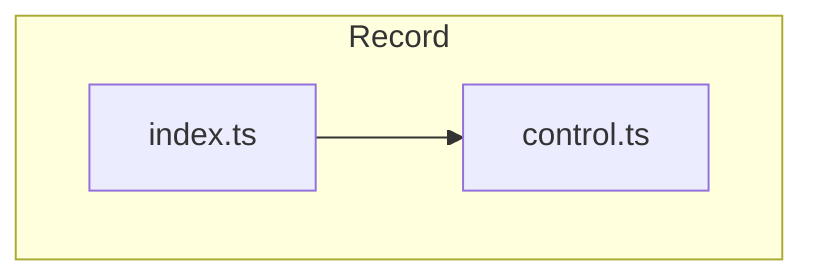
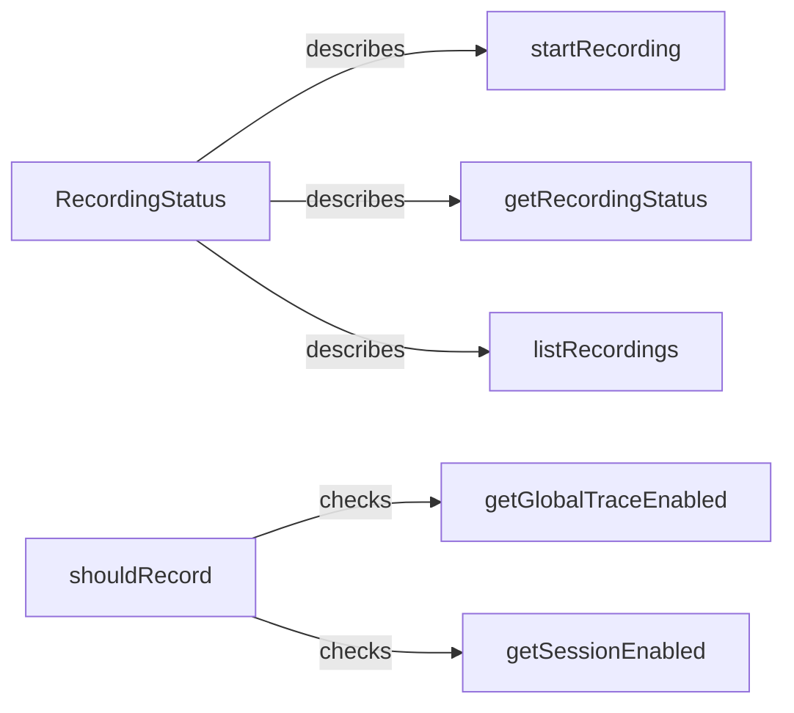
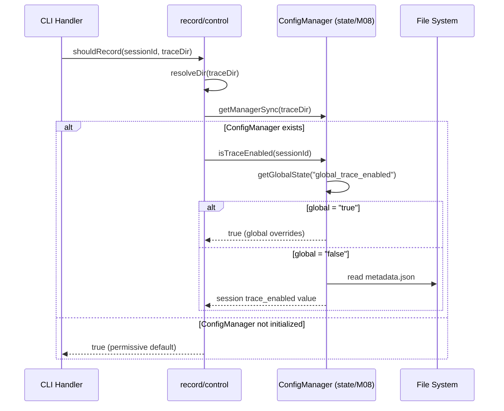
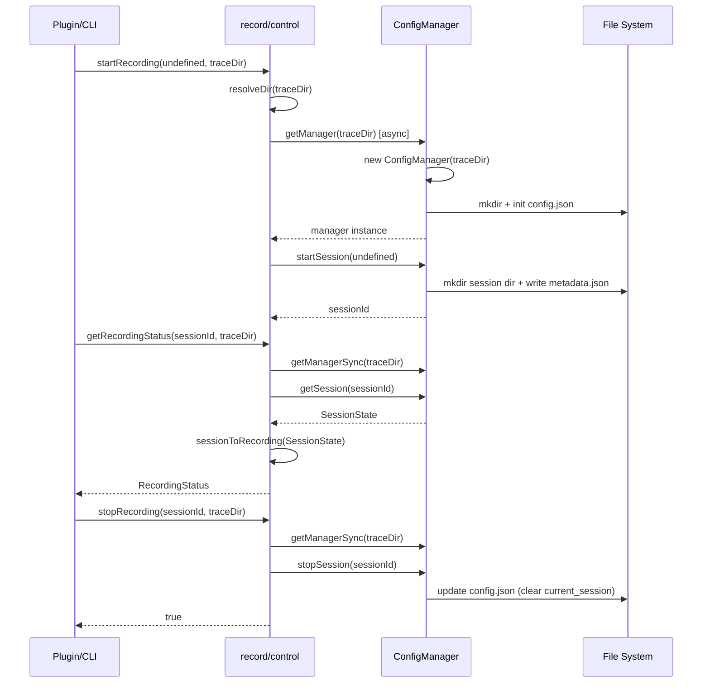
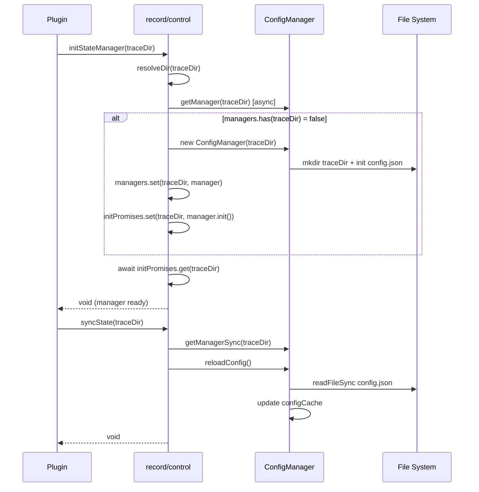

# M07-Record (Control Facade)

## 概述

This module solves the problem of providing a simple, flat API surface for trace recording control (enable/disable, storage preference, session lifecycle) without requiring callers to manage ConfigManager instances directly. It plays the role of an Application Logic layer (L3) facade that delegates all real work to the state module's ConfigManager, while adding optional `traceDir` parameters for flexibility and maintaining its own ConfigManager cache keyed by trace directory. If removed, CLI handlers and the plugin would need to directly instantiate and manage ConfigManager objects, losing the convenience of one-line calls like `shouldRecord(sessionId)`.

---

## 元数据

|字段|值|
|-|-|
|模块 ID|M07|
|路径|packages/core/src/record/|
|文件数|3 (index.ts, control.ts, control.test.ts)|
|代码行数|19 (index) + 262 (control) + 370 (test) = 651 total; 281 source lines|
|主要语言|TypeScript|
|所属层|Application Logic (L3)|

---

## 文件结构



|文件|职责|行数|主要导出|
|-|-|-|-|
|index.ts|Re-export barrel file; bridges control.ts exports to the package surface|19|14 exported functions + 1 exported type|
|control.ts|Implementation: facade over ConfigManager with optional traceDir resolution, filesystem fallbacks, and ConfigManager lifecycle caching|262|startRecording, stopRecording, isRecording, getRecordingStatus, listRecordings, initStateManager, syncState, setGlobalTraceEnabled, getGlobalTraceEnabled, setSessionEnabled, getSessionEnabled, shouldRecord, setStoragePreference, getStoragePreference, setSessionStoragePreference, getSessionStoragePreference + RecordingStatus type|

---

## 功能树

```text
M07-Record (control facade)
├── record/
│   └── control.ts
│       ├── type: RecordingStatus — Recording state descriptor (active, sessionId, startedAt)
│       ├── fn: resolveDir(traceDir?) — Resolve traceDir to default if undefined
│       ├── const: managers — Map<string, ConfigManager> cache by traceDir
│       ├── const: initPromises — Map<string, Promise<void>> init guard by traceDir
│       ├── fn: getManager(traceDir) — Async: get or create+init ConfigManager for traceDir
│       ├── fn: getManagerSync(traceDir) — Sync: get cached ConfigManager or null
│       ├── fn: sessionToRecording(session) — Convert SessionState to RecordingStatus
│       ├── fn: startRecording(sessionId?, traceDir?) — Start a new recording session
│       ├── fn: stopRecording(sessionId, traceDir?) — Stop an active recording session
│       ├── fn: isRecording(sessionId, traceDir?) — Check if session is recording
│       ├── fn: getRecordingStatus(sessionId, traceDir?) — Get full recording status
│       ├── fn: listRecordings(traceDir?) — List all active recordings
│       ├── fn: initStateManager(traceDir?) — Async: initialize ConfigManager for traceDir
│       ├── fn: syncState(traceDir?) — Sync: reload config from disk
│       ├── fn: setGlobalTraceEnabled(enabled, traceDir?) — Set global trace switch
│       ├── fn: getGlobalTraceEnabled(traceDir?) — Get global trace switch
│       ├── fn: setSessionEnabled(sessionId, enabled, traceDir?) — Set session-level trace switch
│       ├── fn: getSessionEnabled(sessionId, traceDir?) — Get session-level trace switch
│       ├── fn: shouldRecord(sessionId?, traceDir?) — Check effective trace enabled state
│       ├── fn: setStoragePreference(pref, traceDir?) — Set global storage preference
│       ├── fn: getStoragePreference(traceDir?) — Get global storage preference
│       ├── fn: setSessionStoragePreference(sessionId, pref, traceDir?) — Set session storage preference
│       ├── fn: getSessionStoragePreference(sessionId, traceDir?) — Get session storage preference
│   └── index.ts
│       └── (re-exports all from control.ts)
```

### 功能清单

|名称|类型|文件|行号|描述|
|-|-|-|-|-|
|RecordingStatus|type|control.ts|9-13|Recording state descriptor with active flag, sessionId, startedAt|
|RECORDING_MARKER|const|control.ts|7|File marker name `.recording` for filesystem fallback|
|resolveDir|fn|control.ts|15-17|Resolve optional traceDir to default via `getTraceDir()`|
|managers|const|control.ts|19|Module-level Map<string, ConfigManager> cache|
|initPromises|const|control.ts|20|Module-level Map<string, Promise<void>> init guard|
|getManager|fn|control.ts|22-30|Async: get or create+init ConfigManager, dedup init by promise|
|getManagerSync|fn|control.ts|32-34|Sync: get cached ConfigManager or return null|
|sessionToRecording|fn|control.ts|36-43|Transform SessionState to RecordingStatus|
|startRecording|fn|control.ts|45-52|Async: delegate to manager.startSession()|
|stopRecording|fn|control.ts|54-76|Delegate to manager.stopSession(), fallback to rmSync marker|
|isRecording|fn|control.ts|175-186|Delegate to manager.getSession(), fallback to existsSync marker|
|getRecordingStatus|fn|control.ts|188-218|Delegate to manager.getSession(), fallback to readFileSync marker|
|listRecordings|fn|control.ts|220-249|Delegate to manager.listSessions(), fallback to readdirSync scan|
|initStateManager|fn|control.ts|251-254|Async: ensure ConfigManager initialized for traceDir|
|syncState|fn|control.ts|256-262|Sync: call manager.reloadConfig()|
|setGlobalTraceEnabled|fn|control.ts|78-87|Delegate to manager.setGlobalState("global_trace_enabled")|
|getGlobalTraceEnabled|fn|control.ts|89-96|Delegate to manager.getGlobalState("global_trace_enabled")|
|setSessionEnabled|fn|control.ts|98-108|Delegate to manager.setSessionEnabled()|
|getSessionEnabled|fn|control.ts|110-120|Delegate to manager.getSessionEnabled()|
|shouldRecord|fn|control.ts|122-129|Delegate to manager.isTraceEnabled()|
|setStoragePreference|fn|control.ts|131-140|Delegate to manager.setStoragePreference()|
|getStoragePreference|fn|control.ts|142-149|Delegate to manager.getStoragePreference()|
|setSessionStoragePreference|fn|control.ts|151-161|Delegate to manager.setSessionStoragePreference()|
|getSessionStoragePreference|fn|control.ts|163-173|Delegate to manager.getSessionStoragePreference()|

### 职责边界

**做什么**

- Provide flat function API with optional `traceDir` parameter for all trace control operations
- Cache ConfigManager instances per traceDir, managing their async initialization lifecycle
- Offer filesystem fallbacks for recording detection when ConfigManager is not initialized
- Convert between internal SessionState and public RecordingStatus type

**不做什么**

- Does not implement config persistence logic (delegated to ConfigManager in M08)
- Does not handle record writing/storage (delegated to ConfigManager.writeRecord)
- Does not manage trace data lifecycle (cleanup, archival)
- Does not implement scope resolution logic itself — delegates `shouldRecord` to `ConfigManager.isTraceEnabled()`

---

## 公共接口契约

### 接口关系图



### 类型定义

```typescript
// [File: packages/core/src/record/control.ts:9]
export interface RecordingStatus {
  active: boolean;        // Whether session is actively recording
  sessionId?: string;     // Session identifier
  startedAt?: string;     // ISO timestamp when recording started
}
```

|类型名|字段/方法|类型|描述|位置|
|-|-|-|-|-|
|RecordingStatus|active|boolean|Whether session is actively recording|control.ts:10|
|RecordingStatus|sessionId|string \| undefined|Session identifier|control.ts:11|
|RecordingStatus|startedAt|string \| undefined|ISO timestamp of recording start|control.ts:12|

### 导出函数

#### `startRecording()`

```typescript
// [File: packages/core/src/record/control.ts:45]
export async function startRecording(
  sessionId?: string,
  traceDir?: string,
): Promise<string>
```

|参数|类型|必需|描述|
|-|-|-|-|
|sessionId|string|否|Optional session ID; auto-generated if omitted|
|traceDir|string|否|Optional trace directory path; defaults to `getTraceDir()`|

- **返回**：`Promise<string>` — The session ID (either provided or auto-generated UUID)
- **抛出**：无显式抛出；底层 ConfigManager.init() 可能因 fs 错误失败

**使用示例**：

```typescript
import { startRecording } from '@opencode-trace/core/record'
const sessionId = await startRecording() // auto ID, default dir
const sessionId2 = await startRecording("my-session", "/custom/path")
```

#### `stopRecording()`

```typescript
// [File: packages/core/src/record/control.ts:54]
export function stopRecording(
  sessionId: string,
  traceDir?: string,
): boolean
```

|参数|类型|必需|描述|
|-|-|-|-|
|sessionId|string|是|Session to stop|
|traceDir|string|否|Trace directory path|

- **返回**：`boolean` — `true` if recording was stopped, `false` if no active recording found

#### `isRecording()`

```typescript
// [File: packages/core/src/record/control.ts:175]
export function isRecording(
  sessionId: string,
  traceDir?: string,
): boolean
```

|参数|类型|必需|描述|
|-|-|-|-|
|sessionId|string|是|Session to check|
|traceDir|string|否|Trace directory path|

- **返回**：`boolean` — Whether the session is currently recording

#### `getRecordingStatus()`

```typescript
// [File: packages/core/src/record/control.ts:188]
export function getRecordingStatus(
  sessionId: string,
  traceDir?: string,
): RecordingStatus
```

|参数|类型|必需|描述|
|-|-|-|-|
|sessionId|string|是|Session to query|
|traceDir|string|否|Trace directory path|

- **返回**：`RecordingStatus` — Full recording descriptor; `{ active: false }` for unknown sessions

#### `listRecordings()`

```typescript
// [File: packages/core/src/record/control.ts:220]
export function listRecordings(traceDir?: string): RecordingStatus[]
```

|参数|类型|必需|描述|
|-|-|-|-|
|traceDir|string|否|Trace directory path|

- **返回**：`RecordingStatus[]` — Array of all active recordings

#### `setGlobalTraceEnabled()`

```typescript
// [File: packages/core/src/record/control.ts:78]
export function setGlobalTraceEnabled(
  enabled: boolean,
  traceDir?: string,
): void
```

|参数|类型|必需|描述|
|-|-|-|-|
|enabled|boolean|是|Global trace switch value|
|traceDir|string|否|Trace directory path|

- **返回**：void — No return value. ConfigManager must be initialized for this to have effect.

#### `getGlobalTraceEnabled()`

```typescript
// [File: packages/core/src/record/control.ts:89]
export function getGlobalTraceEnabled(traceDir?: string): boolean
```

|参数|类型|必需|描述|
|-|-|-|-|
|traceDir|string|否|Trace directory path|

- **返回**：`boolean` — Current global trace enabled state. Returns `true` (permissive default) if ConfigManager not initialized.

#### `setSessionEnabled()`

```typescript
// [File: packages/core/src/record/control.ts:98]
export function setSessionEnabled(
  sessionId: string,
  enabled: boolean,
  traceDir?: string,
): void
```

|参数|类型|必需|描述|
|-|-|-|-|
|sessionId|string|是|Session to modify|
|enabled|boolean|是|Session trace switch value|
|traceDir|string|否|Trace directory path|

#### `getSessionEnabled()`

```typescript
// [File: packages/core/src/record/control.ts:110]
export function getSessionEnabled(
  sessionId: string,
  traceDir?: string,
): boolean
```

- **返回**：`boolean` — Session-level trace enabled. Returns `true` (permissive default) if ConfigManager not initialized.

#### `shouldRecord()`

```typescript
// [File: packages/core/src/record/control.ts:122]
export function shouldRecord(
  sessionId?: string,
  traceDir?: string,
): boolean
```

|参数|类型|必需|描述|
|-|-|-|-|
|sessionId|string|否|Optional session context for scope resolution|
|traceDir|string|否|Trace directory path|

- **返回**：`boolean` — Effective trace-enabled state after scope resolution (global → local → session cascade). Returns `true` if ConfigManager not initialized.

#### `setStoragePreference()`

```typescript
// [File: packages/core/src/record/control.ts:131]
export function setStoragePreference(
  preference: "global" | "local",
  traceDir?: string,
): void
```

#### `getStoragePreference()`

```typescript
// [File: packages/core/src/record/control.ts:142]
export function getStoragePreference(traceDir?: string): "global" | "local"
```

- **返回**：`"global" | "local"` — Storage preference. Returns `"global"` if ConfigManager not initialized.

#### `setSessionStoragePreference()`

```typescript
// [File: packages/core/src/record/control.ts:151]
export function setSessionStoragePreference(
  sessionId: string,
  preference: "global" | "local",
  traceDir?: string,
): void
```

#### `getSessionStoragePreference()`

```typescript
// [File: packages/core/src/record/control.ts:163]
export function getSessionStoragePreference(
  sessionId: string,
  traceDir?: string,
): "global" | "local" | null
```

- **返回**：`"global" | "local" | null` — Session-level storage preference. Returns `null` if ConfigManager not initialized or no preference set.

#### `initStateManager()`

```typescript
// [File: packages/core/src/record/control.ts:251]
export async function initStateManager(traceDir?: string): Promise<void>
```

- **返回**：`Promise<void>` — Ensures ConfigManager is initialized for the given traceDir.

#### `syncState()`

```typescript
// [File: packages/core/src/record/control.ts:256]
export function syncState(traceDir?: string): void
```

- **返回**：void — Reloads config from disk. No-op if ConfigManager not yet initialized.

---

## 内部实现

### 核心内部逻辑

|函数/类|文件|行号|用途|
|-|-|-|-|
|resolveDir|control.ts|15-17|Resolve optional traceDir → defaults to `getTraceDir()` from platform module|
|managers|control.ts|19|Module-level singleton Map: traceDir → ConfigManager instance|
|initPromises|control.ts|20|Module-level singleton Map: traceDir → init Promise (dedup concurrent init)|
|getManager|control.ts|22-30|Async factory: create ConfigManager on first access, cache it, deduplicate init via promise|
|getManagerSync|control.ts|32-34|Sync accessor: return cached ConfigManager or null (no auto-creation)|
|sessionToRecording|control.ts|36-43|Adapter: transform `SessionState` (from M08) → `RecordingStatus` (public type)|
|RECORDING_MARKER|control.ts|7|File marker constant `.recording` for filesystem fallback when ConfigManager unavailable|

### 设计模式

|模式|使用位置|使用原因|代码证据|
|-|-|-|-|
|Facade|All exported functions|Provides flat API with optional traceDir, hiding ConfigManager lifecycle from callers. Callers don't need to manage ConfigManager instances or know about init() lifecycle.|control.ts:78-173 (each function: resolveDir → getManagerSync → delegate)|
|Singleton Cache|managers + initPromises Maps (control.ts:19-20)|Ensures one ConfigManager per traceDir, preventing duplicate instances and races on concurrent init calls.|control.ts:22-30 (getManager checks `managers.has()` before creating)|
|Graceful Degradation / Fallback|stopRecording, isRecording, getRecordingStatus, listRecordings|When ConfigManager is not initialized (getManagerSync returns null), functions fall back to filesystem-based detection using `.recording` marker files, ensuring basic functionality without requiring async init.|control.ts:63-76, 184-186, 199-218, 231-249|
|Adapter|sessionToRecording (control.ts:36-43)|Transforms internal `SessionState` type from M08 to public `RecordingStatus` type, decoupling the public contract from internal representation.|control.ts:36-43|

### 关键算法 / 策略

|算法/策略|用途|复杂度|文件|
|-|-|-|-|
|ConfigManager Init Deduplication|Prevent double init when multiple async callers access same traceDir concurrently|O(1) lookup by Map key|control.ts:22-30|
|Filesystem Fallback Scan|List active recordings without ConfigManager by scanning directory entries for `.recording` marker files|O(D) where D = number of directory entries|control.ts:231-249|
|Scope Resolution (delegated)|shouldRecord delegates to ConfigManager.isTraceEnabled() which implements: global → local → session cascade|O(1) config read + O(1) metadata read|control.ts:122-129 → state/index.ts:457-466|

---

## 关键流程

### 流程 1：Trace Enable/Disable via shouldRecord

**调用链**

```text
CLI/Plugin → control.ts:122 shouldRecord → control.ts:124 getManagerSync → state/index.ts:457 ConfigManager.isTraceEnabled → state/index.ts:459 getGlobalState → state/index.ts:465 getSessionEnabled
```

**时序图**



**步骤详解**

|步骤|说明|文件位置|
|-|-|-|
|1|Caller invokes `shouldRecord(sessionId, traceDir)`|control.ts:122|
|2|Resolve traceDir to default via `resolveDir()`|control.ts:123-124|
|3|Attempt to get cached ConfigManager via `getManagerSync()`|control.ts:125-126|
|4|If ConfigManager exists, delegate to `isTraceEnabled(sessionId)` which implements scope cascade: global → session|state/index.ts:457-466|
|5|If no ConfigManager, return `true` as permissive default (tracing ON by safety)|control.ts:128-129|

### 流程 2：Recording Lifecycle (start → status → stop)

**调用链**

```text
startRecording → control.ts:45 → getManager(dir) → ConfigManager.startSession → getRecordingStatus → getManagerSync → ConfigManager.getSession → stopRecording → getManagerSync → ConfigManager.stopSession
```

**时序图**



**步骤详解**

|步骤|说明|文件位置|
|-|-|-|
|1|startRecording resolves traceDir, calls async getManager which creates+initializes ConfigManager on first access|control.ts:45-52|
|2|ConfigManager.startSession generates UUID (if no ID), creates session dir, writes metadata|state/index.ts:169-175|
|3|getRecordingStatus delegates to getSession, then adapts SessionState → RecordingStatus|control.ts:188-218|
|4|stopRecording delegates to manager.stopSession which clears current_session in config|control.ts:54-76|
|5|Fallback: if no manager, stopRecording removes `.recording` marker file from filesystem|control.ts:63-76|

### 流程 3：ConfigManager Lifecycle (initStateManager + syncState)

**调用链**

```text
initStateManager → getManager(dir) → new ConfigManager → init() → [cache] → syncState → getManagerSync → reloadConfig
```

**时序图**



**步骤详解**

|步骤|说明|文件位置|
|-|-|-|
|1|initStateManager ensures ConfigManager is created and initialized for traceDir|control.ts:251-254|
|2|getManager uses module-level Maps to deduplicate creation and init; concurrent callers await same Promise|control.ts:22-30|
|3|syncState reloads on-disk config into ConfigManager's cache; no-op if no manager exists for this traceDir|control.ts:256-262|

---

## 依赖

### 内部依赖（项目内其他模块）

|模块|使用的接口|调用位置|
|-|-|-|
|M08-state|ConfigManager (constructor, init, startSession, stopSession, getSession, listSessions, setGlobalState, getGlobalState, isTraceEnabled, setSessionEnabled, getSessionEnabled, setStoragePreference, getStoragePreference, setSessionStoragePreference, getSessionStorageStoragePreference, reloadConfig)|control.ts:4,22-30,50,56,85-87,93-96,104-107,115-118,125-129,136-139,146-149,157-160,168-171,260|
|M08-state|SessionState (type import)|control.ts:4|
|M11-platform|getTraceDir()|control.ts:3 → control.ts:16|
|M10-logger|logger.error()|control.ts:5 → control.ts:69-76,213-218,243-248|

### 外部依赖（第三方包）

|包名|版本|用途|可替代性|
|-|-|-|-|
|node:path|built-in|join() for path construction|高（built-in）|
|node:fs|built-in|existsSync, readdirSync, readFileSync, rmSync for filesystem fallback|高（built-in）|
|node:crypto (via state)|built-in|randomUUID for session ID generation in ConfigManager|高（built-in，间接）|

---

## 代码质量与风险

### 代码坏味道

|问题|类型|文件|严重度|建议|
|-|-|-|-|-|
|ConfigManager instance duplication with store module|重复代码|control.ts:19-20|中|The `managers` Map in control.ts and the store module both maintain separate ConfigManager caches. If they co-exist, two ConfigManager instances could exist for the same traceDir, leading to stale reads. Consider a shared singleton registry.|
|Permissive defaults when ConfigManager not initialized|硬编码|control.ts:96,119,129,149|低|Functions return `true`/`"global"` when ConfigManager is null. This is intentional (safe default = tracing ON), but could mask initialization failures in production. Consider logging a warning.|
|Fallback logic duplicates state module capabilities|过度耦合|control.ts:63-76,184-186,199-218,231-249|低|Filesystem fallbacks duplicate what ConfigManager already does. If ConfigManager is always initialized before use (via initStateManager), these fallbacks become dead code. Consider documenting the required init sequence.|
|Silent no-op on missing ConfigManager for setters|过度耦合|control.ts:84-87,103-107,135-139,156-160|中|setGlobalTraceEnabled, setSessionEnabled, setStoragePreference, setSessionStoragePreference silently do nothing if ConfigManager is not initialized. No error, no warning, no log. Caller may believe the operation succeeded. Consider at least logging a warning.|

### 潜在风险

|风险|触发条件|影响|文件|建议|
|-|-|-|-|-|
|Dual ConfigManager instances|Both store and record modules create ConfigManagers for same traceDir without sharing cache|Config changes via record/control not reflected in store reads; stale state|control.ts:19-20|Unify ConfigManager lifecycle into a single registry (e.g., via state module)|
|Race condition on concurrent init|Two async callers invoke getManager() for same traceDir simultaneously before first init completes|Second caller may bypass `managers.has()` check if Map.set happens before await|control.ts:22-30|Current implementation guards against this with initPromises Map — verify that the `await` on line 28 always references the same Promise|
|Setter silent failure|Caller invokes setGlobalTraceEnabled() before initStateManager()|Operation silently skipped; config not modified on disk|control.ts:81-87|Add logger.warn() when manager is null, or throw/return boolean indicating success|
|Stale managers cache on process restart|Module-level Maps persist in memory; if config.json is externally modified and syncState not called, reads return stale data|Incorrect trace enabled state returned to callers|control.ts:19|Mitigated by syncState() but relies on callers remembering to invoke it after external config changes|

### 测试覆盖

|测试类型|覆盖情况|测试文件|说明|
|-|-|-|-|
|单元测试|良好|control.test.ts (370 lines)|6 test groups covering: StateManager integration, trace enable/disable, storage preference, init/sync, listRecordings edge cases, filesystem fallback (no StateManager)|
|集成测试|部分|control.test.ts|Tests use real filesystem (mkdtempSync) and real ConfigManager, effectively integration tests. No mock-based unit tests exist.|

---

## 开发指南

### 洞察

This module exists as an intentional architectural layer: it is not "just a wrapper" but a **facade with purpose**. The flat function signatures with optional `traceDir` eliminate the need for callers to manage ConfigManager lifecycle, and the filesystem fallbacks provide resilience when async init hasn't completed. However, the dual ConfigManager caching (record vs. store) is a latent inconsistency risk that should be addressed by consolidating the lifecycle into a single registry.

### 扩展指南

To add a new trace control operation:
1. Add the function in `control.ts` following the existing pattern: `resolveDir(traceDir)` → `getManagerSync(dir)` → delegate to ConfigManager method → provide permissive default if manager is null
2. For async operations, use `getManager(dir)` instead of `getManagerSync(dir)` and `await` the result
3. Add the re-export in `index.ts`
4. Add tests in `control.test.ts` covering: (a) with ConfigManager initialized, (b) without ConfigManager (fallback/null behavior), (c) edge cases

### 风格与约定

- All exported functions accept optional `traceDir?: string` as the last parameter, defaulting to `getTraceDir()`
- Sync functions use `getManagerSync()` (returns `null` if not initialized); async functions use `getManager()` (creates + initializes on first access)
- When ConfigManager is unavailable, setters silently no-op, getters return permissive defaults (`true`, `"global"`, `null`)
- Filesystem fallback logic uses `.recording` marker file convention for session detection without ConfigManager
- Error handling: `logger.error()` for fs operation failures in fallback paths; no thrown exceptions

### 设计哲学

- **Facade over direct access**: The module deliberately hides ConfigManager instantiation and init lifecycle from callers, making the API feel like simple global functions
- **Permissive defaults**: When state cannot be read, tracing defaults to ON (`true`) — this is a safety-first choice: it's better to over-trace than to silently lose data
- **Dual-path resilience**: ConfigManager path (fast, cached) and filesystem fallback path (slow, no cache) ensure the module works regardless of initialization state
- **Key tradeoff**: Silent no-op on setters vs. explicit error — chose silent because callers (CLI, plugin) typically ensure init before use, and throwing would add complexity to the simple facade pattern

### 修改检查清单

- [ ] Verify that new functions follow the `resolveDir → getManagerSync → delegate` pattern
- [ ] If adding a new setter, add a warning log for null ConfigManager case
- [ ] Check that the new export is added to `index.ts`
- [ ] Ensure tests cover both ConfigManager-initialized and fallback paths
- [ ] If modifying ConfigManager caching logic, verify no duplication with store module's cache
- [ ] If adding async functions, ensure `getManager()` is used and initPromises deduplication is respected
- [ ] Verify that permissive defaults (returning `true`/`"global"` when no manager) are appropriate for the new function's semantics
- [ ] Check that all callers listed in "depended_by" (CLI handlers, plugin) are compatible with the change