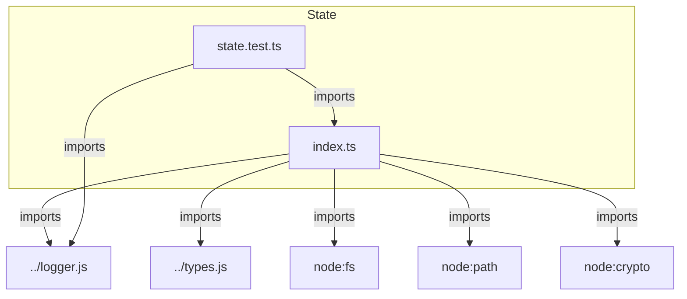
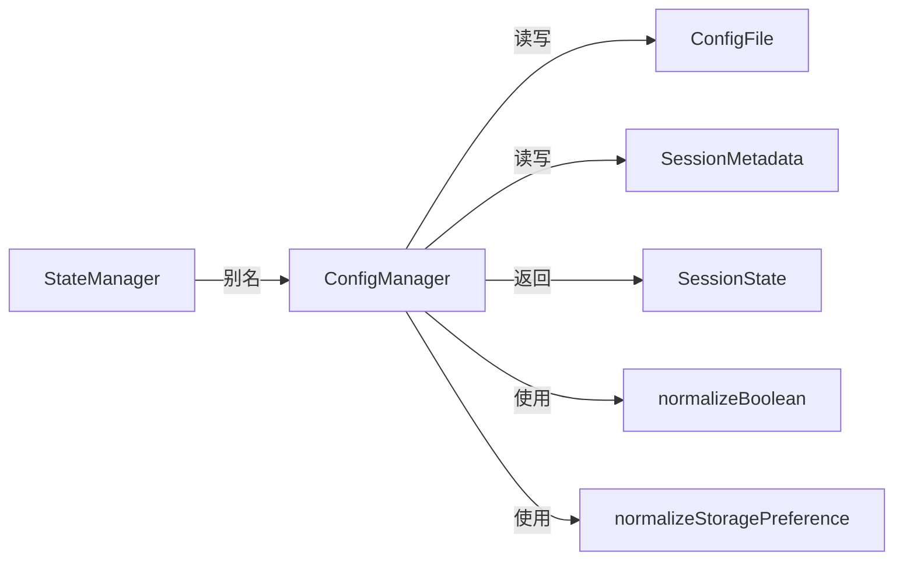
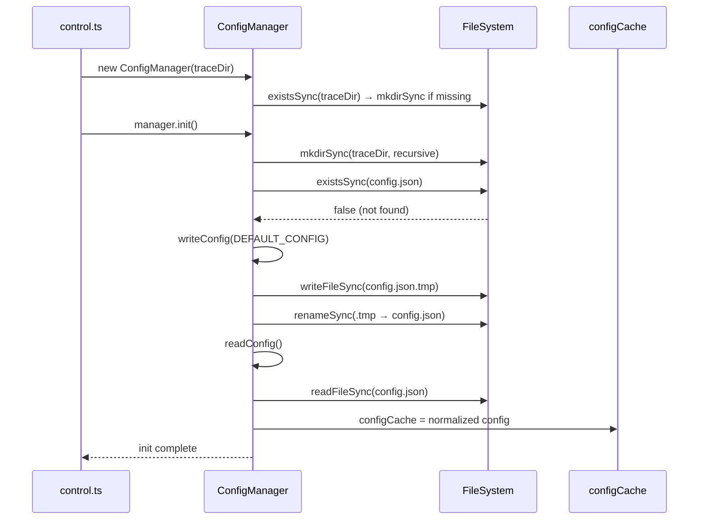
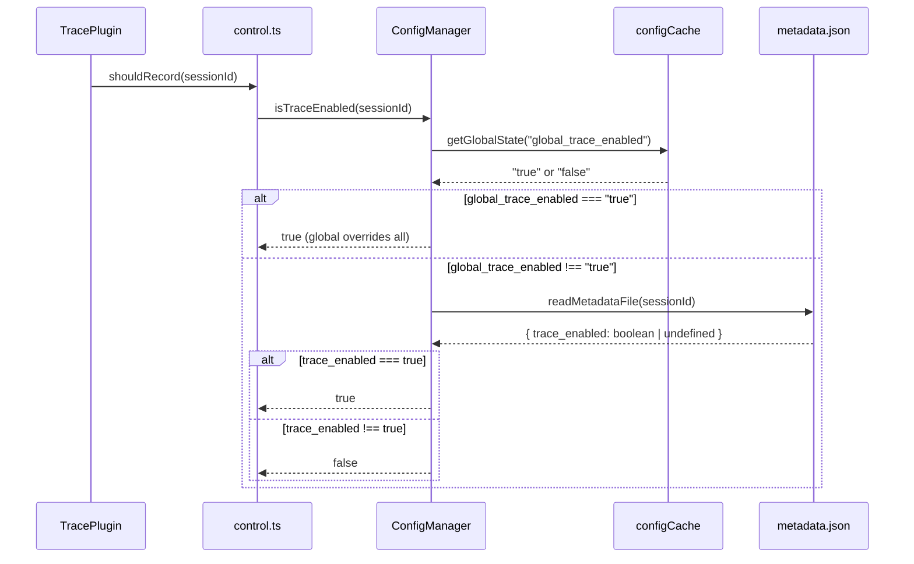
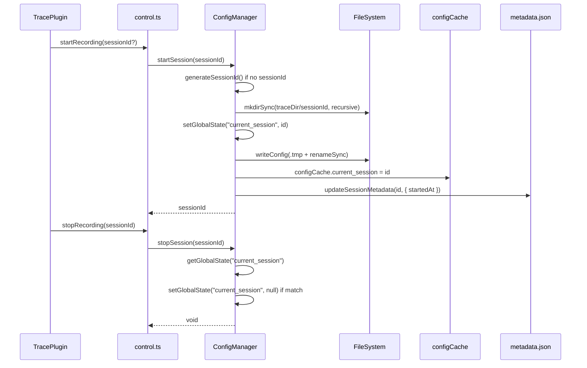

# M08-State

## 概述

State 模块解决的核心问题是：如何在纯文件系统架构（无数据库）下，可靠地管理全局配置、会话状态、trace 开关和存储偏好？它通过 `ConfigManager` 类实现了三层 scope 分级控制（global → local → session）和"最小 scope 优先"的存储偏好解析，是整个 trace 系统的配置中枢。如果移除该模块，系统将失去所有配置持久化能力——trace 开关、会话生命周期、存储偏好都无法运作，plugin 和 viewer 也将无法启动。

---

## 元数据

|字段|值|
|-|-|
|模块 ID|M08|
|路径|packages/core/src/state/|
|文件数|2 (index.ts + state.test.ts)|
|代码行数|491 (index.ts) + 1143 (state.test.ts) = 1634|
|主要语言|TypeScript|
|所属层|Infrastructure (L2) |

---

## 文件结构



|文件|职责|行数|主要导出|
|-|-|-|-|
|index.ts|ConfigManager class + type definitions + normalization helpers|491|ConfigManager, SessionState, SessionMetadata, GlobalState, StateManager|
|state.test.ts|Comprehensive unit tests for ConfigManager|1143|—|

---

## 功能树

```text
M08-State (configuration & session state gateway)
└── index.ts
    ├── type: SessionState — Per-session runtime state (id, status, timing, metadata fields)
    ├── type: SessionMetadata — Per-session persistent metadata (title, parentID, subSessions, trace_enabled, storage_preference, folderPath, startedAt)
    ├── type: GlobalState — Generic key-value state entry (key, value, updatedAt)
    ├── type: ConfigFile — Internal config file schema (global_trace_enabled, storage_preference, plugin_enabled, current_session, schema_version)
    ├── const: DEFAULT_CONFIG — Default config values (trace off, global storage, plugin on, no current session)
    ├── class: ConfigManager — Single gateway for all config and session state
    │   ├── method: constructor(traceDir) — Initialize with trace directory path, create dir if needed
    │   ├── method: init() — Async bootstrap: ensure dir, write default config if missing, warm cache
    │   ├── method: readConfig() — Private: read and normalize config.json from disk
    │   ├── method: writeConfig(config) — Private: atomic write via .tmp + renameSync pattern
    │   ├── method: reloadConfig() — Force re-read config from disk into cache
    │   ├── method: getGlobalState(key) — Read any config field as string from cache
    │   ├── method: setGlobalState(key, value) — Write config field with key-specific normalization
    │   ├── method: startSession(sessionId?) — Create new session dir, set current_session, write startedAt
    │   ├── method: stopSession(sessionId) — Clear current_session if matches
    │   ├── method: getSession(sessionId) — Get full SessionState from filesystem
    │   ├── method: getActiveSession() — Return current session ID if dir exists, auto-cleanup stale refs
    │   ├── method: writeRecord(sessionId, seq, record) — Async write TraceRecord via .tmp + fs.promises.rename
    │   ├── method: listSessions() — List all sessions sorted by startedAt descending
    │   ├── method: setSessionEnabled(sessionId, enabled) — Write trace_enabled to session metadata.json
    │   ├── method: getSessionEnabled(sessionId) — Read trace_enabled from metadata (default true)
    │   ├── method: setSessionStoragePreference(sessionId, preference) — Write storage_preference to metadata
    │   ├── method: getSessionStoragePreference(sessionId) — Read storage_preference from metadata (default null)
    │   ├── method: getStoragePreference() — Read global storage_preference from config cache
    │   ├── method: setStoragePreference(preference) — Write global storage_preference via setGlobalState
    │   ├── method: isTraceEnabled(sessionId?) — 3-tier scope resolution: global → session
    │   ├── method: updateSessionMetadata(sessionId, metadata) — Merge partial metadata fields into session metadata.json
    │   ├── method: addSubSession(parentSessionId, subSessionId) — Append child session ID to parent's subSessions array
    │   ├── method: generateSessionId() — Private: UUID generation
    │   ├── method: scanFsSessions() — Private: list directory entries that are directories
    │   ├── method: getSessionFromFs(sessionId) — Private: build SessionState from disk (ndjson fast path → json fallback)
    │   ├── method: listSessionsFromFs() — Private: enumerate and sort all sessions
    │   ├── method: readNdjsonTiming(sessionDir) — Private: fast timing extraction from timeline.ndjson
    │   ├── method: readMetadataFile(sessionId) — Private: read session metadata.json with error recovery
    │   ├── method: writeMetadataFile(sessionId, metadata) — Private: write session metadata.json to disk
    │   └── method: getMetadataPath(sessionId) — Private: compute metadata.json file path
    ├── fn: normalizeBoolean(value, defaultValue) — Coerce boolean/string to boolean with fallback
    ├── fn: normalizeStoragePreference(value) — Coerce to "global"|"local" (anything non-"local" → "global")
    └── type: StateManager — Type alias for ConfigManager
```

### 功能清单

|名称|类型|文件|行号|描述|
|-|-|-|-|-|
|SessionState|type|index.ts|16|Per-session runtime state with id, status, timing, metadata|
|SessionMetadata|type|index.ts|30|Per-session persistent metadata fields|
|GlobalState|type|index.ts|40|Generic key-value state entry|
|ConfigFile|interface|index.ts|52|Internal config.json schema|
|DEFAULT_CONFIG|const|index.ts|57|Default config: trace off, global storage, plugin on|
|ConfigManager|class|index.ts|65|Single gateway for all config and session state|
|ConfigManager.constructor|method|index.ts|70|Initialize with traceDir, create directory if missing|
|ConfigManager.init|method|index.ts|79|Async bootstrap: mkdir, write default config, warm cache|
|ConfigManager.readConfig|method|index.ts|89|Private: read and normalize config.json from filesystem|
|ConfigManager.writeConfig|method|index.ts|125|Private: atomic write via .tmp + renameSync|
|ConfigManager.reloadConfig|method|index.ts|139|Force re-read config from disk into cache|
|ConfigManager.getGlobalState|method|index.ts|143|Read config field as string (booleans → "true"/"false")|
|ConfigManager.setGlobalState|method|index.ts|153|Write config field with per-key normalization|
|ConfigManager.startSession|method|index.ts|169|Create session dir, set current_session, write startedAt|
|ConfigManager.stopSession|method|index.ts|177|Clear current_session reference if matches|
|ConfigManager.getSession|method|index.ts|184|Get full SessionState from filesystem|
|ConfigManager.getActiveSession|method|index.ts|188|Return current session ID, auto-cleanup stale refs|
|ConfigManager.writeRecord|method|index.ts|201|Async write TraceRecord via .tmp + fs.promises.rename|
|ConfigManager.listSessions|method|index.ts|215|List all sessions sorted by startedAt descending|
|ConfigManager.setSessionEnabled|method|index.ts|426|Write trace_enabled to session metadata.json|
|ConfigManager.getSessionEnabled|method|index.ts|431|Read trace_enabled from metadata (default true)|
|ConfigManager.setSessionStoragePreference|method|index.ts|436|Write storage_preference to session metadata|
|ConfigManager.getSessionStoragePreference|method|index.ts|441|Read storage_preference from metadata (default null)|
|ConfigManager.getStoragePreference|method|index.ts|446|Read global storage_preference from config cache|
|ConfigManager.setStoragePreference|method|index.ts|453|Write global storage_preference via setGlobalState|
|ConfigManager.isTraceEnabled|method|index.ts|457|3-tier scope resolution: global → session|
|ConfigManager.updateSessionMetadata|method|index.ts|397|Merge partial metadata fields into metadata.json|
|ConfigManager.addSubSession|method|index.ts|468|Append child ID to parent's subSessions array|
|normalizeBoolean|fn|index.ts|479|Coerce unknown value to boolean with default fallback|
|normalizeStoragePreference|fn|index.ts|486|Coerce to "global"|"local" (non-"local" → "global")|
|StateManager|type|index.ts|491|Type alias for ConfigManager|

### 职责边界

**做什么**

- 全局配置文件 (config.json) 的读取、写入、归一化和缓存管理
- 会话元数据 (metadata.json) 的读写、合并更新
- 三层 trace 开关的分级解析 (global → local → session)
- 存储偏好 (global/local) 的全局和会话级解析
- 会话生命周期管理 (创建、停止、列表、活跃会话追踪)
- TraceRecord 的异步原子写入 (.tmp + rename)
- 配置损坏时的优雅降级 (回退到默认值)

**不做什么**

- 不处理实时事件推送 (由 viewer SSE 负责)
- 不处理 timeline.ndjson 的写入 (由 store 模块负责)
- 不处理多进程锁或并发写冲突 (仅靠 .tmp+rename 伪原子性)
- 不处理跨平台 Windows 兼容性 (使用 renameSync 而非 safeRename)
- 不处理 trace 数据的查询、过滤或聚合 (由 store 模块负责)

---

## 公共接口契约

### 接口关系图



### 类型定义

```typescript
// [File: packages/core/src/state/index.ts:16]
export interface SessionState {
  id: string;
  status: "active" | "stopped" | "archived";
  startedAt: string | null;
  endedAt: string | null;
  requestCount: number;
  title?: string;
  parentID?: string;
  subSessions?: string[];
  trace_enabled?: boolean;
  storage_preference?: "global" | "local";
  folderPath?: string;
}
```

```typescript
// [File: packages/core/src/state/index.ts:30]
export interface SessionMetadata {
  title?: string;
  parentID?: string;
  subSessions?: string[];
  trace_enabled?: boolean;
  storage_preference?: "global" | "local";
  folderPath?: string;
  startedAt?: string;
}
```

```typescript
// [File: packages/core/src/state/index.ts:40]
export interface GlobalState {
  key: string;
  value: string | null;
  updatedAt: string;
}
```

```typescript
// [File: packages/core/src/state/index.ts:491]
export type StateManager = ConfigManager;
```

|类型名|字段/方法|类型|描述|位置|
|-|-|-|-|-|
|SessionState|id|string|会话唯一标识|index.ts:17|
|SessionState|status|"active" \| "stopped" \| "archived"|会话运行状态|index.ts:18|
|SessionState|startedAt|string \| null|最早请求时间|index.ts:19|
|SessionState|endedAt|string \| null|最后响应时间|index.ts:20|
|SessionState|requestCount|number|请求数量|index.ts:21|
|SessionState|trace_enabled|boolean \| undefined|会话级 trace 开关|index.ts:25|
|SessionState|storage_preference|"global" \| "local" \| undefined|会话级存储偏好|index.ts:26|
|SessionState|folderPath|string \| undefined|项目文件夹路径|index.ts:27|
|SessionMetadata|title|string \| undefined|会话标题|index.ts:31|
|SessionMetadata|parentID|string \| undefined|父会话 ID|index.ts:32|
|SessionMetadata|subSessions|string[] \| undefined|子会话 ID 列表|index.ts:33|
|SessionMetadata|trace_enabled|boolean \| undefined|会话级 trace 开关|index.ts:34|
|SessionMetadata|storage_preference|"global" \| "local" \| undefined|会话级存储偏好|index.ts:35|
|SessionMetadata|folderPath|string \| undefined|项目文件夹路径|index.ts:36|
|SessionMetadata|startedAt|string \| undefined|会话开始时间|index.ts:37|

### 导出类

#### `ConfigManager`

|方法|签名|描述|位置|
|-|-|-|-|
|constructor|(traceDir: string)|Initialize with trace directory path, create dir if needed|index.ts:70|
|init|(): Promise\<void\>|Async bootstrap: ensure dir, write default config, warm cache|index.ts:79|
|reloadConfig|(): void|Force re-read config from disk into cache|index.ts:139|
|getGlobalState|(key: string): string \| null|Read config field as string; booleans → "true"/"false"|index.ts:143|
|setGlobalState|(key: string, value: string \| null): void|Write config field with per-key normalization|index.ts:153|
|startSession|(sessionId?: string): string|Create session dir, set current_session, write startedAt|index.ts:169|
|stopSession|(sessionId: string): void|Clear current_session reference if matches|index.ts:177|
|getSession|(sessionId: string): SessionState \| null|Get full SessionState from filesystem|index.ts:184|
|getActiveSession|(): string \| null|Return current session ID, auto-cleanup stale refs|index.ts:188|
|writeRecord|(sessionId: string, seq: number, record: TraceRecord): Promise\<void\>|Async atomic write of TraceRecord file|index.ts:201|
|listSessions|(): SessionState[]|List all sessions sorted by startedAt descending|index.ts:215|
|setSessionEnabled|(sessionId: string, enabled: boolean): void|Write trace_enabled to session metadata.json|index.ts:426|
|getSessionEnabled|(sessionId: string): boolean|Read trace_enabled from metadata (default true)|index.ts:431|
|setSessionStoragePreference|(sessionId: string, preference: "global" \| "local"): void|Write storage_preference to session metadata|index.ts:436|
|getSessionStoragePreference|(sessionId: string): "global" \| "local" \| null|Read storage_preference from metadata (default null)|index.ts:441|
|getStoragePreference|(): "global" \| "local"|Read global storage_preference from config cache|index.ts:446|
|setStoragePreference|(preference: "global" \| "local"): void|Write global storage_preference via setGlobalState|index.ts:453|
|isTraceEnabled|(sessionId?: string): boolean|3-tier scope resolution: global → session|index.ts:457|
|updateSessionMetadata|(sessionId: string, metadata: Partial\<SessionMetadata\>): void|Merge partial metadata into metadata.json|index.ts:397|
|addSubSession|(parentSessionId: string, subSessionId: string): void|Append child ID to parent's subSessions array|index.ts:468|

---

## 内部实现

### 核心内部逻辑

|函数/类|文件|行号|用途|
|-|-|-|-|
|ConfigManager.readConfig|index.ts|89|从磁盘读取 config.json 并归一化所有字段；损坏时回退 DEFAULT_CONFIG|
|ConfigManager.writeConfig|index.ts|125|原子写入 config.json：先写 .tmp，再 renameSync .tmp → config.json|
|ConfigManager.getSessionFromFs|index.ts|244|构建 SessionState：优先读 timeline.ndjson (O(S+logR) 快路径)，回退扫描所有 {seq}.json|
|ConfigManager.readNdjsonTiming|index.ts|327|从 timeline.ndjson 提取 startedAt/endedAt/count，跳过畸形行|
|ConfigManager.scanFsSessions|index.ts|223|扫描 traceDir 下所有子目录作为 session ID|
|ConfigManager.readMetadataFile|index.ts|364|读取 metadata.json，不存在返回 {}，损坏返回 {} 并 log error|
|ConfigManager.writeMetadataFile|index.ts|384|写入 metadata.json（非原子，直接 writeFileSync）|
|normalizeBoolean|index.ts|479|归一化布尔值：boolean 直传，"true"/"false" 转换，其他回退 default|
|normalizeStoragePreference|index.ts|486|归一化存储偏好："local" 直传，其他一律回退 "global"|
|ConfigManager.generateSessionId|index.ts|219|生成 UUID 作为新 session ID|

### 设计模式

|模式|使用位置|使用原因|代码证据|
|-|-|-|-|
|Singleton-per-traceDir (Map 缓存)|record/control.ts:19|多个模块可能为同一 traceDir 创建 ConfigManager，Map 确保同一目录只有一个实例，避免重复 init 和写冲突|`const managers = new Map<string, ConfigManager>()`|
|Atomic Write (.tmp + renameSync)|index.ts:127-129|配置文件需要原子更新以防止损坏：先写临时文件，再 rename 替换。POSIX 上 rename 是原子操作|`writeFileSync(tmpPath, ...); renameSync(tmpPath, this.configPath)`|
|Config Cache (in-memory)|index.ts:68|避免每次 getGlobalState 都读磁盘，init 时 warm cache，setGlobalState 时 writeConfig 自动更新 cache|`private configCache: ConfigFile | null = null`|
|Graceful Degradation|index.ts:119-122|config.json 损坏时不崩溃，回退默认值并记录 error 日志|`catch (err) { logger.error(...); return { ...DEFAULT_CONFIG } }`|

### 关键算法 / 策略

|算法/策略|用途|复杂度|文件|
|-|-|-|-|
|3-tier Scope Resolution (global → local → session)|判断 trace 是否启用：global=true → ON (无视其余)；global=false → 检查 session 级别|O(1) + O(1) 磁盘读|index.ts:457-466|
|Storage Preference Resolution (smallest scope wins)|判断存储位置：session 有 preference → 用 session 的；否则用全局默认 "global"|O(1) 磁盘读|index.ts:441-455|
|Session Listing Fast Path (ndjson → json fallback)|列表会话时优先读 timeline.ndjson (O(S+logR))；不存在则扫描所有 {seq}.json (O(N*R))|O(S+logR) 或 O(N*R)|index.ts:252-310|

**3-tier Scope Resolution 算法详解**：

```
isTraceEnabled(sessionId?) → boolean
  1. getGlobalState("global_trace_enabled") === "true" → return true  (最大 scope 覆盖)
  2. if (!sessionId) → return false  (无 session 无法继续降级)
  3. getSessionEnabled(sessionId) → return result  (最小 scope 兜底)
```

注意：当前实现只有 global 和 session 两级，local scope (项目级 config.json) 的检查逻辑在 `TracePlugin.shouldRecord()` (plugin-instance.ts) 中，不在 ConfigManager 内。

**Storage Preference Resolution 算法详解**：

```
resolveTraceDir(sessionId) → string
  1. getSessionStoragePreference(sessionId) !== null → 用 session preference
  2. getStoragePreference() → 用全局 preference (默认 "global")
  3. global → ~/.opencode-trace/；local → <project>/.opencode-trace/
```

同样，完整的 storage 解析在 plugin-instance.ts 中完成，ConfigManager 只提供数据读取。

---

## 关键流程

### 流程 1：ConfigManager 初始化

**调用链**

```text
record/control.ts:25 → ConfigManager.constructor → ConfigManager.init() → readConfig() → writeConfig()
```

**时序图**



**步骤详解**

|步骤|说明|文件位置|
|-|-|-|
|1|创建 ConfigManager 实例，设置 traceDir 和 configPath，若目录不存在则 mkdirSync|index.ts:70-77|
|2|init() 异步调用：确保目录存在，若 config.json 不存在则写入默认配置|index.ts:79-87|
|3|readConfig() 读取磁盘 config.json，归一化每个字段 (normalizeBoolean, normalizeStoragePreference)|index.ts:89-123|
|4|缓存归一化后的 ConfigFile 到 configCache，后续 getGlobalState 直接读缓存|index.ts:89|

### 流程 2：Trace Enable/Disable (isTraceEnabled 三层分级)

**调用链**

```text
plugin-instance.ts:shouldRecord → control.ts:shouldRecord → ConfigManager.isTraceEnabled → getGlobalState → getSessionEnabled
```

**时序图**



**步骤详解**

|步骤|说明|文件位置|
|-|-|-|
|1|getGlobalState 从 configCache 读取 "global_trace_enabled"，缓存为空时触发 readConfig()|index.ts:143-151|
|2|若 global 级别为 true，直接返回 true——最大 scope 覆盖一切|index.ts:461|
|3|若 global 级别非 true 且有 sessionId，读取 session 的 metadata.json|index.ts:431-433|
|4|metadata.trace_enabled 默认为 true (getSessionEnabled 使用 `?? true`)|index.ts:433|
|5|注意：local scope (项目级 config.json) 的检查在 plugin-instance.ts 中完成，不在 ConfigManager|plugin-instance.ts|

### 流程 3：Session Lifecycle (start → active → stop)

**调用链**

```text
plugin-instance.ts:startSession → control.ts:startRecording → ConfigManager.startSession → mkdirSync → setGlobalState → updateSessionMetadata
```

**时序图**



**步骤详解**

|步骤|说明|文件位置|
|-|-|-|
|1|startSession：生成 UUID 或使用传入的 sessionId，创建会话目录|index.ts:169-171|
|2|设置 current_session 到 config.json 并更新缓存|index.ts:172-173|
|3|写入 startedAt 到 metadata.json|index.ts:174|
|4|stopSession：检查 current_session 是否匹配，若匹配则清除为 null|index.ts:177-180|

---

## 依赖

### 内部依赖（项目内其他模块）

|模块|使用的接口|调用位置|
|-|-|-|
|M01-types|TraceRecord type|index.ts:13 (import type)|
|M10-logger|logger.error(), logger.warn()|index.ts:14 (import)|
|M07-record/control|ConfigManager class, SessionState type|control.ts:4 (import)|
|M04-store|ConfigManager class, SessionState type|store/index.ts:15 (import)|
|M17-plugin|ConfigManager class via @opencode-trace/core/state|plugin-instance.ts:4 (import)|

### 外部依赖（第三方包）

|包名|版本|用途|可替代性|
|-|-|-|-|
|node:fs|Node.js built-in|readFileSync, writeFileSync, renameSync, mkdirSync, existsSync, readdirSync, statSync|低 (核心基础设施)|
|node:fs/promises|Node.js built-in|async fs.writeFile, fs.mkdir, fs.rename for writeRecord|低|
|node:path|Node.js built-in|join() for path construction|低|
|node:crypto|Node.js built-in|randomUUID() for session ID generation|中 (可用 uuid 包替代)|
|zod|—|不使用 (本模块不用 zod)|—|

---

## 代码质量与风险

### 代码坏味道

|问题|类型|文件|严重度|建议|
|-|-|-|-|-|
|renameSync 不使用 safeRename|硬编码/违反项目约定|index.ts:129|**高**|应替换为 plugin/src/write-queue.ts 的 safeRename 带重试逻辑，否则 Windows CI 上 renameSync 可能因 EPERM/EACCES 失败|
|writeMetadataFile 非原子写入|过度耦合|index.ts:394|中|metadata.json 使用直接 writeFileSync 而非 .tmp+rename 模式，无法保证原子性；若进程中断可能导致半写文件|
|getGlobalState 用 as Record 强转|类型安全缺失|index.ts:147-150|中|使用 `(this.configCache as unknown as Record<string, unknown>)` 擦除类型，对未知键缺乏约束|
|setGlobalState 对未知键直接赋值|硬编码|index.ts:164|低|未知 key 直接写入 config 对象，可能产生 config 文件膨胀，但实际使用中未知键极少|
|plugin_enabled 语义不一致|命名混淆|index.ts:159-160|低|setGlobalState("plugin_enabled", "anything") → true (非 "false" 都为 true)，与 setGlobalState("global_trace_enabled", value === "true") 的严格布尔语义不一致|

### 潜在风险

|风险|触发条件|影响|文件|建议|
|-|-|-|-|-|
|Windows CI: renameSync 不可靠|config.json 或 record .tmp 文件被锁定 (杀毒软件/延迟 flush)|原子写入失败 → 配置丢失或 .tmp 文件残留|index.ts:129|替换为 safeRename (3次重试 + exponential backoff)，参考 plugin/src/write-queue.ts:138|
|configCache 无过期/一致性检查|外部修改 config.json (如用户手动编辑或另一个进程)|configCache 与磁盘不一致，getGlobalState 返回过期数据|index.ts:68|添加 TTL 或 checksum 验证；或在每次 setGlobalState 后强制 readConfig() 再 merge|
|local scope 未在 ConfigManager 实现|用户期望 3-tier (global→local→session) 但代码只做 global→session|local config.json 的 global_trace_enabled 被忽略，只有 plugin-instance.ts 补全了此逻辑|index.ts:457|ConfigManager.isTraceEnabled 应增加 localConfigTraceDir 参数和 local scope 检查|
|writeRecord async .tmp+rename 与 writeConfig sync .tmp+rename 模式不一致|同一模块使用两种原子写入模式|异步写入使用 fs.promises.rename (可重试)，同步写入使用 renameSync (不可重试)|index.ts:129 vs 211-215|统一为 safeRename 模式|

### 测试覆盖

|测试类型|覆盖情况|测试文件|说明|
|-|-|-|-|
|单元测试|有|state.test.ts|覆盖初始化、session 管理、trace 开关、存储偏好、元数据更新、错误恢复、ndjson 读取、writeRecord|
|集成测试|部分|state.test.ts 内嵌|测试了文件系统扫描、配置持久化、metadata 合并等实际磁盘操作|
|边界测试|有|state.test.ts|覆盖损坏 JSON、不存在目录、畸形 ndjson、空 config、current_session 指向不存在目录等|

测试统计：14 个 describe block，约 40+ 个 test case，覆盖所有公共方法。**缺失**：并发写入冲突测试、Windows renameSync 失败模拟测试。

---

## 开发指南

### 洞察

ConfigManager 是一个"文件系统即数据库"模式下的配置管理器。它的核心洞察是：在无数据库的项目中，配置的可靠性完全依赖于原子写入模式和错误恢复。当前实现选择了 `.tmp + renameSync` 作为伪原子模式，这在 POSIX 上是可靠的，但在 Windows NTFS 上不是（renameSync 可能因文件锁失败）。plugin 包已经解决了这个问题（safeRename with retry），但 core 包的 ConfigManager 还没有同步修复。

另一个洞察是：三层 scope 分级 (global → local → session) 的完整实现在 ConfigManager 和 plugin-instance.ts 之间分散。ConfigManager 只实现了 global → session 两级，local scope 的检查逻辑在 plugin-instance.ts 中通过 `shouldRecord()` 方法补充。这意味着 ConfigManager 的 `isTraceEnabled()` 不是完整的 3-tier 实现——它需要调用者自行处理 local scope。

### 扩展指南

**如何添加新 config 字段**：

1. 在 `ConfigFile` interface 中添加字段定义 (index.ts:52-55)
2. 在 `DEFAULT_CONFIG` 中添加默认值 (index.ts:57-63)
3. 在 `readConfig()` 中添加归一化逻辑 (index.ts:89-123)，使用 normalizeBoolean 或自定义归一化
4. 在 `setGlobalState()` 中添加 key-specific 分支 (index.ts:153-167)
5. 在 `getGlobalState()` 中无需修改——它已支持任意 key 的字符串读取
6. 更新 `CURRENT_SCHEMA_VERSION` (index.ts:50) 并在 `readConfig()` 中添加 schema migration 逻辑
7. 在 state.test.ts 中添加对应测试

**如何修复 renameSync Windows 兼容性问题**：

1. 从 plugin/src/write-queue.ts 复制 safeRename 逻辑到 core/src/state/
2. 将 writeConfig() 中的 `renameSync(tmpPath, this.configPath)` 替换为 safeRename (3次重试 + exponential backoff)
3. 同样修复 writeRecord() 中的 `fs.rename(tmpPath, filePath)`
4. 在 state.test.ts 中添加模拟 EPERM 失败的重试测试

### 风格与约定

- **原子写入模式**：所有持久化写入使用 `.tmp + rename` 模式 (POSIX atomic rename)
- **配置归一化**：所有从磁盘读取的配置值必须经过 normalizeBoolean/normalizeStoragePreference 归一化
- **错误恢复优先**：任何读取失败都回退到默认值并 log.error，不抛异常
- **缓存策略**：configCache 在 init() 时 warm，在 writeConfig() 时更新，在 reloadConfig() 时重读
- **字符串化布尔值**：getGlobalState 将 boolean 值返回为 "true"/"false" 字符串

### 设计哲学

1. **文件系统即数据库** — 所有配置和状态以 JSON 文件形式存储在磁盘，ConfigManager 是唯一读写入口
2. **最大 scope 覆盖 (largest wins)** — global_trace_enabled=true 时无视所有 local/session 级别设置，确保运维可以通过全局开关强制启用 trace
3. **最小 scope 存储优先 (smallest wins)** — session 级 storage_preference 覆盖全局默认，允许会话自主决定存储位置
4. **优雅降级优先于严格校验** — 损坏的 JSON 或缺失字段不崩溃，回退默认值并记录 error 日志
5. **sync vs async 分离** — config.json 操作使用 sync API (readFileSync/writeFileSync/renameSync)，record 写入使用 async API (fs.promises)——因为 config 操作频率低且需要立即生效，record 操作频率高且需要非阻塞

### 修改检查清单

- [ ] 修改 ConfigFile interface 后是否更新了 DEFAULT_CONFIG 和 readConfig() 归一化逻辑？
- [ ] 添加新 config key 后是否在 setGlobalState() 中添加了 key-specific 分支？
- [ ] 修改 config.json 格式后是否更新了 CURRENT_SCHEMA_VERSION 和 schema migration？
- [ ] 修改 SessionMetadata interface 后是否更新了 updateSessionMetadata() 的 merge 逻辑？
- [ ] 使用 renameSync 的地方是否考虑了 Windows 兼容性 (应改用 safeRename)？
- [ ] 修改 getGlobalState/setGlobalState 后是否检查了所有依赖模块 (store, record/control, plugin) 的调用点？
- [ ] 修改 isTraceEnabled 逻辑后是否在 plugin-instance.ts 的 shouldRecord() 中保持一致？
- [ ] 新增测试是否覆盖了损坏 JSON 回退和空目录场景？