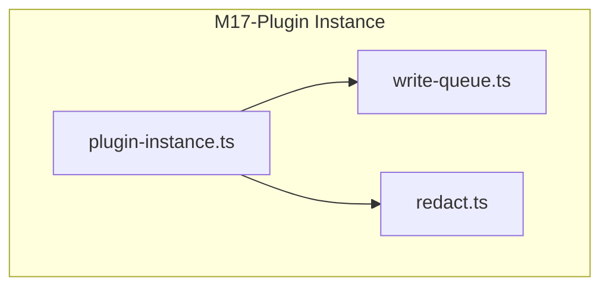
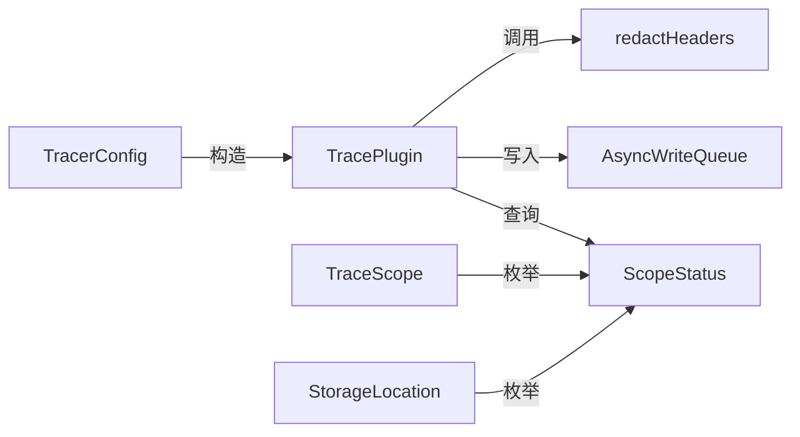
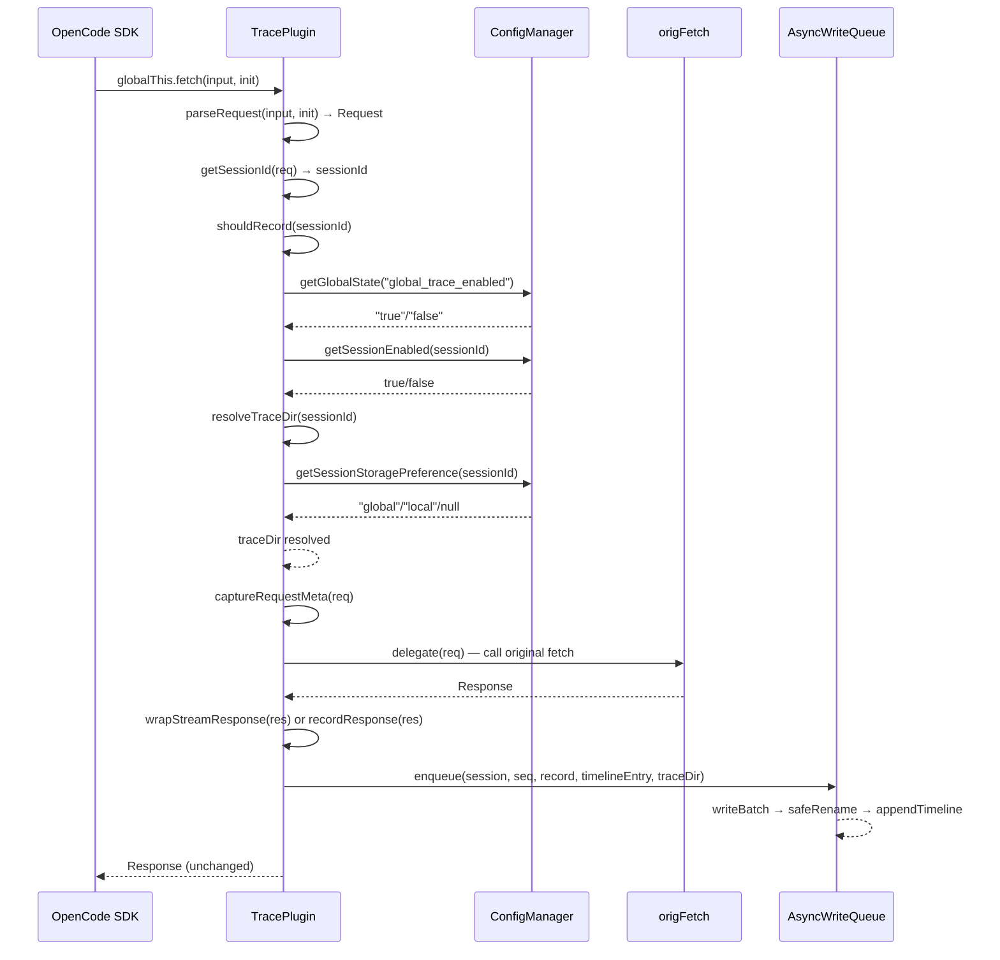
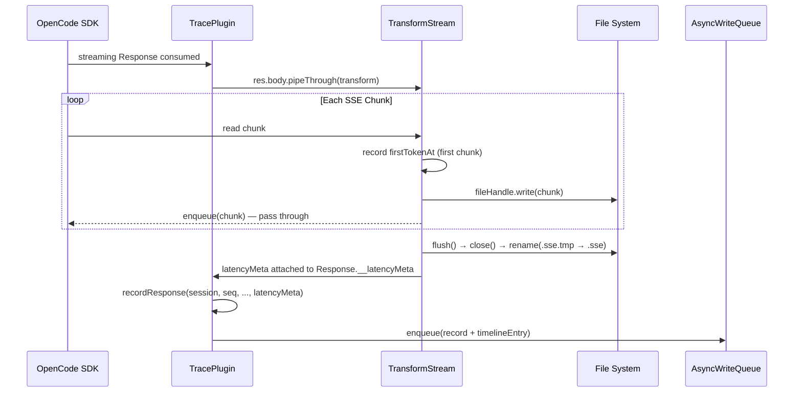

# M17-Plugin Instance

## 概述

TracePlugin 是 opencode-trace 插件的核心记录引擎，解决"如何透明拦截并持久化所有 LLM API 请求/响应"的问题。它在系统架构中属于 Domain Logic (L1) 层，位于 plugin 包的核心位置——所有 fetch 调用都被猴子补丁拦截后流入此模块的 tracedFetch 管道。如果移除此模块，系统将完全丧失 API 请求追踪能力——viewer 无法展示任何对话数据，timeline/record 文件不会被生成，scope/storage 控制也将失效。

---

## 元数据

|字段|值|
|-|-|
|模块 ID|M17|
|路径|packages/plugin/src/plugin-instance.ts|
|文件数|1|
|代码行数|596|
|主要语言|TypeScript|
|所属层|Domain Logic (L1) — Plugin Package|

---

## 文件结构



|文件|职责|行数|主要导出|
|-|-|-|-|
|plugin-instance.ts|Fetch interception, request/response capture, scope resolution, record creation|596|TracePlugin class, TracerConfig, TraceScope, StorageLocation, ScopeStatus interfaces|
|write-queue.ts|Async file writing, atomic rename, timeline append, parsed cache write|216|AsyncWriteQueue class, TimelineEntry interface|
|redact.ts|Header redaction for sensitive fields (Authorization, API-Key, etc.)|42|redactHeaders function|

---

## 功能树

```text
M17-Plugin Instance (core recording engine)
└── plugin-instance.ts
    ├── type: TracerConfig — Plugin configuration (globalDir, localDir)
    ├── type: TraceScope — "global" | "local" | "session"
    ├── type: StorageLocation — "global" | "local"
    ├── type: ScopeStatus — Full scope state snapshot (enabled flags, storage, dirs)
    └── class: TracePlugin — The core recording engine
        ├── method: constructor(config) — Initialize with global/local dirs and save original fetch
        ├── method: initStateManager() — Create and init dual ConfigManager (global + local)
        ├── method: getStateManager() — Return global ConfigManager
        ├── method: getGlobalConfigManager() — Return global ConfigManager
        ├── method: getLocalConfigManager() — Return local ConfigManager
        ├── method: resolveTraceDir(sessionId?) — Resolve storage directory (smallest scope wins)
        ├── method: shouldRecord(sessionId?) — Resolve whether to record (largest scope wins)
        ├── method: getScopeStatus(sessionId?) — Build complete ScopeStatus snapshot
        ├── method: tracedFetch(input, init?, origFetch?) — Core fetch interception pipeline
        ├── method: installInterceptor() — Monkey-patch globalThis.fetch
        ├── method: uninstallInterceptor() — Restore original globalThis.fetch
        ├── method: wrap(fetch) — Create traced wrapper for given fetch function
        ├── method: getInterceptor() — Get interceptor function (doesn't install)
        ├── method: flush() — Flush async write queue
        ├── private: getSessionId(req) — Extract session ID from request headers
        ├── private: parseBody(text) — Parse request/response body (JSON or raw text)
        ├── private: headersToObject(headers) — Convert Headers to plain object
        ├── private: classifyPurpose(raw) — Classify request purpose ("[meta]" or "")
        ├── private: parseRequest(input, init?) — Create Request object from fetch args
        ├── private: captureRequestMeta(req) — Extract session, seq, stream flag, trace data
        ├── private: wrapStreamResponse(res, ...) — TransformStream wrapper for SSE recording
        ├── private: recordResponse(session, seq, ...) — Record non-streaming or post-stream response
        ├── private: buildTimelineEntry(session, seq, ...) — Build lightweight timeline index entry
        ├── private: sanitizeStackTrace(stack?) — Sanitize paths/IPs/ports in error stacks
        ├── private: createTraceRecord(seq, ...) — Build full TraceRecord object
        ├── private: writeParsedCacheAsync(session, seq, ...) — Fire-and-forget parsed cache write
```

### 功能清单

|名称|类型|文件|行号|描述|
|-|-|-|-|-|
|TracerConfig|type|plugin-instance.ts|10-13|Plugin configuration interface (globalDir, localDir)|
|TraceScope|type|plugin-instance.ts|15|Scope enum: "global" | "local" | "session"|
|StorageLocation|type|plugin-instance.ts|16|Storage enum: "global" | "local"|
|ScopeStatus|type|plugin-instance.ts|18-27|Complete scope state snapshot including enabled flags and dirs|
|TracePlugin|class|plugin-instance.ts|28|Core recording engine — intercepts fetch, captures data, resolves scope|
|constructor|method|plugin-instance.ts|38-46|Initialize TracePlugin with global/local dirs, save original fetch, create write queue|
|initStateManager|method|plugin-instance.ts|48-54|Initialize dual ConfigManager for global and local config|
|resolveTraceDir|method|plugin-instance.ts|68-81|Resolve trace storage directory (session pref → global pref → default global)|
|shouldRecord|method|plugin-instance.ts|83-97|Resolve recording enabled state (global > local > session, largest wins)|
|getScopeStatus|method|plugin-instance.ts|99-126|Build complete ScopeStatus object with all scope flags and effective state|
|tracedFetch|method|plugin-instance.ts|128-201|Core interception pipeline: parse → capture → delegate → wrap stream / record|
|installInterceptor|method|plugin-instance.ts|584-589|Monkey-patch globalThis.fetch with tracedFetch|
|uninstallInterceptor|method|plugin-instance.ts|591-594|Restore original globalThis.fetch|
|wrap|method|plugin-instance.ts|574-577|Create traced wrapper function around a given fetch|
|getInterceptor|method|plugin-instance.ts|579-582|Return interceptor function without installing globally|
|flush|method|plugin-instance.ts|570-572|Flush all pending writes in AsyncWriteQueue|
|captureRequestMeta|method|plugin-instance.ts|251-316|Extract session ID, scope check, seq number, stream flag, request data|
|wrapStreamResponse|method|plugin-instance.ts|318-380|TransformStream-based SSE recording with latency tracking|
|recordResponse|method|plugin-instance.ts|382-466|Record response data (streaming with latency meta or non-streaming body)|
|buildTimelineEntry|method|plugin-instance.ts|468-519|Build lightweight TimelineEntry with provider/model/token extraction|
|writeParsedCacheAsync|method|plugin-instance.ts|556-568|Fire-and-forget parsed cache via setImmediate + writeQueue|

### 职责边界

**做什么**

- 拦截所有 global fetch 调用，识别 LLM API 请求并提取 session ID
- 根据三层 scope（global/local/session）决定是否记录请求
- 根据两层 storage preference（global/local）决定存储目录
- 捕获完整的 request/response 数据（headers redacted, body parsed）
- 对 streaming response 使用 TransformStream 逐 chunk 记录 SSE 并追踪延迟指标
- 构建轻量级 timeline entry（provider/model/token 摘要）供 viewer 快速索引
- 异步写入 parsed cache 以避免重复解析开销

**不做什么**

- 不做 UI 渲染或数据展示（viewer 负责）
- 不做数据查询或搜索（core query 负责）
- 不做 config 文件的 schema 验证（ConfigManager 负责）
- 不做 SSE 事件的解析和 conversation 提取（core parse 负责）
- 不做网络重试或 fallback（只记录，不修改原始 fetch 行为）

---

## 公共接口契约

### 接口关系图



### 类型定义

```typescript
// [File: packages/plugin/src/plugin-instance.ts:10]
export interface TracerConfig {
  globalDir?: string;   // 全局追踪目录（默认 ~/.opencode-trace）
  localDir: string;     // 项目本地追踪目录（必需）
}

// [File: packages/plugin/src/plugin-instance.ts:15]
export type TraceScope = "global" | "local" | "session";

// [File: packages/plugin/src/plugin-instance.ts:16]
export type StorageLocation = "global" | "local";

// [File: packages/plugin/src/plugin-instance.ts:18]
export interface ScopeStatus {
  globalEnabled: boolean;         // 全局 scope 是否启用
  localEnabled: boolean;          // 本地 scope 是否启用
  sessionEnabled: boolean | null; // 会话 scope 是否启用（null=未设置）
  effectiveEnabled: boolean;      // 最终生效状态（largest scope wins）
  storageLocation: StorageLocation; // 存储位置
  globalDir: string;              // 全局目录路径
  localDir: string;               // 本地目录路径
}
```

|类型名|字段/方法|类型|描述|位置|
|-|-|-|-|-|
|TracerConfig|globalDir|string?|全局追踪目录路径|plugin-instance.ts:11|
|TracerConfig|localDir|string|项目本地追踪目录（必需）|plugin-instance.ts:12|
|ScopeStatus|globalEnabled|boolean|全局 scope 启用状态|plugin-instance.ts:19|
|ScopeStatus|localEnabled|boolean|本地 scope 启用状态|plugin-instance.ts:20|
|ScopeStatus|sessionEnabled|boolean|null|会话 scope 启用状态|plugin-instance.ts:21|
|ScopeStatus|effectiveEnabled|boolean|最终生效启用状态|plugin-instance.ts:22|
|ScopeStatus|storageLocation|StorageLocation|实际存储位置|plugin-instance.ts:23|
|ScopeStatus|globalDir|string|全局目录路径|plugin-instance.ts:24|
|ScopeStatus|localDir|string|本地目录路径|plugin-instance.ts:25|

### 导出类

#### `TracePlugin`

|方法|签名|描述|位置|
|-|-|-|-|
|constructor|`(config: TracerConfig)`|初始化 TracePlugin，设置目录、保存原始 fetch、创建写入队列|plugin-instance.ts:38|
|initStateManager|`async initStateManager(): Promise<void>`|创建并初始化全局和本地 ConfigManager|plugin-instance.ts:48|
|getStateManager|`getStateManager(): ConfigManager | null`|返回全局 ConfigManager（兼容别名）|plugin-instance.ts:56|
|getGlobalConfigManager|`getGlobalConfigManager(): ConfigManager | null`|返回全局 ConfigManager|plugin-instance.ts:60|
|getLocalConfigManager|`getLocalConfigManager(): ConfigManager | null`|返回本地 ConfigManager|plugin-instance.ts:64|
|resolveTraceDir|`resolveTraceDir(sessionId?: string): string`|解析存储目录路径（session pref → global pref → default）|plugin-instance.ts:68|
|shouldRecord|`shouldRecord(sessionId?: string): boolean`|解析是否记录（global > local > session）|plugin-instance.ts:83|
|getScopeStatus|`getScopeStatus(sessionId?: string): ScopeStatus`|构建完整的 ScopeStatus 快照|plugin-instance.ts:99|
|tracedFetch|`async tracedFetch(input, init?, origFetch?): Promise<Response>`|核心 fetch 拦截管道|plugin-instance.ts:128|
|installInterceptor|`installInterceptor(): void`|猴子补丁 globalThis.fetch|plugin-instance.ts:584|
|uninstallInterceptor|`uninstallInterceptor(): void`|恢复原始 globalThis.fetch|plugin-instance.ts:591|
|wrap|`wrap(fetch): typeof fetch`|为给定 fetch 函数创建 traced 包装|plugin-instance.ts:574|
|getInterceptor|`getInterceptor(): typeof fetch`|获取拦截器函数（不安装）|plugin-instance.ts:579|
|flush|`async flush(): Promise<void>`|刷新异步写入队列|plugin-instance.ts:570|

---

## 内部实现

### 核心内部逻辑

|函数/类|文件|行号|用途|
|-|-|-|-|
|getSessionId|plugin-instance.ts|203-210|从请求 headers 提取 session ID，依次检查 x-opencode-session、x-session-affinity、session_id|
|parseBody|plugin-instance.ts|212-218|解析请求/响应体：JSON.parse 成功则返回对象，失败返回原始文本或 null|
|headersToObject|plugin-instance.ts|220-226|将 Headers 对象转换为 plain Record<string, string>，供 redactHeaders 使用|
|classifyPurpose|plugin-instance.ts|228-238|根据请求体是否包含 tools 数组分类为""（工具调用）或"[meta]"（元请求）|
|parseRequest|plugin-instance.ts|240-249|尝试从 fetch input/init 创建 Request 对象，失败返回 null（跳过追踪）|
|captureRequestMeta|plugin-instance.ts|251-316|核心请求元数据提取：session ID → scope check → seq → stream detection → body parsing → redact headers → build TraceRequest|
|wrapStreamResponse|plugin-instance.ts|318-380|TransformStream 包装 SSE 流：逐 chunk 写入 .sse.tmp 文件，flush 时 rename 为 .sse，记录 firstTokenAt/lastTokenAt 延迟指标|
|recordResponse|plugin-instance.ts|382-466|记录响应数据：clone body → parse → redact headers → normalize latency → createTraceRecord → buildTimelineEntry → enqueue → writeParsedCache|
|buildTimelineEntry|plugin-instance.ts|468-519|构建轻量级 timeline entry：从 response body 提取 model/usage tokens，从 URL 推断 provider (openai/anthropic)|
|sanitizeStackTrace|plugin-instance.ts|521-527|脱敏错误堆栈：用 sanitizePath 替换 home dir，遮蔽 IP 地址和端口号|
|createTraceRecord|plugin-instance.ts|529-554|构建完整 TraceRecord 对象：id/purpose/timestamps/request/response/error/latency|
|writeParsedCacheAsync|plugin-instance.ts|556-568|setImmediate 触发 fire-and-forget parsed cache 写入：detectAndParse → writeParsedCache|

### 设计模式

|模式|使用位置|使用原因|代码证据|
|-|-|-|-|
|Monkey Patching|installInterceptor() (L584-589)|需要透明拦截所有 fetch 调用而不修改调用方代码。OpenCode 插件系统要求在不侵入 SDK 的情况下捕获 API 请求，全局 fetch 替换是唯一可行的无侵入方案|plugin-instance.ts:587|
|Transform Stream (Web Streams API)|wrapStreamResponse() (L318-380)|需要同时传输 SSE 数据给调用方并异步写入文件。TransformStream 允许在 chunk 流过时进行 side-effect（写文件）而不阻塞主数据传输|plugin-instance.ts:338-370|
|Dual ConfigManager|initStateManager() (L48-54)|需要在两个独立目录（global ~/.opencode-trace/ 和 local .opencode-trace/）维护独立的配置状态，以支持三层 scope resolution（global > local > session）|plugin-instance.ts:49-53|
|Async Write Queue|writeQueue field (L34)|避免在高频 fetch 管道中直接执行同步文件 I/O。队列批量处理写入，保证 atomic rename，并在失败时 fallback 到单独目录|plugin-instance.ts:34, write-queue.ts:21-38|
|Fire-and-forget Cache|writeParsedCacheAsync() (L556-568)|Parsed cache 是可选的加速层，不应阻塞主写入流程。setImmediate 确保 cache 写入在下一个 event loop tick 执行，不影响 fetch 响应时间|plugin-instance.ts:556-568|
|Seq Counter per Session|ids Map (L30)|每个 session 维护独立的递增序列号，确保同一 session 的 record 文件按时间排序且唯一命名（1.json, 2.json, ...）|plugin-instance.ts:30|

### 关键算法 / 策略

|算法/策略|用途|复杂度|文件|
|-|-|-|-|
|Scope Resolution (shouldRecord)|三层 scope 优先级：global > local > session。global ON 则全部记录；global OFF 检查 local；local OFF 检查 session；全部 OFF 则不记录|O(1) — 三级 if 链|plugin-instance.ts:83-97|
|Storage Resolution (resolveTraceDir)|反向优先级：session pref > global pref > default。session 有 preference 则使用；否则回退到 global preference；默认 global|O(1) — 两级 if 链|plugin-instance.ts:68-81|
|Streaming SSE Capture|TransformStream transform() 每个 chunk 写文件 + 记录 firstTokenAt；flush() 关闭文件 + rename .tmp→.sse + 记录 lastTokenAt|O(n) — n = chunk 数|plugin-instance.ts:338-370|
|Provider Detection|URL substring 匹配：openai.com/api.openai → "openai"；anthropic.com/api.anthropic → "anthropic"|O(1) — 字符串 includes|plugin-instance.ts:499-503|

---

## 关键流程

### 流程 1：Fetch Interception Pipeline

**调用链**

```text
globalThis.fetch() → installInterceptor() [L587] → tracedFetch() [L128] → parseRequest() [L240] → captureRequestMeta() [L251] → shouldRecord() [L83] → resolveTraceDir() [L68] → delegate(input, init) [L142] → wrapStreamResponse() [L318] / recordResponse() [L382] → writeQueue.enqueue() [write-queue.ts:40]
```

**时序图**



**步骤详解**

|步骤|说明|文件位置|
|-|-|-|
|1|global fetch 调用被 installInterceptor 猴子补丁拦截|plugin-instance.ts:587|
|2|parseRequest 尝试创建 Request 对象，失败则直接调用原始 fetch（不追踪）|plugin-instance.ts:240-249|
|3|getSessionId 从 headers 提取 session ID，无 session 则不追踪|plugin-instance.ts:203-210|
|4|shouldRecord 三级 scope 检查：global ON → 记录；global OFF → local ON → 记录；否则 → session check|plugin-instance.ts:83-97|
|5|resolveTraceDir 决定存储目录：session pref → global pref → default global|plugin-instance.ts:68-81|
|6|captureRequestMeta 提取请求元数据：seq number, stream detection, body parsing, header redaction|plugin-instance.ts:251-316|
|7|delegate 调用原始 fetch 获取实际 Response|plugin-instance.ts:142|
|8|streaming response → wrapStreamResponse TransformStream 包装；non-streaming → recordResponse 直接记录|plugin-instance.ts:181-186|
|9|writeQueue.enqueue 异步批量写入：.json.tmp → safeRename → .json, append timeline.ndjson|write-queue.ts:40-67|
|10|writeParsedCacheAsync fire-and-forget 写入 parsed cache|plugin-instance.ts:556-568|

### 流程 2：Streaming SSE Response Capture

**调用链**

```text
tracedFetch() [L181] → wrapStreamResponse() [L318] → TransformStream.transform() [L342] → fileHandle.write(chunk) [L344] → TransformStream.flush() [L357] → fileHandle.close() → safeRename(.sse.tmp → .sse) → (res as any).__latencyMeta [L378] → recordResponse() [L382]
```

**时序图**



**步骤详解**

|步骤|说明|文件位置|
|-|-|-|
|1|检测 streaming response (req.body.stream === true)|plugin-instance.ts:289-294|
|2|创建 TransformStream：transform() 写每个 chunk 到 .sse.tmp 文件，flush() 关闭文件并 rename|plugin-instance.ts:338-370|
|3|记录 firstTokenAt（第一个 chunk 到达时间）用于 TTFT 计算|plugin-instance.ts:340-342|
|4|所有 chunk 完成后 flush() 记录 lastTokenAt，关闭文件 handle|plugin-instance.ts:355-368|
|5|bytesWritten > 0 则 rename .sse.tmp → .sse（atomic）；否则删除空 .sse.tmp|plugin-instance.ts:361-364|
|6|将 latencyMeta 附加到 wrapped Response 的 __latencyMeta 属性（hack：as any）|plugin-instance.ts:378|
|7|在 tracedFetch 后续调用 recordResponse 时读取 __latencyMeta 用于完整 record|plugin-instance.ts:186-189|

### 流程 3：Scope Resolution Decision

**调用链**

```text
shouldRecord(sessionId) [L83] → globalConfigManager.getGlobalState("global_trace_enabled") [L86] → localConfigManager.getGlobalState("global_trace_enabled") [L90] → globalConfigManager.getSessionEnabled(sessionId) [L96]
```

**步骤详解**

|步骤|说明|文件位置|
|-|-|-|
|1|检查 global scope：global_trace_enabled === "true" → 立即返回 true（最大 scope 生效）|plugin-instance.ts:86-88|
|2|global OFF → 检查 local scope：local global_trace_enabled === "true" → 返回 true|plugin-instance.ts:89-91|
|3|local OFF → 检查 session scope：getSessionEnabled(sessionId) → 返回 session 值|plugin-instance.ts:93-96|
|4|无 sessionId → 返回 false（默认关闭）|plugin-instance.ts:94|
|5|ConfigManager 未初始化 → 返回 true（默认记录，保守策略）|plugin-instance.ts:84|

---

## 依赖

### 内部依赖（项目内其他模块）

|模块|使用的接口|调用位置|
|-|-|-|
|core/parse|detectAndParse(), PARSED_CACHE_VERSION|plugin-instance.ts:559-562|
|core/logger|logger.error(), logger.info()|plugin-instance.ts:281-283, 347-353|
|core/sanitizePath|sanitizePath() — path sanitization for stack traces|plugin-instance.ts:524-527|
|core/state|ConfigManager — global/local config management, scope/storage resolution|plugin-instance.ts:4, 49-53, 69-80, 86-97|
|M18-write-queue|AsyncWriteQueue, TimelineEntry — async file writing, timeline append|plugin-instance.ts:4, 45, 166-170, 431-435, 563-567|
|M18-redact|redactHeaders() — sensitive header redaction|plugin-instance.ts:5, 301, 403|

### 外部依赖（第三方包）

|包名|版本|用途|可替代性|
|-|-|-|-|
|node:os|homedir()|获取用户 home 目录路径|低（Node 内置）|
|node:path|join()|构建文件路径|低（Node 内置）|
|node:fs|promises — 文件 I/O（mkdir, open, rename, unlink）|低（Node 内置）|
|@opencode-ai/plugin|Plugin SDK 类型定义|中（插件生态绑定）|
|@opencode-ai/sdk|Event, Session, Part 类型|中（SDK 生态绑定）|

---

## 代码质量与风险

### 代码坏味道

|问题|类型|文件|严重度|建议|
|-|-|-|-|-|
|`(res as any).__latencyMeta`|硬编码/类型逃逸|plugin-instance.ts:189, 378|中|创建自定义 Response wrapper class 或使用 WeakMap<Response, LatencyMeta> 替代 as any 属性注入|
|596 行单一文件|过大类|plugin-instance.ts|中|将 scope/storage resolution 提取为独立的 ScopeResolver 类；将 record/timeline building 提取为 RecordBuilder 类|
|provider 检测仅基于 URL substring 匹配|硬编码|plugin-instance.ts:499-503|低|提取为 ProviderRegistry，支持动态注册和正则匹配|
|`__TRACE_HANDLED__` magic string throw|硬编码|trace.ts:312|低|定义常量 `TRACE_HANDLED_EXIT = "__TRACE_HANDLED__"` 并在 trace.ts 中 import|
|classifyPurpose 返回空字符串 vs "[meta]"|命名不清|plugin-instance.ts:228-238|低|空字符串应命名为 "tool_call" 或 "chat"，增强语义可读性|
|fs.rename() 在 wrapStreamResponse flush 中使用|潜在 Windows 问题|plugin-instance.ts:362|中|应使用 writeQueue 的 safeRename() 替代裸 fs.rename()，确保 Windows NTFS 上的 EACCES/EPERM 不会导致 SSE 文件丢失|

### 潜在风险

|风险|触发条件|影响|文件|建议|
|-|-|-|-|-|
|__latencyMeta 丢失|streaming response 被中途取消/中断时 flush() 可能未执行|latencyMeta.firstTokenAt/lastTokenAt 为 null，record 中 TTFT/totalDuration 数据不完整|plugin-instance.ts:357-368|在 catch/abort 场景中也记录最后已知延迟值|
|ConfigManager null 状态|initStateManager 失败但 installInterceptor 已执行|shouldRecord 返回 true（默认记录），所有请求被追踪但 config 不可修改|plugin-instance.ts:84|在 tracedFetch 入口检查 ConfigManager 状态，未初始化时发出警告|
|seq counter 非持久化|进程重启后 ids Map 从 0 开始|record 文件名从 1.json 重新开始，与已有文件冲突覆盖|plugin-instance.ts:30-31, 271-272|启动时扫描已有 session 目录，从最大 seq 继续计数|
|concurrent fetch 同一 session|多个并发请求共享 seq counter|seq 可能因 Map.get/set 竞争而不连续（但不会重复，因 JS 单线程）|plugin-instance.ts:271-272|当前 JS 单线程保证安全；如果未来用 Worker 需要原子计数器|
|wrapStreamResponse 中裸 fs.rename|Windows NTFS EACCES/EPERM 错误|.sse.tmp → .sse rename 失败，SSE 数据丢失|plugin-instance.ts:362|改用 AsyncWriteQueue.safeRename() 或提取为独立 safeRename 工具函数|

### 测试覆盖

|测试类型|覆盖情况|测试文件|说明|
|-|-|-|-|
|单元测试|有|packages/plugin/src/plugin-instance.test.ts (推断)|测试 tracedFetch 管道、scope resolution、streaming wrapper|
|集成测试|部分|packages/plugin/src/trace.test.ts (推断)|测试完整插件初始化 + fetch interception + slash command handling|

---

## 开发指南

### 洞察

TracePlugin 的核心设计哲学是"透明拦截 + 最小侵入"：通过猴子补丁 global fetch 实现零侵入拦截，通过 TransformStream 实现 SSE 数据的并行采集而不阻塞原始数据流。scope/storage resolution 采用对称但反向的优先级策略（scope: 最大优先 → 全局 ON 则强制记录；storage: 最小优先 → session 级 preference 覆盖全局），这种设计确保用户可以在任何粒度上控制追踪行为。

### 扩展指南

**如何添加新的 LLM provider 检测**

1. 在 `buildTimelineEntry()` 方法 (L499-503) 的 provider detection 逻辑中添加新的 URL substring 匹配条件
2. 例如添加 Google Gemini 检测：
   ```typescript
   } else if (traceReq.url.includes("generativelanguage.googleapis.com")) {
     provider = "google";
   }
   ```
3. 长期方案：提取为 `ProviderRegistry` 类，支持动态注册 `detect(url: string): string | null` 函数

**如何添加新的 session header**

1. 在 `getSessionId()` 方法 (L203-210) 的 header 检查链中添加新的 header name
2. 例如添加 `x-custom-session` header：
   ```typescript
   req.headers.get("x-opencode-session") ?? 
   req.headers.get("x-session-affinity") ?? 
   req.headers.get("session_id") ?? 
   req.headers.get("x-custom-session") ??  // 新增
   undefined
   ```
3. Header 检查优先级从上到下，第一个匹配即使用

**如何添加新的敏感 header**

1. 在 `redact.ts` 的 `SENSITIVE_HEADERS` 数组 (L1-14) 中添加新的 header key（小写）
2. 例如添加 `x-refresh-token`：
   ```typescript
   const SENSITIVE_HEADERS = [
     ...existing,
     "x-refresh-token",
   ];
   ```

### 风格与约定

- **Error handling 约定**：所有内部方法用 try/catch 包裹并 logger.error 记录，不向上层抛出（保证 fetch 管道不被中断）
- **Null safety 约定**：ConfigManager 初始化为 null，所有使用前检查 `if (!this.globalConfigManager)`，未初始化时走保守默认路径
- **File naming 约定**：record 文件 `{seq}.json`，SSE 文件 `{seq}.sse`，parsed cache `{seq}.parsed`，timeline `timeline.ndjson`
- **Atomic write 约定**：所有文件写入通过 `.tmp` + rename 实现 atomic，SSE 文件也遵循此模式

### 设计哲学

1. **透明拦截优先**：猴子补丁 global fetch 是唯一可行的零侵入方案，因为 OpenCode SDK 不提供 request/response hook
2. **保守默认策略**：ConfigManager 未初始化时 shouldRecord 返回 true（宁可多记录不漏记录）
3. **最小阻塞原则**：streaming 使用 TransformStream 而非先收集再转发，parsed cache 使用 setImmediate fire-and-forget
4. **对称反向优先级**：scope (largest wins) vs storage (smallest wins) — 这反映了"权限向下传递、配置向上细化"的设计理念

### 修改检查清单

- [ ] 修改 shouldRecord() 逻辑时，验证三层 scope 优先级仍然正确（global > local > session）
- [ ] 修改 resolveTraceDir() 逻辑时，验证两层 storage 优先级仍然正确（session > global default）
- [ ] 修改 wrapStreamResponse() 时，确认 TransformStream flush() 在 abort/cancel 场景下仍能正确关闭文件 handle
- [ ] 修改 buildTimelineEntry() provider 检测时，确认新 URL pattern 不误匹配其他 provider
- [ ] 修改 getSessionId() header 列表时，确认优先级顺序符合预期
- [ ] 修改 parsed cache 写入时，确认 PARSED_CACHE_VERSION 已同步更新
- [ ] 修改 record 文件格式时，确认 viewer 的 fallback 解析路径仍能正确读取
- [ ] 在 Windows CI 上测试所有 rename 操作，确认 safeRename 重试逻辑覆盖 EACCES/EPERM
- [ ] 修改 TracePlugin constructor 时，确认 writeQueue 的 defaultTraceDir 与 globalDir 一致