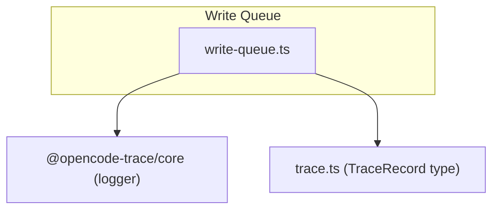
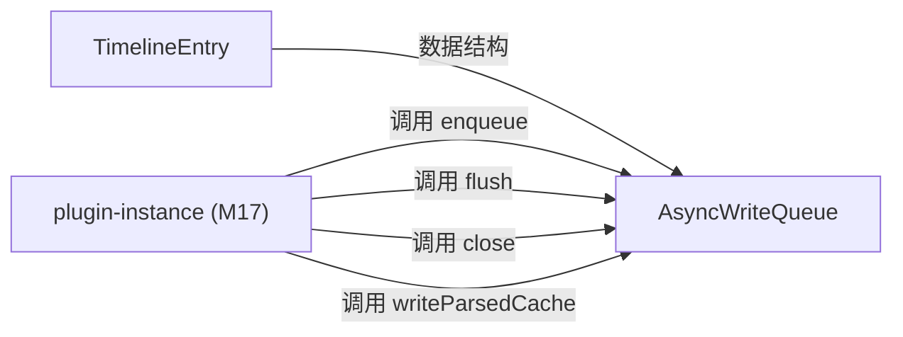
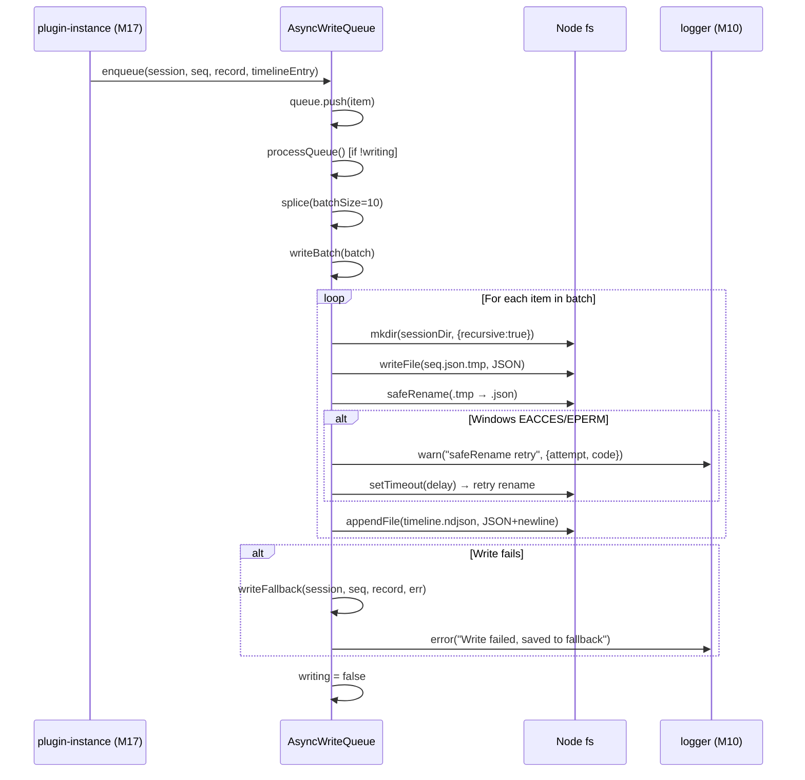
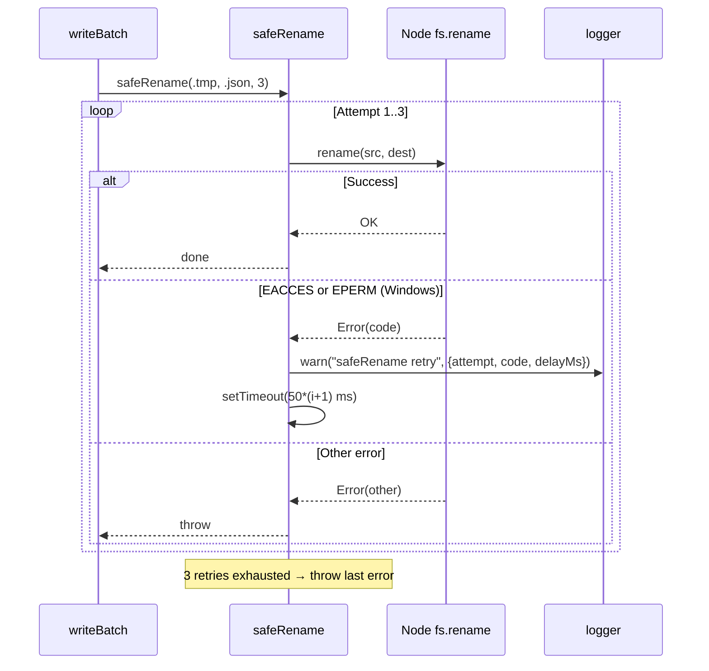
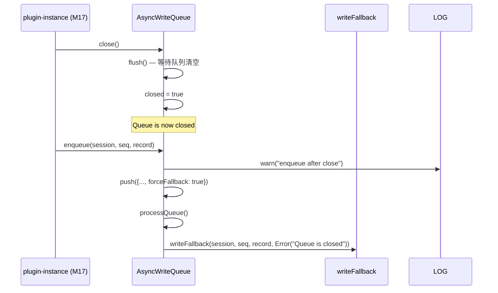

# M19-Write Queue

## 概述

AsyncWriteQueue 解决了 trace 记录持久化中的三个核心问题：并发写入的顺序保证、跨平台原子写入（Windows NTFS 下的 EACCES/EPERM 错误），以及写入失败的数据保全。它在系统架构中属于基础设施层（L2，plugin 包），是 plugin-instance（M17）唯一的数据写入通道。如果移除此模块，系统将丢失所有 trace 数据的可靠磁盘持久化能力——原子写入保证、失败数据的 fallback 存储、以及 timeline.ndjson 的增量索引构建。

---

## 元数据

|字段|值|
|-|-|
|模块 ID|M19|
|路径|packages/plugin/src/write-queue.ts|
|文件数|1|
|代码行数|216|
|主要语言|TypeScript|
|所属层|Infrastructure (L2) — plugin package|

---

## 文件结构



|文件|职责|行数|主要导出|
|-|-|-|-|
|write-queue.ts|批量原子写入队列，含 safeRename、fallback、parsed cache|216|AsyncWriteQueue, TimelineEntry|

---

## 功能树

```text
M19-Write Queue (write-queue.ts)
├── interface: TimelineEntry — timeline.ndjson 单行摘要数据结构
│   ├── seq: number
│   ├── url / method / purpose / requestAt / responseAt
│   ├── status / provider / model
│   └── inputTokens / outputTokens / totalDurationMs
└── class: AsyncWriteQueue — 批量原子写入队列
    ├── method: enqueue(session, seq, record, timelineEntry?, traceDir?) — 入队一条记录
    ├── method: flush() — 等待队列清空
    ├── method: close() — 关闭队列（先 flush 再标记 closed）
    ├── method: writeParsedCache(session, seq, parsed, traceDir?) — fire-and-forget 写 parsed cache
    ├── private method: processQueue() — 循环消费队列
    ├── private method: writeBatch(items) — 批量写入一批记录
    ├── private method: safeRename(src, dest, retries=3) — Windows-safe 原子重命名
    ├── private method: appendTimeline(sessionDir, entry) — 追加 timeline.ndjson
    └── private method: writeFallback(session, seq, record, err, traceDir) — 写入 fallback 目录
```

### 功能清单

|名称|类型|文件|行号|描述|
|-|-|-|-|-|
|TimelineEntry|interface|write-queue.ts|6-19|timeline.ndjson 单行摘要数据结构|
|AsyncWriteQueue|class|write-queue.ts|21-216|批量原子写入队列，保证 trace 记录可靠持久化|
|enqueue|method|write-queue.ts|40-67|入队一条 trace 记录，触发异步处理|
|flush|method|write-queue.ts|87-93|等待队列完全清空|
|close|method|write-queue.ts|69-72|关闭队列：先 flush 再标记 closed，后续入队走 fallback|
|writeParsedCache|method|write-queue.ts|163-175|fire-and-forget 写 parsed cache，不阻塞主队列|
|processQueue|private method|write-queue.ts|74-85|循环消费队列，按 batchSize 分批处理|
|writeBatch|private method|write-queue.ts|95-132|批量写入：mkdir → write .tmp → safeRename → appendTimeline|
|safeRename|private method|write-queue.ts|138-160|Windows-safe 原子重命名，3 次重试+指数退避|
|appendTimeline|private method|write-queue.ts|177-184|追加一行 JSON 到 timeline.ndjson|
|writeFallback|private method|write-queue.ts|186-215|写入 fallback 目录，保存失败记录+错误信息|

### 职责边界

**做什么**

- 批量顺序写入 trace 记录到磁盘（.json.tmp → safeRename → .json）
- 在 Windows 环境下通过 safeRename 重试机制保证原子写入
- 构建 timeline.ndjson 增量索引（append-only）
- 写入失败时将记录+错误信息保存到 fallback 目录，确保数据不丢失
- 以 fire-and-forget 方式写入 parsed cache（不阻塞主写入流程）

**不做什么**

- 不负责 trace 记录的内容生成（由 plugin-instance 提供）
- 不负责读取/查询 trace 数据（由 core 的 query 模块负责）
- 不负责 parsed cache 的版本管理（由 core 的 PARSED_CACHE_VERSION 控制）
- 不负责 fallback 数据的后续恢复（仅保存，不自动恢复）

---

## 公共接口契约

### 接口关系图



### 类型定义

```typescript
// [File: packages/plugin/src/write-queue.ts:6]
export interface TimelineEntry {
  seq: number;               // 记录序号
  url: string;               // 请求 URL
  method: string;            // HTTP 方法
  purpose: string;           // 请求用途描述
  requestAt: string;         // 请求时间 (ISO)
  responseAt: string | null; // 响应时间 (ISO)
  status: number;            // HTTP 状态码
  provider: string | null;   // AI 提供商名称
  model: string | null;      // 模型名称
  inputTokens: number | null;   // 输入 token 数
  outputTokens: number | null;  // 输出 token 数
  totalDurationMs: number | null; // 总耗时 (ms)
}
```

|类型名|字段/方法|类型|描述|位置|
|-|-|-|-|-|
|TimelineEntry|seq|number|记录序号|write-queue.ts:7|
|TimelineEntry|url|string|请求 URL|write-queue.ts:8|
|TimelineEntry|method|string|HTTP 方法|write-queue.ts:9|
|TimelineEntry|purpose|string|请求用途描述|write-queue.ts:10|
|TimelineEntry|requestAt|string|请求时间 (ISO)|write-queue.ts:11|
|TimelineEntry|responseAt|string \| null|响应时间|write-queue.ts:12|
|TimelineEntry|status|number|HTTP 状态码|write-queue.ts:13|
|TimelineEntry|provider|string \| null|AI 提供商|write-queue.ts:14|
|TimelineEntry|model|string \| null|模型名称|write-queue.ts:15|
|TimelineEntry|inputTokens|number \| null|输入 token 数|write-queue.ts:16|
|TimelineEntry|outputTokens|number \| null|输出 token 数|write-queue.ts:17|
|TimelineEntry|totalDurationMs|number \| null|总耗时|write-queue.ts:18|

### 导出类

#### `AsyncWriteQueue`

|方法|签名|描述|位置|
|-|-|-|-|
|constructor|`constructor(traceDir: string, batchSize: number = 10)`|创建写入队列，指定 trace 目录和批大小|write-queue.ts:35|
|enqueue|`enqueue(session: string, seq: number, record: TraceRecord, timelineEntry?: TimelineEntry, traceDir?: string): void`|入队一条 trace 记录，异步处理|write-queue.ts:40|
|flush|`async flush(): Promise<void>`|等待队列清空（轮询 10ms）|write-queue.ts:87|
|close|`async close(): Promise<void>`|关闭队列：先 flush 再标记 closed|write-queue.ts:69|
|writeParsedCache|`writeParsedCache(session: string, seq: number, parsed: Record<string, unknown>, traceDir?: string): void`|fire-and-forget 写 parsed cache|write-queue.ts:163|

---

## 内部实现

### 核心内部逻辑

|函数/类|文件|行号|用途|
|-|-|-|-|
|processQueue|write-queue.ts|74-85|循环消费队列：writing=true → splice batchSize → writeBatch → writing=false → 检查新入队|
|writeBatch|write-queue.ts|95-132|逐条处理一批记录：mkdir → writeFile(.tmp) → safeRename(.json) → appendTimeline|
|safeRename|write-queue.ts|138-160|3 次重试 rename，指数退避 50ms*(i+1)，仅对 EACCES/EPERM 重试|
|appendTimeline|write-queue.ts|177-184|JSON.stringify(entry) + "\n" → fs.appendFile(timeline.ndjson)|
|writeFallback|write-queue.ts|186-215|mkdir fallback → writeFile({record, error}, session-seq-timestamp.json)|
|writeParsedCache|write-queue.ts|163-175|setImmediate(async → mkdir → writeFile(.parsed))，catch 空处理|

### 设计模式

|模式|使用位置|使用原因|代码证据|
|-|-|-|-|
|批处理 (Batch Processing)|processQueue:76-81|减少 I/O 操作次数，每次处理 batchSize=10 条记录，避免逐条写入的频繁磁盘操作|write-queue.ts:76-81|
|原子写入 (Atomic Write via tmp+rename)|writeBatch:120-126|保证文件写入完整性：先写 .json.tmp 临时文件，再 safeRename 到最终路径，避免半写文件|write-queue.ts:120-126|
|重试+退避 (Retry with Exponential Backoff)|safeRename:138-160|解决 Windows NTFS 上 rename 的 EACCES/EPERM 临时锁定错误，3 次重试+50ms 递增延迟|write-queue.ts:138-160|
|Fallback 存储|writeFallback:186-215|写入失败不丢数据：将原始 record + error 信息保存到 fallback/ 目录，便于后续恢复|write-queue.ts:186-215|
|Fire-and-forget|writeParsedCache:163-175|parsed cache 是可选优化，不应阻塞主写入队列；用 setImmediate 异步写入，catch 空处理|write-queue.ts:163-175|
|闭后强制 Fallback|enqueue:48-61|队列关闭后仍接受入队（warn 日志），但标记 forceFallback=true 确保数据不丢失|write-queue.ts:48-61|

### 关键算法 / 策略

|算法/策略|用途|复杂度|文件|
|-|-|-|-|
|safeRename 退避重试|解决 Windows NTFS rename 瞬态错误|O(retries=3)，固定开销|write-queue.ts:138-160|
|flush 轮询等待|等待队列清空用于 close|O(queue_len/batchSize)，10ms 轮询间隔|write-queue.ts:87-93|
|fallback 唯一命名|避免 fallback 文件名冲突|O(1)，用 session-seq-Date.now() 组合|write-queue.ts:195|

---

## 关键流程

### 流程 1：enqueue → processQueue → writeBatch（主写入流程）

**调用链**

```text
enqueue (write-queue.ts:40) → processQueue (write-queue.ts:74) → writeBatch (write-queue.ts:95) → safeRename (write-queue.ts:138) + appendTimeline (write-queue.ts:177)
```

**时序图**



**步骤详解**

|步骤|说明|文件位置|
|-|-|-|
|1|调用者通过 enqueue 入队一条 trace 记录|write-queue.ts:40-67|
|2|若队列未在写入状态（!writing），立即触发 processQueue|write-queue.ts:64-66|
|3|processQueue 设 writing=true，循环 splice batchSize 条记录|write-queue.ts:74-81|
|4|writeBatch 逐条处理：创建 sessionDir、写入 .json.tmp|write-queue.ts:105-126|
|5|safeRename 将 .tmp 重命名为 .json（3 次重试+退避）|write-queue.ts:138-160|
|6|如有 timelineEntry，追加一行到 timeline.ndjson|write-queue.ts:125-127|
|7|写入失败则调用 writeFallback 保存到 fallback 目录|write-queue.ts:128-130|
|8|循环结束后 writing=false，检查是否有新入队项|write-queue.ts:80-84|

### 流程 2：safeRename 重试流程（Windows 原子写入保障）

**调用链**

```text
writeBatch:126 → safeRename(src, dest, retries=3) → fs.rename → retry on EACCES/EPERM
```

**时序图**



**步骤详解**

|步骤|说明|文件位置|
|-|-|-|
|1|writeBatch 写完 .json.tmp 后调用 safeRename|write-queue.ts:126|
|2|safeRename 尝试 fs.rename(src, dest)|write-queue.ts:141-144|
|3|若成功则直接返回|write-queue.ts:142-143|
|4|若失败且 code 为 EACCES/EPERM 且还有重试次数，计算延迟 50*(i+1) ms|write-queue.ts:145-156|
|5|记录 warn 日志，等待 delay 后继续循环|write-queue.ts:146-157|
|6|若非 EACCES/EPERM 或重试耗尽，抛出原始错误|write-queue.ts:157-160|

### 流程 3：close → flush → forceFallback（关闭流程）

**调用链**

```text
close (write-queue.ts:69) → flush (write-queue.ts:87) → closed=true → enqueue(forceFallback=true) → writeFallback
```

**时序图**



**步骤详解**

|步骤|说明|文件位置|
|-|-|-|
|1|调用 close()，先 flush 等待当前队列清空|write-queue.ts:69-72|
|2|标记 closed=true，队列不再接受正常写入|write-queue.ts:71|
|3|后续 enqueue 仍接受入队但打 warn 日志并标记 forceFallback|write-queue.ts:48-61|
|4|forceFallback=true 的条目在 writeBatch 中跳过正常写入，直接走 writeFallback|write-queue.ts:107-116|

---

## 依赖

### 内部依赖（项目内其他模块）

|模块|使用的接口|调用位置|
|-|-|-|
|M10 (logger from core)|logger.warn(), logger.error()|write-queue.ts:49, 150, 211|

### 外部依赖（第三方包）

|包名|版本|用途|可替代性|
|-|-|-|-|
|node:fs (promises)|Node built-in|异步文件操作（mkdir, writeFile, rename, appendFile）|低（Node 内置）|
|node:path|Node built-in|路径拼接（join）|低（Node 内置）|
|@opencode-trace/core|workspace|logger 日志输出|中（可替换为其他日志库）|

---

## 代码质量与风险

### 代码坏味道

|问题|类型|文件|严重度|建议|
|-|-|-|-|-|
|flush 使用 10ms 轮询等待|硬编码|write-queue.ts:88-92|低|可用 Promise+事件通知替代轮询，但当前场景队列短、轮询次数少，影响有限|
|processQueue 末尾条件 `queue.length > 0 && !writing`|过度防御|write-queue.ts:82-84|低|while 循环结束后 writing=false，queue 应已空；此检查应对 enqueue 在循环最后瞬间入队的竞态，保留合理|

### 潜在风险

|风险|触发条件|影响|文件|建议|
|-|-|-|-|-|
|state 模块使用裸 renameSync|Windows NTFS 环境下 config.json 写入可能因 EACCES/EPERM 失败|config.json 写入失败导致配置丢失|packages/core/src/state/index.ts:129|应统一使用 safeRename 模式，与 write-queue 保持一致|
|parsed cache 写入无原子保证|writeParsedCache 直接 writeFile 无 .tmp→rename|极端情况下可能产生半写 .parsed 文件|write-queue.ts:169-170|低风险（parsed cache 是可选缓存，可重新生成），但若需严格一致性可改为原子写入|
|flush 轮询无超时上限|队列写入持续出错导致 writing 始终为 true|flush() 永不返回|write-queue.ts:87-93|实际中 writeBatch 有 fallback 保障不会死循环，但可加超时参数|
|fallback 文件无自动恢复|fallback 目录数据需手动处理|数据可达但不自动回到正常路径|write-queue.ts:186-215|可增加恢复工具或 viewer 中的 fallback 展示|

### 测试覆盖

|测试类型|覆盖情况|测试文件|说明|
|-|-|-|-|
|单元测试|部分|packages/plugin/src/write-queue.test.ts|覆盖 enqueue、flush、close、safeRename 重试、fallback|
|集成测试|有|packages/plugin/src/plugin-instance.test.ts|plugin-instance 集成测试间接覆盖写入队列|

---

## 开发指南

### 洞察

1. **safeRename 是本项目 Windows CI 兼容性的关键模式**。core/state 模块的 `renameSync`（state/index.ts:129）是遗留的不安全实现，而 write-queue 的 `safeRename` 是正确模式。任何新增的 .tmp→rename 写入路径都应使用 safeRename 或等价重试机制。
2. **Fallback 设计体现"数据不丢失"原则**。即使写入流程完全失败，数据仍保存在 fallback 目录，只是不在正常读取路径上。
3. **parsed cache 的 fire-and-forget 设计**体现了"缓存是优化而非必须"的理念——它不阻塞主流程，失败也不影响核心数据。

### 扩展指南

若需扩展写入队列功能：
1. **新增写入类型**：在 writeBatch 的循环中添加新的写入步骤（如写入 .sse 流文件）
2. **修改批大小策略**：调整 constructor 的 batchSize 参数或引入动态批大小
3. **增加 fallback 恢复**：在 viewer 中增加读取 fallback 目录的能力，或在 CLI 中增加恢复命令
4. **统一 safeRename**：将 safeRename 提取为 core 模块的公共工具函数，供 state 模块等使用

### 风格与约定

- 所有文件写入均使用异步 fs.promises API（非 sync）
- 临时文件统一使用 `.tmp` 后缀，完成后 rename 到最终路径
- 错误日志使用 `logger.error()`，重试日志使用 `logger.warn()`
- fallback 文件名格式：`{session}-{seq}-{Date.now()}.json`

### 设计哲学

1. **原子写入优先**：所有关键数据通过 .tmp→safeRename 保证完整性，宁可重试也不产生半写文件
2. **数据不丢失**：任何写入失败都有 fallback 保全机制，系统可降级但不可丢数据
3. **缓存不阻塞**：parsed cache 作为可选优化，绝不能影响主写入流程的时序和可靠性
4. **批处理减开销**：batchSize=10 减少 I/O 操作频率，但不过大批量以免延迟感知

### 修改检查清单

- [ ] 修改 safeRename 重试逻辑时，确保仍覆盖 EACCES 和 EPERM 两种 Windows 错误码
- [ ] 增加 TimelineEntry 字段时，需同步更新 viewer 的 timeline 解析逻辑
- [ ] 修改 batchSize 时，需评估对 flush 等待时间的影响（越大 flush 越快但单批延迟越长）
- [ ] 修改 fallback 目录结构时，需确认 viewer 不依赖当前 fallback 格式
- [ ] 修改 parsed cache 写入逻辑时，确保仍为 fire-and-forget 且 catch 空处理（不阻塞主队列）
- [ ] 新增 .tmp→rename 写入路径时，必须使用 safeRename（非裸 renameSync）