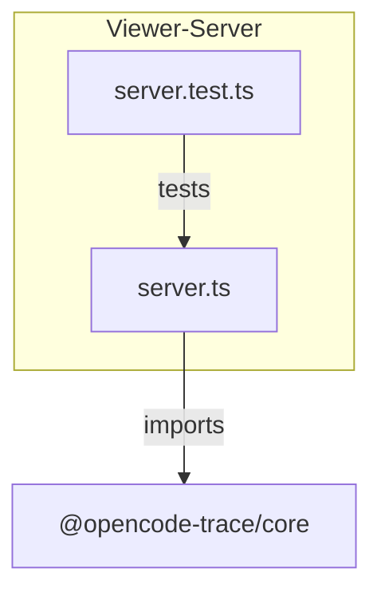
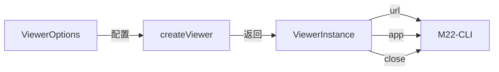
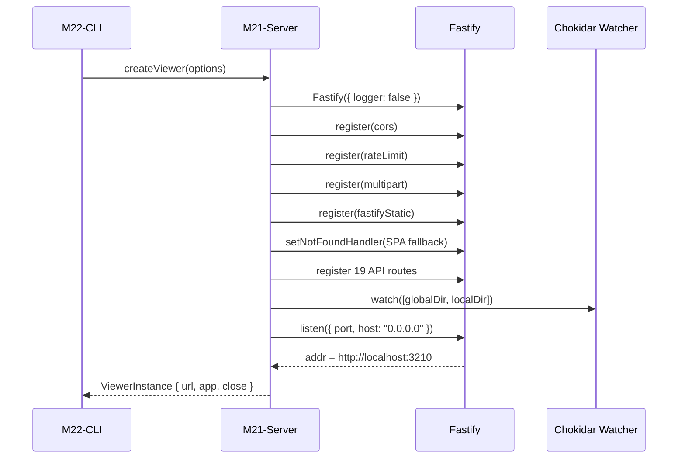
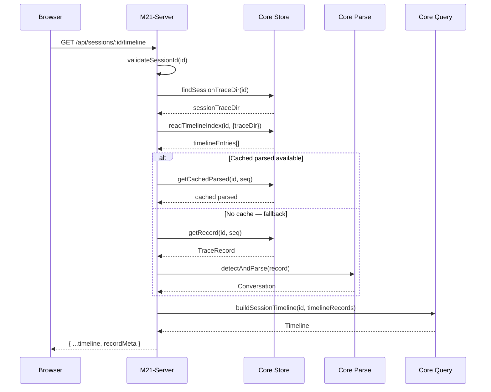
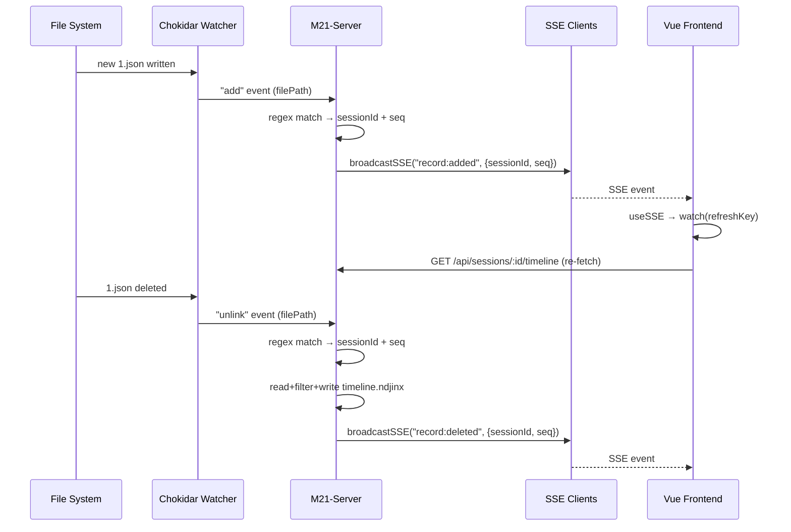

# M21-Viewer-Server

## 概述

M21-Viewer-Server 解决的核心问题是：如何将本地文件系统中存储的 trace 数据（JSON 记录、ndjson 索引、解析缓存）通过 HTTP API 和实时推送暴露给 Vue 前端，使得用户可以在浏览器中浏览、搜索、导出 trace 会话。它在系统架构中属于 Infrastructure Layer (L2)，是 viewer 包的唯一后端服务层——所有数据读取、会话管理、SSE 推送和文件变更检测都在此模块完成。如果移除此模块，系统将完全失去 Web 查看能力：前端无法获取任何 trace 数据，CLI 的 `opencode-trace-viewer` 命令也无法启动。

---

## 元数据

|字段|值|
|-|-|
|模块 ID|M21|
|路径|packages/viewer/src/server.ts|
|文件数|1 (+ 1 test file: server.test.ts ~1559 lines)|
|代码行数|870|
|主要语言|TypeScript|
|所属层|Infrastructure (L2) — viewer 包服务层|

---

## 文件结构



|文件|职责|行数|主要导出|
|-|-|-|-|
|server.ts|Fastify HTTP 服务器，REST API + SSE + chokidar 文件监视|870|`createViewer`, `ViewerOptions`, `ViewerInstance`, `SSEClient`|
|server.test.ts|集成测试，覆盖所有 API 端点、参数校验、双目录解析|1559|（无导出，vitest 测试套件）|

---

## 功能树

```text
M21-Viewer-Server (HTTP server + SSE + file watching)
├── Validation Helpers
│   ├── fn: validateSessionId(id): boolean — 校验 sessionId 格式 (a-zA-Z0-9_-)
│   ├── fn: validateRecordId(id): {valid, value} — 校验 recordId 为正整数 ≤999999
│   └── fn: validateParams(reply, sessionId, recordId?): number|null — 组合校验 + 错误响应
│
├── SSE Infrastructure
│   ├── interface: SSEClient {id, reply} — SSE 连接客户端
│   ├── const: sseClients — Set<SSEClient> 客户端集合
│   ├── const: sseKeepAlive — 15s 心跳定时器 (write ": heartbeat\n\n")
│   └── fn: broadcastSSE(event, data) — 向所有客户端推送 SSE 事件
│
├── Session Resolution
│   ├── fn: findSessionTraceDir(sessionId): string|null — 在 globalDir/localDir 中定位会话
│   └── fn: validateSessionAndFindDir(reply, sessionId): string|null — 校验+定位+404 处理
│
├── Fastify Setup
│   ├── CORS plugin — @fastify/cors (localhost only by default)
│   ├── Rate-limit plugin — @fastify/rate-limit (1000/min, allow localhost)
│   ├── Multipart plugin — @fastify/multipart (for import)
│   ├── Static plugin — @fastify/static (Vue SPA dist/public/)
│   └── SPA fallback — setNotFoundHandler → index.html
│
├── API Routes (19 endpoints)
│   ├── GET /api/sessions — 列出所有会话
│   ├── GET /api/sessions/tree — 会话树结构
│   ├── GET /api/sessions/:sessionId/timeline — 时间线 (ndjson → parsed cache → full parse)
│   ├── GET /api/sessions/:sessionId/metadata — 会话元数据+统计
│   ├── GET /api/sessions/:sessionId/records/:recordId/parsed — 解析后的记录 (cached优先)
│   ├── GET /api/sessions/:sessionId/records/:recordId/usage — token usage 提取
│   ├── GET /api/sessions/:sessionId/records/:recordId/latency — 延迟数据提取
│   ├── GET /api/sessions/:sessionId/records/:recordId/sse — SSE 流+转换消息
│   ├── GET /api/sessions/:sessionId/records/:recordId — 原始 TraceRecord
│   ├── GET /api/sessions/:sessionId — 会话详情+enriched records
│   ├── GET /api/trace/status — 全局 trace 启用状态
│   ├── GET /api/trace/enable — 启用全局 trace
│   ├── GET /api/trace/disable — 禁用全局 trace
│   ├── GET /api/trace-dir — trace 目录信息
│   ├── GET /api/events — SSE 连接入口 (15s heartbeat)
│   ├── POST /api/sessions/:sessionId/export — 导出会话 ZIP
│   ├── POST /api/sessions/import — 导入 ZIP (multipart)
│   ├── POST /api/sessions/:sessionId/delete — 删除会话
│   └── POST /api/sessions/batch-delete — 批量删除会话
│
├── File Watcher (chokidar)
│   ├── watcher.on("add") → broadcastSSE("record:added")
│   ├── watcher.on("change") → broadcastSSE("record:updated")
│   ├── watcher.on("unlink") → ndjson cleanup + broadcastSSE("record:deleted")
│   ├── watcher.on("addDir") → broadcastSSE("session:created")
│   └── watcher.on("unlinkDir") → broadcastSSE("session:deleted")
│
└── Server Lifecycle
    ├── fn: createViewer(options) — 创建服务器、注册路由、启动监听
    └── fn: ViewerInstance.close() — 清理 SSE heartbeat、关闭 watcher、关闭 Fastify
```

### 功能清单

|名称|类型|文件|行号|描述|
|-|-|-|-|-|
|validateSessionId|fn|server.ts|21-31|校验 sessionId 格式 (1-256 chars, a-zA-Z0-9_-)|
|validateRecordId|fn|server.ts|33-36|校验 recordId 为正整数且 ≤999999|
|validateParams|fn|server.ts|38-58|组合校验 sessionId + recordId，返回 number|null|
|ViewerOptions|interface|server.ts|60-65|createViewer 的配置参数|
|ViewerInstance|interface|server.ts|67-71|createViewer 返回值 (url, app, close)|
|SSEClient|interface|server.ts|73-76|SSE 客户端连接描述|
|createViewer|fn|server.ts|78-870|创建 Fastify 服务器、注册所有路由和 watcher|
|broadcastSSE|fn|server.ts|101-110|向所有 SSE 客户端推送事件消息|
|findSessionTraceDir|fn|server.ts|112-131|在 globalDir/localDir 双目录中定位会话|
|validateSessionAndFindDir|fn|server.ts|133-149|校验 sessionId + 定位目录 + 404 响应|
|sseKeepAlive|const|server.ts|89-100|15 秒心跳定时器|
|watcher|const|server.ts|759-764|chokidar 文件监视器 (globalDir + localDir)|
|close|method|server.ts|864-870|关闭 viewer 实例 (停止心跳、关闭 watcher、关闭 Fastify)|

### 职责边界

**做什么**

- 提供 REST API 读取 trace 数据（会话列表、时间线、元数据、单条记录、usage/latency/SSE 数据）
- 提供 SSE 实时推送通道，当文件系统发生变化时广播事件到前端
- 提供 trace 启用/禁用控制端点
- 提供会话导出（ZIP）、导入（multipart ZIP）、删除、批量删除端点
- 管理 chokidar 文件监视器（globalDir + localDir 双目录）
- 管理 SSE 客户端连接池和心跳
- 处理 Vue SPA 的 fallback 路由（setNotFoundHandler → index.html）
- 在双目录（globalDir/localDir）中解析会话的实际存储位置

**不做什么**

- 不做数据写入/记录捕获（由 core store + plugin 负责）
- 不做数据解析逻辑（调用 core parse/query/transform）
- 不做前端渲染（由 Vue SPA 负责）
- 不做 CLI 参数解析（由 M22-viewer-cli 负责）
- 不做认证/权限控制（所有 API 无认证）
- 不做数据持久化格式定义（由 core 定义）

---

## 公共接口契约

### 接口关系图



### 类型定义

```typescript
// [File: packages/viewer/src/server.ts:57]
export interface ViewerOptions {
  port?: number;           // 服务端口，默认 3210
  traceDir?: string;       // 自定义 trace 目录（同时作为 globalDir）
  globalDir?: string;      // 全局 trace 目录
  localDir?: string;       // 本地项目 trace 目录
  open?: boolean;          // 是否自动打开浏览器
  corsOrigin?: string | string[] | RegExp | boolean; // CORS 配置
  noListen?: boolean;      // 不启动 HTTP 监听（仅用于测试注入）
}

// [File: packages/viewer/src/server.ts:67]
export interface ViewerInstance {
  url: string;             // 服务器 URL（如 http://localhost:3210）
  close: () => Promise<void>; // 关闭服务器（停止心跳、关闭 watcher、关闭 Fastify）
  app?: FastifyInstance;   // Fastify 应用实例（用于测试注入）
}

// [File: packages/viewer/src/server.ts:73]
interface SSEClient {
  id: string;              // 客户端编号（递增计数器）
  reply: any;              // Fastify reply 对象（用于 raw SSE 写入）
}
```

|类型名|字段/方法|类型|描述|位置|
|-|-|-|-|-|
|ViewerOptions|port|number?|服务端口，默认 3210|server.ts:57|
|ViewerOptions|traceDir|string?|自定义 trace 目录|server.ts:58|
|ViewerOptions|globalDir|string?|全局 trace 目录|server.ts:59|
|ViewerOptions|localDir|string?|本地项目 trace 目录|server.ts:60|
|ViewerOptions|open|boolean?|自动打开浏览器|server.ts:61|
|ViewerOptions|corsOrigin|string\|string[]\|RegExp\|boolean?|CORS 来源配置|server.ts:62|
|ViewerOptions|noListen|boolean?|不启动 HTTP 监听|server.ts:64|
|ViewerInstance|url|string|服务器 URL|server.ts:68|
|ViewerInstance|close|() => Promise<void>|关闭服务器|server.ts:69|
|ViewerInstance|app|FastifyInstance?|Fastify 实例|server.ts:70|
|SSEClient|id|string|客户端编号|server.ts:74|
|SSEClient|reply|any|Fastify reply 对象|server.ts:75|

### 导出函数

#### `createViewer()`

```typescript
// [File: packages/viewer/src/server.ts:78]
export async function createViewer(
  options?: ViewerOptions,
): Promise<ViewerInstance>
```

|参数|类型|必需|描述|
|-|-|-|-|
|options|ViewerOptions?|否|服务器配置（端口、目录、CORS等）|

- **返回**：`ViewerInstance` — 包含 url（服务器地址）、app（Fastify 实例）、close（关闭方法）的对象。当 `noListen=true` 时 url 为 `http://localhost:0`，不会实际监听端口。
- **抛出**：无显式抛出，但 Fastify.listen 可能因端口占用等抛出错误

**使用示例**：

```typescript
import { createViewer } from "@opencode-trace/viewer/server.js";
const instance = await createViewer({ port: 3210, open: true });
console.log(`Viewer running at ${instance.url}`);
// ... later
await instance.close();
```

---

## 内部实现

### 核心内部逻辑

|函数/类|文件|行号|用途|
|-|-|-|-|
|validateSessionId|server.ts|21-31|校验 sessionId 是否符合 a-zA-Z0-9_- 且长度 1-256|
|validateRecordId|server.ts|33-36|校验 recordId 为正整数 ≤999999，返回 {valid, value}|
|validateParams|server.ts|38-58|组合校验 sessionId + recordId，失败时设置 400 响应|
|sseKeepAlive|server.ts|89-100|15 秒心跳定时器，向所有 SSE 客户端发送 `: heartbeat\n\n`，失败的客户端自动移除|
|broadcastSSE|server.ts|101-110|格式化 SSE 事件 `event: X\ndata: JSON\n\n`，向所有客户端推送，失败的客户端自动移除|
|findSessionTraceDir|server.ts|112-131|优先查找 localDir（metadata 或 records），然后查找 globalDir|
|validateSessionAndFindDir|server.ts|133-149|校验 sessionId 格式 + 调用 findSessionTraceDir + 设置 400/404 响应|
|ndjson rebuild (fire-and-forget)|server.ts|297-329|当 timeline.ndjson 缺失时，异步重建 ndjson 索引（setImmediate + fs.writeFile）|
|ndjinx cleanup on unlink|server.ts|784-812|当 JSON 记录被删除时，直接读写 timeline.ndjinx 清理对应条目（绕过 store 抽象）|
|watcher setup|server.ts|759-764|chokidar 监视 globalDir + localDir，忽略 .tmp/.parsed，depth=2|
|SPA fallback|server.ts|168-177|setNotFoundHandler → 读取 index.html（同步 readFileSync）|

### 设计模式

|模式|使用位置|使用原因|代码证据|
|-|-|-|-|
|Fastify Plugin Registration|server.ts:150-166|利用 Fastify 的插件系统逐步注册 CORS、rate-limit、multipart、static，每个插件独立配置且保证加载顺序|server.ts:150 (`await app.register(cors, ...)`)|
|SSE Push (Observer)|server.ts:595-614|文件变更时通过 SSE 广播到所有前端客户端，实现实时更新无需轮询|server.ts:606 (`reply.raw.write(...)`) + server.ts:101 (`broadcastSSE`)|
|File Watcher → Event Bridge|server.ts:759-843|chokidar 监视文件系统变更，转换为 SSE 事件推送，桥接两个异步系统|server.ts:766 (`watcher.on("add", ...) → broadcastSSE`)|
|SPA Fallback|server.ts:168-177|所有非 API 路径返回 index.html，让 Vue Router 处理客户端路由|server.ts:171 (`app.setNotFoundHandler`)|
|Dual-Location Resolution|server.ts:112-131|会话可能存储在 globalDir 或 localDir，需要先查 local 再查 global 以优先本地数据|server.ts:112 (`findSessionTraceDir`)|
|Read Performance Hierarchy|server.ts:206-252|API 端点优先读取 ndjson 索引 + parsed 缓存，避免全量 JSON 扫描+detectAndParse|server.ts:206 (`readTimelineIndex`) → server.ts:221 (`getCachedParsed`)|
|Fire-and-Forget Rebuild|server.ts:321-329|当 ndjson 缺失时，用 setImmediate 异步重建，不阻塞当前请求|server.ts:321 (`setImmediate(async () => { ... })`)|

### 关键算法 / 策略

|算法/策略|用途|复杂度|文件|
|-|-|-|-|
|Dual-Dir Session Resolution|在 globalDir 和 localDir 中定位会话的实际存储位置|O(n) — 查 metadata 再查 records|server.ts:112-131|
|Read Performance Hierarchy (ndjson → parsed cache → full parse)|优先从快速索引路径读取数据，逐步降级到慢路径|O(1) ndjson → O(n) parsed → O(n²) full scan|server.ts:206-252, server.ts:346-395|
|ndjinx Cleanup on Unlink|当 JSON 记录被删除时，同步读写 ndjinx 文件移除对应条目|O(n) — 需要过滤所有行|server.ts:784-812|
|SSE Client Management|使用 Set 存储客户端，广播时遍历写入，写入失败的客户端自动移除|O(k) — k 为活跃客户端数|server.ts:89-110, server.ts:595-614|

---

## 关键流程

### 流程 1：Viewer 启动流程

**调用链**

```text
cli.ts:52 → server.ts:78 (createViewer) → server.ts:148 (Fastify init) → server.ts:150-166 (register plugins) → server.ts:168 (SPA fallback) → server.ts:179-749 (register routes) → server.ts:595 (SSE endpoint) → server.ts:751 (chokidar setup) → server.ts:845 (listen) → server.ts:852 (open browser)
```

**时序图**



**步骤详解**

|步骤|说明|文件位置|
|-|-|-|
|1|CLI 解析命令行参数后调用 createViewer|cli.ts:52|
|2|创建 Fastify 实例（禁用日志）|server.ts:148|
|3|顺序注册 CORS、rate-limit、multipart、static 插件|server.ts:150-166|
|4|设置 SPA fallback 处理器（非 API 路径返回 index.html）|server.ts:168-177|
|5|注册 19 个 API 路由（GET/POST）|server.ts:179-749|
|6|设置 SSE 客户端管理（Set + 15s 心跳）|server.ts:89-100|
|7|启动 chokidar 监视器，绑定 5 个事件处理器|server.ts:759-843|
|8|调用 app.listen() 启动 HTTP 服务|server.ts:845-847|
|9|如果 open=true，动态导入 child_process 执行浏览器打开|server.ts:852-862|
|10|返回 ViewerInstance 对象|server.ts:861-870|

### 流程 2：Timeline 请求流程（Read Performance Hierarchy）

**调用链**

```text
server.ts:189 (GET /api/sessions/:sessionId/timeline) → server.ts:197 (validateSessionId) → server.ts:200 (findSessionTraceDir) → server.ts:206 (readTimelineIndex) → server.ts:221 (getCachedParsed) → [fallback] server.ts:231 (getRecord + detectAndParse) → server.ts:245 (buildSessionTimeline) → server.ts:249 (build recordMeta)
```

**时序图**



**步骤详解**

|步骤|说明|文件位置|
|-|-|-|
|1|客户端请求会话时间线|server.ts:189|
|2|校验 sessionId 格式|server.ts:197|
|3|在 globalDir/localDir 中定位会话目录|server.ts:200|
|4|读取 timeline.ndjson 索引（快速路径）|server.ts:206|
|5|对每个 entry 尝试读取 parsed 缓存|server.ts:221|
|6|如果缓存不存在，回退到读取原始 JSON + detectAndParse|server.ts:231-235|
|7|如果 ndjson 索引为空（无索引），回退到全量扫描所有 JSON 文件|server.ts:257-295|
|8|全量扫描时，fire-and-forget 重建 timeline.ndjson|server.ts:297-329|
|9|使用 buildSessionTimeline 构建最终时间线|server.ts:245|
|10|添加 recordMeta（id, model, provider）并返回|server.ts:249-254|

### 流程 3：SSE 实时推送流程（文件变更 → 前端更新）

**调用链**

```text
chokidar add/change/unlink event → server.ts:766/772/784 (watcher.on) → server.ts:768 (regex match sessionId + seq) → server.ts:784-812 (unlink: ndjinx cleanup) → server.ts:771/780/810 (broadcastSSE) → server.ts:105 (format SSE payload) → server.ts:108 (raw.write to each client) → [frontend] useSSE composable → watch(refreshKey) → re-fetch API
```

**时序图**



**步骤详解**

|步骤|说明|文件位置|
|-|-|-|
|1|文件系统发生变更（新增/修改/删除 JSON）|chokidar event|
|2|chokidar 触发 add/change/unlink 事件|server.ts:766/772/784|
|3|regex 匹配文件路径提取 sessionId 和 seq|server.ts:767 (`filePath.match(/\/([^/]+)\/(\d+)\.json$/)`)||
|4|对于 unlink 事件：同步读写 timeline.ndjinx 清理被删除记录的条目|server.ts:784-812|
|5|调用 broadcastSSE 向所有 SSE 客户端推送事件|server.ts:771/780/810|
|6|前端 useSSE composable 接收事件，触发 refreshKey watch|前端|
|7|前端重新调用相关 API 获取最新数据|前端|

---

## 依赖

### 内部依赖（项目内其他模块）

|模块|使用的接口|调用位置|
|-|-|-|
|M01-Core Store|listSessionsFromBothDirs, listSessionsTreeFromBothDirs, getSessionRecords, getRecord, getSSEStream, readTimelineIndex, getCachedParsed, readSessionMetadata, exportSessionZip, importSessionZip, deleteSession|server.ts:183/185/192/257/371/380/431/438/441/461/481/501/508/534/554/557/633/676/708/736|
|M01-Core Parse|detectAndParse, detectProvider, extractUsage, extractLatency, openaiChatParser.parseRequest, openaiResponsesParser.parseRequest, anthropicParser.parseRequest|server.ts:235/262/264/270/275/279/448/468/488/510/513/562|
|M01-Core Query|buildSessionTimeline, buildSessionMetadata|server.ts:245/410|
|M01-Core Transform|sseAnthropicToMessages, sseOpenaiChatToMessages, sseOpenaiResponsesToMessages|server.ts:516/518/520|
|M01-Core Record|getGlobalTraceEnabled, setGlobalTraceEnabled|server.ts:577/582/587|
|M01-Core getTraceDir|getTraceDir()|server.ts:85|

### 外部依赖（第三方包）

|包名|版本|用途|可替代性|
|-|-|-|-|
|fastify|^5.8.5|HTTP 服务器框架，路由、插件系统|低 — 深度使用插件注册模式|
|@fastify/cors|^11.2.0|CORS 跨域支持|中 — Express/Koa 有等价中间件|
|@fastify/rate-limit|^10.3.0|请求频率限制|中 — 可用其他 rate-limit 实现|
|@fastify/multipart|^10.0.0|multipart 文件上传（import ZIP）|中 — 仅 import 功能使用|
|@fastify/static|^8.1.0|静态文件服务（Vue SPA dist）|中 — 可用 serve-static 等替代|
|chokidar|^3.6.0|文件系统监视器|低 — SSE 推送核心依赖，fsevents 绑定|

---

## 代码质量与风险

### 代码坏味道

|问题|类型|文件|严重度|建议|
|-|-|-|-|-|
|870 行单文件包含全部服务器逻辑|过大类|server.ts|中|拆分为 route handlers、validation module、SSE manager、watcher setup 等子模块|
|ndjinx cleanup 直接读写文件系统（readFileSync + writeFileSync）绕过 store 抽象|过度耦合|server.ts:784-812|高|将 ndjinx cleanup 逻辑移入 core store，通过 store.removeTimelineEntry() 调用|
|fire-and-forget ndjson rebuild（setImmediate + 静默 catch）无错误日志|硬编码|server.ts:321-329|中|添加 winston logger 记录重建失败，或使用 store 提供的 rebuildTimeline() 方法|
|GET 方法用于状态变更操作（/api/trace/enable, /api/trace/disable）|过度耦合|server.ts:581-589|中|改为 POST/PUT 方法，GET 仅用于读取|
|SPA fallback 使用同步 readFileSync|硬编码|server.ts:176|低|可改用异步 readFile 或缓存 index.html 内容|
|SSEClient.reply 类型为 any|硬编码|server.ts:75|低|使用 Fastify 的 RawReply 类型|
|findSessionTraceDir 多次调用 store.readSessionMetadata + store.getSessionRecords（双目录各一次）|重复代码|server.ts:112-131|低|store 可提供统一的 findSessionDir 方法|

### 潜在风险

|风险|触发条件|影响|文件|建议|
|-|-|-|-|-|
|无 API 认证|viewer 对外暴露时（非 localhost）|任何人可读取所有 trace 数据、删除会话、启禁 trace|server.ts:全文件|添加可选的 auth middleware 或仅限 localhost 绑定|
|ndjinx cleanup 非原子操作|unlink 事件触发时，读取 → 过滤 → 写入非原子|并发写入可能导致数据丢失或文件损坏|server.ts:792-807|使用 store 的原子操作方法或 .tmp+safeRename 模式|
|fire-and-forget rebuild 无错误通知|setImmediate 中 writeFile 失败被静默吞掉|timeline.ndjson 可能永远无法重建，后续请求持续走慢路径|server.ts:321-329|添加错误日志，或将 rebuild 改为 store.rebuildTimelineIndex()|
|rate-limit allowList 绕过|127.0.0.1 和 ::1 不受频率限制|本地自动化脚本可无限请求|server.ts:156|对 localhost 也设置合理上限|
|chokidar depth=2 限制|目录层级 > 2 时无法检测变更|深层嵌套的会话目录变更不会被推送|server.ts:763|确认项目目录结构不会超过 depth=2，或调整 depth|
|SSE 客户端无限增长|大量客户端连接但网络不稳定|内存泄漏（断连客户端仅在写入失败时移除）|server.ts:89-110|添加定期清理或最大连接数限制|

### 测试覆盖

|测试类型|覆盖情况|测试文件|说明|
|-|-|-|-|
|单元测试|有|server.test.ts (1559 lines)|覆盖所有 19 个 API 端点、参数校验、SSE 连接测试、双目录解析|
|集成测试|部分|server.test.ts|使用 Fastify inject() 模拟 HTTP 请求，mock core 模块|
|端到端测试|无|—|无真实浏览器 + SSE + chokidar 的端到端测试|

---

## 开发指南

### 洞察

1. **Read Performance Hierarchy 是此模块的核心设计哲学**：ndjson → parsed cache → full parse 的三级降级路径确保了大多数请求走快速路径，仅首次访问或缓存缺失时才触发全量解析。这决定了 `/timeline` 和 `/metadata` 端点的实现必须严格遵循此降级顺序。

2. **双目录解析（findSessionTraceDir）体现了项目的 "local-first" 原则**：优先查找 localDir，确保项目级 trace 数据优先展示，仅在本地没有时才回退到全局目录。这种设计支持了用户在不同项目间切换时仍能看到项目相关数据。

3. **chokidar → SSE 桥接是唯一的实时更新路径**：没有此桥接，前端只能通过手动刷新获取更新。此桥接的设计简洁但直接——没有队列、没有去重、没有事件合并，每个文件系统事件都会立即推送一个 SSE 事件。

### 扩展指南

添加新的 API 端点需要遵循以下步骤：

1. **在 `createViewer()` 函数内添加路由注册**：使用 `app.get<Params>()` 或 `app.post<Params>()` 添加路由，Fastify 泛型参数定义 URL 参数类型
2. **添加参数校验**：使用 `validateSessionId()` 和 `validateParams()` 校验路径参数
3. **使用 findSessionTraceDir/validateSessionAndFindDir 定位会话目录**：不直接使用 globalDir/localDir，而是通过双目录解析
4. **使用 core store/parse/query/transform 提供的方法读取数据**：不直接操作文件系统
5. **添加 SSE 广播**（如果端点修改了数据）：调用 `broadcastSSE(event, data)` 推送变更通知
6. **在 server.test.ts 中添加测试**：使用 `instance.app!.inject()` 模拟请求，mock core 方法

添加新的 SSE 事件类型：
1. 在 chokidar watcher 事件处理器中添加 `broadcastSSE("new:event", data)` 调用
2. 在前端 `useSSE()` composable 中添加对应事件监听

### 风格与约定

- **路由注册风格**：所有路由在 `createViewer()` 函数内直接注册，不使用独立路由文件或 Fastify route decorators
- **参数校验风格**：使用自定义校验函数而非 Fastify schema validation，校验失败时手动设置 HTTP 状态码和错误响应
- **错误处理风格**：try/catch 捕获错误后统一返回 `{ error: string }` JSON，状态码 400/404/500
- **SSE 风格**：使用 raw `reply.raw.write()` 直接写入 SSE 格式文本，不使用 Fastify 的 SSE 插件
- **文件监视风格**：chokidar 事件处理器中使用正则匹配提取 sessionId 和 seq，而非路径解析工具

### 设计哲学

1. **"薄服务层"哲学**：server.ts 是一个纯粹的 HTTP 桥接层，几乎不包含业务逻辑——所有数据处理委托给 core 的 store/parse/query/transform 模块。这使得 server.ts 的职责边界清晰：HTTP 协议处理 + SSE 推送 + 文件监视桥接。

2. **"优先快速路径"哲学**：Read Performance Hierarchy 的三级降级设计反映了一个核心权衡：牺牲首次请求的延迟（需要全量解析 + fire-and-forget 重建 ndjson），换取后续请求的快速响应。这种权衡适用于查看器场景（用户打开查看器后会持续浏览）。

3. **"文件系统是真相来源"哲学**：chokidar 直接监视文件目录而非依赖事件总线，体现了项目"文件系统是数据真相来源"的核心原则。但这也导致 ndjinx cleanup 必须直接操作文件（绕过 store），因为 store 层没有提供对应的原子操作接口。

### 修改检查清单

- [ ] 新增/修改 API 端点时，确保参数校验使用 validateSessionId/validateParams
- [ ] 新增/修改 API 端点时，确保使用 findSessionTraceDir 定位目录而非直接使用 globalDir/localDir
- [ ] 修改数据读取逻辑时，确保遵循 Read Performance Hierarchy（ndjson → parsed cache → full parse）
- [ ] 修改会影响前端显示的数据时，确保添加对应的 SSE 广播事件
- [ ] 修改 chokidar 事件处理时，确保 ndjinx cleanup 逻辑与 store 层一致
- [ ] 修改路由后，确保在 server.test.ts 中添加对应的 inject() 测试
- [ ] 修改 trace enable/disable 端点时，考虑将 GET 改为 POST/PUT
- [ ] 修改 ndjinx/timeline.ndjson 操作时，确保使用原子写入模式（.tmp + safeRename）
- [ ] 修改 SSE 客户端管理时，确保连接断开时正确清理客户端引用
- [ ] 新增第三方依赖时，确保在 viewer/package.json 中添加并考虑 Windows CI 兼容性